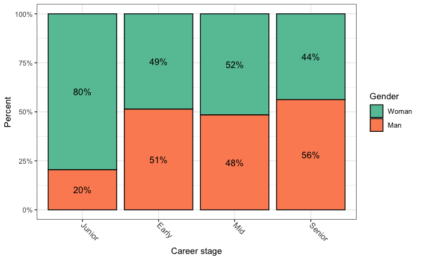

# Survey Demographics

We asked a number of demographic-based questions to determine coverage of the ESRC community. This allowed us to segment the responses to questions in the survey according to these base characteristics. This document summarises the demographics.

* [Institutions](#institutions)
* [Research disciplines](#research-disciplines)
* [Gender](#gender)
* [Career stages](#career-stages)
* [Ethnicity](#ethnicity)
* [Disability](#disability)

## Institutions

We asked (Q17, N = 152) people to specify their institutional affiliation (the organisation/company that directly paid their salary or one or more institutions they were affiliated with). 58 unique organisations were specified. Institutions with more than three responses are shown in Table 1 below, the hyphen (-) signifies that no institution was specified or could not be determined from the answer or associated data, e.g. “University”. The remainder with three or fewer responses for a given organisation are aggregated in the “Other” category to make the table manageable.

<table>
  <tr>
   <td><strong>Institutions</strong></td>
   <td><strong>Responses</strong></td>
  </tr>
  <tr>
   <td>University of Essex
   </td>
   <td>
14

   </td>
  </tr>
  <tr>
   <td>-
   </td>
   <td>
12

   </td>
  </tr>
  <tr>
   <td>University College London
   </td>
   <td>
12

   </td>
  </tr>
  <tr>
   <td>University of Edinburgh
   </td>
   <td>
9

   </td>
  </tr>
  <tr>
   <td>University of Glasgow
   </td>
   <td>
8

   </td>
  </tr>
  <tr>
   <td>University of Manchester
   </td>
   <td>
8

   </td>
  </tr>
  <tr>
   <td>University of Bristol
   </td>
   <td>
7

   </td>
  </tr>
  <tr>
   <td>University of Exeter
   </td>
   <td>
6

   </td>
  </tr>
  <tr>
   <td>Queen Mary University of London
   </td>
   <td>
4

   </td>
  </tr>
  <tr>
   <td>University of Birmingham
   </td>
   <td>
4

   </td>
  </tr>
  <tr>
   <td>University of Reading
   </td>
   <td>
4

   </td>
  </tr>
  <tr>
   <td>University of Strathclyde
   </td>
   <td>
4

   </td>
  </tr>
  <tr>
   <td>Others
   </td>
   <td>
72

   </td>
  </tr>
</table>

<strong>Table 1</strong>: Responses from institutions where they are provided. Organisations with a count greater than three are shown. Those with three or less have been aggregated as “Others”. The hyphen signifies that no value was given or what was provided did not uniquely identify the institution.

Locations that could be geographically identified are shown in Fig 1 below. The size of the blue disks is proportionally representative to the number of responses received from that location.

<strong>Figure 1</strong>: A map locating the institutions where they were provided and could be geolocated. The bigger the disk the higher the value of responses from that institution.

## Research disciplines

We asked people to identify the academic disciplines they belonged to (Q19, N = 161). From the list below. Where the disciplines[^1] have been abbreviated for the purposes of the graph - the abbreviation used is shown in the bold term in brackets at the end of the line:

* Area Studies (**AreaStudies**)
* Data science and artificial intelligence (**DS_AI**)
* Demography (**Demography**)
* Development studies (**DvelopmentStudies**)
* Economics(**Economics**)
* Education (**Education**)
* Environmental planning (**EnvPlanning**)
* History (**History**)
* Human Geography (**HumanGeography**)
* Information science (**InfoSci**)
* Law & legal studies (**Law**)
* Linguistics (**Linguistics**)
* Management & business studies (**ManBusStud**)
* Political science. & international studies (**PolSci_IntStud**)
* Psychology (**Psychology**)
* Science and Technology Studies (**SciTechStud**)
* Social anthropology (**SocAnth**)
* Social policy (**SocPol**)
* Social work (**SocWork**)
* Sociology (**Sociology**)
* Tools, technologies & methods (**ToolsTechMeth**)
* Other (**Other**)

However, respondents were allowed to pick more than one discipline which, retrospectively, making it slightly harder to combine this category with other survey choices in a meaningful way. We can normalise the contributions so if a person suggested N research disciplines were appropriate for them then each will contribute 1/N to the total. The results are summarised in Fig 2.

<strong>Figure 2</strong>: Research discipline the respondents identified as. Values are normalised - if a person picked N research disciplines then each contributes 1/N to the total.

We can see that most of the people who answered though self-identified as “Sociologists”. Three individuals did not specify any academic discipline. A few people did not find an academic discipline they thought fitted them so they filled in the “Other” choice - nine of these were health-related areas, a few were crossover disciplines such as computer science, statistics and medicine; others were on the boundary with other work funded by other research councils like cultural studies. As opposed to introducing more categories these were left in the “Other” category.

Fig 3 shows how the distribution of research disciplines picked by individuals. 

<strong>Figure 3</strong>: The number of research disciplines chosen by individuals. Three individuals did not choose any academic discipline or specify another category.

Discipline combinations are shown in the table below with a count greater than one.

<table>
  <tr>
   <td>Combined disciplines
   </td>
   <td>
Count

   </td>
  </tr>
  <tr>
   <td>SocPol, Sociology
   </td>
   <td>
6

   </td>
  </tr>
  <tr>
   <td>Sociology, Other
   </td>
   <td>
5

   </td>
  </tr>
  <tr>
   <td>Education, Linguistics
   </td>
   <td>
4

   </td>
  </tr>
  <tr>
   <td>Education, SocPol
   </td>
   <td>
3

   </td>
  </tr>
  <tr>
   <td>DS_AI, Human Geography
   </td>
   <td>
2

   </td>
  </tr>
  <tr>
   <td>Combined choices
   </td>
   <td>
Count

   </td>
  </tr>
  <tr>
   <td>SciTechStud, Sociology, Other
   </td>
   <td>
2

   </td>
  </tr>
  <tr>
   <td>Development Studies, Economics
   </td>
   <td>
2

   </td>
  </tr>
  <tr>
   <td>DS_AI, ToolsTechMeth
   </td>
   <td>
2

   </td>
  </tr>
  <tr>
   <td>Economics, Education, SocPol
   </td>
   <td>

2

   </td>
  </tr>
</table>

<strong>Table 2</strong>: Count of the combined choices that have more than one occurrence.

From this, we can see that certain disciplines correlate and were probably picked in conjunction, for instance, _Social Policy and Sociology were picked in combination, Sociology was combined with an Other research discipline_ and so on. 

## Gender

We asked people to self-identify their gender (Q21, N = 164). Fig 4 summarises the responses.

<strong>Figure 4</strong>: How people self-identified their gender. The “-” means no value was given.

For the survey, we got a slightly higher response from women. In four cases, indicated by a dash, the gender was not specified. For the other category, some expressed unhappiness about being asked about their gender or stated that their sex was female but they had no gender identity. Two people did not disclose their gender and one self-identified as being non-binary. For most of the analysis of the survey results, the low statistic components were not considered when partitioning the data by gender.

Fig 5 shows how gender is distributed across the academic disciplines. Numbers are normalised as individuals could pick more than one research disciplines (if a person chose N disciplines then each contributes 1/N). The percentages shown are given in relation to the number of responses to the particular gender population, e.g. 18% of all the women that answered said they were (in part) from sociology. 

<strong>Figure 5</strong>: Academic disciplines are decomposed by gender. Percentages correspond to the number of answers in relation to the corresponding gender population.

From this diagram, we can see that for some disciplines we have more answers from specific genders. For instance, Sociology, Education, Social Work, Linguistics, Management and business studies and Science and Technology Studies have more responses from women while Human Geography, History, Information Science, Data Science and Artificial Intelligence and Tools, technologies & methods have more answers from male respondents.

## Career stages

We also asked about the career stage the respondee came from (Q20, N = 164). For this, we used a scale[^2] developed by the _League of European Research Universities_ (LERU) mainly:

* Phase 1 - **Junior **(e.g. PhD candidate, Junior Research Software Engineer)
* Phase 2 - **Early **(e.g Research Assistant/Associate, first grant holder, Lecturer, Research Software Engineer)
* Phase 3 - **Mid** / Recognised (e.g. Senior Lecturer, Reader, Senior Researcher, Senior Research Software Engineer, Research Software Group Leader)
* Phase 4 - Established / Experienced / **Senior** (e.g. Professor, Director of Research Computing, Distinguished Engineer, Chief Data Scientist)

We added an additional  “Other” category for respondents who could not place themselves in any of the LERU categories, e.g. retired. The items in bold indicated in the list above is the labelling that we used to identify the different phases for the summary of the survey results. Fig 6 shows the number of respondents in each category as well as showing the percentage of the number in relation to all respondents. The “-” indicates that no value was given.

<strong>Figure 6</strong>: how people self-identified their LERU career stage. The “-” means no value was given.

In most graphs, we miss out the “Other” and “-” categories when partitioning the data by career stage because of their low statistics. In the survey most responses came from Junior researchers but with a fair representation of Early, Mid and senior career stages. For the “Other” responses we got: “retired as Senior Research Fellow”, “phase 3 but still on temporary contracts” and “in the process of applying for a PhD”.

We can see how gender and career stage relate in the tile diagram in Fig 7. The percentages shown are in relation to the whole population. For gender we only consider male, female populations as the other gender components have low statistics. In Fig 8 we see that for early, mid and senior career researchers we have a reasonable male and female balance. However, for the junior career researchers there is a much higher representation of women (80%) to men (20%) - percentages here are in relation to each career stage population. We thus need to take care when interpreting results as women and junior career researchers can act as aliases for each other. From the responses in this survey, more women at an earlier career stage answered the survey but numbers gradually decreased as one progressed up the career stages (negatively correlated (-0.856)) while for men the distribution was much flatter (but positively correlated (0.673)).

<strong>Figure 7</strong>: How gender is related to career stages.

<strong>Figure 8</strong>: Career stages by gender percentages composition.

Fig 9 shows how the academic disciplines are distributed across the different career stages. Numbers have been normalised (if respondent provided N research disciplines each contributes 1/N). From this we see that mid and early career stage sociologists had the top and third highest representation and junior career psychologists have the second highest representation.

<strong>Figure 9</strong>: Research disciplines split by career stage. Numbers have been normalised - if a researcher said they were involved in N research disciplines they each contribute 1/N.

## Ethnicity

Using the 2021 census definition for ethnicity[^3] we asked the respondents (Q22, N = 164) to self-identify to which ethnic group they belonged to. The results are shown in Fig 10.

<strong>Figure 10</strong>: the distribution of ethnicities where this was provided. The “-” means that no value was given.

From which we see that 79% of the respondents are white, 5% did not want to disclose or did not answer and about 16% came from black, asian, mixed or other backgrounds. Comparing this to the HESA data which got 76% for whites, 18% for black, asian, mixed or other backgrounds and 6% for unknowns we can see that we are not too far from have a proportionate representation of the ethnic population determination from HESA.

Fig 11 shows ethnicity splits across the different career stages. Other than for the white ethnic group representation across the different career stages is a little bit patchy.

<strong>Figure 11</strong>: Ethnicity and career stage.

The gender decomposition of the ethnicities is given by Fig 12. Coverage in the non-white ethnicities is a little bit patchy and seems to flip-flop a little bit by there being male or female in some cases. There are no instances of anything other than male or female outside the white ethnicities when specified.

<strong>Figure 12</strong>: Ethnicity vs gender.

For the other category, where people could attribute their own ethnic make-up, some used the terms hispanic/latin american/latino, there was a white with no further specificity and there was also an Italian-Scot.

## Disability

We also asked the respondents whether they considered themselves to have a disability (Q23, N = 164) or not. The responses are given in Fig 13. 

<strong>Figure 13</strong>: Whether a respondent self-identifies as having a disability.

The majority (83%) did not consider themselves to have a disability but 15% did self identify as having some form of disability which would be higher than what is observed in the ESRC community (4.6%) from the HESA data analysis in the main report. Six people (4%) did not fill in this question. Despite the fact that the survey obtained a higher representation of the community with some form of disability than what is observed by the HESA data the sample size (25) is relatively low so not much multivariate analysis has been done based on disability.

Fig 14 shows that those that identify as being disabled are farily evenly distributed across the different genders. 

<strong>Figure 14</strong>:  Disability is represented across all the gender options. Percentages are in relation to the whole population that answered the survey.

Fig 15 shows the representation by career stage - we have representation from all four career stages though the senior career stage is rather small with a count of 1.

<strong>Figure 15</strong>: Mid-career and below have higher disability representation. Percentages are in relation to the whole population.

Finally. Fig 16 gives a break down across research domain but as individuals were able to select more than one research domain the numbers have been normalised, i.e. if a person selected N research disciplines then each will contribute 1/N to the count.

<strong>Figure 16</strong>: Research disciplines split according to whether respondents self-identify as having a disability.

<!-- Footnotes themselves at the bottom. -->
## Notes

[^1]:
     The base discipline list was derived from the “Application and success rate data 2011-12 to 2017-18” document available from [https://www.ukri.org/publications/esrc-application-and-success-rate-data-and-analysis/](https://www.ukri.org/publications/esrc-application-and-success-rate-data-and-analysis/) (last accessed 22/04/22) with a couple of additions suggested by our survey reviewers.

[^2]:
     See [https://www.leru.org/files/UK-England.pdf](https://www.leru.org/files/UK-England.pdf) (last accessed 04/08/22).

[^3]:
     [https://www.ethnicity-facts-figures.service.gov.uk/style-guide/ethnic-groups](https://www.ethnicity-facts-figures.service.gov.uk/style-guide/ethnic-groups).