Economic and Social Research Council (ESRC) Data
================
**Author**: Mario Antonioletti. 
**Last updated**: 20/06/22.

-   <a href="#introduction" id="toc-introduction">Introduction</a>
-   <a href="#overall-expenditure" id="toc-overall-expenditure">Overall
    expenditure</a>
    -   <a href="#expenditure-for-all-ukri-projects"
        id="toc-expenditure-for-all-ukri-projects">Expenditure for all UKRI
        projects</a>
    -   <a href="#expenditure-for-active-ukri-projects-only"
        id="toc-expenditure-for-active-ukri-projects-only">Expenditure for
        active UKRI projects only</a>
-   <a href="#esrc-data" id="toc-esrc-data">ESRC data</a>
    -   <a href="#project-category-awards"
        id="toc-project-category-awards">Project category awards</a>
        -   <a href="#all-projects-category-awards"
            id="toc-all-projects-category-awards">All projects category awards</a>
        -   <a href="#active-projects-category-awards-only"
            id="toc-active-projects-category-awards-only">Active projects category
            awards only</a>
    -   <a href="#award-length-distribution"
        id="toc-award-length-distribution">Award length distribution</a>
        -   <a href="#award-length-distribution-for-all-projects"
            id="toc-award-length-distribution-for-all-projects">Award length
            distribution for all projects</a>
        -   <a href="#active-projects-award-length-distribution"
            id="toc-active-projects-award-length-distribution">Active projects award
            length distribution</a>
    -   <a href="#regional-distribution-of-awards"
        id="toc-regional-distribution-of-awards">Regional distribution of
        awards</a>
        -   <a href="#region-distributions-of-awards-for-all-projects"
            id="toc-region-distributions-of-awards-for-all-projects">Region
            distributions of awards for all projects</a>
        -   <a href="#regional-distributions-of-awards-for-active-projects-only"
            id="toc-regional-distributions-of-awards-for-active-projects-only">Regional
            distributions of awards for active projects only</a>
    -   <a href="#funding-by-lead-organisation"
        id="toc-funding-by-lead-organisation">Funding by lead organisation</a>
        -   <a href="#funding-by-lead-organisation-for-all-projects"
            id="toc-funding-by-lead-organisation-for-all-projects">Funding by lead
            organisation for all projects</a>
        -   <a href="#funding-by-lead-organisation-for-active-projects-only"
            id="toc-funding-by-lead-organisation-for-active-projects-only">Funding
            by lead organisation for active projects only</a>
    -   <a href="#department-awards" id="toc-department-awards">Department
        awards</a>
        -   <a href="#department-awards-for-all-projects"
            id="toc-department-awards-for-all-projects">Department awards for all
            projects</a>
        -   <a href="#department-awards-for-active-projects-only"
            id="toc-department-awards-for-active-projects-only">Department awards
            for active projects only</a>
    -   <a href="#doctoral-training-partnerships"
        id="toc-doctoral-training-partnerships">Doctoral Training
        Partnerships</a>
        -   <a href="#active-partnerships" id="toc-active-partnerships">Active
            Partnerships</a>
    -   <a href="#award-titles" id="toc-award-titles">Award Titles</a>
    -   <a href="#classification-by-category-using-research-subjects"
        id="toc-classification-by-category-using-research-subjects">Classification
        by category using research subjects</a>
    -   <a href="#classification-by-category-using-research-topics"
        id="toc-classification-by-category-using-research-topics">Classification
        by category using research topics</a>
-   <a href="#todo-items" id="toc-todo-items">ToDo Items</a>

# Introduction

The aim of this document is to provide an overview of the awards
provided by the [United Kingdom Research and
Innovation](https://www.ukri.org/)’s (UKRI) [Economics and Social
Sciences Research Council](https://esrc.ukri.org/) (ESRC) as determined
from a [Gateway to Research](https://gtr.ukri.org/) (GtR) data snapshot
update from the the 24th February 2022 - these data snapshots update
come out roughly every month. The data is made available under an [Open
Government
Licence](https://www.nationalarchives.gov.uk/doc/open-government-licence/version/3/),
and covers the period from 01/01/73 to 01/01/30.

The R markdown that generated this analysis is available at:

-   <https://github.com/softwaresaved/esrc-software-study/blob/main/Src/ESRC.Rmd>

The entire data set consists of 128,238 rows for all research councils,
where each row corresponds to a record of an award. Within this data set
11,598 rows (9%) correspond to ESRC awards.

UK Research Councils were formed in different years (source:
[wikipedia](https://en.wikipedia.org/wiki/UK_Research_and_Innovation))
as shown in the table below which has an impact in the interpretation of
the data.

| Research Council                                                                             | Formation |
|----------------------------------------------------------------------------------------------|-----------|
| Arts and Humanities Research Council (AHRC)                                                  | 2005      |
| Biotechnology and Biological Sciences Research Council (BBSRC)                               | 1994      |
| Engineering and Physical Sciences Research Council (EPSRC)                                   | 1994      |
| Economic and Social Research Council (ESRC)                                                  | 1965      |
| Medical Research Council (MRC)                                                               | 1913      |
| National Centre for the Replacement, Refinement and Reduction of Animals in Research (NC3RS) | 2004      |
| Natural Environment Research Council (NERC)                                                  | 1965      |
| Science and Technology Facilities Council (STFC)                                             | 2007      |
| Innovate UK                                                                                  | 2007      |
| Research England                                                                             | 2018      |
| UKRI                                                                                         | 2018      |

Although, strictly speaking, it was the *Social Science Research
Council* (SSRC) that came into being in 1965, it was not until 1983 that
the SSRC was renamed the Economic and Social Research Council (ESRC).

# Overall expenditure

We start by doing a brief overview of all the data obtained from the
Gateway to Research before we go on to focus on the ESRC data.

## Expenditure for all UKRI projects

Expenditure for the whole period under consideration is shown in the
graph below. Awards that do not have an awards value defined have been
removed.

The same information in tabular format:

| Funding org | Total awarded (Million £s) |
|:------------|---------------------------:|
| EPSRC       |                     15,262 |
| Innovate UK |                     11,940 |
| MRC         |                      6,268 |
| BBSRC       |                      4,732 |
| ESRC        |                      3,501 |
| NERC        |                      3,350 |
| STFC        |                      2,364 |
| AHRC        |                      1,261 |
| UKRI        |                        392 |
| NC3Rs       |                         73 |

The number of awards given by each council over the whole data period:

The average award given by funding council:

Average award per founding council ordered by the average award in
tabular form:

| Funding org | Number of awards | Total awarded (£) | Average award (£) |
|:------------|-----------------:|------------------:|------------------:|
| UKRI        |              393 |       391,911,795 |           997,231 |
| MRC         |           10,166 |     6,267,924,420 |           616,558 |
| Innovate UK |           25,000 |    11,939,854,589 |           477,594 |
| EPSRC       |           33,238 |    15,261,747,133 |           459,166 |
| STFC        |            7,112 |     2,364,288,736 |           332,437 |
| NERC        |           10,759 |     3,350,291,272 |           311,394 |
| ESRC        |           11,598 |     3,501,153,022 |           301,876 |
| BBSRC       |           16,178 |     4,732,082,523 |           292,501 |
| NC3Rs       |              463 |        73,384,156 |           158,497 |
| AHRC        |            9,662 |     1,261,472,322 |           130,560 |

The distribution of awards by research council.

The overall stats for the award amount agree with the diagram above (not
normally distributed).

| Funding org |          Total |    Mean | Standard Dev |    Median | Mode      |
|:------------|---------------:|--------:|-------------:|----------:|:----------|
| AHRC        |  1,261,472,322 | 172,215 |      417,128 |    56,268 | 14,013    |
| BBSRC       |  4,732,082,523 | 386,419 |      783,527 |   300,620 | 95,042    |
| EPSRC       | 15,261,747,133 | 757,858 |    2,556,970 |   302,998 | 90,000    |
| ESRC        |  3,501,153,022 | 442,121 |    1,702,051 |   130,045 | 100,000   |
| Innovate UK | 11,939,854,589 | 479,224 |    5,357,990 |    95,816 | 5,000     |
| MRC         |  6,267,924,420 | 759,564 |    1,099,714 |   432,424 | 290,658   |
| NC3Rs       |     73,384,156 | 182,548 |      130,336 |   101,837 | 90,000    |
| NERC        |  3,350,291,272 | 362,703 |    1,905,917 |   178,348 | 88,292    |
| STFC        |  2,364,288,736 | 461,865 |      964,691 |   150,664 | 10,000    |
| UKRI        |    391,911,795 | 997,231 |      308,931 | 1,069,796 | 1,196,146 |

The graph with the values for each research council normalised:

Expenditure by year using the starting year of the award for funds
allocated that year per research council:

The same information by percent expenditure for each year.

Although there seems to be historical data for the MRC, ESRC and STFC it
seems to make more sense to start looking at the data from 2008 (this
will be applied later).

## Expenditure for active UKRI projects only

The graph below only contains values for currently active projects,
i.e. whose end date extends beyond the date at which the GtR data
snapshot was produced:

The same information in tabular format:

| Funding org | Total awarded (Million £s) |
|:------------|---------------------------:|
| EPSRC       |                      6,304 |
| Innovate UK |                      4,791 |
| ESRC        |                      1,766 |
| MRC         |                      1,745 |
| NERC        |                      1,443 |
| BBSRC       |                      1,367 |
| STFC        |                        741 |
| AHRC        |                        443 |
| UKRI        |                        382 |
| NC3Rs       |                         21 |

The number of awards given by each council for active projects:

The average award given by funding council for active projects:

Average award per founding council for active projects ordered by the
average award:

| Funding org | Number of awards | Total awarded (£) | Average award (£) |
|:------------|-----------------:|------------------:|------------------:|
| Innovate UK |            3,448 |     4,790,776,011 |         1,389,436 |
| UKRI        |              382 |       382,101,075 |         1,000,265 |
| MRC         |            3,386 |     1,745,442,053 |           515,488 |
| NERC        |            3,323 |     1,443,216,024 |           434,311 |
| EPSRC       |           15,385 |     6,303,746,217 |           409,733 |
| ESRC        |            4,944 |     1,766,391,182 |           357,280 |
| BBSRC       |            4,538 |     1,366,783,223 |           301,186 |
| STFC        |            2,719 |       740,988,391 |           272,522 |
| AHRC        |            3,352 |       443,171,889 |           132,211 |
| NC3Rs       |              172 |        20,698,414 |           120,340 |

The distribution of awards by research council for active projects.

with the stats for the above again showing in agreement with the graphs
above that the distribution is not normal.

| Funding org |         Total |      Mean | Standard Dev |    Median | Mode      |
|:------------|--------------:|----------:|-------------:|----------:|:----------|
| AHRC        |   443,171,889 |   365,051 |      843,084 |   176,362 | 5,040     |
| BBSRC       | 1,366,783,223 |   624,672 |    1,571,541 |   406,369 | 100,279   |
| EPSRC       | 6,303,746,217 | 1,385,439 |    3,568,116 |   519,026 | 300,000   |
| ESRC        | 1,766,391,182 | 1,099,186 |    3,320,943 |   253,981 | 100,000   |
| Innovate UK | 4,790,776,011 | 1,392,263 |   12,517,574 |   209,554 | 50,000    |
| MRC         | 1,745,442,053 |   969,690 |    1,187,336 |   588,872 | 292,355   |
| NC3Rs       |    20,698,414 |   155,627 |      121,866 |    94,402 | 90,000    |
| NERC        | 1,443,216,024 |   731,112 |    3,878,590 |   341,740 | 89,114    |
| STFC        |   740,988,391 |   572,192 |      973,439 |   242,684 | 78,040    |
| UKRI        |   382,101,075 | 1,000,265 |      310,717 | 1,074,176 | 1,196,146 |

With the densities normalised for each research council:

Expenditure by year using the starting year of the award for funds
allocated that year per research council for active projects:

# ESRC data

## Project category awards

### All projects category awards

The project categories for the ESRC awards covers the period 01/01/06 to
30/09/29 (project start dates - to project end dates). However, as
previously stated data only projects that started from 2008 onwards will
be considered from this point onwards reduces the number of records from
11,598 to 10,374.

No explicit expenditure data seems to be provided for *Studentships*.
Data is sorted by the average award.

| Project Categeory | Number of Awards | Total Awarded (£) | Average Award (£) |
|:------------------|-----------------:|------------------:|------------------:|
| Training Grant    |              403 |       574,573,855 |         1,425,742 |
| Research Grant    |            5,166 |     2,548,848,403 |           493,389 |
| Fellowship        |            1,156 |       125,637,540 |           108,683 |
| Studentship       |            3,649 |                 0 |                 0 |

The same diagram with each year shown as a percentage:

<!-- -->

<!-- -->

### Active projects category awards only

This information corresponds to projects that are classified as
*Active*.

| Project Catgeory | Number of Awards | Total Awarded (£) | Average Award (£) |
|:-----------------|-----------------:|------------------:|------------------:|
| Training Grant   |               65 |       479,756,418 |         7,380,868 |
| Research Grant   |            1,262 |     1,253,900,235 |           993,582 |
| Fellowship       |              280 |        32,734,529 |           116,909 |
| Studentship      |            3,337 |                 0 |                 0 |

<!-- -->

<!-- -->

## Award length distribution

### Award length distribution for all projects

The award length distribution of the award lengths binned into 28-day
periods is shown below.

The average award length:

| Grant Category | Mean (weeks) | Standar deviation (weeks) | Minimum (weeks) | Maximum (weeks) |
|:---------------|-------------:|--------------------------:|----------------:|----------------:|
| Studentship    |          204 |                        52 |               4 |             522 |
| Training Grant |          185 |                       132 |               0 |             626 |
| Research Grant |          123 |                        64 |               0 |             557 |
| Fellowship     |           72 |                        42 |               4 |             287 |

The same info but as days - we have peaks at 1460 days (4 years), 364
days (year) and 1095 days ( 3 years).

Here is the information tabulated by category and the grant length.

| Project category | Grant length | Number of awards |
|:-----------------|-------------:|-----------------:|
| Studentship      |    1460 days |              749 |
| Fellowship       |     364 days |              406 |
| Research Grant   |    1095 days |              385 |
| Studentship      |    1095 days |              345 |
| Research Grant   |     364 days |              340 |
| Research Grant   |     729 days |              305 |
| Studentship      |    1277 days |              200 |
| Research Grant   |    1460 days |              171 |
| Research Grant   |    1094 days |              170 |
| Studentship      |    1094 days |              159 |
| Research Grant   |     730 days |              150 |
| Research Grant   |     545 days |              112 |
| Fellowship       |     365 days |               99 |
| Research Grant   |    1276 days |               87 |
| Research Grant   |     546 days |               86 |
| Studentship      |    1552 days |               85 |
| Studentship      |    1187 days |               84 |
| Research Grant   |     548 days |               80 |
| Research Grant   |    1825 days |               76 |
| Studentship      |    1464 days |               74 |
| Research Grant   |    1277 days |               72 |
| Research Grant   |     365 days |               65 |
| Research Grant   |     547 days |               64 |
| Studentship      |    1461 days |               62 |
| Research Grant   |     911 days |               62 |
| Training Grant   |     913 days |               59 |
| Studentship      |    1186 days |               56 |
| Research Grant   |     912 days |               53 |
| Studentship      |    1642 days |               52 |
| Training Grant   |    1278 days |               50 |
| Studentship      |    1368 days |               50 |
| Fellowship       |     730 days |               46 |
| Research Grant   |     456 days |               45 |
| Fellowship       |     729 days |               42 |
| Research Grant   |     425 days |               42 |
| Studentship      |    1463 days |               42 |
| Fellowship       |    1095 days |               40 |
| Research Grant   |     913 days |               39 |
| Studentship      |    1825 days |               39 |
| Research Grant   |     152 days |               38 |
| Research Grant   |    1278 days |               38 |
| Research Grant   |     455 days |               37 |
| Research Grant   |     395 days |               37 |
| Studentship      |    1551 days |               36 |
| Research Grant   |     637 days |               35 |
| Studentship      |    1468 days |               33 |
| Research Grant   |     486 days |               31 |
| Research Grant   |     821 days |               30 |
| Training Grant   |     182 days |               30 |
| Research Grant   |     668 days |               30 |
| Studentship      |    1276 days |               29 |
| Research Grant   |     638 days |               29 |
| Training Grant   |     548 days |               28 |
| Research Grant   |    1368 days |               28 |
| Studentship      |    2190 days |               28 |
| Studentship      |    1521 days |               27 |
| Training Grant   |    1460 days |               27 |
| Studentship      |    1471 days |               27 |
| Research Grant   |    1826 days |               26 |
| Research Grant   |    1003 days |               26 |
| Fellowship       |     456 days |               25 |
| Research Grant   |    1187 days |               25 |
| Research Grant   |     820 days |               25 |
| Research Grant   |    1279 days |               24 |
| Studentship      |    1583 days |               24 |
| Studentship      |    1096 days |               24 |
| Research Grant   |     910 days |               24 |
| Research Grant   |     211 days |               24 |
| Studentship      |    1097 days |               24 |
| Research Grant   |     517 days |               24 |
| Research Grant   |     272 days |               24 |
| Research Grant   |     669 days |               23 |
| Studentship      |    1099 days |               22 |
| Research Grant   |     607 days |               22 |
| Studentship      |    1733 days |               21 |
| Research Grant   |    1186 days |               21 |
| Research Grant   |    1185 days |               21 |
| Studentship      |    1218 days |               21 |
| Research Grant   |     608 days |               20 |
| Research Grant   |    1216 days |               20 |
| Research Grant   |     426 days |               20 |
| Research Grant   |     180 days |               20 |
| Research Grant   |     760 days |               19 |
| Research Grant   |    1307 days |               19 |
| Research Grant   |     457 days |               18 |
| Studentship      |    2921 days |               18 |
| Research Grant   |     577 days |               18 |
| Research Grant   |     454 days |               18 |
| Research Grant   |     303 days |               17 |
| Research Grant   |     334 days |               17 |
| Research Grant   |     790 days |               17 |
| Research Grant   |     576 days |               17 |
| Research Grant   |     759 days |               17 |
| Fellowship       |    1094 days |               17 |
| Research Grant   |     852 days |               17 |
| Studentship      |    1470 days |               17 |
| Research Grant   |    1033 days |               17 |
| Studentship      |    1611 days |               16 |
| Research Grant   |     183 days |               16 |
| Research Grant   |    1248 days |               16 |
| Research Grant   |     242 days |               16 |
| Studentship      |    1467 days |               16 |
| Research Grant   |     822 days |               16 |
| Studentship      |    1307 days |               16 |
| Research Grant   |     699 days |               15 |
| Research Grant   |    1217 days |               15 |
| Research Grant   |     850 days |               15 |
| Training Grant   |    1643 days |               15 |
| Studentship      |    1477 days |               15 |
| Training Grant   |    1095 days |               15 |
| Research Grant   |    1399 days |               15 |
| Research Grant   |    1125 days |               15 |
| Research Grant   |     942 days |               14 |
| Research Grant   |    1552 days |               14 |
| Studentship      |    1558 days |               14 |
| Research Grant   |     639 days |               14 |
| Fellowship       |     545 days |               14 |
| Studentship      |    1826 days |               14 |
| Research Grant   |     394 days |               14 |
| Training Grant   |    3651 days |               14 |
| Research Grant   |     851 days |               14 |
| Research Grant   |     333 days |               14 |
| Research Grant   |     914 days |               14 |
| Fellowship       |     546 days |               14 |
| Fellowship       |      91 days |               14 |
| Research Grant   |     274 days |               13 |
| Research Grant   |    1156 days |               13 |
| Research Grant   |     487 days |               13 |
| Research Grant   |    1126 days |               13 |
| Studentship      |    1246 days |               13 |
| Studentship      |    1399 days |               13 |
| Studentship      |    1641 days |               13 |
| Research Grant   |     484 days |               13 |
| Research Grant   |    1642 days |               13 |
| Research Grant   |    1917 days |               13 |
| Studentship      |    1338 days |               13 |
| Research Grant   |     606 days |               12 |
| Studentship      |    2191 days |               12 |
| Research Grant   |    1215 days |               12 |
| Studentship      |    1430 days |               12 |
| Research Grant   |    1369 days |               12 |
| Research Grant   |    1154 days |               12 |
| Research Grant   |      30 days |               12 |
| Studentship      |    1491 days |               12 |
| Research Grant   |    1643 days |               12 |
| Fellowship       |     547 days |               12 |
| Studentship      |    1156 days |               11 |
| Training Grant   |    1277 days |               11 |
| Research Grant   |     181 days |               11 |
| Fellowship       |     425 days |               11 |
| Research Grant   |    1338 days |               11 |
| Research Grant   |     761 days |               11 |
| Research Grant   |     182 days |               11 |
| Research Grant   |    1034 days |               11 |
| Research Grant   |    1002 days |               11 |
| Research Grant   |    1246 days |               11 |
| Research Grant   |     974 days |               10 |
| Studentship      |    1475 days |               10 |
| Research Grant   |     973 days |               10 |
| Research Grant   |     882 days |               10 |
| Training Grant   |    4019 days |               10 |
| Studentship      |    1185 days |               10 |
| Research Grant   |     670 days |               10 |
| Research Grant   |     241 days |               10 |
| Research Grant   |     819 days |               10 |
| Research Grant   |     791 days |               10 |
| Research Grant   |     273 days |                9 |
| Research Grant   |     943 days |                9 |
| Research Grant   |     698 days |                9 |
| Research Grant   |     549 days |                9 |
| Research Grant   |    1218 days |                9 |
| Fellowship       |     182 days |                9 |
| Studentship      |     364 days |                9 |
| Research Grant   |     423 days |                9 |
| Research Grant   |     789 days |                9 |
| Research Grant   |    1096 days |                9 |
| Research Grant   |     609 days |                9 |
| Fellowship       |     121 days |                9 |
| Research Grant   |     453 days |                9 |
| Studentship      |    1643 days |                9 |
| Fellowship       |     395 days |                9 |
| Research Grant   |     578 days |                9 |
| Studentship      |    1672 days |                9 |
| Research Grant   |    1005 days |                9 |
| Studentship      |    1435 days |                9 |
| Studentship      |    1474 days |                9 |
| Research Grant   |     485 days |                9 |
| Studentship      |    1217 days |                9 |
| Research Grant   |    1582 days |                9 |
| Studentship      |    1476 days |                9 |
| Studentship      |    1278 days |                8 |
| Research Grant   |     515 days |                8 |
| Studentship      |     638 days |                8 |
| Research Grant   |    1247 days |                8 |
| Studentship      |    2556 days |                8 |
| Research Grant   |     244 days |                8 |
| Training Grant   |    1005 days |                8 |
| Research Grant   |    1641 days |                8 |
| Research Grant   |    1519 days |                8 |
| Fellowship       |     183 days |                8 |
| Research Grant   |     849 days |                8 |
| Studentship      |    1465 days |                8 |
| Fellowship       |     455 days |                8 |
| Studentship      |    1104 days |                7 |
| Studentship      |    1281 days |                7 |
| Research Grant   |    1275 days |                7 |
| Studentship      |    2373 days |                7 |
| Research Grant   |    1370 days |                7 |
| Research Grant   |    2190 days |                7 |
| Research Grant   |     518 days |                7 |
| Research Grant   |    1309 days |                7 |
| Studentship      |    1101 days |                7 |
| Studentship      |    1734 days |                7 |
| Research Grant   |    1337 days |                7 |
| Fellowship       |     334 days |                7 |
| Studentship      |    1466 days |                7 |
| Research Grant   |     424 days |                7 |
| Studentship      |    1582 days |                7 |
| Studentship      |    1644 days |                7 |
| Research Grant   |    1764 days |                7 |
| Studentship      |    1764 days |                7 |
| Studentship      |    1559 days |                7 |
| Fellowship       |     486 days |                7 |
| Studentship      |     729 days |                7 |
| Research Grant   |     941 days |                7 |
| Research Grant   |     514 days |                7 |
| Training Grant   |     730 days |                7 |
| Research Grant   |    2191 days |                7 |
| Research Grant   |     853 days |                7 |
| Research Grant   |     881 days |                7 |
| Research Grant   |    1371 days |                6 |
| Fellowship       |     426 days |                6 |
| Fellowship       |     821 days |                6 |
| Studentship      |    1472 days |                6 |
| Studentship      |    1459 days |                6 |
| Fellowship       |     122 days |                6 |
| Research Grant   |     516 days |                6 |
| Studentship      |    1283 days |                6 |
| Studentship      |    1597 days |                6 |
| Fellowship       |      60 days |                6 |
| Research Grant   |     305 days |                6 |
| Research Grant   |     667 days |                6 |
| Research Grant   |    1340 days |                6 |
| Studentship      |    1648 days |                6 |
| Research Grant   |     393 days |                6 |
| Research Grant   |    2007 days |                6 |
| Fellowship       |     457 days |                6 |
| Studentship      |    1098 days |                6 |
| Studentship      |    1442 days |                6 |
| Research Grant   |    1155 days |                6 |
| Research Grant   |     213 days |                6 |
| Research Grant   |    1065 days |                6 |
| Research Grant   |     972 days |                6 |
| Research Grant   |     595 days |                6 |
| Fellowship       |     454 days |                6 |
| Research Grant   |    1064 days |                6 |
| Research Grant   |    1035 days |                6 |
| Fellowship       |     607 days |                6 |
| Studentship      |    1856 days |                6 |
| Research Grant   |    1429 days |                6 |
| Research Grant   |    1491 days |                6 |
| Research Grant   |     121 days |                6 |
| Studentship      |    1653 days |                6 |
| Studentship      |    1126 days |                5 |
| Research Grant   |     151 days |                5 |
| Studentship      |     730 days |                5 |
| Training Grant   |    3654 days |                5 |
| Research Grant   |    1551 days |                5 |
| Research Grant   |     883 days |                5 |
| Studentship      |    1550 days |                5 |
| Studentship      |    2555 days |                5 |
| Research Grant   |    2008 days |                5 |
| Research Grant   |    2099 days |                5 |
| Research Grant   |    1398 days |                5 |
| Research Grant   |     396 days |                5 |
| Studentship      |    1374 days |                5 |
| Fellowship       |     272 days |                5 |
| Fellowship       |    1460 days |                5 |
| Fellowship       |     911 days |                5 |
| Studentship      |    1673 days |                5 |
| Fellowship       |     576 days |                5 |
| Studentship      |    1164 days |                5 |
| Studentship      |    1656 days |                5 |
| Research Grant   |     879 days |                5 |
| Research Grant   |    1184 days |                5 |
| Research Grant   |    1916 days |                5 |
| Research Grant   |     122 days |                5 |
| Fellowship       |     180 days |                5 |
| Training Grant   |    1551 days |                5 |
| Studentship      |    1917 days |                5 |
| Fellowship       |     487 days |                5 |
| Research Grant   |    1461 days |                5 |
| Research Grant   |     700 days |                5 |
| Research Grant   |    1613 days |                4 |
| Studentship      |     425 days |                4 |
| Studentship      |    2007 days |                4 |
| Research Grant   |    1432 days |                4 |
| Studentship      |     365 days |                4 |
| Studentship      |    1190 days |                4 |
| Research Grant   |     697 days |                4 |
| Fellowship       |    1277 days |                4 |
| Research Grant   |      88 days |                4 |
| Research Grant   |     728 days |                4 |
| Research Grant   |    1063 days |                4 |
| Research Grant   |    1734 days |                4 |
| Studentship      |    1456 days |                4 |
| Research Grant   |     559 days |                4 |
| Studentship      |    1549 days |                4 |
| Studentship      |    1482 days |                4 |
| Studentship      |    1556 days |                4 |
| Studentship      |    1528 days |                4 |
| Fellowship       |     181 days |                4 |
| Studentship      |    1670 days |                4 |
| Training Grant   |    1826 days |                4 |
| Fellowship       |     394 days |                4 |
| Research Grant   |    1490 days |                4 |
| Research Grant   |    1856 days |                4 |
| Research Grant   |    1004 days |                4 |
| Studentship      |    1194 days |                4 |
| Research Grant   |     150 days |                4 |
| Research Grant   |     532 days |                4 |
| Research Grant   |     640 days |                4 |
| Research Grant   |    1430 days |                4 |
| Studentship      |    1102 days |                4 |
| Fellowship       |     913 days |                4 |
| Studentship      |    1490 days |                4 |
| Research Grant   |     744 days |                4 |
| Research Grant   |     880 days |                4 |
| Studentship      |    1581 days |                4 |
| Fellowship       |     152 days |                4 |
| Studentship      |    1557 days |                4 |
| Studentship      |    1505 days |                4 |
| Studentship      |    1703 days |                4 |
| Studentship      |    1650 days |                4 |
| Fellowship       |    1216 days |                4 |
| Research Grant   |     443 days |                4 |
| Studentship      |    1795 days |                4 |
| Studentship      |    1286 days |                4 |
| Studentship      |    1478 days |                4 |
| Training Grant   |    2009 days |                4 |
| Studentship      |    1567 days |                4 |
| Research Grant   |      91 days |                4 |
| Research Grant   |     427 days |                4 |
| Research Grant   |     335 days |                4 |
| Research Grant   |     302 days |                4 |
| Fellowship       |     424 days |                4 |
| Research Grant   |     336 days |                4 |
| Fellowship       |     242 days |                4 |
| Studentship      |    1828 days |                4 |
| Fellowship       |     274 days |                4 |
| Research Grant   |    1644 days |                4 |
| Studentship      |    1106 days |                4 |
| Research Grant   |    1310 days |                3 |
| Research Grant   |     758 days |                3 |
| Studentship      |    1651 days |                3 |
| Research Grant   |     786 days |                3 |
| Research Grant   |    1124 days |                3 |
| Training Grant   |     274 days |                3 |
| Studentship      |    1527 days |                3 |
| Research Grant   |     837 days |                3 |
| Studentship      |    1322 days |                3 |
| Fellowship       |    1003 days |                3 |
| Research Grant   |    1339 days |                3 |
| Research Grant   |     212 days |                3 |
| Research Grant   |    1459 days |                3 |
| Studentship      |    1379 days |                3 |
| Studentship      |    1553 days |                3 |
| Research Grant   |    1400 days |                3 |
| Studentship      |    1577 days |                3 |
| Research Grant   |    1157 days |                3 |
| Research Grant   |     239 days |                3 |
| Research Grant   |    2009 days |                3 |
| Fellowship       |    1217 days |                3 |
| Studentship      |    1345 days |                3 |
| Research Grant   |     634 days |                3 |
| Studentship      |    1462 days |                3 |
| Studentship      |    1248 days |                3 |
| Research Grant   |     435 days |                3 |
| Fellowship       |     396 days |                3 |
| Training Grant   |     364 days |                3 |
| Research Grant   |     399 days |                3 |
| Studentship      |    1337 days |                3 |
| Fellowship       |     851 days |                3 |
| Training Grant   |    1401 days |                3 |
| Studentship      |    1900 days |                3 |
| Research Grant   |     818 days |                3 |
| Fellowship       |      29 days |                3 |
| Studentship      |    1125 days |                3 |
| Training Grant   |     365 days |                3 |
| Research Grant   |      61 days |                3 |
| Studentship      |    1634 days |                3 |
| Fellowship       |      88 days |                3 |
| Research Grant   |     579 days |                3 |
| Studentship      |    1565 days |                3 |
| Research Grant   |     908 days |                3 |
| Research Grant   |    1672 days |                3 |
| Studentship      |    1613 days |                3 |
| Studentship      |    1365 days |                3 |
| Research Grant   |     465 days |                3 |
| Studentship      |    1560 days |                3 |
| Training Grant   |    1370 days |                3 |
| Studentship      |    1285 days |                3 |
| Studentship      |    3103 days |                3 |
| Studentship      |    1245 days |                3 |
| Training Grant   |     273 days |                3 |
| Research Grant   |     773 days |                3 |
| Research Grant   |     405 days |                3 |
| Studentship      |    1841 days |                3 |
| Research Grant   |     683 days |                3 |
| Studentship      |    1288 days |                3 |
| Studentship      |    1473 days |                3 |
| Studentship      |    1533 days |                3 |
| Studentship      |    1103 days |                3 |
| Research Grant   |     593 days |                3 |
| Training Grant   |     671 days |                3 |
| Research Grant   |     689 days |                3 |
| Studentship      |    2313 days |                3 |
| Studentship      |    1192 days |                3 |
| Studentship      |    1295 days |                3 |
| Research Grant   |     347 days |                3 |
| Research Grant   |    1110 days |                3 |
| Fellowship       |     393 days |                3 |
| Research Grant   |    1735 days |                3 |
| Research Grant   |     366 days |                3 |
| Research Grant   |    2006 days |                3 |
| Research Grant   |    1674 days |                3 |
| Research Grant   |      90 days |                3 |
| Studentship      |    1193 days |                3 |
| Studentship      |    1003 days |                3 |
| Fellowship       |    1279 days |                3 |
| Fellowship       |     517 days |                3 |
| Fellowship       |     423 days |                3 |
| Research Grant   |    1978 days |                3 |
| Research Grant   |    2373 days |                3 |
| Studentship      |    1646 days |                3 |
| Research Grant   |     868 days |                3 |
| Studentship      |    1740 days |                3 |
| Studentship      |    1563 days |                3 |
| Studentship      |    1372 days |                3 |
| Studentship      |    1547 days |                3 |
| Fellowship       |    1276 days |                3 |
| Fellowship       |     333 days |                3 |
| Studentship      |    1561 days |                3 |
| Studentship      |    1309 days |                3 |
| Fellowship       |     912 days |                3 |
| Studentship      |    1165 days |                3 |
| Studentship      |    1279 days |                3 |
| Research Grant   |    1245 days |                3 |
| Studentship      |    1604 days |                3 |
| Research Grant   |     745 days |                3 |
| Studentship      |    1649 days |                3 |
| Studentship      |    1289 days |                3 |
| Research Grant   |    1324 days |                3 |
| Fellowship       |     637 days |                3 |
| Research Grant   |     472 days |                3 |
| Research Grant   |     750 days |                2 |
| Research Grant   |     685 days |                2 |
| Research Grant   |    1175 days |                2 |
| Studentship      |     370 days |                2 |
| Research Grant   |    1018 days |                2 |
| Fellowship       |     243 days |                2 |
| Studentship      |    1640 days |                2 |
| Studentship      |    1754 days |                2 |
| Studentship      |    1616 days |                2 |
| Fellowship       |     606 days |                2 |
| Research Grant   |    1457 days |                2 |
| Studentship      |    1396 days |                2 |
| Fellowship       |    1367 days |                2 |
| Studentship      |    1541 days |                2 |
| Research Grant   |     370 days |                2 |
| Studentship      |    2282 days |                2 |
| Studentship      |    1093 days |                2 |
| Studentship      |    1695 days |                2 |
| Fellowship       |    1278 days |                2 |
| Studentship      |    2155 days |                2 |
| Fellowship       |     717 days |                2 |
| Studentship      |    1236 days |                2 |
| Research Grant   |    1733 days |                2 |
| Fellowship       |    1338 days |                2 |
| Research Grant   |     854 days |                2 |
| Research Grant   |     944 days |                2 |
| Research Grant   |     671 days |                2 |
| Fellowship       |     778 days |                2 |
| Studentship      |    1369 days |                2 |
| Studentship      |    1710 days |                2 |
| Research Grant   |     806 days |                2 |
| Research Grant   |    1915 days |                2 |
| Research Grant   |     766 days |                2 |
| Studentship      |    2042 days |                2 |
| Research Grant   |     795 days |                2 |
| Research Grant   |    1020 days |                2 |
| Studentship      |    2799 days |                2 |
| Research Grant   |     898 days |                2 |
| Studentship      |    1141 days |                2 |
| Studentship      |    1636 days |                2 |
| Studentship      |    1747 days |                2 |
| Research Grant   |     451 days |                2 |
| Fellowship       |     485 days |                2 |
| Fellowship       |    1032 days |                2 |
| Studentship      |    1545 days |                2 |
| Research Grant   |     412 days |                2 |
| Studentship      |    1151 days |                2 |
| Research Grant   |     459 days |                2 |
| Research Grant   |    1318 days |                2 |
| Training Grant   |     487 days |                2 |
| Training Grant   |    2374 days |                2 |
| Research Grant   |     656 days |                2 |
| Training Grant   |    3834 days |                2 |
| Research Grant   |    1012 days |                2 |
| Studentship      |    1678 days |                2 |
| Studentship      |    1486 days |                2 |
| Studentship      |    1446 days |                2 |
| Studentship      |    1857 days |                2 |
| Studentship      |    2159 days |                2 |
| Fellowship       |     382 days |                2 |
| Studentship      |    1502 days |                2 |
| Research Grant   |     691 days |                2 |
| Studentship      |    1077 days |                2 |
| Research Grant   |    1249 days |                2 |
| Research Grant   |     627 days |                2 |
| Research Grant   |    1105 days |                2 |
| Studentship      |    1759 days |                2 |
| Studentship      |    1480 days |                2 |
| Studentship      |    1359 days |                2 |
| Studentship      |    1831 days |                2 |
| Research Grant   |    1006 days |                2 |
| Studentship      |    1259 days |                2 |
| Research Grant   |     536 days |                2 |
| Studentship      |    1951 days |                2 |
| Studentship      |    1742 days |                2 |
| Studentship      |    1771 days |                2 |
| Research Grant   |     543 days |                2 |
| Studentship      |    1367 days |                2 |
| Research Grant   |    2068 days |                2 |
| Studentship      |    1108 days |                2 |
| Research Grant   |     550 days |                2 |
| Studentship      |    1608 days |                2 |
| Research Grant   |    1350 days |                2 |
| Research Grant   |    1394 days |                2 |
| Training Grant   |    2556 days |                2 |
| Studentship      |    1658 days |                2 |
| Studentship      |    1574 days |                2 |
| Research Grant   |     349 days |                2 |
| Research Grant   |    1612 days |                2 |
| Research Grant   |    1611 days |                2 |
| Studentship      |    1275 days |                2 |
| Studentship      |    1115 days |                2 |
| Studentship      |    1687 days |                2 |
| Training Grant   |    1735 days |                2 |
| Research Grant   |     641 days |                2 |
| Research Grant   |    1119 days |                2 |
| Studentship      |    2458 days |                2 |
| Research Grant   |    1567 days |                2 |
| Studentship      |    1789 days |                2 |
| Research Grant   |     119 days |                2 |
| Studentship      |    1540 days |                2 |
| Fellowship       |     515 days |                2 |
| Fellowship       |     335 days |                2 |
| Studentship      |    1155 days |                2 |
| Research Grant   |     556 days |                2 |
| Research Grant   |    1153 days |                2 |
| Research Grant   |    1550 days |                2 |
| Studentship      |    1763 days |                2 |
| Research Grant   |     612 days |                2 |
| Research Grant   |     445 days |                2 |
| Studentship      |    1287 days |                2 |
| Studentship      |    1197 days |                2 |
| Fellowship       |     853 days |                2 |
| Studentship      |    1370 days |                2 |
| Studentship      |    1282 days |                2 |
| Studentship      |    1612 days |                2 |
| Studentship      |    2129 days |                2 |
| Research Grant   |    1113 days |                2 |
| Research Grant   |     815 days |                2 |
| Studentship      |    1618 days |                2 |
| Studentship      |    1178 days |                2 |
| Fellowship       |     577 days |                2 |
| Research Grant   |    1328 days |                2 |
| Fellowship       |     308 days |                2 |
| Research Grant   |     665 days |                2 |
| Research Grant   |     120 days |                2 |
| Studentship      |    1121 days |                2 |
| Research Grant   |    1583 days |                2 |
| Research Grant   |    2040 days |                2 |
| Research Grant   |    1428 days |                2 |
| Research Grant   |     751 days |                2 |
| Studentship      |    1829 days |                2 |
| Research Grant   |     598 days |                2 |
| Studentship      |    1617 days |                2 |
| Fellowship       |     380 days |                2 |
| Studentship      |    1137 days |                2 |
| Research Grant   |    1261 days |                2 |
| Studentship      |     822 days |                2 |
| Training Grant   |    1582 days |                2 |
| Studentship      |    1437 days |                2 |
| Research Grant   |     713 days |                2 |
| Studentship      |    1258 days |                2 |
| Research Grant   |     392 days |                2 |
| Research Grant   |    1062 days |                2 |
| Research Grant   |     466 days |                2 |
| Studentship      |    1666 days |                2 |
| Studentship      |    1410 days |                2 |
| Fellowship       |      90 days |                2 |
| Studentship      |    1832 days |                2 |
| Studentship      |    1385 days |                2 |
| Fellowship       |     453 days |                2 |
| Studentship      |    1948 days |                2 |
| Fellowship       |     213 days |                2 |
| Studentship      |    1645 days |                2 |
| Studentship      |    1354 days |                2 |
| Studentship      |    2952 days |                2 |
| Studentship      |    1362 days |                2 |
| Studentship      |    1291 days |                2 |
| Research Grant   |    1555 days |                2 |
| Studentship      |    2494 days |                2 |
| Fellowship       |     313 days |                2 |
| Research Grant   |     664 days |                2 |
| Research Grant   |     721 days |                2 |
| Research Grant   |     788 days |                2 |
| Research Grant   |    1032 days |                2 |
| Research Grant   |    2070 days |                2 |
| Research Grant   |     481 days |                2 |
| Studentship      |    1546 days |                2 |
| Studentship      |    1819 days |                2 |
| Studentship      |    1665 days |                2 |
| Research Grant   |    1081 days |                2 |
| Studentship      |    1522 days |                2 |
| Research Grant   |    1521 days |                2 |
| Research Grant   |    1438 days |                2 |
| Studentship      |    1544 days |                2 |
| Research Grant   |     304 days |                2 |
| Research Grant   |     927 days |                2 |
| Research Grant   |     471 days |                2 |
| Fellowship       |     150 days |                2 |
| Studentship      |    1503 days |                2 |
| Fellowship       |     303 days |                2 |
| Studentship      |    1516 days |                2 |
| Studentship      |    1280 days |                2 |
| Research Grant   |    1067 days |                2 |
| Research Grant   |      60 days |                2 |
| Research Grant   |     490 days |                2 |
| Research Grant   |     792 days |                2 |
| Research Grant   |    1143 days |                2 |
| Studentship      |    1834 days |                2 |
| Fellowship       |     119 days |                2 |
| Studentship      |    1796 days |                2 |
| Training Grant   |    1309 days |                2 |
| Fellowship       |     296 days |                2 |
| Research Grant   |    2921 days |                2 |
| Research Grant   |     958 days |                2 |
| Research Grant   |     636 days |                2 |
| Fellowship       |     302 days |                2 |
| Studentship      |    1914 days |                2 |
| Studentship      |    2193 days |                2 |
| Fellowship       |     850 days |                2 |
| Training Grant   |    1098 days |                2 |
| Studentship      |    1498 days |                2 |
| Training Grant   |    1613 days |                2 |
| Research Grant   |     488 days |                2 |
| Research Grant   |     510 days |                2 |
| Research Grant   |     596 days |                2 |
| Fellowship       |     609 days |                2 |
| Studentship      |      91 days |                2 |
| Studentship      |    1268 days |                2 |
| Research Grant   |     755 days |                2 |
| Research Grant   |     731 days |                2 |
| Studentship      |    2013 days |                2 |
| Research Grant   |     985 days |                2 |
| Research Grant   |     473 days |                2 |
| Research Grant   |     575 days |                2 |
| Studentship      |    1450 days |                2 |
| Research Grant   |     929 days |                2 |
| Research Grant   |    1188 days |                2 |
| Research Grant   |     975 days |                2 |
| Research Grant   |    2283 days |                2 |
| Research Grant   |     931 days |                2 |
| Studentship      |    1122 days |                2 |
| Research Grant   |     938 days |                2 |
| Studentship      |    1918 days |                2 |
| Studentship      |    1915 days |                2 |
| Research Grant   |     867 days |                2 |
| Studentship      |    1586 days |                2 |
| Research Grant   |     610 days |                2 |
| Studentship      |    2372 days |                2 |
| Studentship      |    1284 days |                2 |
| Research Grant   |     748 days |                2 |
| Studentship      |    2434 days |                2 |
| Research Grant   |     591 days |                2 |
| Training Grant   |     944 days |                2 |
| Fellowship       |     669 days |                2 |
| Research Grant   |    1325 days |                2 |
| Fellowship       |    1370 days |                2 |
| Research Grant   |    1173 days |                2 |
| Fellowship       |     699 days |                2 |
| Studentship      |    1314 days |                2 |
| Studentship      |    2008 days |                2 |
| Research Grant   |    1208 days |                2 |
| Studentship      |    1537 days |                2 |
| Fellowship       |    1151 days |                2 |
| Studentship      |    2283 days |                2 |
| Studentship      |    1376 days |                2 |
| Research Grant   |     772 days |                2 |
| Research Grant   |     784 days |                2 |
| Fellowship       |     267 days |                2 |
| Studentship      |    1375 days |                2 |
| Fellowship       |    1246 days |                2 |
| Fellowship       |     548 days |                2 |
| Research Grant   |     834 days |                2 |
| Training Grant   |     640 days |                2 |
| Studentship      |    1615 days |                2 |
| Research Grant   |    1123 days |                2 |
| Fellowship       |     408 days |                2 |
| Research Grant   |    1794 days |                2 |
| Fellowship       |    1125 days |                2 |
| Research Grant   |     234 days |                2 |
| Fellowship       |     399 days |                2 |
| Research Grant   |     917 days |                2 |
| Training Grant   |    1429 days |                2 |
| Training Grant   |    2190 days |                2 |
| Studentship      |    2105 days |                2 |
| Studentship      |    1274 days |                2 |
| Studentship      |    2012 days |                2 |
| Studentship      |    1350 days |                2 |
| Studentship      |    1661 days |                2 |
| Research Grant   |     673 days |                2 |
| Studentship      |    1429 days |                2 |
| Fellowship       |     379 days |                2 |
| Research Grant   |    1904 days |                2 |
| Research Grant   |    1078 days |                2 |
| Fellowship       |    1185 days |                2 |
| Studentship      |    1953 days |                2 |
| Studentship      |    1424 days |                2 |
| Research Grant   |    1886 days |                2 |
| Studentship      |    2222 days |                2 |
| Fellowship       |     608 days |                2 |
| Research Grant   |     501 days |                2 |
| Studentship      |    1660 days |                2 |
| Studentship      |    1356 days |                2 |
| Research Grant   |    1042 days |                2 |
| Studentship      |    1916 days |                1 |
| Studentship      |     333 days |                1 |
| Studentship      |    1109 days |                1 |
| Studentship      |    1718 days |                1 |
| Studentship      |    1509 days |                1 |
| Fellowship       |     405 days |                1 |
| Studentship      |     272 days |                1 |
| Studentship      |    2938 days |                1 |
| Research Grant   |    2023 days |                1 |
| Research Grant   |     383 days |                1 |
| Studentship      |    1886 days |                1 |
| Research Grant   |     470 days |                1 |
| Studentship      |    2525 days |                1 |
| Studentship      |    1163 days |                1 |
| Research Grant   |    1546 days |                1 |
| Studentship      |    2237 days |                1 |
| Research Grant   |     902 days |                1 |
| Research Grant   |     585 days |                1 |
| Research Grant   |    1115 days |                1 |
| Studentship      |    1888 days |                1 |
| Studentship      |    2645 days |                1 |
| Research Grant   |     243 days |                1 |
| Training Grant   |    2831 days |                1 |
| Research Grant   |    1265 days |                1 |
| Studentship      |     921 days |                1 |
| Fellowship       |     287 days |                1 |
| Research Grant   |     440 days |                1 |
| Studentship      |    1358 days |                1 |
| Research Grant   |     866 days |                1 |
| Studentship      |    1797 days |                1 |
| Training Grant   |     426 days |                1 |
| Studentship      |    1499 days |                1 |
| Studentship      |    1792 days |                1 |
| Research Grant   |     899 days |                1 |
| Research Grant   |    1295 days |                1 |
| Fellowship       |     496 days |                1 |
| Fellowship       |    1325 days |                1 |
| Studentship      |    1823 days |                1 |
| Fellowship       |      58 days |                1 |
| Studentship      |    1227 days |                1 |
| Studentship      |     280 days |                1 |
| Studentship      |    1752 days |                1 |
| Research Grant   |    1269 days |                1 |
| Studentship      |    1523 days |                1 |
| Studentship      |    2352 days |                1 |
| Studentship      |    2208 days |                1 |
| Research Grant   |     137 days |                1 |
| Research Grant   |     492 days |                1 |
| Studentship      |      93 days |                1 |
| Research Grant   |    1494 days |                1 |
| Research Grant   |    1403 days |                1 |
| Fellowship       |     273 days |                1 |
| Research Grant   |     740 days |                1 |
| Studentship      |    2463 days |                1 |
| Studentship      |     640 days |                1 |
| Training Grant   |     222 days |                1 |
| Training Grant   |     213 days |                1 |
| Research Grant   |    1263 days |                1 |
| Studentship      |    1175 days |                1 |
| Studentship      |    1448 days |                1 |
| Studentship      |    1736 days |                1 |
| Research Grant   |    1183 days |                1 |
| Fellowship       |     879 days |                1 |
| Studentship      |    2860 days |                1 |
| Studentship      |    2371 days |                1 |
| Studentship      |    1530 days |                1 |
| Fellowship       |     345 days |                1 |
| Studentship      |    1704 days |                1 |
| Research Grant   |     388 days |                1 |
| Research Grant   |    1241 days |                1 |
| Training Grant   |    1094 days |                1 |
| Training Grant   |    1397 days |                1 |
| Research Grant   |    1179 days |                1 |
| Studentship      |    1312 days |                1 |
| Research Grant   |     890 days |                1 |
| Research Grant   |    2284 days |                1 |
| Studentship      |    1683 days |                1 |
| Studentship      |    2088 days |                1 |
| Training Grant   |     579 days |                1 |
| Studentship      |    2195 days |                1 |
| Studentship      |    1804 days |                1 |
| Research Grant   |     741 days |                1 |
| Research Grant   |    1343 days |                1 |
| Research Grant   |    1662 days |                1 |
| Studentship      |    2341 days |                1 |
| Studentship      |    1433 days |                1 |
| Studentship      |    2381 days |                1 |
| Fellowship       |    1315 days |                1 |
| Studentship      |    1802 days |                1 |
| Studentship      |    1807 days |                1 |
| Research Grant   |     655 days |                1 |
| Studentship      |    1510 days |                1 |
| Studentship      |    2037 days |                1 |
| Research Grant   |     980 days |                1 |
| Research Grant   |     229 days |                1 |
| Training Grant   |    1248 days |                1 |
| Research Grant   |     415 days |                1 |
| Fellowship       |     483 days |                1 |
| Research Grant   |    1129 days |                1 |
| Studentship      |    1842 days |                1 |
| Studentship      |    1290 days |                1 |
| Research Grant   |    1427 days |                1 |
| Research Grant   |     701 days |                1 |
| Research Grant   |    1616 days |                1 |
| Studentship      |    2251 days |                1 |
| Studentship      |    1439 days |                1 |
| Research Grant   |    2311 days |                1 |
| Research Grant   |     184 days |                1 |
| Fellowship       |    1256 days |                1 |
| Research Grant   |     271 days |                1 |
| Training Grant   |    1156 days |                1 |
| Research Grant   |    1467 days |                1 |
| Studentship      |    1622 days |                1 |
| Research Grant   |     749 days |                1 |
| Studentship      |    1775 days |                1 |
| Fellowship       |     378 days |                1 |
| Research Grant   |     951 days |                1 |
| Research Grant   |    1193 days |                1 |
| Fellowship       |     578 days |                1 |
| Research Grant   |    1673 days |                1 |
| Research Grant   |     467 days |                1 |
| Studentship      |    1830 days |                1 |
| Research Grant   |      24 days |                1 |
| Research Grant   |    1912 days |                1 |
| Research Grant   |    1704 days |                1 |
| Research Grant   |    1823 days |                1 |
| Studentship      |      80 days |                1 |
| Research Grant   |     848 days |                1 |
| Fellowship       |     820 days |                1 |
| Research Grant   |     541 days |                1 |
| Studentship      |    1890 days |                1 |
| Fellowship       |     151 days |                1 |
| Research Grant   |     611 days |                1 |
| Studentship      |    2085 days |                1 |
| Research Grant   |     507 days |                1 |
| Research Grant   |     626 days |                1 |
| Training Grant   |    1917 days |                1 |
| Research Grant   |    1109 days |                1 |
| Fellowship       |    1368 days |                1 |
| Research Grant   |      59 days |                1 |
| Research Grant   |     719 days |                1 |
| Research Grant   |     277 days |                1 |
| Research Grant   |    1800 days |                1 |
| Studentship      |    1696 days |                1 |
| Research Grant   |     798 days |                1 |
| Research Grant   |    1708 days |                1 |
| Research Grant   |    1192 days |                1 |
| Fellowship       |     588 days |                1 |
| Research Grant   |    1884 days |                1 |
| Studentship      |    1453 days |                1 |
| Research Grant   |    1810 days |                1 |
| Studentship      |     759 days |                1 |
| Studentship      |    1412 days |                1 |
| Studentship      |     105 days |                1 |
| Research Grant   |    1827 days |                1 |
| Research Grant   |     310 days |                1 |
| Studentship      |    2464 days |                1 |
| Studentship      |    2402 days |                1 |
| Research Grant   |    1380 days |                1 |
| Studentship      |    1590 days |                1 |
| Studentship      |    1578 days |                1 |
| Studentship      |     535 days |                1 |
| Fellowship       |     401 days |                1 |
| Training Grant   |     638 days |                1 |
| Studentship      |    2578 days |                1 |
| Research Grant   |     377 days |                1 |
| Research Grant   |     976 days |                1 |
| Research Grant   |    1288 days |                1 |
| Studentship      |    2925 days |                1 |
| Studentship      |    1310 days |                1 |
| Studentship      |    1346 days |                1 |
| Research Grant   |    1637 days |                1 |
| Fellowship       |    1157 days |                1 |
| Research Grant   |      96 days |                1 |
| Studentship      |    1120 days |                1 |
| Research Grant   |    1703 days |                1 |
| Research Grant   |     208 days |                1 |
| Research Grant   |    1133 days |                1 |
| Research Grant   |     793 days |                1 |
| Fellowship       |    1194 days |                1 |
| Studentship      |    1514 days |                1 |
| Research Grant   |     993 days |                1 |
| Studentship      |    1253 days |                1 |
| Studentship      |    1821 days |                1 |
| Studentship      |    1184 days |                1 |
| Studentship      |    1880 days |                1 |
| Research Grant   |     387 days |                1 |
| Research Grant   |     315 days |                1 |
| Studentship      |    1355 days |                1 |
| Studentship      |    1852 days |                1 |
| Studentship      |    1657 days |                1 |
| Research Grant   |     870 days |                1 |
| Studentship      |    1303 days |                1 |
| Research Grant   |     117 days |                1 |
| Research Grant   |    1384 days |                1 |
| Fellowship       |     375 days |                1 |
| Studentship      |    1580 days |                1 |
| Research Grant   |    2280 days |                1 |
| Fellowship       |     176 days |                1 |
| Research Grant   |     808 days |                1 |
| Research Grant   |    1285 days |                1 |
| Studentship      |    2327 days |                1 |
| Studentship      |    1114 days |                1 |
| Studentship      |    1762 days |                1 |
| Fellowship       |     866 days |                1 |
| Research Grant   |     893 days |                1 |
| Studentship      |    1341 days |                1 |
| Research Grant   |    1518 days |                1 |
| Research Grant   |    1149 days |                1 |
| Studentship      |    2435 days |                1 |
| Research Grant   |    1412 days |                1 |
| Studentship      |    2056 days |                1 |
| Training Grant   |     349 days |                1 |
| Studentship      |    1451 days |                1 |
| Studentship      |    2235 days |                1 |
| Studentship      |    2131 days |                1 |
| Studentship      |     444 days |                1 |
| Studentship      |    2068 days |                1 |
| Research Grant   |    1948 days |                1 |
| Research Grant   |     995 days |                1 |
| Research Grant   |    1361 days |                1 |
| Studentship      |    2262 days |                1 |
| Research Grant   |     230 days |                1 |
| Studentship      |    1564 days |                1 |
| Studentship      |    1725 days |                1 |
| Research Grant   |     495 days |                1 |
| Fellowship       |     668 days |                1 |
| Studentship      |    1513 days |                1 |
| Studentship      |    1778 days |                1 |
| Studentship      |     742 days |                1 |
| Research Grant   |    1098 days |                1 |
| Fellowship       |     326 days |                1 |
| Research Grant   |     299 days |                1 |
| Training Grant   |     949 days |                1 |
| Studentship      |    1013 days |                1 |
| Studentship      |     361 days |                1 |
| Research Grant   |    1190 days |                1 |
| Fellowship       |      89 days |                1 |
| Studentship      |    1068 days |                1 |
| Studentship      |     140 days |                1 |
| Studentship      |     376 days |                1 |
| Studentship      |    2287 days |                1 |
| Studentship      |    2019 days |                1 |
| Fellowship       |     968 days |                1 |
| Fellowship       |     727 days |                1 |
| Studentship      |    1664 days |                1 |
| Studentship      |    2917 days |                1 |
| Research Grant   |      94 days |                1 |
| Research Grant   |    1372 days |                1 |
| Studentship      |    1380 days |                1 |
| Training Grant   |    2288 days |                1 |
| Research Grant   |     757 days |                1 |
| Studentship      |    1623 days |                1 |
| Research Grant   |    1401 days |                1 |
| Research Grant   |    1855 days |                1 |
| Studentship      |    1934 days |                1 |
| Research Grant   |     343 days |                1 |
| Fellowship       |     713 days |                1 |
| Studentship      |    2070 days |                1 |
| Research Grant   |     586 days |                1 |
| Research Grant   |    1165 days |                1 |
| Research Grant   |     149 days |                1 |
| Studentship      |    1887 days |                1 |
| Research Grant   |     903 days |                1 |
| Studentship      |    1386 days |                1 |
| Studentship      |    1892 days |                1 |
| Research Grant   |    1234 days |                1 |
| Research Grant   |    2204 days |                1 |
| Training Grant   |    1230 days |                1 |
| Research Grant   |    1448 days |                1 |
| Fellowship       |    1248 days |                1 |
| Research Grant   |     622 days |                1 |
| Training Grant   |    1459 days |                1 |
| Fellowship       |     772 days |                1 |
| Research Grant   |    1121 days |                1 |
| Studentship      |    1495 days |                1 |
| Studentship      |    2050 days |                1 |
| Studentship      |    1247 days |                1 |
| Research Grant   |    1296 days |                1 |
| Research Grant   |     139 days |                1 |
| Research Grant   |     561 days |                1 |
| Studentship      |    1731 days |                1 |
| Studentship      |    2109 days |                1 |
| Research Grant   |     291 days |                1 |
| Studentship      |    1873 days |                1 |
| Studentship      |    1838 days |                1 |
| Research Grant   |     410 days |                1 |
| Fellowship       |     519 days |                1 |
| Fellowship       |     700 days |                1 |
| Fellowship       |      30 days |                1 |
| Research Grant   |     332 days |                1 |
| Research Grant   |     106 days |                1 |
| Fellowship       |     435 days |                1 |
| Research Grant   |     763 days |                1 |
| Studentship      |    1206 days |                1 |
| Fellowship       |     311 days |                1 |
| Research Grant   |     897 days |                1 |
| Research Grant   |    1108 days |                1 |
| Research Grant   |    1464 days |                1 |
| Research Grant   |     777 days |                1 |
| Studentship      |    3374 days |                1 |
| Research Grant   |     564 days |                1 |
| Research Grant   |     971 days |                1 |
| Studentship      |    1629 days |                1 |
| Training Grant   |    2106 days |                1 |
| Studentship      |    1682 days |                1 |
| Studentship      |     294 days |                1 |
| Studentship      |    1748 days |                1 |
| Training Grant   |    1887 days |                1 |
| Studentship      |    2196 days |                1 |
| Training Grant   |     729 days |                1 |
| Training Grant   |    2082 days |                1 |
| Research Grant   |     449 days |                1 |
| Studentship      |    2099 days |                1 |
| Studentship      |    1512 days |                1 |
| Studentship      |    2006 days |                1 |
| Research Grant   |     601 days |                1 |
| Research Grant   |     916 days |                1 |
| Research Grant   |     381 days |                1 |
| Research Grant   |     431 days |                1 |
| Studentship      |    2564 days |                1 |
| Studentship      |    1594 days |                1 |
| Research Grant   |    2251 days |                1 |
| Research Grant   |     785 days |                1 |
| Research Grant   |     500 days |                1 |
| Training Grant   |      90 days |                1 |
| Training Grant   |     203 days |                1 |
| Research Grant   |     869 days |                1 |
| Research Grant   |     644 days |                1 |
| Training Grant   |    1339 days |                1 |
| Training Grant   |    1856 days |                1 |
| Research Grant   |    1533 days |                1 |
| Studentship      |    1593 days |                1 |
| Research Grant   |     702 days |                1 |
| Studentship      |    1261 days |                1 |
| Research Grant   |    1359 days |                1 |
| Research Grant   |    1945 days |                1 |
| Research Grant   |    1946 days |                1 |
| Research Grant   |     708 days |                1 |
| Research Grant   |    1522 days |                1 |
| Training Grant   |    3433 days |                1 |
| Studentship      |    1782 days |                1 |
| Fellowship       |     510 days |                1 |
| Studentship      |    1639 days |                1 |
| Studentship      |    1223 days |                1 |
| Research Grant   |    1345 days |                1 |
| Studentship      |    1876 days |                1 |
| Training Grant   |     914 days |                1 |
| Studentship      |      70 days |                1 |
| Studentship      |    1226 days |                1 |
| Research Grant   |     421 days |                1 |
| Studentship      |     158 days |                1 |
| Research Grant   |    3896 days |                1 |
| Research Grant   |    1274 days |                1 |
| Research Grant   |    1210 days |                1 |
| Research Grant   |     398 days |                1 |
| Fellowship       |    1002 days |                1 |
| Studentship      |    1677 days |                1 |
| Research Grant   |    1236 days |                1 |
| Research Grant   |    1170 days |                1 |
| Studentship      |    1363 days |                1 |
| Training Grant   |    1004 days |                1 |
| Fellowship       |    1186 days |                1 |
| Research Grant   |     416 days |                1 |
| Fellowship       |     982 days |                1 |
| Studentship      |    1685 days |                1 |
| Studentship      |    1112 days |                1 |
| Fellowship       |     910 days |                1 |
| Studentship      |     526 days |                1 |
| Research Grant   |     933 days |                1 |
| Research Grant   |    1229 days |                1 |
| Studentship      |    2021 days |                1 |
| Fellowship       |    1156 days |                1 |
| Research Grant   |     884 days |                1 |
| Fellowship       |     278 days |                1 |
| Studentship      |    2466 days |                1 |
| Studentship      |    1690 days |                1 |
| Research Grant   |    2556 days |                1 |
| Fellowship       |     407 days |                1 |
| Research Grant   |    1200 days |                1 |
| Studentship      |    2756 days |                1 |
| Studentship      |    1242 days |                1 |
| Studentship      |    3652 days |                1 |
| Research Grant   |     684 days |                1 |
| Studentship      |    1037 days |                1 |
| Studentship      |    2374 days |                1 |
| Research Grant   |     179 days |                1 |
| Research Grant   |     419 days |                1 |
| Studentship      |    1378 days |                1 |
| Fellowship       |     247 days |                1 |
| Fellowship       |     789 days |                1 |
| Fellowship       |     241 days |                1 |
| Studentship      |    2976 days |                1 |
| Research Grant   |     856 days |                1 |
| Studentship      |    2034 days |                1 |
| Studentship      |    1945 days |                1 |
| Fellowship       |     406 days |                1 |
| Studentship      |    1487 days |                1 |
| Studentship      |     445 days |                1 |
| Research Grant   |     480 days |                1 |
| Research Grant   |     955 days |                1 |
| Studentship      |    2983 days |                1 |
| Research Grant   |    1235 days |                1 |
| Research Grant   |     269 days |                1 |
| Studentship      |     778 days |                1 |
| Studentship      |    2939 days |                1 |
| Research Grant   |    1366 days |                1 |
| Studentship      |     362 days |                1 |
| Research Grant   |     107 days |                1 |
| Research Grant   |     649 days |                1 |
| Fellowship       |     728 days |                1 |
| Research Grant   |     218 days |                1 |
| Studentship      |    1195 days |                1 |
| Studentship      |    1812 days |                1 |
| Research Grant   |    1242 days |                1 |
| Research Grant   |     196 days |                1 |
| Research Grant   |    2100 days |                1 |
| Studentship      |     761 days |                1 |
| Studentship      |    1768 days |                1 |
| Studentship      |    1746 days |                1 |
| Research Grant   |    1347 days |                1 |
| Fellowship       |    1372 days |                1 |
| Studentship      |    1267 days |                1 |
| Research Grant   |    1419 days |                1 |
| Fellowship       |     294 days |                1 |
| Research Grant   |    1434 days |                1 |
| Research Grant   |      92 days |                1 |
| Research Grant   |    1487 days |                1 |
| Research Grant   |    1031 days |                1 |
| Research Grant   |     799 days |                1 |
| Studentship      |    1139 days |                1 |
| Research Grant   |     774 days |                1 |
| Research Grant   |    1036 days |                1 |
| Studentship      |     669 days |                1 |
| Training Grant   |    1074 days |                1 |
| Fellowship       |     437 days |                1 |
| Studentship      |    1198 days |                1 |
| Research Grant   |    1061 days |                1 |
| Research Grant   |    2160 days |                1 |
| Training Grant   |    4018 days |                1 |
| Fellowship       |     698 days |                1 |
| Fellowship       |     265 days |                1 |
| Studentship      |    2311 days |                1 |
| Research Grant   |    1899 days |                1 |
| Studentship      |    1693 days |                1 |
| Studentship      |    2087 days |                1 |
| Fellowship       |     230 days |                1 |
| Studentship      |    1292 days |                1 |
| Research Grant   |    1144 days |                1 |
| Research Grant   |     355 days |                1 |
| Studentship      |    1389 days |                1 |
| Studentship      |      99 days |                1 |
| Training Grant   |    1760 days |                1 |
| Fellowship       |    1215 days |                1 |
| Studentship      |    1177 days |                1 |
| Studentship      |    2481 days |                1 |
| Research Grant   |    1364 days |                1 |
| Training Grant   |      61 days |                1 |
| Studentship      |    1361 days |                1 |
| Research Grant   |    1293 days |                1 |
| Studentship      |    1224 days |                1 |
| Research Grant   |     504 days |                1 |
| Studentship      |    1497 days |                1 |
| Studentship      |    2429 days |                1 |
| Research Grant   |    2039 days |                1 |
| Training Grant   |    1523 days |                1 |
| Studentship      |    2495 days |                1 |
| Research Grant   |    1763 days |                1 |
| Research Grant   |     727 days |                1 |
| Fellowship       |     232 days |                1 |
| Training Grant   |    1064 days |                1 |
| Research Grant   |     990 days |                1 |
| Research Grant   |    3895 days |                1 |
| Training Grant   |    2250 days |                1 |
| Research Grant   |    1365 days |                1 |
| Fellowship       |    1000 days |                1 |
| Studentship      |     741 days |                1 |
| Studentship      |    1676 days |                1 |
| Training Grant   |     959 days |                1 |
| Studentship      |    2391 days |                1 |
| Studentship      |    2400 days |                1 |
| Studentship      |    1925 days |                1 |
| Studentship      |    1520 days |                1 |
| Research Grant   |     378 days |                1 |
| Studentship      |    1335 days |                1 |
| Research Grant   |    1530 days |                1 |
| Research Grant   |    1093 days |                1 |
| Research Grant   |    1458 days |                1 |
| Research Grant   |    1489 days |                1 |
| Research Grant   |    1335 days |                1 |
| Research Grant   |    1320 days |                1 |
| Research Grant   |    1470 days |                1 |
| Research Grant   |     199 days |                1 |
| Fellowship       |     359 days |                1 |
| Studentship      |    1323 days |                1 |
| Research Grant   |    2862 days |                1 |
| Research Grant   |     816 days |                1 |
| Fellowship       |     677 days |                1 |
| Research Grant   |    1151 days |                1 |
| Studentship      |    1525 days |                1 |
| Studentship      |    1858 days |                1 |
| Training Grant   |    1431 days |                1 |
| Research Grant   |    1040 days |                1 |
| Studentship      |    1555 days |                1 |
| Studentship      |    1596 days |                1 |
| Studentship      |    1255 days |                1 |
| Training Grant   |    1490 days |                1 |
| Studentship      |     512 days |                1 |
| Research Grant   |     329 days |                1 |
| Research Grant   |     635 days |                1 |
| Fellowship       |     105 days |                1 |
| Fellowship       |      48 days |                1 |
| Research Grant   |    2646 days |                1 |
| Studentship      |    3287 days |                1 |
| Research Grant   |     344 days |                1 |
| Research Grant   |    1678 days |                1 |
| Research Grant   |     231 days |                1 |
| Research Grant   |     633 days |                1 |
| Research Grant   |    2059 days |                1 |
| Research Grant   |     753 days |                1 |
| Training Grant   |    1495 days |                1 |
| Research Grant   |     417 days |                1 |
| Research Grant   |     422 days |                1 |
| Studentship      |    2617 days |                1 |
| Studentship      |    2106 days |                1 |
| Fellowship       |      57 days |                1 |
| Research Grant   |     404 days |                1 |
| Research Grant   |     288 days |                1 |
| Studentship      |    1993 days |                1 |
| Research Grant   |    1796 days |                1 |
| Research Grant   |     961 days |                1 |
| Research Grant   |     653 days |                1 |
| Research Grant   |     452 days |                1 |
| Fellowship       |     141 days |                1 |
| Research Grant   |     537 days |                1 |
| Research Grant   |    1008 days |                1 |
| Studentship      |    1449 days |                1 |
| Research Grant   |    1581 days |                1 |
| Research Grant   |     628 days |                1 |
| Studentship      |    1614 days |                1 |
| Research Grant   |     361 days |                1 |
| Studentship      |    1214 days |                1 |
| Research Grant   |    1336 days |                1 |
| Research Grant   |    3881 days |                1 |
| Research Grant   |    1189 days |                1 |
| Studentship      |    1949 days |                1 |
| Studentship      |     728 days |                1 |
| Studentship      |    1989 days |                1 |
| Studentship      |    1566 days |                1 |
| Research Grant   |     952 days |                1 |
| Studentship      |     262 days |                1 |
| Research Grant   |     491 days |                1 |
| Studentship      |     595 days |                1 |
| Fellowship       |     938 days |                1 |
| Studentship      |    2125 days |                1 |
| Research Grant   |    1260 days |                1 |
| Studentship      |      34 days |                1 |
| Research Grant   |     368 days |                1 |
| Research Grant   |     900 days |                1 |
| Studentship      |    1579 days |                1 |
| Studentship      |    1603 days |                1 |
| Fellowship       |     488 days |                1 |
| Research Grant   |    1376 days |                1 |
| Research Grant   |    1348 days |                1 |
| Fellowship       |    2006 days |                1 |
| Research Grant   |     164 days |                1 |
| Studentship      |    1183 days |                1 |
| Studentship      |    1420 days |                1 |
| Studentship      |    2055 days |                1 |
| Research Grant   |    1341 days |                1 |
| Studentship      |     514 days |                1 |
| Studentship      |    1861 days |                1 |
| Research Grant   |    1597 days |                1 |
| Research Grant   |    1211 days |                1 |
| Fellowship       |     566 days |                1 |
| Studentship      |    1488 days |                1 |
| Fellowship       |     346 days |                1 |
| Fellowship       |    1307 days |                1 |
| Research Grant   |    1017 days |                1 |
| Research Grant   |     441 days |                1 |
| Research Grant   |     629 days |                1 |
| Fellowship       |     630 days |                1 |
| Research Grant   |     864 days |                1 |
| Research Grant   |     896 days |                1 |
| Research Grant   |    1100 days |                1 |
| Studentship      |    2295 days |                1 |
| Studentship      |    1595 days |                1 |
| Studentship      |    2101 days |                1 |
| Research Grant   |     529 days |                1 |
| Research Grant   |     803 days |                1 |
| Studentship      |    2139 days |                1 |
| Fellowship       |     944 days |                1 |
| Studentship      |    2038 days |                1 |
| Studentship      |    1625 days |                1 |
| Research Grant   |     312 days |                1 |
| Training Grant   |    1125 days |                1 |
| Studentship      |    1342 days |                1 |
| Research Grant   |     621 days |                1 |
| Fellowship       |     317 days |                1 |
| Research Grant   |    1379 days |                1 |
| Studentship      |    1883 days |                1 |
| Studentship      |    1884 days |                1 |
| Fellowship       |    1093 days |                1 |
| Research Grant   |     906 days |                1 |
| Studentship      |     757 days |                1 |
| Research Grant   |    1462 days |                1 |
| Research Grant   |    1262 days |                1 |
| Fellowship       |    1581 days |                1 |
| Studentship      |     273 days |                1 |
| Studentship      |    1171 days |                1 |
| Research Grant   |     805 days |                1 |
| Training Grant   |    4382 days |                1 |
| Research Grant   |    1887 days |                1 |
| Studentship      |    1203 days |                1 |
| Fellowship       |     942 days |                1 |
| Research Grant   |    1569 days |                1 |
| Studentship      |     604 days |                1 |
| Research Grant   |    1334 days |                1 |
| Studentship      |    1758 days |                1 |
| Studentship      |    2370 days |                1 |
| Studentship      |    1504 days |                1 |
| Fellowship       |     876 days |                1 |
| Research Grant   |     554 days |                1 |
| Research Grant   |     190 days |                1 |
| Research Grant   |    1841 days |                1 |
| Studentship      |    2742 days |                1 |
| Research Grant   |    1308 days |                1 |
| Studentship      |     389 days |                1 |
| Fellowship       |     567 days |                1 |
| Research Grant   |     245 days |                1 |
| Training Grant   |    1001 days |                1 |
| Research Grant   |     551 days |                1 |
| Research Grant   |    1397 days |                1 |
| Research Grant   |     739 days |                1 |
| Fellowship       |     626 days |                1 |
| Fellowship       |    1188 days |                1 |
| Fellowship       |     657 days |                1 |
| Research Grant   |     776 days |                1 |
| Research Grant   |    1766 days |                1 |
| Studentship      |    1318 days |                1 |
| Studentship      |     821 days |                1 |
| Fellowship       |     598 days |                1 |
| Studentship      |    1181 days |                1 |
| Research Grant   |    1145 days |                1 |
| Studentship      |    2935 days |                1 |
| Research Grant   |     909 days |                1 |
| Studentship      |    1698 days |                1 |
| Studentship      |    1294 days |                1 |
| Studentship      |    1414 days |                1 |
| Research Grant   |     327 days |                1 |
| Research Grant   |    1539 days |                1 |
| Studentship      |    1526 days |                1 |
| Research Grant   |     651 days |                1 |
| Studentship      |    1626 days |                1 |
| Studentship      |    1403 days |                1 |
| Studentship      |    1655 days |                1 |
| Studentship      |    3474 days |                1 |
| Studentship      |    2533 days |                1 |
| Fellowship       |     199 days |                1 |
| Fellowship       |     790 days |                1 |
| Studentship      |    2233 days |                1 |
| Research Grant   |     796 days |                1 |
| Research Grant   |     198 days |                1 |
| Research Grant   |     888 days |                1 |
| Fellowship       |      37 days |                1 |
| Studentship      |     109 days |                1 |
| Studentship      |    1293 days |                1 |
| Research Grant   |     356 days |                1 |
| Studentship      |    1211 days |                1 |
| Studentship      |    2510 days |                1 |
| Fellowship       |    1340 days |                1 |
| Research Grant   |     824 days |                1 |
| Research Grant   |     562 days |                1 |
| Fellowship       |      92 days |                1 |
| Studentship      |    2224 days |                1 |
| Training Grant   |     811 days |                1 |
| Research Grant   |     703 days |                1 |
| Training Grant   |     609 days |                1 |
| Research Grant   |    2129 days |                1 |
| Research Grant   |    1630 days |                1 |
| Studentship      |    1252 days |                1 |
| Research Grant   |     276 days |                1 |
| Research Grant   |     232 days |                1 |
| Research Grant   |    1140 days |                1 |
| Research Grant   |     787 days |                1 |
| Research Grant   |     307 days |                1 |
| Studentship      |    1647 days |                1 |
| Research Grant   |    1291 days |                1 |
| Research Grant   |    1250 days |                1 |
| Studentship      |    1947 days |                1 |
| Studentship      |    3111 days |                1 |
| Training Grant   |     699 days |                1 |
| Research Grant   |     301 days |                1 |
| Studentship      |    1602 days |                1 |
| Training Grant   |    1035 days |                1 |
| Research Grant   |     358 days |                1 |
| Research Grant   |     524 days |                1 |
| Research Grant   |     316 days |                1 |
| Studentship      |     815 days |                1 |
| Research Grant   |    1728 days |                1 |
| Research Grant   |     843 days |                1 |
| Training Grant   |    1404 days |                1 |
| Studentship      |    2200 days |                1 |
| Fellowship       |      80 days |                1 |
| Research Grant   |    1266 days |                1 |
| Studentship      |    1053 days |                1 |
| Fellowship       |     315 days |                1 |
| Research Grant   |    1520 days |                1 |
| Studentship      |    1562 days |                1 |
| Fellowship       |     211 days |                1 |
| Research Grant   |    1209 days |                1 |
| Studentship      |    1633 days |                1 |
| Studentship      |    1588 days |                1 |
| Studentship      |     963 days |                1 |
| Studentship      |     138 days |                1 |
| Studentship      |    1388 days |                1 |
| Studentship      |    1691 days |                1 |
| Research Grant   |     807 days |                1 |
| Studentship      |    2265 days |                1 |
| Fellowship       |     881 days |                1 |
| Studentship      |    1419 days |                1 |
| Research Grant   |     249 days |                1 |
| Training Grant   |    1894 days |                1 |
| Studentship      |    1606 days |                1 |
| Research Grant   |     602 days |                1 |
| Studentship      |    2201 days |                1 |
| Research Grant   |     340 days |                1 |
| Fellowship       |     684 days |                1 |
| Research Grant   |    1205 days |                1 |
| Fellowship       |     671 days |                1 |
| Fellowship       |     111 days |                1 |
| Research Grant   |    1284 days |                1 |
| Training Grant   |    3836 days |                1 |
| Studentship      |    1652 days |                1 |
| Studentship      |    2243 days |                1 |
| Research Grant   |    1977 days |                1 |
| Research Grant   |     482 days |                1 |
| Research Grant   |    2128 days |                1 |
| Fellowship       |     490 days |                1 |
| Research Grant   |     765 days |                1 |
| Research Grant   |     489 days |                1 |
| Fellowship       |     554 days |                1 |
| Research Grant   |     267 days |                1 |
| Research Grant   |    2281 days |                1 |
| Research Grant   |     496 days |                1 |
| Studentship      |    2114 days |                1 |
| Studentship      |    1452 days |                1 |
| Studentship      |    1667 days |                1 |
| Research Grant   |     605 days |                1 |
| Studentship      |      98 days |                1 |
| Research Grant   |    1463 days |                1 |
| Research Grant   |     707 days |                1 |
| Research Grant   |     247 days |                1 |
| Research Grant   |     521 days |                1 |
| Research Grant   |     353 days |                1 |
| Research Grant   |     494 days |                1 |
| Studentship      |    2152 days |                1 |
| Studentship      |    1720 days |                1 |
| Training Grant   |    1704 days |                1 |
| Research Grant   |     764 days |                1 |
| Research Grant   |    1435 days |                1 |
| Fellowship       |     338 days |                1 |
| Research Grant   |    1580 days |                1 |
| Research Grant   |     165 days |                1 |
| Fellowship       |     579 days |                1 |
| Studentship      |    1059 days |                1 |
| Research Grant   |    1239 days |                1 |
| Research Grant   |    1131 days |                1 |
| Studentship      |    1100 days |                1 |
| Research Grant   |    2037 days |                1 |
| Studentship      |    1237 days |                1 |
| Studentship      |    1084 days |                1 |
| Studentship      |     414 days |                1 |
| Research Grant   |     255 days |                1 |
| Research Grant   |    1702 days |                1 |
| Research Grant   |     939 days |                1 |
| Research Grant   |    2708 days |                1 |
| Research Grant   |    3135 days |                1 |
| Fellowship       |     392 days |                1 |
| Studentship      |    1542 days |                1 |
| Studentship      |    1215 days |                1 |
| Research Grant   |     752 days |                1 |
| Studentship      |    2470 days |                1 |
| Research Grant   |    1433 days |                1 |
| Research Grant   |     895 days |                1 |
| Research Grant   |    1194 days |                1 |
| Research Grant   |    1029 days |                1 |
| Studentship      |    1906 days |                1 |
| Research Grant   |     657 days |                1 |
| Research Grant   |    1454 days |                1 |
| Studentship      |    1860 days |                1 |
| Studentship      |    1585 days |                1 |
| Studentship      |    1333 days |                1 |
| Studentship      |    1479 days |                1 |
| Training Grant   |     909 days |                1 |
| Research Grant   |     666 days |                1 |
| Research Grant   |    1294 days |                1 |
| Studentship      |    1454 days |                1 |
| Studentship      |    2345 days |                1 |
| Research Grant   |    1174 days |                1 |
| Research Grant   |     762 days |                1 |
| Studentship      |    1330 days |                1 |
| Studentship      |     995 days |                1 |
| Research Grant   |    1609 days |                1 |
| Fellowship       |     377 days |                1 |
| Studentship      |    1659 days |                1 |
| Studentship      |    1219 days |                1 |
| Research Grant   |     860 days |                1 |
| Fellowship       |     120 days |                1 |
| Studentship      |    1090 days |                1 |
| Research Grant   |     428 days |                1 |
| Research Grant   |    1142 days |                1 |
| Research Grant   |     905 days |                1 |
| Studentship      |    1744 days |                1 |
| Research Grant   |    1824 days |                1 |
| Studentship      |    1154 days |                1 |
| Studentship      |    1257 days |                1 |
| Studentship      |    1610 days |                1 |
| Studentship      |    1811 days |                1 |
| Studentship      |    3292 days |                1 |
| Training Grant   |     395 days |                1 |
| Research Grant   |     625 days |                1 |
| Studentship      |    1751 days |                1 |
| Studentship      |    1348 days |                1 |
| Research Grant   |     317 days |                1 |
| Fellowship       |     791 days |                1 |
| Studentship      |    2767 days |                1 |
| Studentship      |    2272 days |                1 |
| Research Grant   |    2375 days |                1 |
| Research Grant   |    3468 days |                1 |
| Research Grant   |    1214 days |                1 |
| Studentship      |    1431 days |                1 |
| Training Grant   |     478 days |                1 |
| Fellowship       |     385 days |                1 |
| Research Grant   |     960 days |                1 |
| Studentship      |    1172 days |                1 |
| Research Grant   |    1482 days |                1 |
| Studentship      |    1130 days |                1 |
| Studentship      |     287 days |                1 |
| Research Grant   |     371 days |                1 |
| Studentship      |    1360 days |                1 |
| Research Grant   |     645 days |                1 |
| Studentship      |    2044 days |                1 |
| Research Grant   |     722 days |                1 |
| Fellowship       |     430 days |                1 |
| Fellowship       |    1399 days |                1 |
| Studentship      |     694 days |                1 |
| Studentship      |    1329 days |                1 |
| Research Grant   |    2371 days |                1 |
| Fellowship       |      97 days |                1 |
| Fellowship       |     125 days |                1 |
| Research Grant   |     363 days |                1 |
| Training Grant   |     821 days |                1 |
| Research Grant   |    1253 days |                1 |
| Fellowship       |     986 days |                1 |
| Research Grant   |     983 days |                1 |
| Studentship      |    2192 days |                1 |
| Studentship      |    1313 days |                1 |
| Studentship      |     758 days |                1 |
| Fellowship       |     647 days |                1 |
| Fellowship       |     214 days |                1 |
| Fellowship       |     336 days |                1 |
| Research Grant   |     224 days |                1 |
| Fellowship       |     529 days |                1 |
| Research Grant   |    1302 days |                1 |
| Studentship      |    1531 days |                1 |
| Fellowship       |    1245 days |                1 |
| Research Grant   |     225 days |                1 |
| Studentship      |    1240 days |                1 |
| Studentship      |    1196 days |                1 |
| Studentship      |    1180 days |                1 |
| Studentship      |    3438 days |                1 |
| Studentship      |      31 days |                1 |
| Fellowship       |    1642 days |                1 |
| Studentship      |    1406 days |                1 |
| Studentship      |    2695 days |                1 |
| Studentship      |    1441 days |                1 |
| Research Grant   |     138 days |                1 |
| Studentship      |    2221 days |                1 |
| Fellowship       |    1362 days |                1 |
| Research Grant   |    1037 days |                1 |
| Studentship      |    1739 days |                1 |
| Studentship      |    1964 days |                1 |
| Studentship      |    1382 days |                1 |
| Studentship      |    3133 days |                1 |
| Training Grant   |    1766 days |                1 |
| Training Grant   |    1646 days |                1 |
| Research Grant   |    2069 days |                1 |
| Training Grant   |    2130 days |                1 |
| Research Grant   |    1051 days |                1 |
| Research Grant   |     617 days |                1 |
| Studentship      |    1726 days |                1 |
| Studentship      |    1383 days |                1 |
| Research Grant   |    1056 days |                1 |
| Studentship      |    2567 days |                1 |
| Fellowship       |    1124 days |                1 |
| Studentship      |    1927 days |                1 |
| Fellowship       |    1430 days |                1 |
| Research Grant   |     891 days |                1 |
| Fellowship       |     514 days |                1 |
| Research Grant   |     557 days |                1 |
| Studentship      |    1543 days |                1 |
| Fellowship       |     262 days |                1 |
| Research Grant   |    1258 days |                1 |
| Training Grant   |     333 days |                1 |
| Studentship      |     375 days |                1 |
| Studentship      |    2558 days |                1 |
| Fellowship       |     442 days |                1 |
| Training Grant   |    2100 days |                1 |
| Research Grant   |     926 days |                1 |
| Research Grant   |    1220 days |                1 |
| Studentship      |    1484 days |                1 |
| Research Grant   |    1158 days |                1 |
| Studentship      |     397 days |                1 |
| Studentship      |    3001 days |                1 |
| Research Grant   |    1947 days |                1 |
| Research Grant   |     756 days |                1 |
| Studentship      |    1111 days |                1 |
| Fellowship       |     513 days |                1 |
| Training Grant   |     243 days |                1 |
| Studentship      |    1270 days |                1 |
| Training Grant   |     566 days |                1 |
| Research Grant   |    1306 days |                1 |
| Fellowship       |     403 days |                1 |
| Studentship      |    1867 days |                1 |
| Research Grant   |     565 days |                1 |
| Fellowship       |     500 days |                1 |
| Studentship      |    2522 days |                1 |
| Studentship      |    1668 days |                1 |
| Research Grant   |     623 days |                1 |
| Research Grant   |     226 days |                1 |
| Research Grant   |    1270 days |                1 |
| Fellowship       |     343 days |                1 |
| Studentship      |    1745 days |                1 |
| Research Grant   |    1204 days |                1 |
| Fellowship       |      77 days |                1 |
| Research Grant   |    1413 days |                1 |
| Training Grant   |     503 days |                1 |
| Research Grant   |     350 days |                1 |
| Studentship      |    2796 days |                1 |
| Studentship      |    1492 days |                1 |
| Research Grant   |     989 days |                1 |
| Research Grant   |    1469 days |                1 |
| Research Grant   |     528 days |                1 |
| Training Grant   |    2164 days |                1 |
| Fellowship       |     610 days |                1 |
| Research Grant   |     176 days |                1 |
| Studentship      |    1315 days |                1 |
| Fellowship       |     591 days |                1 |
| Research Grant   |     216 days |                1 |
| Studentship      |    1901 days |                1 |
| Training Grant   |     927 days |                1 |
| Fellowship       |    1033 days |                1 |
| Fellowship       |     381 days |                1 |
| Studentship      |    3286 days |                1 |
| Research Grant   |     397 days |                1 |
| Research Grant   |     280 days |                1 |
| Research Grant   |    1508 days |                1 |
| Research Grant   |     418 days |                1 |
| Research Grant   |    1671 days |                1 |
| Research Grant   |     275 days |                1 |

Look at the award given by the length of project by project category for
all projects.

The top 15 active projects by award level:

|                      Lead Organisation |       Category | Total awarded (£) |                                                           Project title | Length (weeks) |
|---------------------------------------:|---------------:|------------------:|------------------------------------------------------------------------:|---------------:|
|                    University of Essex | Research Grant |        49,115,852 | Understanding Society: The UK Household Longitudinal Survey Waves 13-15 |            387 |
|              University College London | Research Grant |        36,267,415 |                Centre for Longitudinal Studies, Resource Centre 2015-20 |            417 |
|                    University of Essex | Research Grant |        31,987,749 |                                      Understanding Society Waves 6 to 8 |            448 |
|                    University of Essex | Research Grant |        31,322,728 |                                             UK Data Service (2017-2022) |            339 |
|                    University of Essex | Research Grant |        30,212,001 |  Understanding Society: The UK Household Longitudinal Study: Waves 9-11 |            417 |
|                University of Edinburgh | Training Grant |        27,538,201 |                       Scottish ESRC Doctoral Training Centre DTC 2011 - |            522 |
|               University of Manchester | Research Grant |        26,621,454 |                                              The Productivity Institute |            261 |
|                University of Liverpool | Training Grant |        24,932,784 |                       North West ESRC Doctoral Training Centre DTG 2011 |            574 |
|                University of Sheffield | Training Grant |        21,107,576 |                       White Rose ESRC Doctoral Training Centre DTG 2011 |            574 |
|                   University of Oxford | Training Grant |        19,130,626 |             University of Oxford ESRC Doctoral Training Centre DTG 2011 |            574 |
|                    Coventry University | Research Grant |        18,759,063 |              GCRF South-South Migration, Inequality and Development Hub |            274 |
|                   University of Oxford | Research Grant |        18,531,197 |              GCRF Accelerating Achievement for Africa’s Adolescents Hub |            272 |
|              University College London | Training Grant |        18,280,789 |           UCL, Bloomsbury and East London Doctoral Training Partnership |            522 |
| World Conservation Monitoring Ctr WCMC | Research Grant |        18,239,311 |                         GCRF Trade, Development and the Environment Hub |            272 |
|                University of Liverpool | Training Grant |        17,857,544 |       North West Social Science Doctoral Training Partnership (NWSSDTP) |            522 |

### Active projects award length distribution

The same information as provided above but only for *Active* projects.
The maximum funding period corresponds to 4,382 days.

Looking at the statistics for active projects:

| Grant Category | Mean (days) | Standar deviation (days) | Maximum (days) | Minimum (days) |
|:---------------|------------:|-------------------------:|---------------:|---------------:|
| Training Grant |        2714 |                     1188 |           4382 |           1277 |
| Studentship    |        1466 |                      339 |           3652 |            280 |
| Research Grant |        1025 |                      478 |           3896 |             88 |
| Fellowship     |         500 |                      230 |           1581 |             91 |

Plot of the distribution:

The main peaks happen at 1460 days (4 years), 1095 days (3 years) and
364 days (1 year) respectively.

| Project category | Grant length | Number of awards |
|:-----------------|-------------:|-----------------:|
| Studentship      |    1460 days |              854 |
| Research Grant   |    1460 days |              854 |
| Training Grant   |    1460 days |              854 |
| Studentship      |    1095 days |              500 |
| Research Grant   |    1095 days |              500 |
| Fellowship       |    1095 days |              500 |
| Research Grant   |    1094 days |              221 |
| Studentship      |    1094 days |              221 |
| Research Grant   |     364 days |              212 |
| Fellowship       |     364 days |              212 |
| Studentship      |    1277 days |              188 |
| Training Grant   |    1277 days |              188 |
| Research Grant   |    1277 days |              188 |
| Research Grant   |     729 days |               91 |
| Fellowship       |     729 days |               91 |
| Studentship      |     729 days |               91 |
| Studentship      |    1552 days |               86 |
| Research Grant   |    1552 days |               86 |
| Research Grant   |    1825 days |               78 |
| Studentship      |    1825 days |               78 |
| Studentship      |    1187 days |               76 |
| Research Grant   |    1187 days |               76 |
| Research Grant   |     545 days |               75 |
| Fellowship       |     545 days |               75 |
| Studentship      |    1464 days |               74 |
| Studentship      |    1461 days |               63 |
| Research Grant   |    1461 days |               63 |
| Studentship      |    1642 days |               62 |
| Research Grant   |    1642 days |               62 |
| Studentship      |    1368 days |               55 |
| Research Grant   |    1368 days |               55 |
| Studentship      |    1186 days |               50 |
| Research Grant   |    1186 days |               50 |
| Research Grant   |    1276 days |               43 |
| Studentship      |    1276 days |               43 |
| Studentship      |    1463 days |               42 |
| Studentship      |    1551 days |               37 |
| Research Grant   |    1551 days |               37 |
| Research Grant   |     548 days |               34 |
| Studentship      |    1468 days |               33 |
| Research Grant   |    2190 days |               31 |
| Studentship      |    2190 days |               31 |
| Training Grant   |    2190 days |               31 |
| Research Grant   |    1826 days |               29 |
| Studentship      |    1826 days |               29 |
| Studentship      |    1521 days |               28 |
| Research Grant   |    1521 days |               28 |
| Studentship      |    1471 days |               27 |
| Studentship      |    1096 days |               26 |
| Research Grant   |     547 days |               26 |
| Research Grant   |    1096 days |               26 |
| Studentship      |    1583 days |               25 |
| Research Grant   |    1583 days |               25 |
| Research Grant   |     456 days |               24 |
| Fellowship       |     456 days |               24 |
| Studentship      |    1097 days |               24 |
| Studentship      |    1733 days |               23 |
| Research Grant   |    1733 days |               23 |
| Studentship      |    1099 days |               21 |
| Studentship      |    2921 days |               20 |
| Fellowship       |     546 days |               20 |
| Research Grant   |     546 days |               20 |
| Research Grant   |    2921 days |               20 |
| Fellowship       |     730 days |               19 |
| Research Grant   |     730 days |               19 |
| Studentship      |     730 days |               19 |
| Studentship      |    1399 days |               18 |
| Research Grant   |    1338 days |               18 |
| Research Grant   |    1399 days |               18 |
| Studentship      |    1338 days |               18 |
| Studentship      |    1611 days |               17 |
| Studentship      |    1641 days |               17 |
| Studentship      |    1467 days |               17 |
| Studentship      |    1470 days |               17 |
| Research Grant   |    1467 days |               17 |
| Research Grant   |    1641 days |               17 |
| Research Grant   |    1611 days |               17 |
| Studentship      |    1278 days |               16 |
| Research Grant   |    1278 days |               16 |
| Studentship      |    2191 days |               15 |
| Studentship      |    1477 days |               15 |
| Research Grant   |    2191 days |               15 |
| Studentship      |    1558 days |               14 |
| Training Grant   |    3651 days |               14 |
| Studentship      |    1218 days |               14 |
| Research Grant   |    1307 days |               14 |
| Studentship      |    1307 days |               14 |
| Research Grant   |    1218 days |               14 |
| Studentship      |    1430 days |               13 |
| Studentship      |    1185 days |               13 |
| Research Grant   |     911 days |               13 |
| Studentship      |    1491 days |               13 |
| Research Grant   |    1430 days |               13 |
| Research Grant   |    1185 days |               13 |
| Research Grant   |    1491 days |               13 |
| Studentship      |    1156 days |               12 |
| Studentship      |     425 days |               12 |
| Research Grant   |    1156 days |               12 |
| Research Grant   |     425 days |               12 |
| Fellowship       |    1217 days |               12 |
| Research Grant   |     180 days |               12 |
| Research Grant   |     912 days |               12 |
| Research Grant   |    1217 days |               12 |
| Studentship      |    1217 days |               12 |
| Fellowship       |     425 days |               12 |
| Fellowship       |     912 days |               12 |
| Studentship      |    2556 days |               11 |
| Studentship      |    1643 days |               11 |
| Studentship      |    1672 days |               11 |
| Research Grant   |    1764 days |               11 |
| Training Grant   |    2556 days |               11 |
| Studentship      |    1764 days |               11 |
| Research Grant   |    1672 days |               11 |
| Studentship      |    1246 days |               11 |
| Research Grant   |    1246 days |               11 |
| Research Grant   |    1643 days |               11 |
| Research Grant   |    2556 days |               11 |
| Studentship      |    1475 days |               10 |
| Training Grant   |    4019 days |               10 |
| Research Grant   |    1369 days |               10 |
| Studentship      |    1369 days |               10 |
| Studentship      |    2373 days |                9 |
| Research Grant   |     577 days |                9 |
| Research Grant   |     637 days |                9 |
| Research Grant   |    1126 days |                9 |
| Studentship      |    1582 days |                9 |
| Research Grant   |    1003 days |                9 |
| Studentship      |    1644 days |                9 |
| Studentship      |    1435 days |                9 |
| Studentship      |    1474 days |                9 |
| Research Grant   |    1279 days |                9 |
| Studentship      |    1126 days |                9 |
| Research Grant   |    1582 days |                9 |
| Studentship      |    1003 days |                9 |
| Research Grant   |    2373 days |                9 |
| Research Grant   |    1644 days |                9 |
| Studentship      |    1476 days |                9 |
| Studentship      |    1279 days |                9 |
| Fellowship       |     637 days |                9 |
| Fellowship       |    1003 days |                9 |
| Studentship      |    1465 days |                8 |
| Studentship      |    1104 days |                7 |
| Studentship      |    1459 days |                7 |
| Studentship      |    1597 days |                7 |
| Research Grant   |    1459 days |                7 |
| Research Grant   |    1248 days |                7 |
| Studentship      |     638 days |                7 |
| Studentship      |    1734 days |                7 |
| Studentship      |    1466 days |                7 |
| Research Grant   |    1917 days |                7 |
| Studentship      |    1559 days |                7 |
| Research Grant   |     668 days |                7 |
| Fellowship       |    1248 days |                7 |
| Studentship      |    1917 days |                7 |
| Research Grant   |     638 days |                7 |
| Research Grant   |    1597 days |                7 |
| Studentship      |    1248 days |                7 |
| Fellowship       |     821 days |                6 |
| Research Grant   |     821 days |                6 |
| Studentship      |    1472 days |                6 |
| Research Grant   |     486 days |                6 |
| Studentship      |    2007 days |                6 |
| Studentship      |    1550 days |                6 |
| Research Grant   |     942 days |                6 |
| Studentship      |    1648 days |                6 |
| Research Grant   |    2007 days |                6 |
| Research Grant   |    1519 days |                6 |
| Studentship      |    1442 days |                6 |
| Studentship      |    1125 days |                6 |
| Research Grant   |    1065 days |                6 |
| Research Grant   |     595 days |                6 |
| Research Grant   |    1550 days |                6 |
| Studentship      |    1856 days |                6 |
| Research Grant   |    1125 days |                6 |
| Studentship      |    1653 days |                6 |
| Studentship      |     821 days |                6 |
| Training Grant   |    3654 days |                5 |
| Studentship      |    2555 days |                5 |
| Research Grant   |     484 days |                5 |
| Studentship      |    1098 days |                5 |
| Studentship      |    1374 days |                5 |
| Research Grant   |    1155 days |                5 |
| Studentship      |    1490 days |                5 |
| Studentship      |    1673 days |                5 |
| Studentship      |    1164 days |                5 |
| Studentship      |    1656 days |                5 |
| Studentship      |    1155 days |                5 |
| Studentship      |    1581 days |                5 |
| Research Grant   |     423 days |                5 |
| Fellowship       |     607 days |                5 |
| Studentship      |    1281 days |                5 |
| Studentship      |    1567 days |                5 |
| Research Grant   |     910 days |                5 |
| Fellowship       |     423 days |                5 |
| Research Grant   |     607 days |                5 |
| Fellowship       |    1581 days |                5 |
| Research Grant   |    1490 days |                5 |
| Research Grant   |    1567 days |                5 |
| Research Grant   |     699 days |                4 |
| Research Grant   |     515 days |                4 |
| Research Grant   |    1370 days |                4 |
| Research Grant   |     426 days |                4 |
| Research Grant   |     913 days |                4 |
| Studentship      |    1379 days |                4 |
| Studentship      |    1190 days |                4 |
| Studentship      |    1456 days |                4 |
| Research Grant   |     517 days |                4 |
| Studentship      |    1345 days |                4 |
| Research Grant   |    1034 days |                4 |
| Studentship      |    1549 days |                4 |
| Studentship      |    1482 days |                4 |
| Studentship      |    1556 days |                4 |
| Studentship      |    1528 days |                4 |
| Studentship      |    1194 days |                4 |
| Studentship      |    1102 days |                4 |
| Research Grant   |    1275 days |                4 |
| Studentship      |    1275 days |                4 |
| Fellowship       |     576 days |                4 |
| Studentship      |    1557 days |                4 |
| Studentship      |    1370 days |                4 |
| Research Grant   |     514 days |                4 |
| Studentship      |    1841 days |                4 |
| Studentship      |    1505 days |                4 |
| Studentship      |    1703 days |                4 |
| Studentship      |    1795 days |                4 |
| Studentship      |    1478 days |                4 |
| Research Grant   |     272 days |                4 |
| Fellowship       |     487 days |                4 |
| Research Grant   |    1345 days |                4 |
| Studentship      |    1828 days |                4 |
| Research Grant   |    1216 days |                4 |
| Research Grant   |     576 days |                4 |
| Research Grant   |    1379 days |                4 |
| Research Grant   |    1841 days |                4 |
| Fellowship       |     514 days |                4 |
| Studentship      |    1916 days |                3 |
| Studentship      |    1651 days |                3 |
| Research Grant   |     973 days |                3 |
| Studentship      |    1527 days |                3 |
| Studentship      |    1553 days |                3 |
| Research Grant   |    1915 days |                3 |
| Studentship      |    1577 days |                3 |
| Studentship      |    1462 days |                3 |
| Research Grant   |    1340 days |                3 |
| Research Grant   |     822 days |                3 |
| Studentship      |    1678 days |                3 |
| Studentship      |    1670 days |                3 |
| Research Grant   |     455 days |                3 |
| Studentship      |    1337 days |                3 |
| Research Grant   |    1309 days |                3 |
| Studentship      |    1367 days |                3 |
| Studentship      |    1634 days |                3 |
| Studentship      |    1565 days |                3 |
| Studentship      |    1613 days |                3 |
| Studentship      |    1365 days |                3 |
| Research Grant   |     454 days |                3 |
| Research Grant   |    1371 days |                3 |
| Studentship      |    1285 days |                3 |
| Studentship      |    1763 days |                3 |
| Studentship      |    3103 days |                3 |
| Research Grant   |    1916 days |                3 |
| Studentship      |    2129 days |                3 |
| Research Grant   |     882 days |                3 |
| Studentship      |    1473 days |                3 |
| Studentship      |    1533 days |                3 |
| Studentship      |     822 days |                3 |
| Studentship      |    1103 days |                3 |
| Studentship      |    2313 days |                3 |
| Studentship      |    1295 days |                3 |
| Research Grant   |    1110 days |                3 |
| Studentship      |    1362 days |                3 |
| Research Grant   |     453 days |                3 |
| Studentship      |    1193 days |                3 |
| Research Grant   |     242 days |                3 |
| Research Grant   |    1763 days |                3 |
| Studentship      |    1646 days |                3 |
| Studentship      |    1740 days |                3 |
| Studentship      |    1563 days |                3 |
| Studentship      |    1372 days |                3 |
| Research Grant   |     881 days |                3 |
| Research Grant   |    1678 days |                3 |
| Studentship      |    1547 days |                3 |
| Studentship      |    1915 days |                3 |
| Research Grant   |     791 days |                3 |
| Studentship      |    1283 days |                3 |
| Research Grant   |    1376 days |                3 |
| Studentship      |    1106 days |                3 |
| Research Grant   |    1005 days |                3 |
| Research Grant   |    1337 days |                3 |
| Studentship      |    1561 days |                3 |
| Research Grant   |    2008 days |                3 |
| Studentship      |    2008 days |                3 |
| Studentship      |    1165 days |                3 |
| Studentship      |    2283 days |                3 |
| Fellowship       |    1367 days |                3 |
| Studentship      |    1376 days |                3 |
| Studentship      |    1309 days |                3 |
| Fellowship       |     454 days |                3 |
| Studentship      |    1604 days |                3 |
| Research Grant   |    2129 days |                3 |
| Studentship      |    1429 days |                3 |
| Studentship      |    1649 days |                3 |
| Fellowship       |     881 days |                3 |
| Studentship      |    1154 days |                3 |
| Research Grant   |    2283 days |                3 |
| Fellowship       |    1362 days |                3 |
| Research Grant   |    1429 days |                3 |
| Research Grant   |    1154 days |                3 |
| Studentship      |    1109 days |                2 |
| Studentship      |    1640 days |                2 |
| Studentship      |    1754 days |                2 |
| Studentship      |    1396 days |                2 |
| Studentship      |    1541 days |                2 |
| Studentship      |    2282 days |                2 |
| Studentship      |    1093 days |                2 |
| Studentship      |    1695 days |                2 |
| Studentship      |    1823 days |                2 |
| Studentship      |    2155 days |                2 |
| Studentship      |    1523 days |                2 |
| Research Grant   |    1403 days |                2 |
| Studentship      |    1236 days |                2 |
| Research Grant   |     759 days |                2 |
| Studentship      |    1704 days |                2 |
| Studentship      |    1710 days |                2 |
| Research Grant   |     766 days |                2 |
| Studentship      |    2042 days |                2 |
| Studentship      |    2799 days |                2 |
| Research Grant   |     898 days |                2 |
| Studentship      |    1636 days |                2 |
| Studentship      |    1747 days |                2 |
| Research Grant   |     634 days |                2 |
| Fellowship       |    1315 days |                2 |
| Studentship      |    1545 days |                2 |
| Studentship      |    1151 days |                2 |
| Research Grant   |     914 days |                2 |
| Research Grant   |    2311 days |                2 |
| Training Grant   |    3834 days |                2 |
| Research Grant   |    2099 days |                2 |
| Research Grant   |     518 days |                2 |
| Studentship      |    1486 days |                2 |
| Studentship      |    1446 days |                2 |
| Studentship      |    1857 days |                2 |
| Studentship      |    2159 days |                2 |
| Research Grant   |    1398 days |                2 |
| Studentship      |    1502 days |                2 |
| Research Grant   |    1704 days |                2 |
| Research Grant   |    1823 days |                2 |
| Studentship      |    1759 days |                2 |
| Studentship      |    1480 days |                2 |
| Studentship      |    1359 days |                2 |
| Studentship      |    1831 days |                2 |
| Research Grant   |    1109 days |                2 |
| Studentship      |    1951 days |                2 |
| Studentship      |    1742 days |                2 |
| Studentship      |    1771 days |                2 |
| Studentship      |    1108 days |                2 |
| Studentship      |    1608 days |                2 |
| Studentship      |    1412 days |                2 |
| Studentship      |    1658 days |                2 |
| Studentship      |    1574 days |                2 |
| Research Grant   |     241 days |                2 |
| Studentship      |    1687 days |                2 |
| Studentship      |    2458 days |                2 |
| Research Grant   |     667 days |                2 |
| Studentship      |    1789 days |                2 |
| Studentship      |    1540 days |                2 |
| Studentship      |    1341 days |                2 |
| Research Grant   |    1412 days |                2 |
| Research Grant   |     556 days |                2 |
| Research Grant   |    1157 days |                2 |
| Research Grant   |     606 days |                2 |
| Research Grant   |     995 days |                2 |
| Studentship      |    1287 days |                2 |
| Studentship      |    1197 days |                2 |
| Studentship      |    1612 days |                2 |
| Studentship      |    1618 days |                2 |
| Studentship      |    1178 days |                2 |
| Research Grant   |    1215 days |                2 |
| Fellowship       |     713 days |                2 |
| Studentship      |    2070 days |                2 |
| Research Grant   |    1428 days |                2 |
| Studentship      |    1829 days |                2 |
| Research Grant   |     598 days |                2 |
| Studentship      |    1617 days |                2 |
| Studentship      |    1437 days |                2 |
| Research Grant   |     466 days |                2 |
| Studentship      |    1666 days |                2 |
| Studentship      |    1410 days |                2 |
| Studentship      |    1832 days |                2 |
| Studentship      |    1385 days |                2 |
| Studentship      |    2099 days |                2 |
| Studentship      |    1948 days |                2 |
| Studentship      |    1645 days |                2 |
| Studentship      |    1354 days |                2 |
| Studentship      |    2952 days |                2 |
| Research Grant   |     500 days |                2 |
| Studentship      |    2494 days |                2 |
| Studentship      |    1819 days |                2 |
| Studentship      |    1665 days |                2 |
| Studentship      |    1522 days |                2 |
| Studentship      |    1544 days |                2 |
| Research Grant   |    1033 days |                2 |
| Studentship      |    1503 days |                2 |
| Studentship      |    1487 days |                2 |
| Studentship      |    1560 days |                2 |
| Studentship      |    1900 days |                2 |
| Studentship      |    1516 days |                2 |
| Studentship      |    1280 days |                2 |
| Studentship      |    1834 days |                2 |
| Studentship      |    1796 days |                2 |
| Research Grant   |    1487 days |                2 |
| Studentship      |    1914 days |                2 |
| Studentship      |    2193 days |                2 |
| Studentship      |    2311 days |                2 |
| Research Grant   |     713 days |                2 |
| Studentship      |    1498 days |                2 |
| Training Grant   |    1523 days |                2 |
| Studentship      |    1268 days |                2 |
| Studentship      |    2013 days |                2 |
| Research Grant   |     851 days |                2 |
| Studentship      |    1450 days |                2 |
| Research Grant   |    1151 days |                2 |
| Studentship      |    1122 days |                2 |
| Studentship      |    1918 days |                2 |
| Fellowship       |     395 days |                2 |
| Studentship      |    1586 days |                2 |
| Studentship      |    2372 days |                2 |
| Studentship      |    1284 days |                2 |
| Studentship      |    2434 days |                2 |
| Research Grant   |    1341 days |                2 |
| Research Grant   |     639 days |                2 |
| Research Grant   |     850 days |                2 |
| Fellowship       |    1093 days |                2 |
| Research Grant   |     516 days |                2 |
| Studentship      |    1537 days |                2 |
| Research Grant   |     394 days |                2 |
| Studentship      |    1375 days |                2 |
| Studentship      |    1615 days |                2 |
| Fellowship       |     408 days |                2 |
| Fellowship       |     399 days |                2 |
| Studentship      |    1403 days |                2 |
| Studentship      |    2105 days |                2 |
| Studentship      |    1274 days |                2 |
| Studentship      |    2012 days |                2 |
| Studentship      |    1661 days |                2 |
| Studentship      |    1947 days |                2 |
| Research Grant   |    1904 days |                2 |
| Research Grant   |    2070 days |                2 |
| Research Grant   |    1324 days |                2 |
| Studentship      |    1288 days |                2 |
| Studentship      |    1953 days |                2 |
| Studentship      |     995 days |                2 |
| Studentship      |    1424 days |                2 |
| Studentship      |    2222 days |                2 |
| Research Grant   |     303 days |                2 |
| Studentship      |    1660 days |                2 |
| Studentship      |    1356 days |                2 |
| Research Grant   |    1947 days |                2 |
| Fellowship       |     500 days |                2 |
| Studentship      |    1315 days |                2 |
| Studentship      |    1718 days |                1 |
| Studentship      |    1509 days |                1 |
| Studentship      |    2938 days |                1 |
| Studentship      |    1886 days |                1 |
| Research Grant   |     470 days |                1 |
| Studentship      |    2525 days |                1 |
| Studentship      |    1163 days |                1 |
| Studentship      |    2237 days |                1 |
| Studentship      |    1888 days |                1 |
| Studentship      |    2645 days |                1 |
| Research Grant   |    1457 days |                1 |
| Studentship      |    1358 days |                1 |
| Studentship      |    1797 days |                1 |
| Studentship      |    1499 days |                1 |
| Studentship      |    1792 days |                1 |
| Research Grant   |     899 days |                1 |
| Studentship      |    1227 days |                1 |
| Studentship      |     280 days |                1 |
| Studentship      |    1752 days |                1 |
| Studentship      |    2352 days |                1 |
| Studentship      |    2208 days |                1 |
| Studentship      |    2463 days |                1 |
| Research Grant   |     944 days |                1 |
| Studentship      |    1448 days |                1 |
| Fellowship       |     778 days |                1 |
| Studentship      |    1736 days |                1 |
| Studentship      |    2860 days |                1 |
| Studentship      |    2371 days |                1 |
| Studentship      |    1530 days |                1 |
| Studentship      |    1312 days |                1 |
| Studentship      |    1141 days |                1 |
| Studentship      |    1683 days |                1 |
| Studentship      |    2088 days |                1 |
| Research Grant   |    2009 days |                1 |
| Studentship      |    2195 days |                1 |
| Studentship      |    1804 days |                1 |
| Studentship      |    2341 days |                1 |
| Studentship      |    1433 days |                1 |
| Studentship      |    2381 days |                1 |
| Studentship      |    1802 days |                1 |
| Studentship      |    1807 days |                1 |
| Studentship      |    1510 days |                1 |
| Studentship      |    2037 days |                1 |
| Research Grant   |     459 days |                1 |
| Fellowship       |     483 days |                1 |
| Studentship      |    1842 days |                1 |
| Studentship      |    1290 days |                1 |
| Research Grant   |    1427 days |                1 |
| Studentship      |    2251 days |                1 |
| Studentship      |    1439 days |                1 |
| Research Grant   |     656 days |                1 |
| Studentship      |    1622 days |                1 |
| Studentship      |    1775 days |                1 |
| Fellowship       |     378 days |                1 |
| Research Grant   |    1002 days |                1 |
| Studentship      |    1830 days |                1 |
| Research Grant   |    1105 days |                1 |
| Research Grant   |     820 days |                1 |
| Studentship      |    1890 days |                1 |
| Research Grant   |     760 days |                1 |
| Studentship      |    2085 days |                1 |
| Studentship      |    1259 days |                1 |
| Research Grant   |     719 days |                1 |
| Research Grant   |     532 days |                1 |
| Studentship      |    1696 days |                1 |
| Fellowship       |     588 days |                1 |
| Studentship      |    1453 days |                1 |
| Studentship      |    2464 days |                1 |
| Studentship      |    2402 days |                1 |
| Research Grant   |     305 days |                1 |
| Studentship      |    1590 days |                1 |
| Studentship      |    1578 days |                1 |
| Studentship      |    2578 days |                1 |
| Studentship      |    2925 days |                1 |
| Studentship      |    1346 days |                1 |
| Studentship      |    1120 days |                1 |
| Research Grant   |     579 days |                1 |
| Research Grant   |    1133 days |                1 |
| Research Grant   |     536 days |                1 |
| Studentship      |    1514 days |                1 |
| Studentship      |    1253 days |                1 |
| Research Grant   |     465 days |                1 |
| Studentship      |    1821 days |                1 |
| Studentship      |    1184 days |                1 |
| Studentship      |    1880 days |                1 |
| Studentship      |    1355 days |                1 |
| Studentship      |    1852 days |                1 |
| Studentship      |    1657 days |                1 |
| Studentship      |    1303 days |                1 |
| Research Grant   |     549 days |                1 |
| Studentship      |    1580 days |                1 |
| Research Grant   |    2280 days |                1 |
| Studentship      |    2327 days |                1 |
| Studentship      |    1114 days |                1 |
| Studentship      |    1762 days |                1 |
| Research Grant   |    1518 days |                1 |
| Research Grant   |    1149 days |                1 |
| Studentship      |    2435 days |                1 |
| Studentship      |    2056 days |                1 |
| Studentship      |    1451 days |                1 |
| Studentship      |    2235 days |                1 |
| Studentship      |    2131 days |                1 |
| Studentship      |    2068 days |                1 |
| Research Grant   |     181 days |                1 |
| Research Grant   |     612 days |                1 |
| Studentship      |    2262 days |                1 |
| Studentship      |    1564 days |                1 |
| Studentship      |    1725 days |                1 |
| Studentship      |    1513 days |                1 |
| Studentship      |    1778 days |                1 |
| Research Grant   |    1113 days |                1 |
| Studentship      |    1013 days |                1 |
| Research Grant   |     943 days |                1 |
| Studentship      |    1068 days |                1 |
| Studentship      |    2287 days |                1 |
| Studentship      |    2019 days |                1 |
| Studentship      |    1664 days |                1 |
| Studentship      |    2917 days |                1 |
| Research Grant   |      94 days |                1 |
| Research Grant   |    1339 days |                1 |
| Studentship      |    1380 days |                1 |
| Studentship      |    1623 days |                1 |
| Research Grant   |    1855 days |                1 |
| Studentship      |    1934 days |                1 |
| Studentship      |    1887 days |                1 |
| Studentship      |    1386 days |                1 |
| Studentship      |    1892 days |                1 |
| Studentship      |    1495 days |                1 |
| Studentship      |    2050 days |                1 |
| Studentship      |    1247 days |                1 |
| Studentship      |    1731 days |                1 |
| Studentship      |    2109 days |                1 |
| Studentship      |    1873 days |                1 |
| Studentship      |    1838 days |                1 |
| Fellowship       |     435 days |                1 |
| Studentship      |    1206 days |                1 |
| Research Grant   |     777 days |                1 |
| Studentship      |    3374 days |                1 |
| Studentship      |    1629 days |                1 |
| Studentship      |    1682 days |                1 |
| Studentship      |     294 days |                1 |
| Studentship      |    1748 days |                1 |
| Studentship      |    2196 days |                1 |
| Studentship      |    1512 days |                1 |
| Studentship      |    2006 days |                1 |
| Research Grant   |     601 days |                1 |
| Studentship      |    2564 days |                1 |
| Studentship      |    1594 days |                1 |
| Research Grant   |     644 days |                1 |
| Fellowship       |     393 days |                1 |
| Studentship      |    1593 days |                1 |
| Studentship      |    1261 days |                1 |
| Studentship      |    1782 days |                1 |
| Studentship      |    1121 days |                1 |
| Research Grant   |    1394 days |                1 |
| Studentship      |    1546 days |                1 |
| Studentship      |    1876 days |                1 |
| Research Grant   |    3896 days |                1 |
| Studentship      |    1677 days |                1 |
| Research Grant   |     669 days |                1 |
| Studentship      |    1363 days |                1 |
| Studentship      |    1685 days |                1 |
| Studentship      |    1112 days |                1 |
| Studentship      |    2021 days |                1 |
| Studentship      |    1137 days |                1 |
| Studentship      |    2466 days |                1 |
| Studentship      |    1690 days |                1 |
| Fellowship       |     407 days |                1 |
| Studentship      |    2756 days |                1 |
| Studentship      |    3652 days |                1 |
| Research Grant   |     684 days |                1 |
| Studentship      |    2374 days |                1 |
| Studentship      |    1378 days |                1 |
| Studentship      |    2976 days |                1 |
| Studentship      |    2034 days |                1 |
| Studentship      |    1945 days |                1 |
| Studentship      |     445 days |                1 |
| Studentship      |    2983 days |                1 |
| Research Grant   |    1235 days |                1 |
| Research Grant   |     269 days |                1 |
| Studentship      |    2939 days |                1 |
| Research Grant   |    1067 days |                1 |
| Studentship      |    1195 days |                1 |
| Studentship      |    1812 days |                1 |
| Studentship      |    1768 days |                1 |
| Studentship      |    1746 days |                1 |
| Research Grant   |     790 days |                1 |
| Studentship      |    1139 days |                1 |
| Fellowship       |     437 days |                1 |
| Studentship      |    1198 days |                1 |
| Research Grant   |     578 days |                1 |
| Training Grant   |    4018 days |                1 |
| Studentship      |    1693 days |                1 |
| Studentship      |    2087 days |                1 |
| Studentship      |    1292 days |                1 |
| Studentship      |    1389 days |                1 |
| Studentship      |    1177 days |                1 |
| Studentship      |    2481 days |                1 |
| Studentship      |    1361 days |                1 |
| Studentship      |    1224 days |                1 |
| Studentship      |    1497 days |                1 |
| Studentship      |    2429 days |                1 |
| Studentship      |    2495 days |                1 |
| Research Grant   |    3895 days |                1 |
| Studentship      |     741 days |                1 |
| Studentship      |    1676 days |                1 |
| Studentship      |    2391 days |                1 |
| Studentship      |    2400 days |                1 |
| Studentship      |    1925 days |                1 |
| Studentship      |    1520 days |                1 |
| Studentship      |    1335 days |                1 |
| Research Grant   |     473 days |                1 |
| Studentship      |    1323 days |                1 |
| Research Grant   |      88 days |                1 |
| Studentship      |    1525 days |                1 |
| Studentship      |    1858 days |                1 |
| Research Grant   |    1040 days |                1 |
| Studentship      |    1555 days |                1 |
| Studentship      |    1596 days |                1 |
| Studentship      |    1255 days |                1 |
| Studentship      |    3287 days |                1 |
| Research Grant   |     931 days |                1 |
| Research Grant   |     231 days |                1 |
| Fellowship       |     424 days |                1 |
| Research Grant   |     633 days |                1 |
| Studentship      |    2617 days |                1 |
| Studentship      |    2106 days |                1 |
| Research Grant   |     640 days |                1 |
| Studentship      |    1993 days |                1 |
| Studentship      |    1449 days |                1 |
| Studentship      |    1614 days |                1 |
| Studentship      |    1214 days |                1 |
| Research Grant   |    3881 days |                1 |
| Studentship      |    1949 days |                1 |
| Studentship      |    1989 days |                1 |
| Studentship      |    1566 days |                1 |
| Research Grant   |     491 days |                1 |
| Fellowship       |     938 days |                1 |
| Studentship      |    2125 days |                1 |
| Research Grant   |    1260 days |                1 |
| Studentship      |    1579 days |                1 |
| Studentship      |    1603 days |                1 |
| Studentship      |    1183 days |                1 |
| Studentship      |    1420 days |                1 |
| Studentship      |    2055 days |                1 |
| Studentship      |    1861 days |                1 |
| Research Grant   |    1400 days |                1 |
| Studentship      |    1488 days |                1 |
| Research Grant   |     629 days |                1 |
| Fellowship       |     630 days |                1 |
| Studentship      |    2295 days |                1 |
| Studentship      |    1595 days |                1 |
| Research Grant   |    1153 days |                1 |
| Studentship      |    2101 days |                1 |
| Research Grant   |     803 days |                1 |
| Studentship      |    2139 days |                1 |
| Studentship      |    2038 days |                1 |
| Studentship      |    1625 days |                1 |
| Studentship      |    1342 days |                1 |
| Research Grant   |    1064 days |                1 |
| Studentship      |    1101 days |                1 |
| Research Grant   |    1325 days |                1 |
| Studentship      |    1883 days |                1 |
| Studentship      |    1884 days |                1 |
| Research Grant   |     683 days |                1 |
| Research Grant   |     698 days |                1 |
| Studentship      |    1171 days |                1 |
| Training Grant   |    4382 days |                1 |
| Studentship      |    1203 days |                1 |
| Studentship      |    1758 days |                1 |
| Studentship      |    2370 days |                1 |
| Studentship      |    1504 days |                1 |
| Research Grant   |     554 days |                1 |
| Studentship      |    2742 days |                1 |
| Research Grant   |    1245 days |                1 |
| Research Grant   |    1032 days |                1 |
| Studentship      |    1616 days |                1 |
| Fellowship       |     626 days |                1 |
| Studentship      |    1318 days |                1 |
| Studentship      |    1314 days |                1 |
| Studentship      |    1181 days |                1 |
| Studentship      |    2935 days |                1 |
| Research Grant   |    1794 days |                1 |
| Research Grant   |     758 days |                1 |
| Research Grant   |     909 days |                1 |
| Studentship      |    1698 days |                1 |
| Studentship      |    1414 days |                1 |
| Research Grant   |     818 days |                1 |
| Studentship      |    1526 days |                1 |
| Research Grant   |     651 days |                1 |
| Studentship      |    1626 days |                1 |
| Studentship      |    1655 days |                1 |
| Studentship      |    3474 days |                1 |
| Studentship      |    2533 days |                1 |
| Studentship      |    2233 days |                1 |
| Research Grant   |     888 days |                1 |
| Studentship      |    1293 days |                1 |
| Studentship      |    1211 days |                1 |
| Studentship      |    2510 days |                1 |
| Studentship      |    2224 days |                1 |
| Studentship      |    1350 days |                1 |
| Studentship      |    1252 days |                1 |
| Research Grant   |    1140 days |                1 |
| Research Grant   |     787 days |                1 |
| Studentship      |    1647 days |                1 |
| Research Grant   |    1291 days |                1 |
| Studentship      |    3111 days |                1 |
| Studentship      |    1602 days |                1 |
| Studentship      |     815 days |                1 |
| Studentship      |    2200 days |                1 |
| Research Grant   |     274 days |                1 |
| Studentship      |    1053 days |                1 |
| Fellowship       |     379 days |                1 |
| Studentship      |    1289 days |                1 |
| Studentship      |    1562 days |                1 |
| Studentship      |    1633 days |                1 |
| Studentship      |    1588 days |                1 |
| Fellowship       |     296 days |                1 |
| Studentship      |    1388 days |                1 |
| Studentship      |    1691 days |                1 |
| Studentship      |    2265 days |                1 |
| Studentship      |    1419 days |                1 |
| Studentship      |    1606 days |                1 |
| Research Grant   |    1188 days |                1 |
| Studentship      |    2201 days |                1 |
| Research Grant   |     340 days |                1 |
| Research Grant   |    1205 days |                1 |
| Research Grant   |     664 days |                1 |
| Training Grant   |    3836 days |                1 |
| Studentship      |    1652 days |                1 |
| Studentship      |    2243 days |                1 |
| Studentship      |    2114 days |                1 |
| Studentship      |    1452 days |                1 |
| Studentship      |    1667 days |                1 |
| Research Grant   |     605 days |                1 |
| Research Grant   |     494 days |                1 |
| Studentship      |    2152 days |                1 |
| Studentship      |    1720 days |                1 |
| Studentship      |    1100 days |                1 |
| Studentship      |    1237 days |                1 |
| Studentship      |    1084 days |                1 |
| Research Grant   |    2708 days |                1 |
| Research Grant   |    3135 days |                1 |
| Studentship      |    1542 days |                1 |
| Studentship      |    2470 days |                1 |
| Research Grant   |     744 days |                1 |
| Research Grant   |    1029 days |                1 |
| Studentship      |    1906 days |                1 |
| Fellowship       |     717 days |                1 |
| Studentship      |    1860 days |                1 |
| Studentship      |    1585 days |                1 |
| Studentship      |    1333 days |                1 |
| Studentship      |    1479 days |                1 |
| Research Grant   |     666 days |                1 |
| Research Grant   |    1294 days |                1 |
| Research Grant   |     302 days |                1 |
| Studentship      |    1454 days |                1 |
| Studentship      |    2345 days |                1 |
| Research Grant   |    1978 days |                1 |
| Studentship      |    1330 days |                1 |
| Studentship      |    1659 days |                1 |
| Studentship      |    1219 days |                1 |
| Studentship      |    1090 days |                1 |
| Studentship      |    1744 days |                1 |
| Research Grant   |    1208 days |                1 |
| Studentship      |    1257 days |                1 |
| Studentship      |    1610 days |                1 |
| Studentship      |    1811 days |                1 |
| Studentship      |    3292 days |                1 |
| Studentship      |    1751 days |                1 |
| Studentship      |    1348 days |                1 |
| Studentship      |    2767 days |                1 |
| Studentship      |    2272 days |                1 |
| Research Grant   |    3468 days |                1 |
| Studentship      |    1431 days |                1 |
| Studentship      |    1172 days |                1 |
| Studentship      |    1360 days |                1 |
| Studentship      |    2044 days |                1 |
| Research Grant   |     941 days |                1 |
| Studentship      |    1329 days |                1 |
| Studentship      |    2192 days |                1 |
| Research Grant   |     849 days |                1 |
| Studentship      |    1531 days |                1 |
| Research Grant   |     225 days |                1 |
| Studentship      |    1240 days |                1 |
| Studentship      |    1196 days |                1 |
| Studentship      |    3438 days |                1 |
| Research Grant   |     974 days |                1 |
| Studentship      |    1406 days |                1 |
| Studentship      |    2695 days |                1 |
| Studentship      |    1441 days |                1 |
| Studentship      |    2221 days |                1 |
| Studentship      |    1739 days |                1 |
| Studentship      |    1964 days |                1 |
| Studentship      |    1382 days |                1 |
| Studentship      |    3133 days |                1 |
| Research Grant   |    2069 days |                1 |
| Research Grant   |     617 days |                1 |
| Studentship      |    1726 days |                1 |
| Studentship      |    1383 days |                1 |
| Research Grant   |    1056 days |                1 |
| Studentship      |    2567 days |                1 |
| Studentship      |    1927 days |                1 |
| Studentship      |    1543 days |                1 |
| Research Grant   |    1258 days |                1 |
| Studentship      |    2558 days |                1 |
| Research Grant   |     926 days |                1 |
| Studentship      |    1484 days |                1 |
| Studentship      |    3001 days |                1 |
| Studentship      |    1111 days |                1 |
| Research Grant   |     689 days |                1 |
| Studentship      |    1270 days |                1 |
| Fellowship       |      91 days |                1 |
| Studentship      |    1867 days |                1 |
| Studentship      |    2522 days |                1 |
| Studentship      |    1668 days |                1 |
| Research Grant   |    1173 days |                1 |
| Studentship      |    1745 days |                1 |
| Research Grant   |     755 days |                1 |
| Studentship      |    2796 days |                1 |
| Studentship      |    1492 days |                1 |
| Studentship      |    1322 days |                1 |
| Research Grant   |     216 days |                1 |
| Studentship      |    1901 days |                1 |
| Studentship      |    3286 days |                1 |
| Research Grant   |    1508 days |                1 |
| Research Grant   |    1671 days |                1 |

The longest fifteen awards lie in term of days by project category is
tabulated below.

| Number of days | Project Category | Number of projects |
|---------------:|:-----------------|-------------------:|
|           1460 | Studentship      |                740 |
|           1095 | Studentship      |                300 |
|           1095 | Research Grant   |                188 |
|           1277 | Studentship      |                159 |
|           1094 | Studentship      |                152 |
|            364 | Fellowship       |                151 |
|           1460 | Research Grant   |                 99 |
|           1552 | Studentship      |                 85 |
|           1464 | Studentship      |                 74 |
|           1187 | Studentship      |                 71 |
|            729 | Research Grant   |                 69 |
|           1094 | Research Grant   |                 69 |
|            545 | Research Grant   |                 62 |
|           1461 | Studentship      |                 62 |
|            364 | Research Grant   |                 61 |

Percentage of award types by time length.

Look at the award given by the length of project by project category for
active projects.

## Regional distribution of awards

### Region distributions of awards for all projects

The expenditure of the awards over the whole time period by region
ordered by the total award given is shown in the table below.

| Region                   | Number of Awards | Total Awarded (£) | Average Award (£) |
|:-------------------------|-----------------:|------------------:|------------------:|
| Unknown                  |            3,511 |     1,040,994,020 |           296,495 |
| London                   |            1,504 |       433,340,480 |           288,125 |
| South East               |            1,481 |       399,540,289 |           269,777 |
| East of England          |              183 |       335,868,903 |         1,835,349 |
| Scotland                 |            1,025 |       304,558,712 |           297,130 |
| North West               |              694 |       189,191,900 |           272,611 |
| South West               |              493 |       133,789,672 |           271,379 |
| West Midlands            |              354 |       110,179,317 |           311,241 |
| East Midlands            |              383 |        82,964,712 |           216,618 |
| Wales                    |              189 |        69,380,128 |           367,091 |
| Yorkshire and The Humber |              291 |        51,671,632 |           177,566 |
| Northern Ireland         |              143 |        51,429,447 |           359,646 |
| Outside UK               |               82 |        41,002,086 |           500,025 |
| North East               |               39 |         4,620,877 |           118,484 |

### Regional distributions of awards for active projects only

We can generate the table for projects that are currently active ordered
by the total award given is shown in the table below.

| Region                   | Number of Awards | Total Awarded (£) | Average Award (£) |
|:-------------------------|-----------------:|------------------:|------------------:|
| Unknown                  |            1,817 |       596,141,468 |           328,091 |
| East of England          |               76 |       221,920,343 |         2,920,005 |
| London                   |              698 |       202,710,650 |           290,416 |
| South East               |              686 |       191,757,717 |           279,530 |
| Scotland                 |              464 |       168,722,647 |           363,626 |
| North West               |              314 |        98,176,988 |           312,666 |
| South West               |              245 |        77,239,538 |           315,263 |
| West Midlands            |              140 |        66,614,179 |           475,816 |
| Wales                    |              111 |        42,259,224 |           380,714 |
| East Midlands            |              176 |        38,895,480 |           220,997 |
| Northern Ireland         |               57 |        22,834,484 |           400,605 |
| Yorkshire and The Humber |              120 |        19,329,286 |           161,077 |
| Outside UK               |               26 |        17,845,281 |           686,357 |
| North East               |               13 |         1,843,525 |           141,810 |

## Funding by lead organisation

### Funding by lead organisation for all projects

This only shows the top 25 organisations by the average value of the
award.

| Organisation                            | Number of Awards | Total Awarded (£) | Average Award (£) |
|:----------------------------------------|-----------------:|------------------:|------------------:|
| World Conservation Monitoring Ctr WCMC  |                2 |        22,456,789 |        11,228,394 |
| Office for National Statistics          |                2 |        17,898,948 |         8,949,474 |
| Ministry of Justice                     |                1 |         3,412,732 |         3,412,732 |
| Liverpool School of Tropical Medicine   |                4 |        12,482,546 |         3,120,636 |
| International Institute for Env and Dev |                4 |         9,359,410 |         2,339,852 |
| Northern Ireland Stat Res Agency NISRA  |                2 |         3,979,826 |         1,989,913 |
| University of Essex                     |              163 |       308,044,623 |         1,889,844 |
| The Scottish Government                 |                3 |         5,468,844 |         1,822,948 |
| University of Pretoria                  |                2 |         2,581,756 |         1,290,878 |
| Rhodes University                       |                2 |         2,561,566 |         1,280,783 |
| Coventry University                     |               19 |        22,978,127 |         1,209,375 |
| Leonard Cheshire Disability             |                2 |         2,161,816 |         1,080,908 |
| Addis Ababa University                  |                3 |         3,131,845 |         1,043,948 |
| University of Cape Town                 |                6 |         5,670,678 |           945,113 |
| Johns Hopkins University                |                1 |           865,561 |           865,561 |
| University of Wales Trinity St David    |                1 |           804,117 |           804,117 |
| University of Michigan                  |                3 |         2,240,913 |           746,971 |
| National Institute of Public Health     |                1 |           722,163 |           722,163 |
| Institute for Fiscal Studies            |               68 |        46,927,139 |           690,105 |
| University of the Free State            |                1 |           670,903 |           670,903 |
| Institute of Development Studies        |               33 |        21,359,197 |           647,248 |
| University of Nairobi                   |                1 |           614,772 |           614,772 |
| University of Lagos                     |                2 |         1,229,275 |           614,638 |
| University of the Witwatersrand         |                2 |         1,223,884 |           611,942 |

### Funding by lead organisation for active projects only

This only shows the top 25 organisations with active projects by the
average value of the award.

| Organisation                            | Number of Awards | Total Awarded (£) | Average Award (£) |
|:----------------------------------------|-----------------:|------------------:|------------------:|
| Liverpool School of Tropical Medicine   |                1 |        12,156,514 |        12,156,514 |
| World Conservation Monitoring Ctr WCMC  |                2 |        22,456,789 |        11,228,394 |
| Office for National Statistics          |                2 |        17,898,948 |         8,949,474 |
| International Institute for Env and Dev |                2 |         8,252,550 |         4,126,275 |
| Ministry of Justice                     |                1 |         3,412,732 |         3,412,732 |
| Coventry University                     |                7 |        21,819,585 |         3,117,084 |
| University of Essex                     |               69 |       196,169,721 |         2,843,039 |
| Northern Ireland Stat Res Agency NISRA  |                1 |         1,329,836 |         1,329,836 |
| The Scottish Government                 |                2 |         2,606,844 |         1,303,422 |
| University of Pretoria                  |                2 |         2,581,756 |         1,290,878 |
| Rhodes University                       |                2 |         2,561,566 |         1,280,783 |
| Addis Ababa University                  |                3 |         3,131,845 |         1,043,948 |
| University of Surrey                    |               25 |        22,930,331 |           917,213 |
| Institute of Development Studies        |               13 |        11,640,314 |           895,409 |
| Institute for Fiscal Studies            |               19 |        16,400,339 |           863,176 |
| University of Cape Town                 |                4 |         3,264,723 |           816,181 |
| University of Wales Trinity St David    |                1 |           804,117 |           804,117 |
| Cranfield University                    |                4 |         2,993,439 |           748,360 |
| Washington University in St Louis       |                1 |           713,698 |           713,698 |
| University of Michigan                  |                1 |           697,241 |           697,241 |
| University of Salford                   |                2 |         1,384,158 |           692,079 |
| University of the Free State            |                1 |           670,903 |           670,903 |
| University of Edinburgh                 |              139 |        92,166,008 |           663,065 |
| University College London               |              299 |       194,907,944 |           651,866 |
| De Montfort University                  |                3 |         1,869,576 |           623,192 |

The same table ordered by the number of awards:

| Organisation                         | Number of Awards | Total Awarded (£) | Average Award (£) |
|:-------------------------------------|-----------------:|------------------:|------------------:|
| University College London            |              299 |       194,907,944 |           651,866 |
| University of Oxford                 |              234 |        83,325,112 |           356,090 |
| London School of Economics & Pol Sci |              224 |        78,281,421 |           349,471 |
| Cardiff University                   |              221 |        57,730,832 |           261,225 |
| King’s College London                |              216 |        57,064,736 |           264,189 |
| University of Cambridge              |              210 |        43,301,780 |           206,199 |
| University of Manchester             |              163 |        53,837,183 |           330,289 |
| University of Sheffield              |              162 |        63,279,551 |           390,615 |
| University of Leeds                  |              140 |        27,757,429 |           198,267 |
| University of Southampton            |              140 |        50,057,303 |           357,552 |
| University of Edinburgh              |              139 |        92,166,008 |           663,065 |
| University of Bristol                |              134 |        64,005,811 |           477,655 |
| University of Birmingham             |              133 |        18,524,190 |           139,280 |
| University of Exeter                 |              128 |        17,303,084 |           135,180 |
| University of Glasgow                |              126 |        42,004,979 |           333,373 |
| Durham University                    |              121 |        31,044,809 |           256,569 |
| University of Liverpool              |              113 |        54,090,187 |           478,674 |
| Newcastle University                 |              110 |        24,667,367 |           224,249 |
| Lancaster University                 |              106 |        26,024,426 |           245,513 |
| University of Warwick                |               99 |        39,237,211 |           396,335 |
| University of Nottingham             |               90 |        17,019,837 |           189,109 |
| Queen Mary, University of London     |               85 |        10,693,466 |           125,805 |
| University of York                   |               84 |        17,345,460 |           206,494 |
| University of Bath                   |               80 |         9,464,088 |           118,301 |
| University of Sussex                 |               70 |        38,201,879 |           545,741 |

Plotting by the number of awards and institution.

<!-- -->

Plotting by the total amount of awards and institution but keeping the
number of awards order.

<!-- -->

Plotting by the average size of awards and institution but keeping the
number of awards order.

<!-- -->

## Department awards

### Department awards for all projects

There are 1119 unique departments. The table below only shows
departments that have 30 or more occurrences. The Departments below have
been ‘cleaned’ to remove minor differences, e.g. Cardiff Business School
to Business School and so on.

| Department                             | Number | Percent | Total Awarded (£) |
|:---------------------------------------|-------:|--------:|------------------:|
| Psychology                             |    758 |    7.31 |       138,317,873 |
| Social Science                         |    553 |    5.33 |       201,168,618 |
| Geography                              |    408 |    3.93 |       132,462,745 |
| Economics                              |    367 |    3.54 |        92,568,798 |
| Education                              |    323 |    3.11 |        74,028,436 |
| Sociology                              |    275 |    2.65 |        72,731,454 |
| Law                                    |    261 |    2.52 |        40,351,547 |
| Business School                        |    246 |    2.37 |        94,230,663 |
| Politics                               |    194 |    1.87 |        22,914,127 |
| Management                             |    134 |    1.29 |        22,166,058 |
| Applied Social Science                 |    130 |    1.25 |        16,393,785 |
| Social and Political Science           |    129 |    1.24 |        60,233,521 |
| Anthropology                           |     96 |    0.93 |        12,181,407 |
| Sociology & Social Policy              |     89 |    0.86 |         7,105,171 |
| Politics and International Studies     |     82 |    0.79 |        23,157,580 |
| International Development              |     81 |    0.78 |        13,271,376 |
| Experimental Psychology                |     79 |    0.76 |        19,205,558 |
| Geography Politics and Sociology       |     79 |    0.76 |         7,353,442 |
| Environment, Education and Development |     78 |    0.75 |        23,049,547 |
| Health Science                         |     74 |    0.71 |        21,627,826 |
| Epidemiology and Public Health         |     74 |    0.71 |        23,143,895 |
| Social & Political Science             |     73 |    0.70 |        33,771,060 |
| History                                |     73 |    0.70 |         7,312,565 |
| Economic, Social & Political Sci       |     71 |    0.68 |        58,163,997 |
| IFS Research Team                      |     68 |    0.66 |        46,927,139 |
| Geography and Planning                 |     59 |    0.57 |         2,257,283 |
| Research Department                    |     56 |    0.54 |        21,966,197 |
| Policy Studies                         |     54 |    0.52 |        12,042,157 |
| Politics and International Relations   |     54 |    0.52 |         4,284,184 |
| Global Studies                         |     52 |    0.50 |        11,330,855 |
| Social and Economic Research           |     50 |    0.48 |       199,000,336 |
| Arts, Humanities & Social Sci          |     49 |    0.47 |                 0 |
| Psychological Science                  |     49 |    0.47 |         7,653,645 |
| Criminology                            |     45 |    0.43 |        19,815,492 |
| Health and Life Science                |     43 |    0.41 |         4,901,287 |
| Public Health and Policy               |     41 |    0.40 |        15,781,594 |
| Social and Policy Science              |     41 |    0.40 |         3,510,715 |
| Education and Professional Studies     |     38 |    0.37 |         5,906,044 |
| Philosophy Psychology & Language       |     38 |    0.37 |         8,674,195 |
| Government                             |     38 |    0.37 |         6,199,217 |
| Sociological Studies                   |     36 |    0.35 |         5,576,363 |
| War Studies                            |     36 |    0.35 |        21,706,313 |
| Linguistics and English Language       |     36 |    0.35 |         6,822,489 |
| Finance                                |     33 |    0.32 |         9,853,421 |
| Planning and Geography                 |     32 |    0.31 |         3,471,438 |
| Arts and Social Sci (FASS)             |     31 |    0.30 |         6,624,205 |
| Arts Languages and Cultures            |     31 |    0.30 |         2,974,941 |
| Social Pol Sociology & Social Res      |     30 |    0.29 |         3,390,023 |
| Politics & International Relation      |     30 |    0.29 |         8,072,909 |
| Geographical Science                   |     30 |    0.29 |         2,788,901 |

Plotting by the number of awards

<!-- -->

Plotting by the number of awards ordered by the number of awards.

<!-- -->

Plotting by the number of awards ordered by the number of awards.

<!-- -->

### Department awards for active projects only

There are 662 unique departments for active projects (1119 for all
projects). The table below only shows cases that have 30 or more
occurrences in active projects.

| Department                           | Number | Percent | Total Awarded (£) |
|:-------------------------------------|-------:|--------:|------------------:|
| Psychology                           |    369 |    7.46 |        56,245,872 |
| Social Science                       |    259 |    5.24 |       108,040,091 |
| Geography                            |    201 |    4.07 |        91,704,134 |
| Education                            |    177 |    3.58 |        42,643,897 |
| Economics                            |    169 |    3.42 |        38,105,729 |
| Sociology                            |    150 |    3.03 |        39,184,114 |
| Law                                  |    140 |    2.83 |        13,254,439 |
| Business School                      |    113 |    2.29 |        67,189,698 |
| Politics                             |    100 |    2.02 |         8,268,647 |
| Applied Social Science               |     78 |    1.58 |         8,704,044 |
| Sociology & Social Policy            |     60 |    1.21 |         2,536,700 |
| Anthropology                         |     56 |    1.13 |         2,759,406 |
| Management                           |     54 |    1.09 |         9,652,115 |
| Economic, Social & Political Sci     |     53 |    1.07 |        45,040,523 |
| Arts, Humanities & Social Sci        |     49 |    0.99 |                 0 |
| Geography Politics and Sociology     |     49 |    0.99 |         2,547,632 |
| History                              |     48 |    0.97 |         2,256,813 |
| Epidemiology and Public Health       |     44 |    0.89 |         9,484,655 |
| Health Science                       |     41 |    0.83 |         4,664,324 |
| Geography and Planning               |     40 |    0.81 |           708,622 |
| Social & Political Science           |     40 |    0.81 |        24,036,849 |
| Social and Political Science         |     39 |    0.79 |        42,150,481 |
| Experimental Psychology              |     36 |    0.73 |         5,288,082 |
| International Development            |     34 |    0.69 |         4,556,432 |
| Politics and International Relations |     31 |    0.63 |         1,725,275 |
| Politics and International Studies   |     30 |    0.61 |        15,045,532 |

Plotting by the number of awards

<!-- -->

Plotting by the number of awards ordered by the number of awards.

<!-- -->

Plotting by the number of awards ordered by the number of awards.

<!-- -->

## Doctoral Training Partnerships

### Active Partnerships

Currently active doctoral partnerships identified by the words “Doctoral
Training” being in the title (case insensitive) ordered by the start
date.

| Lead Organisation                    | Department                              | Start    | End      |  Award (£) |
|:-------------------------------------|:----------------------------------------|:---------|:---------|-----------:|
| University College London            | Economics                               | 01/10/11 | 02/10/21 | 14,505,856 |
| University of Surrey                 | Psychology                              | 01/10/11 | 02/10/22 | 11,094,593 |
| University of Nottingham             | Research and Graduate Services          | 01/10/11 | 02/10/22 |  7,964,843 |
| London School of Economics & Pol Sci | Research & Project Development Division | 01/10/11 | 02/10/21 | 15,316,412 |
| University of Southampton            | Sch of Economic, Social & Political Sci | 01/10/11 | 02/10/22 |  8,164,941 |
| University of Essex                  | Sociology                               | 01/10/11 | 02/10/22 |  7,884,208 |
| University of Sussex                 | Research and Enterprise Services        | 01/10/11 | 02/10/22 |  4,865,866 |
| University of Oxford                 | Social Sciences Division                | 01/10/11 | 02/10/22 | 19,130,626 |
| University College London            | Doctoral School                         | 01/10/11 | 02/10/22 | 12,927,461 |
| University of Cambridge              | Board of Graduate Studies               | 01/10/11 | 02/10/22 | 10,015,074 |
| University of Liverpool              | Sch of Law and Social Justice           | 01/10/11 | 01/10/22 | 24,932,784 |
| King’s College London                | SSPP School Office                      | 01/10/11 | 31/03/22 |  7,150,273 |
| University of Bristol                | Research and Enterprise Development     | 01/10/11 | 02/10/21 | 17,563,914 |
| University of Edinburgh              | Sch of Social and Political Science     | 01/10/11 | 02/10/21 | 27,538,201 |
| Durham University                    | Archaeology                             | 01/10/11 | 30/09/23 | 11,794,305 |
| Queen Mary, University of London     | English                                 | 01/10/11 | 02/10/21 |  5,087,223 |
| Cardiff University                   | Registry                                | 01/10/11 | 02/10/22 | 14,946,728 |
| University of Birmingham             | The Registrar                           | 01/10/11 | 02/04/22 |  6,277,485 |
| University of Sheffield              | Geography                               | 01/10/11 | 02/10/22 | 21,107,576 |
| University of Warwick                | Politics and International Studies      | 03/10/11 | 02/04/22 | 12,411,023 |
| London Business School               | Research and Faculty Office             | 01/08/17 | 02/10/21 |    346,071 |
| University of Bristol                | Education                               | 01/10/17 | 30/09/27 | 17,756,940 |
| University of Cambridge              | Criminology                             | 01/10/17 | 30/09/27 | 12,988,673 |
| University of Leeds                  | Sch of Geography                        | 01/10/17 | 30/09/24 |  2,346,732 |
| University College London            | Epidemiology and Public Health          | 01/10/17 | 30/09/24 |  2,154,131 |
| University of Edinburgh              | Sch of Geosciences                      | 01/10/17 | 30/09/27 | 17,392,901 |
| University College London            | Doctoral School                         | 01/10/17 | 30/09/27 | 18,280,789 |
| University of Essex                  | Registry                                | 01/10/17 | 30/09/27 | 11,813,676 |
| University of Liverpool              | Sch of Law and Social Justice           | 01/10/17 | 30/09/27 | 17,857,544 |
| University of Oxford                 | Social Sciences Division                | 01/10/17 | 30/09/27 | 12,256,023 |
| Durham University                    | Geography                               | 01/10/17 | 30/09/27 | 11,156,304 |
| Cardiff University                   | Sch of Social Sciences                  | 01/10/17 | 30/09/27 | 13,588,999 |
| London School of Economics & Pol Sci | Research & Project Development Division | 01/10/17 | 30/09/27 | 11,976,473 |
| University of Warwick                | Sociology                               | 01/10/17 | 30/09/27 | 12,497,302 |
| University of Sheffield              | Geography                               | 01/10/17 | 30/09/27 | 15,429,313 |
| University of Southampton            | Sch of Economic, Social & Political Sci | 01/10/17 | 30/09/27 | 14,988,643 |
| University College London            | Epidemiology and Public Health          | 01/10/20 | 30/09/26 |  1,453,720 |

We can do a time line plot. From this we can see that certain
organisations get different trenches of funding before the original
award has expired.

<!-- -->

## Award Titles

## Classification by category using research subjects

We want to be able to classify projects under the following base
categories:

-   Area Studies
-   Demography
-   Development studies
-   Economics
-   Education
-   Environmental planning
-   History
-   Human Geography
-   Law & legal studies
-   Linguistics
-   Management & business studies
-   Political science. & international studies
-   Psychology
-   Science and Technology Studies
-   Social anthropology
-   Social policy
-   Social work
-   Sociology
-   Tools, technologies & methods
-   Other

These categories are derived from decomposition of previous ESRC
expenditure reports at [ESRC application and success rate data and
analysis](https://www.ukri.org/publications/esrc-application-and-success-rate-data-and-analysis/).

The GtR allows each project to be classified under one or more research
subjects. This data does not come with the data snapshots but can be
obtained by other means. This has been mapped to the above categories
using the mapping provided below. Where a project subject is not
provided an “Unclassified” type is used.

There are 73 research subject types and 21 categories described above
plus the `Uncategorised` type for the cases where this information has
not been provided. The GtR subjects for ESRC projects have been mapped
to categories according to:

-   **Area Studies**: Area Studies
-   **Demography**: Demography, Demography & human geography
-   **Development studies**: Development studies
-   **Economics**: Economics
-   **Education**: Education
-   **Environmental planning**: Environmental planning
-   **History**: History
-   **Human Geography**: Human Geography
-   **Law & legal studies**: Law & legal studies
-   **Linguistics**: Linguistics, Languages & Literature
-   **Management & business studies**: Management & Business Studies
-   **Political science. & international studies**: Pol. sci. &
    internat. studies
-   **Psychology**: Psychology
-   **Science and Technology Studies**: Science and Technology Studies
-   **Social anthropology**: Social Anthropology
-   **Social policy**: Social Policy
-   **Social work**: Social Work
-   **Sociology**: Sociology
-   **Tools, technologies & methods**: “Tools, technologies & methods”
-   **Other**: RCUK Programmes, Genetics & development, Climate &
    Climate Change, Media, “Ecol, biodivers. & systematics”, Civil eng.
    & built environment, Info. & commun. Technol., Medical & health
    interface, Visual arts, Design, Complexity Science, “Pollution,
    waste & resources”, Terrest. & freshwater environ.,
    Agri-environmental science, Food science & nutrition, Environmental
    Engineering, Manufacturing, Drama & theatre studies, Cultural &
    museum studies, Philosophy, Animal Science, Energy, Mathematical
    sciences, Archaeology, Music, “Theology, divinity & religion”,
    Library & information studies, Astronomy - observation, Astronomy -
    theory, Particle Astrophysics, Bioengineering, Cell biology, Process
    engineering, Omic sciences & technologies, Systems engineering,
    Marine environments, Atmospheric phys. & chemistry, Plant & crop
    science, Electrical Engineering, Dance, Chemical measurement,
    Geosciences, Microbial sciences, Mechanical Engineering, Classics,
    Catalysis & surfaces, Materials sciences, Instrument. sensor &
    detectors, Materials Processing
-   **Uncategorised**: NA

A project might be assigned more than one research subject, where this
is the case if the project has been assigned with n subjects then each
will contribute 1/n to the classification count and will be assigned a
contribution of Award_amount/n to each subject. Taking this into account
for each project, this gives a breakdown of the number of awards and
amount awarded as:

| Category                                   | Number of awards | Number % | Award (£)   | Award % |
|:-------------------------------------------|:-----------------|:---------|:------------|:--------|
| Uncategorised                              | 4,277.0          | 41       | 661,431,925 | 20      |
| Other                                      | 604.7            | 6        | 383,745,803 | 12      |
| Economics                                  | 526.6            | 5        | 338,799,625 | 10      |
| Sociology                                  | 743.6            | 7        | 285,194,282 | 9       |
| Psychology                                 | 799.3            | 8        | 246,376,376 | 8       |
| Social policy                              | 392.1            | 4        | 203,999,345 | 6       |
| Political science. & international studies | 495.9            | 5        | 136,527,673 | 4       |
| Education                                  | 323.8            | 3        | 134,694,744 | 4       |
| Development studies                        | 311.0            | 3        | 127,563,704 | 4       |
| Human Geography                            | 234.1            | 2        | 122,727,321 | 4       |
| Management & business studies              | 360.5            | 3        | 116,195,854 | 4       |
| Tools, technologies & methods              | 198.4            | 2        | 109,860,096 | 3       |
| Demography                                 | 216.6            | 2        | 106,195,991 | 3       |
| Law & legal studies                        | 191.2            | 2        | 54,172,169  | 2       |
| Linguistics                                | 168.1            | 2        | 48,297,137  | 1       |
| Social anthropology                        | 157.7            | 2        | 45,561,198  | 1       |
| History                                    | 103.4            | 1        | 33,589,332  | 1       |
| Social work                                | 82.9             | 1        | 30,099,764  | 1       |
| Environmental planning                     | 83.6             | 1        | 26,536,290  | 1       |
| Science and Technology Studies             | 60.3             | 1        | 23,625,071  | 1       |
| Area Studies                               | 42.0             | 0        | 13,558,534  | 0       |

The `Other` category dominates by award amount though the
`Uncategorised` dominate by numbers. Looking at the `Other` category in
more detail:

| Subject                        | Number of awards | Number % | Award (£)      | Award % |
|:-------------------------------|:-----------------|:---------|:---------------|:--------|
| RCUK Programmes                | 155.0            | 26       | 123,439,927.26 | 32      |
| Medical & health interface     | 107.2            | 18       | 82,260,150.32  | 21      |
| Info. & commun. Technol.       | 50.7             | 8        | 27,019,172.20  | 7       |
| Genetics & development         | 9.9              | 2        | 21,599,697.88  | 6       |
| Civil eng. & built environment | 26.4             | 4        | 15,091,926.39  | 4       |
| Climate & Climate Change       | 18.3             | 3        | 11,644,688.42  | 3       |
| Mathematical sciences          | 16.1             | 3        | 10,307,418.49  | 3       |
| Design                         | 19.1             | 3        | 8,148,979.46   | 2       |
| Visual arts                    | 17.1             | 3        | 7,234,559.47   | 2       |
| Library & information studies  | 2.2              | 0        | 6,869,187.65   | 2       |
| Media                          | 27.2             | 5        | 6,753,037.07   | 2       |
| Agri-environmental science     | 12.3             | 2        | 6,737,178.83   | 2       |
| Energy                         | 13.6             | 2        | 6,672,216.80   | 2       |
| Animal Science                 | 17.8             | 3        | 6,144,659.74   | 2       |
| Complexity Science             | 8.6              | 1        | 5,451,662.50   | 1       |
| Ecol, biodivers. & systematics | 7.5              | 1        | 5,144,719.31   | 1       |
| Food science & nutrition       | 14.5             | 2        | 4,981,417.06   | 1       |
| Philosophy                     | 14.7             | 2        | 4,239,294.46   | 1       |
| Theology, divinity & religion  | 7.0              | 1        | 3,518,954.19   | 1       |
| Cultural & museum studies      | 15.3             | 3        | 2,820,192.63   | 1       |
| Environmental Engineering      | 2.2              | 0        | 2,403,605.88   | 1       |
| Pollution, waste & resources   | 4.8              | 1        | 2,105,474.31   | 1       |
| Terrest. & freshwater environ. | 2.9              | 0        | 1,809,238.00   | 0       |
| Microbial sciences             | 1.7              | 0        | 1,280,770.64   | 0       |
| Mechanical Engineering         | 1.0              | 0        | 1,258,921.07   | 0       |
| Manufacturing                  | 5.7              | 1        | 1,198,467.70   | 0       |
| Drama & theatre studies        | 3.8              | 1        | 1,021,262.05   | 0       |
| Bioengineering                 | 1.2              | 0        | 795,586.51     | 0       |
| Marine environments            | 1.9              | 0        | 751,153.37     | 0       |
| Omic sciences & technologies   | 1.5              | 0        | 684,902.92     | 0       |
| Music                          | 4.5              | 1        | 658,680.39     | 0       |
| Atmospheric phys. & chemistry  | 0.4              | 0        | 577,551.45     | 0       |
| Systems engineering            | 1.2              | 0        | 555,601.57     | 0       |
| Geosciences                    | 2.5              | 0        | 536,919.14     | 0       |
| Electrical Engineering         | 2.4              | 0        | 507,161.59     | 0       |
| Cell biology                   | 0.7              | 0        | 286,269.60     | 0       |
| Archaeology                    | 1.3              | 0        | 206,572.00     | 0       |
| Materials Processing           | 0.3              | 0        | 204,640.82     | 0       |
| Classics                       | 0.3              | 0        | 201,333.46     | 0       |
| Plant & crop science           | 0.2              | 0        | 175,269.20     | 0       |
| Dance                          | 1.0              | 0        | 152,404.00     | 0       |
| Materials sciences             | 0.8              | 0        | 81,695.26      | 0       |
| Process engineering            | 0.8              | 0        | 67,583.81      | 0       |
| Astronomy - observation        | 0.2              | 0        | 38,559.00      | 0       |
| Astronomy - theory             | 0.2              | 0        | 38,559.00      | 0       |
| Particle Astrophysics          | 0.2              | 0        | 38,559.00      | 0       |
| Catalysis & surfaces           | 0.2              | 0        | 30,020.75      | 0       |

There are some large items near the top. Also, some of the items would
not usually fall under the ESRC area.

If we only focus on currently active projects we get:

| Category                                   | Number of awards | Number % | Award (£)   | Award % |
|:-------------------------------------------|:-----------------|:---------|:------------|:--------|
| Uncategorised                              | 3,478.0          | 70       | 523,234,670 | 30      |
| Other                                      | 230.1            | 5        | 272,994,283 | 15      |
| Economics                                  | 122.1            | 2        | 157,322,573 | 9       |
| Sociology                                  | 166.2            | 3        | 114,551,889 | 6       |
| Social policy                              | 102.2            | 2        | 110,135,170 | 6       |
| Psychology                                 | 173.2            | 4        | 84,502,509  | 5       |
| Human Geography                            | 93.8             | 2        | 80,545,321  | 5       |
| Development studies                        | 67.7             | 1        | 65,876,212  | 4       |
| Education                                  | 75.1             | 2        | 58,132,386  | 3       |
| Management & business studies              | 65.9             | 1        | 55,405,705  | 3       |
| Political science. & international studies | 99.9             | 2        | 50,626,694  | 3       |
| Demography                                 | 17.1             | 0        | 49,879,926  | 3       |
| Tools, technologies & methods              | 27.4             | 1        | 30,126,581  | 2       |
| Law & legal studies                        | 46.8             | 1        | 24,494,514  | 1       |
| Social work                                | 24.9             | 1        | 17,608,512  | 1       |
| Social anthropology                        | 40.2             | 1        | 17,547,416  | 1       |
| Science and Technology Studies             | 25.6             | 1        | 14,166,210  | 1       |
| Environmental planning                     | 17.8             | 0        | 12,736,827  | 1       |
| Linguistics                                | 31.6             | 1        | 11,638,437  | 1       |
| Area Studies                               | 18.8             | 0        | 8,353,914   | 0       |
| History                                    | 19.3             | 0        | 6,413,233   | 0       |

and again looking to see how the `Other` category breakdown for active
projects only:

| Subject                        | Number of awards | Number % | Award (£)      | Award % |
|:-------------------------------|:-----------------|:---------|:---------------|:--------|
| RCUK Programmes                | 42.9             | 19       | 105,591,657.39 | 39      |
| Medical & health interface     | 46.1             | 20       | 56,438,591.83  | 21      |
| Info. & commun. Technol.       | 23.6             | 10       | 15,673,625.62  | 6       |
| Genetics & development         | 1.1              | 0        | 13,234,159.47  | 5       |
| Civil eng. & built environment | 10.2             | 4        | 10,410,176.88  | 4       |
| Climate & Climate Change       | 6.9              | 3        | 7,680,351.48   | 3       |
| Library & information studies  | 0.2              | 0        | 6,264,545.60   | 2       |
| Visual arts                    | 10.7             | 5        | 6,060,247.73   | 2       |
| Mathematical sciences          | 4.9              | 2        | 5,520,091.14   | 2       |
| Design                         | 9.4              | 4        | 5,128,469.20   | 2       |
| Energy                         | 6.1              | 3        | 5,008,606.58   | 2       |
| Agri-environmental science     | 3.8              | 2        | 4,094,839.53   | 1       |
| Media                          | 10.2             | 4        | 3,903,650.83   | 1       |
| Ecol, biodivers. & systematics | 3.3              | 1        | 3,793,801.73   | 1       |
| Food science & nutrition       | 5.9              | 3        | 2,455,105.23   | 1       |
| Theology, divinity & religion  | 2.4              | 1        | 2,450,914.54   | 1       |
| Animal Science                 | 4.8              | 2        | 2,434,490.92   | 1       |
| Environmental Engineering      | 1.8              | 1        | 2,390,817.38   | 1       |
| Complexity Science             | 3.8              | 2        | 1,884,220.46   | 1       |
| Pollution, waste & resources   | 2.1              | 1        | 1,630,963.38   | 1       |
| Terrest. & freshwater environ. | 1.6              | 1        | 1,471,464.70   | 1       |
| Philosophy                     | 4.1              | 2        | 1,242,766.84   | 0       |
| Cultural & museum studies      | 6.6              | 3        | 1,233,008.15   | 0       |
| Drama & theatre studies        | 2.5              | 1        | 874,282.45     | 0       |
| Bioengineering                 | 0.7              | 0        | 756,400.51     | 0       |
| Microbial sciences             | 0.5              | 0        | 755,576.74     | 0       |
| Manufacturing                  | 2.7              | 1        | 707,405.79     | 0       |
| Atmospheric phys. & chemistry  | 0.4              | 0        | 577,551.45     | 0       |
| Electrical Engineering         | 2.2              | 1        | 501,733.79     | 0       |
| Systems engineering            | 0.9              | 0        | 489,079.07     | 0       |
| Music                          | 2.0              | 1        | 423,270.72     | 0       |
| Geosciences                    | 0.9              | 0        | 359,453.36     | 0       |
| Marine environments            | 1.0              | 0        | 330,669.02     | 0       |
| Cell biology                   | 0.7              | 0        | 286,269.60     | 0       |
| Omic sciences & technologies   | 0.8              | 0        | 206,730.20     | 0       |
| Materials Processing           | 0.3              | 0        | 204,640.82     | 0       |
| Classics                       | 0.3              | 0        | 201,333.46     | 0       |
| Plant & crop science           | 0.2              | 0        | 175,269.20     | 0       |
| Mechanical Engineering         | 0.8              | 0        | 113,810.07     | 0       |
| Process engineering            | 0.3              | 0        | 31,770.86      | 0       |
| Archaeology                    | 0.2              | 0        | 2,469.50       | 0       |

Ignoring the `Other` and `Uncategorised` categories and considering only
active projects:

| Category                                   | Number of awards | Number % | Award (£)   | Award % |
|:-------------------------------------------|:-----------------|:---------|:------------|:--------|
| Economics                                  | 122.1            | 10       | 157,322,573 | 16      |
| Sociology                                  | 166.2            | 13       | 114,551,889 | 12      |
| Social policy                              | 102.2            | 8        | 110,135,170 | 11      |
| Psychology                                 | 173.2            | 14       | 84,502,509  | 9       |
| Human Geography                            | 93.8             | 8        | 80,545,321  | 8       |
| Development studies                        | 67.7             | 5        | 65,876,212  | 7       |
| Education                                  | 75.1             | 6        | 58,132,386  | 6       |
| Management & business studies              | 65.9             | 5        | 55,405,705  | 6       |
| Political science. & international studies | 99.9             | 8        | 50,626,694  | 5       |
| Demography                                 | 17.1             | 1        | 49,879,926  | 5       |
| Tools, technologies & methods              | 27.4             | 2        | 30,126,581  | 3       |
| Law & legal studies                        | 46.8             | 4        | 24,494,514  | 3       |
| Social work                                | 24.9             | 2        | 17,608,512  | 2       |
| Social anthropology                        | 40.2             | 3        | 17,547,416  | 2       |
| Science and Technology Studies             | 25.6             | 2        | 14,166,210  | 1       |
| Environmental planning                     | 17.8             | 1        | 12,736,827  | 1       |
| Linguistics                                | 31.6             | 3        | 11,638,437  | 1       |
| Area Studies                               | 18.8             | 2        | 8,353,914   | 1       |
| History                                    | 19.3             | 2        | 6,413,233   | 1       |

Plot the number of contributions against research subject.

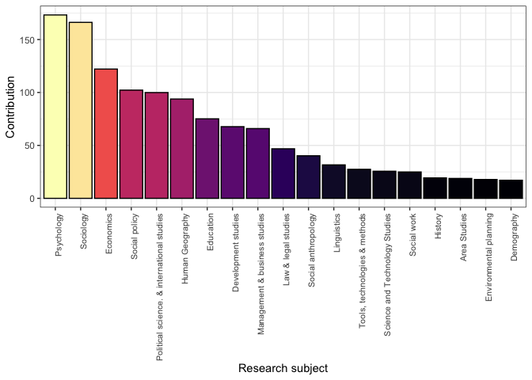<!-- -->

Plot the total awards against research subject.

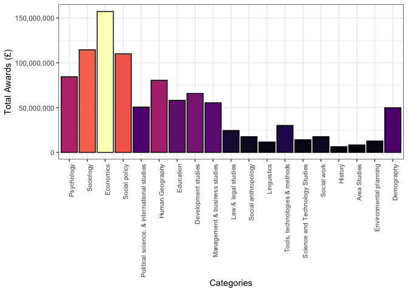<!-- -->

Plot the average award against research subject.

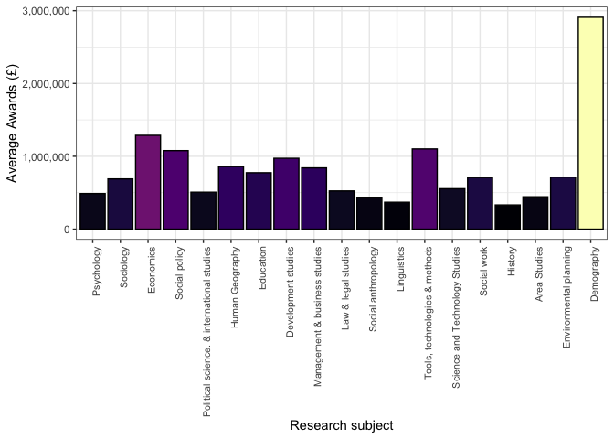<!-- -->

<!-- -->

<!-- -->

## Classification by category using research topics

Unlike the 71 unique research subjects there are 399 unique [research
topics](https://gtr.ukri.org/resources/classificationlists.html) but it
gives as a different way of classifying awards into the categories
mentioned above. As there are a lot more topics to assign you will have
to examine the code to see the detail. This would be a zeroth order
approximation to the matching with categories.

The GtR [says](https://gtr.ukri.org/resources/data.html):

> Classifications: The ability to search for classifications has been
> provided to give an insight into grants that are from similar areas
> that may be of interest to the user. Care should be taken if using
> these classifications for comparative analysis purposes as the source,
> coverage and level of usage of the classifications varies
> significantly across the GtR funders. It is not possible to search and
> download all the classification categories that are being published on
> GtR. The ones that are searchable and downloadable are Research
> Topics, Health Category and UKRI Programmes. A full list of these
> classifications and their categories can be found here.

As with research subjects a project might be assigned more than one
research topics, as previously done if a project is associated with n
research topics then each of these will contribute 1/n to the
classification count and will be assigned a contribution of
Award_amount/n to each category. We can compare the number of research
subjects/topics assigned to each project in the graph below.

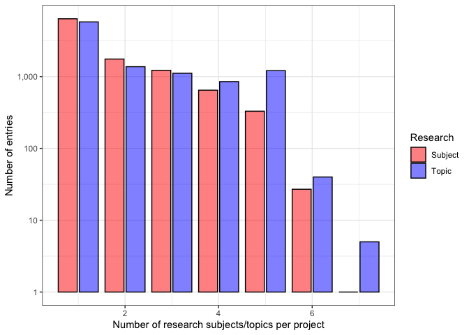<!-- -->

Taking this into account for each project, this gives a breakdown of the
number of awards and amount awarded as ordered by the total awarded to
each category:

| Category                                   | Number of awards | Number % | Award (£)   | Award % |
|:-------------------------------------------|:-----------------|:---------|:------------|:--------|
| Other                                      | 4,751.8          | 46       | 921,555,293 | 28      |
| Economics                                  | 623.3            | 6        | 369,121,298 | 11      |
| Sociology                                  | 574.2            | 6        | 258,482,444 | 8       |
| Psychology                                 | 684.5            | 7        | 198,722,802 | 6       |
| Social policy                              | 375.8            | 4        | 194,707,004 | 6       |
| Political science. & international studies | 605.5            | 6        | 177,659,697 | 5       |
| Development studies                        | 249.1            | 2        | 160,167,131 | 5       |
| Education                                  | 358.4            | 3        | 151,290,227 | 5       |
| Human Geography                            | 373.7            | 4        | 138,566,197 | 4       |
| Management & business studies              | 358.8            | 3        | 116,601,273 | 4       |
| Environmental planning                     | 243.1            | 2        | 109,243,745 | 3       |
| Demography                                 | 109.0            | 1        | 103,605,676 | 3       |
| Law & legal studies                        | 254.5            | 2        | 73,651,173  | 2       |
| Linguistics                                | 173.6            | 2        | 52,289,250  | 2       |
| Social anthropology                        | 154.3            | 1        | 47,376,835  | 1       |
| Tools, technologies & methods              | 90.9             | 1        | 44,415,252  | 1       |
| Uncategorised                              | 54.0             | 1        | 41,980,644  | 1       |
| Science and Technology Studies             | 127.2            | 1        | 39,836,949  | 1       |
| Area Studies                               | 136.1            | 1        | 30,291,410  | 1       |
| Social work                                | 51.4             | 0        | 11,769,752  | 0       |
| History                                    | 23.9             | 0        | 7,491,934   | 0       |

The order of projects categorised by research topics here are broadly
similar to that produced by the research subjects though there are some
note-able differences. For instance, the “Uncategorised” items are much
less and there some differences in the ordering - for the research
subject categorisation “Education” was followed by “Development studies”
while for research topics the order is the other way round. The graph
below shows the difference in the order of the Topics in relation to the
Subject ordering. The fact that the very first value differs causes a
knock on effect (the order is done by the total amount awarded per
category).

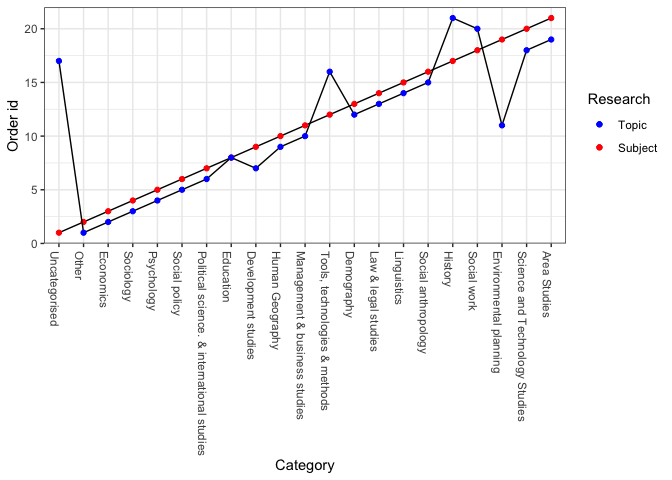<!-- --> The award amounts
are broadly similar. There are many less uncategorised items using the
research topics though there are a lot more others which are items that
do not fit into chosen categories. There are smaller differences in
Sociology, Development studies, Human geography and in other cases too.

If we remove `Other` and the `Uncategorised` categories:

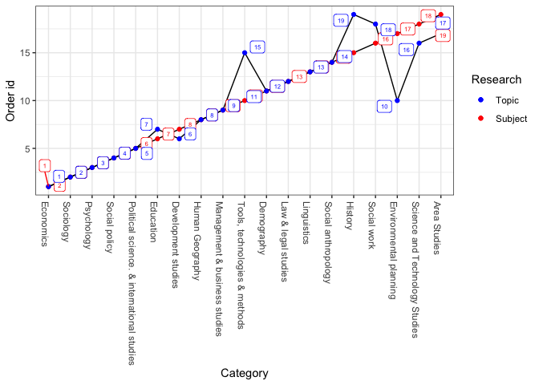<!-- -->

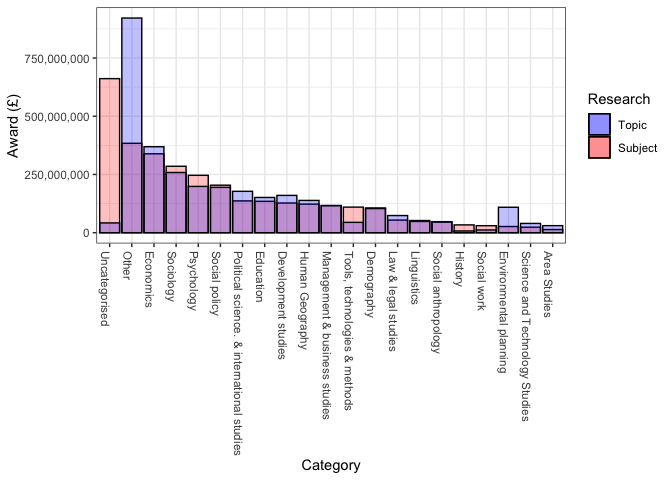<!-- -->

Removing other and uncategorised fields.

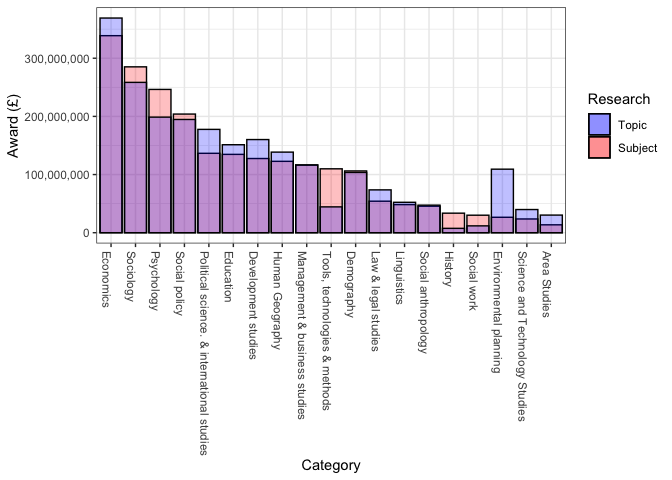<!-- -->

In terms of the award numbers scaled by multiple subject/topic
classifications there are some differences but I think these mainly lie
in the Uncategorised and Other categories. There are also some
differences in Development studies, Demography, Human geography, Science
and Technology and Area Studies.

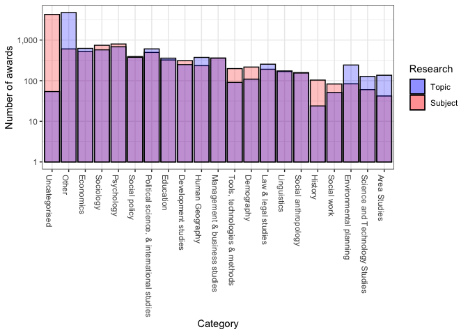<!-- -->

Removing the `Other` and `Unclassified` categories:

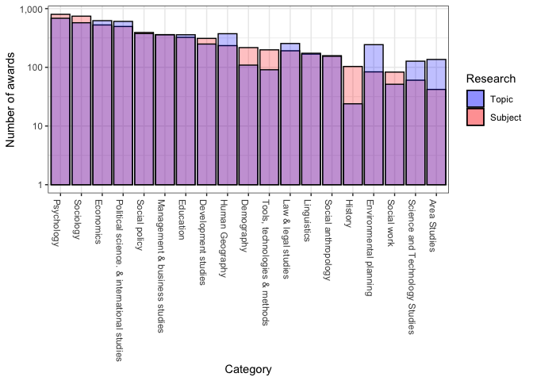<!-- -->

Normalising the quantities without the `Other` and `Unclassified`:

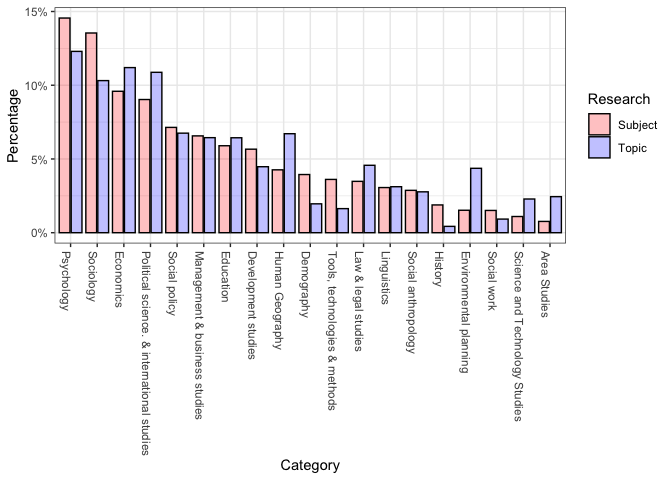<!-- --> The
`Other` category dominates by award amount though the `Uncategorised`
dominate by numbers. Looking at the `Other` category in more detail:

| Subject                        | Number of awards | Number % | Award (£)      | Award % |
|:-------------------------------|:-----------------|:---------|:---------------|:--------|
| Unclassified                   | 4,277.0          | 90       | 661,431,925.00 | 72      |
| Mental Health                  | 33.4             | 1        | 27,714,002.97  | 3       |
| Biomedical sciences            | 3.9              | 0        | 22,828,828.03  | 2       |
| Children and Families          | 26.2             | 1        | 17,040,876.50  | 2       |
| Med Soc/Soc Health & Illness   | 43.3             | 1        | 16,504,981.17  | 2       |
| Innovation                     | 20.2             | 0        | 15,524,338.66  | 2       |
| Information & Knowledge Mgmt   | 11.0             | 0        | 13,196,390.07  | 1       |
| Medical science & disease      | 31.3             | 1        | 12,544,465.24  | 1       |
| Global Health and Medicine     | 15.8             | 0        | 12,266,863.58  | 1       |
| Climate & Climate Change       | 14.0             | 0        | 9,915,426.38   | 1       |
| Dev Informatics & Technology   | 4.1              | 0        | 8,529,210.88   | 1       |
| Biomedical neuroscience        | 13.9             | 0        | 7,416,596.63   | 1       |
| Stratification                 | 18.3             | 0        | 6,879,595.18   | 1       |
| Epigenetics                    | 5.4              | 0        | 6,394,452.26   | 1       |
| Community Art inc A & H        | 5.6              | 0        | 5,525,467.40   | 1       |
| Cultural Studies               | 16.5             | 0        | 5,342,471.32   | 1       |
| Bioinformatics                 | 3.4              | 0        | 5,046,044.76   | 1       |
| Agricultural systems           | 7.9              | 0        | 4,791,784.82   | 1       |
| Research approaches            | 10.7             | 0        | 3,959,015.53   | 0       |
| Media & Communication Studies  | 13.2             | 0        | 3,927,819.63   | 0       |
| Diet & health                  | 9.3              | 0        | 3,325,246.11   | 0       |
| Rel, Material & Cog Anthrop    | 6.3              | 0        | 3,286,865.25   | 0       |
| Design Processes               | 6.8              | 0        | 3,186,990.19   | 0       |
| Analytical Science             | 0.9              | 0        | 2,698,450.60   | 0       |
| Kinship Health & relatedness   | 11.4             | 0        | 2,634,870.19   | 0       |
| Survey & Monitoring            | 4.6              | 0        | 2,484,997.04   | 0       |
| New Media/Web-Based Studies    | 11.0             | 0        | 2,305,923.49   | 0       |
| Reproductive and sexual health | 4.6              | 0        | 1,974,633.30   | 0       |
| Sustainable Energy Networks    | 3.9              | 0        | 1,924,626.74   | 0       |
| Product Design                 | 5.1              | 0        | 1,920,842.18   | 0       |
| Media Studies                  | 7.1              | 0        | 1,734,082.03   | 0       |
| Architecture HTP               | 2.6              | 0        | 1,628,427.90   | 0       |
| Pollution                      | 2.5              | 0        | 1,422,322.67   | 0       |
| Manufact. Enterprise Ops& Mgmt | 7.1              | 0        | 1,304,574.89   | 0       |
| Microbiology                   | 1.5              | 0        | 1,218,548.23   | 0       |
| Energy Efficiency              | 4.1              | 0        | 899,652.29     | 0       |
| Systems neuroscience           | 2.6              | 0        | 833,556.55     | 0       |
| Islam                          | 1.9              | 0        | 797,287.47     | 0       |
| Marketing                      | 4.4              | 0        | 788,332.64     | 0       |
| Sport and Exercise             | 2.5              | 0        | 780,883.70     | 0       |
| Food processing                | 2.0              | 0        | 749,638.41     | 0       |
| Design HTP                     | 1.2              | 0        | 604,640.47     | 0       |
| Hosp, Leisure & tourism manage | 3.6              | 0        | 596,878.03     | 0       |
| Multimedia                     | 1.6              | 0        | 501,087.40     | 0       |
| Project Studies                | 1.9              | 0        | 499,727.72     | 0       |
| Cultural Studies & Pop Culture | 2.5              | 0        | 478,053.82     | 0       |
| Drama & Theatre - Other        | 0.6              | 0        | 448,072.80     | 0       |
| Structural Engineering         | 0.8              | 0        | 439,579.04     | 0       |
| Inter-faith Relations          | 1.7              | 0        | 438,513.50     | 0       |
| Genomics                       | 0.8              | 0        | 435,318.51     | 0       |
| Design Engineering             | 2.6              | 0        | 421,447.83     | 0       |
| Boundary Layer Meteorology     | 0.2              | 0        | 402,282.25     | 0       |
| Medical Imaging                | 1.8              | 0        | 400,611.55     | 0       |
| Digital Signal Processing      | 1.2              | 0        | 395,443.55     | 0       |
| Music & Society                | 1.9              | 0        | 355,332.72     | 0       |
| Gene action & regulation       | 1.6              | 0        | 352,062.65     | 0       |
| Digital Art & Design           | 1.9              | 0        | 350,086.27     | 0       |
| Gender & Sexuality             | 0.6              | 0        | 349,660.59     | 0       |
| Bioenergy                      | 1.2              | 0        | 323,253.05     | 0       |
| eScience                       | 1.2              | 0        | 299,838.66     | 0       |
| Performance & Live Art         | 1.0              | 0        | 298,827.85     | 0       |
| Comparative Literature         | 0.6              | 0        | 295,616.87     | 0       |
| Celtic Studies                 | 0.2              | 0        | 288,176.60     | 0       |
| Museum & Gallery Studies       | 2.6              | 0        | 287,483.30     | 0       |
| Gender & Sexuality Studies     | 1.2              | 0        | 285,019.00     | 0       |
| Film-based media (H, T & P)    | 1.0              | 0        | 274,793.40     | 0       |
| Applied Arts HTP               | 1.5              | 0        | 261,554.72     | 0       |
| Immunology                     | 0.3              | 0        | 261,081.66     | 0       |
| Theatre & Society              | 1.6              | 0        | 237,703.50     | 0       |
| Networks & Distributed Systems | 1.8              | 0        | 235,440.12     | 0       |
| Sustainable Energy Vectors     | 0.8              | 0        | 221,227.14     | 0       |
| Soil science                   | 0.4              | 0        | 214,212.40     | 0       |
| Journalism                     | 1.5              | 0        | 208,450.39     | 0       |
| Food structure/composition     | 0.4              | 0        | 198,729.30     | 0       |
| Energy - Nuclear               | 1.0              | 0        | 189,079.00     | 0       |
| Landscape Architecture         | 1.8              | 0        | 187,530.74     | 0       |
| Photography HTP                | 0.8              | 0        | 186,656.65     | 0       |
| Energy Storage                 | 0.4              | 0        | 175,257.80     | 0       |
| Assess/Remediate Contamination | 0.2              | 0        | 173,266.20     | 0       |
| Mining & Minerals Extraction   | 0.2              | 0        | 173,266.20     | 0       |
| Drug Formulation & Delivery    | 0.6              | 0        | 165,582.19     | 0       |
| Cells                          | 0.3              | 0        | 163,968.20     | 0       |
| Tissue engineering             | 0.3              | 0        | 163,968.20     | 0       |
| Ground Engineering             | 1.0              | 0        | 152,219.00     | 0       |
| Civil Engineering Materials    | 0.4              | 0        | 147,576.80     | 0       |
| Lifewriting                    | 0.5              | 0        | 146,455.09     | 0       |
| English Language & Literature  | 1.6              | 0        | 145,271.71     | 0       |
| Art Theory & Aesthetics        | 1.4              | 0        | 145,176.40     | 0       |
| Musculoskeletal system         | 0.5              | 0        | 140,130.50     | 0       |
| Biomechanics & Rehabilitation  | 2.4              | 0        | 138,807.44     | 0       |
| Creative Writing               | 0.6              | 0        | 130,747.87     | 0       |
| Buddhism                       | 0.4              | 0        | 130,633.65     | 0       |
| Energy - Conventional          | 0.7              | 0        | 126,407.40     | 0       |
| Materials Processing           | 0.2              | 0        | 122,907.40     | 0       |
| Land - Atmosphere Interactions | 0.2              | 0        | 115,780.60     | 0       |
| Food microbiology              | 0.9              | 0        | 114,688.20     | 0       |
| Stem cell biology              | 0.2              | 0        | 101,618.20     | 0       |
| Philosophy Of Mind             | 0.6              | 0        | 101,522.40     | 0       |
| Information Sci. & Retrieval   | 0.4              | 0        | 97,306.75      | 0       |
| Metabolomics / Metabonomics    | 0.4              | 0        | 88,579.15      | 0       |
| Materials Synthesis & Growth   | 0.7              | 0        | 86,234.35      | 0       |
| Acoustics                      | 0.3              | 0        | 80,598.32      | 0       |
| Power Sys Man, Prot & Control  | 0.2              | 0        | 76,054.25      | 0       |
| Functional genomics            | 0.2              | 0        | 75,978.40      | 0       |
| Proteomics                     | 0.2              | 0        | 75,978.40      | 0       |
| Atheism/Secularism             | 0.4              | 0        | 68,466.97      | 0       |
| Fine Art HTP                   | 0.9              | 0        | 68,298.05      | 0       |
| Library Studies                | 0.2              | 0        | 64,978.75      | 0       |
| Choreography                   | 0.4              | 0        | 60,961.60      | 0       |
| Dance Performance              | 0.4              | 0        | 60,961.60      | 0       |
| Digital Arts HTP               | 0.5              | 0        | 55,776.29      | 0       |
| Aesthetics                     | 0.5              | 0        | 55,670.66      | 0       |
| Theoretical biology            | 0.5              | 0        | 54,076.43      | 0       |
| Publishing                     | 0.3              | 0        | 53,834.44      | 0       |
| Music & Acoustic Technology    | 0.4              | 0        | 42,102.00      | 0       |
| Musical Performance            | 0.4              | 0        | 42,102.00      | 0       |
| Classical Music                | 0.6              | 0        | 40,553.60      | 0       |
| Surfaces & Interfaces          | 0.3              | 0        | 39,987.64      | 0       |
| Astron. & Space Sci. Technol.  | 0.2              | 0        | 38,559.00      | 0       |
| Extra-Galactic Astron.&Cosmol. | 0.2              | 0        | 38,559.00      | 0       |
| Galactic & Interstellar Astron | 0.2              | 0        | 38,559.00      | 0       |
| Gamma Ray Astronomy            | 0.2              | 0        | 38,559.00      | 0       |
| Bioelectronic Devices          | 0.7              | 0        | 33,321.98      | 0       |
| Traditional Music              | 0.3              | 0        | 33,112.52      | 0       |
| Biogeochemical Cycles          | 0.2              | 0        | 30,487.60      | 0       |
| Dramaturgy                     | 0.2              | 0        | 23,802.00      | 0       |
| Materials testing & eng.       | 0.2              | 0        | 20,638.00      | 0       |
| Archives                       | 0.2              | 0        | 19,664.20      | 0       |
| Installation & Sound Art HTP   | 0.2              | 0        | 18,258.80      | 0       |
| Archaeology of Literate Soc.   | 0.2              | 0        | 14,945.00      | 0       |
| Composition                    | 0.2              | 0        | 10,038.60      | 0       |
| Archaeological Theory          | 0.2              | 0        | 6,012.20       | 0       |
| Biomaterials                   | 0.2              | 0        | 6,012.20       | 0       |
| Materials Characterisation     | 0.2              | 0        | 5,427.80       | 0       |
| Optical Devices & Subsystems   | 0.2              | 0        | 5,427.80       | 0       |
| Literary & Cultural Theory     | 0.2              | 0        | 5,376.60       | 0       |

There are some large items near the top. Also, a lot of these items
would not usually fall under the ESRC area.

If we only focus on currently active projects we get:

| Category                                   | Number of awards | Number % | Award (£)   | Award % |
|:-------------------------------------------|:-----------------|:---------|:------------|:--------|
| Other                                      | 3,673.1          | 74       | 687,246,037 | 39      |
| Economics                                  | 146.3            | 3        | 165,514,088 | 9       |
| Development studies                        | 97.8             | 2        | 112,119,807 | 6       |
| Social policy                              | 96.9             | 2        | 107,708,641 | 6       |
| Sociology                                  | 58.8             | 1        | 79,071,714  | 4       |
| Political science. & international studies | 145.2            | 3        | 74,622,405  | 4       |
| Human Geography                            | 97.6             | 2        | 71,909,045  | 4       |
| Education                                  | 90.8             | 2        | 71,247,708  | 4       |
| Demography                                 | 29.6             | 1        | 70,097,791  | 4       |
| Environmental planning                     | 81.8             | 2        | 59,086,588  | 3       |
| Psychology                                 | 116.8            | 2        | 57,367,675  | 3       |
| Management & business studies              | 70.3             | 1        | 53,222,713  | 3       |
| Law & legal studies                        | 80.3             | 2        | 38,431,634  | 2       |
| Uncategorised                              | 2.0              | 0        | 36,002,161  | 2       |
| Tools, technologies & methods              | 41.8             | 1        | 28,183,776  | 2       |
| Social anthropology                        | 35.7             | 1        | 17,740,044  | 1       |
| Linguistics                                | 35.4             | 1        | 13,808,546  | 1       |
| Science and Technology Studies             | 22.9             | 0        | 13,149,808  | 1       |
| Social work                                | 9.4              | 0        | 4,809,200   | 0       |
| History                                    | 7.4              | 0        | 2,603,237   | 0       |
| Area Studies                               | 4.0              | 0        | 2,336,274   | 0       |

and again looking to see how the `Other` category breakdown for active
projects only:

| Subject                        | Number of awards | Number % | Award (£)      | Award % |
|:-------------------------------|:-----------------|:---------|:---------------|:--------|
| Unclassified                   | 3,478.0          | 95       | 523,234,670.00 | 76      |
| Biomedical sciences            | 1.5              | 0        | 21,238,524.69  | 3       |
| Mental Health                  | 14.8             | 0        | 17,435,214.87  | 3       |
| Children and Families          | 12.3             | 0        | 12,012,258.81  | 2       |
| Innovation                     | 6.5              | 0        | 11,225,924.27  | 2       |
| Global Health and Medicine     | 7.5              | 0        | 10,602,112.10  | 2       |
| Information & Knowledge Mgmt   | 2.7              | 0        | 8,628,563.89   | 1       |
| Med Soc/Soc Health & Illness   | 20.5             | 1        | 7,274,379.10   | 1       |
| Medical science & disease      | 10.7             | 0        | 6,766,584.49   | 1       |
| Climate & Climate Change       | 5.0              | 0        | 6,720,019.94   | 1       |
| Community Art inc A & H        | 2.8              | 0        | 4,977,431.35   | 1       |
| Dev Informatics & Technology   | 0.8              | 0        | 4,719,836.80   | 1       |
| Biomedical neuroscience        | 6.3              | 0        | 4,048,125.58   | 1       |
| Cultural Studies               | 9.7              | 0        | 3,733,247.34   | 1       |
| Agricultural systems           | 2.8              | 0        | 3,598,961.94   | 1       |
| Stratification                 | 7.2              | 0        | 3,210,087.16   | 0       |
| Rel, Material & Cog Anthrop    | 4.3              | 0        | 2,994,432.26   | 0       |
| Analytical Science             | 0.7              | 0        | 2,686,572.60   | 0       |
| Media & Communication Studies  | 5.9              | 0        | 2,660,638.85   | 0       |
| Design Processes               | 3.1              | 0        | 1,965,512.47   | 0       |
| Research approaches            | 2.8              | 0        | 1,863,664.55   | 0       |
| Kinship Health & relatedness   | 6.6              | 0        | 1,604,859.42   | 0       |
| Reproductive and sexual health | 2.3              | 0        | 1,468,902.83   | 0       |
| Diet & health                  | 3.6              | 0        | 1,397,104.56   | 0       |
| Architecture HTP               | 1.0              | 0        | 1,359,157.95   | 0       |
| Sustainable Energy Networks    | 1.6              | 0        | 1,233,320.04   | 0       |
| Pollution                      | 1.0              | 0        | 1,190,486.09   | 0       |
| Product Design                 | 3.4              | 0        | 1,171,489.75   | 0       |
| Microbiology                   | 0.8              | 0        | 1,058,236.00   | 0       |
| New Media/Web-Based Studies    | 2.8              | 0        | 959,591.99     | 0       |
| Manufact. Enterprise Ops& Mgmt | 3.1              | 0        | 848,402.64     | 0       |
| Media Studies                  | 3.0              | 0        | 815,269.11     | 0       |
| Bioinformatics                 | 1.1              | 0        | 741,695.04     | 0       |
| Sport and Exercise             | 1.8              | 0        | 694,804.10     | 0       |
| Food processing                | 1.2              | 0        | 629,772.41     | 0       |
| Islam                          | 1.1              | 0        | 580,027.25     | 0       |
| Energy Efficiency              | 1.2              | 0        | 497,773.56     | 0       |
| Drama & Theatre - Other        | 0.6              | 0        | 448,072.80     | 0       |
| Hosp, Leisure & tourism manage | 0.9              | 0        | 427,304.95     | 0       |
| Structural Engineering         | 0.5              | 0        | 423,635.00     | 0       |
| Boundary Layer Meteorology     | 0.2              | 0        | 402,282.25     | 0       |
| Design HTP                     | 0.4              | 0        | 390,921.00     | 0       |
| Gender & Sexuality             | 0.6              | 0        | 349,660.59     | 0       |
| Project Studies                | 0.3              | 0        | 333,593.74     | 0       |
| Performance & Live Art         | 0.9              | 0        | 295,812.25     | 0       |
| Digital Signal Processing      | 0.6              | 0        | 280,372.40     | 0       |
| Music & Society                | 1.1              | 0        | 274,374.72     | 0       |
| Systems neuroscience           | 0.3              | 0        | 264,462.61     | 0       |
| Immunology                     | 0.3              | 0        | 261,081.66     | 0       |
| Survey & Monitoring            | 0.9              | 0        | 239,868.91     | 0       |
| Soil science                   | 0.2              | 0        | 184,154.80     | 0       |
| Cultural Studies & Pop Culture | 0.9              | 0        | 179,971.35     | 0       |
| Energy - Nuclear               | 0.5              | 0        | 176,290.50     | 0       |
| Film-based media (H, T & P)    | 0.6              | 0        | 176,107.00     | 0       |
| Comparative Literature         | 0.2              | 0        | 174,744.80     | 0       |
| Applied Arts HTP               | 0.9              | 0        | 174,314.52     | 0       |
| Assess/Remediate Contamination | 0.2              | 0        | 173,266.20     | 0       |
| Mining & Minerals Extraction   | 0.2              | 0        | 173,266.20     | 0       |
| Drug Formulation & Delivery    | 0.6              | 0        | 165,582.19     | 0       |
| Cells                          | 0.3              | 0        | 163,968.20     | 0       |
| Tissue engineering             | 0.3              | 0        | 163,968.20     | 0       |
| Bioenergy                      | 0.2              | 0        | 153,693.00     | 0       |
| Museum & Gallery Studies       | 1.5              | 0        | 148,769.15     | 0       |
| Marketing                      | 0.4              | 0        | 142,740.95     | 0       |
| Photography HTP                | 0.4              | 0        | 141,664.65     | 0       |
| Inter-faith Relations          | 0.2              | 0        | 138,700.60     | 0       |
| Medical Imaging                | 0.7              | 0        | 138,516.70     | 0       |
| Journalism                     | 0.5              | 0        | 137,960.37     | 0       |
| Food structure/composition     | 0.2              | 0        | 122,917.80     | 0       |
| Civil Engineering Materials    | 0.2              | 0        | 122,907.40     | 0       |
| Energy Storage                 | 0.2              | 0        | 122,907.40     | 0       |
| Materials Processing           | 0.2              | 0        | 122,907.40     | 0       |
| Biomechanics & Rehabilitation  | 2.2              | 0        | 108,318.84     | 0       |
| Stem cell biology              | 0.2              | 0        | 101,618.20     | 0       |
| Landscape Architecture         | 1.0              | 0        | 97,342.90      | 0       |
| Theatre & Society              | 0.4              | 0        | 93,739.50      | 0       |
| Genomics                       | 0.4              | 0        | 88,579.15      | 0       |
| Metabolomics / Metabonomics    | 0.4              | 0        | 88,579.15      | 0       |
| Design Engineering             | 0.9              | 0        | 85,997.05      | 0       |
| Acoustics                      | 0.3              | 0        | 80,598.32      | 0       |
| Power Sys Man, Prot & Control  | 0.2              | 0        | 76,054.25      | 0       |
| Functional genomics            | 0.2              | 0        | 75,978.40      | 0       |
| Proteomics                     | 0.2              | 0        | 75,978.40      | 0       |
| Gender & Sexuality Studies     | 0.4              | 0        | 61,982.80      | 0       |
| Networks & Distributed Systems | 0.2              | 0        | 60,648.75      | 0       |
| Digital Arts HTP               | 0.5              | 0        | 55,776.29      | 0       |
| Sustainable Energy Vectors     | 0.5              | 0        | 54,535.00      | 0       |
| Art Theory & Aesthetics        | 0.7              | 0        | 50,318.60      | 0       |
| Digital Art & Design           | 0.6              | 0        | 40,425.69      | 0       |
| Philosophy Of Mind             | 0.4              | 0        | 40,186.00      | 0       |
| Aesthetics                     | 0.3              | 0        | 36,174.46      | 0       |
| Fine Art HTP                   | 0.7              | 0        | 33,453.25      | 0       |
| Bioelectronic Devices          | 0.7              | 0        | 33,321.98      | 0       |
| Traditional Music              | 0.3              | 0        | 33,112.52      | 0       |
| Multimedia                     | 0.5              | 0        | 24,554.00      | 0       |
| Dramaturgy                     | 0.2              | 0        | 23,802.00      | 0       |
| Materials testing & eng.       | 0.2              | 0        | 20,638.00      | 0       |
| Epigenetics                    | 0.2              | 0        | 19,939.80      | 0       |
| Composition                    | 0.2              | 0        | 10,038.60      | 0       |
| Classical Music                | 0.2              | 0        | 10,006.40      | 0       |
| Creative Writing               | 0.2              | 0        | 9,990.20       | 0       |
| Buddhism                       | 0.2              | 0        | 9,897.40       | 0       |
| English Language & Literature  | 0.2              | 0        | 6,033.40       | 0       |

Ignoring the `Other` and `Uncategorised` categories and considering only
active projects:

| Category                                   | Number of awards | Number % | Award (£)   | Award % |
|:-------------------------------------------|:-----------------|:---------|:------------|:--------|
| Economics                                  | 146.3            | 12       | 165,514,088 | 16      |
| Development studies                        | 97.8             | 8        | 112,119,807 | 11      |
| Social policy                              | 96.9             | 8        | 107,708,641 | 10      |
| Sociology                                  | 58.8             | 5        | 79,071,714  | 8       |
| Political science. & international studies | 145.2            | 11       | 74,622,405  | 7       |
| Human Geography                            | 97.6             | 8        | 71,909,045  | 7       |
| Education                                  | 90.8             | 7        | 71,247,708  | 7       |
| Demography                                 | 29.6             | 2        | 70,097,791  | 7       |
| Environmental planning                     | 81.8             | 6        | 59,086,588  | 6       |
| Psychology                                 | 116.8            | 9        | 57,367,675  | 6       |
| Management & business studies              | 70.3             | 6        | 53,222,713  | 5       |
| Law & legal studies                        | 80.3             | 6        | 38,431,634  | 4       |
| Tools, technologies & methods              | 41.8             | 3        | 28,183,776  | 3       |
| Social anthropology                        | 35.7             | 3        | 17,740,044  | 2       |
| Linguistics                                | 35.4             | 3        | 13,808,546  | 1       |
| Science and Technology Studies             | 22.9             | 2        | 13,149,808  | 1       |
| Social work                                | 9.4              | 1        | 4,809,200   | 0       |
| History                                    | 7.4              | 1        | 2,603,237   | 0       |
| Area Studies                               | 4.0              | 0        | 2,336,274   | 0       |

Plot the number of contributions against research topic.

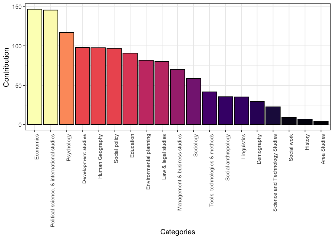<!-- -->

Plot the total awards against research subject.

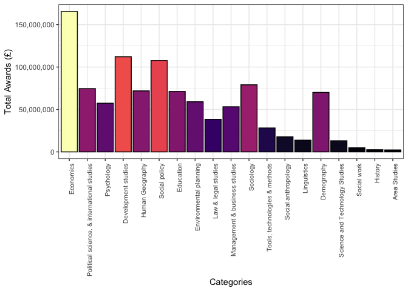<!-- -->

Plot the average award against research subject.

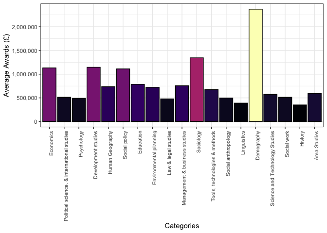<!-- -->

# ToDo Items

-   [ ] Reconcile DTPs from what was scraped from the [ESRC
    DTP](https://esrc.ukri.org/skills-and-careers/doctoral-training/doctoral-training-partnerships/doctoral-training-partnership-dtp-contacts/)
    web page and what is in the GtR data file (there are more).
-   [ ] Research title looks interesting for further examination but
    will require processing to be comprehensible.
