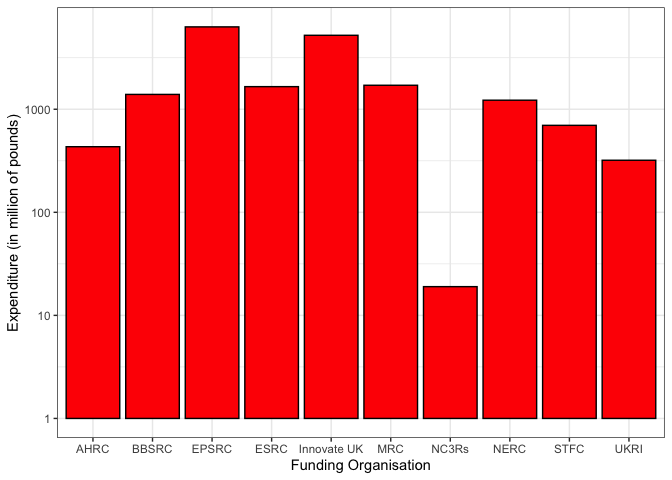

Economic and Social Research Council (ESRC) Data
================
**Author**: Mario Antonioletti. 
**Last updated**: 15/10/21.

-   [Introduction](#introduction)
-   [Overall expenditure](#overall-expenditure)
    -   [Expenditure for all UKRI
        projects](#expenditure-for-all-ukri-projects)
    -   [Expenditure for active UKRI projects
        only](#expenditure-for-active-ukri-projects-only)
-   [ESRC data](#esrc-data)
    -   [Project category awards](#project-category-awards)
        -   [All projects category
            awards](#all-projects-category-awards)
        -   [Active projects categry awards
            only](#active-projects-categry-awards-only)
    -   [Award length distribution](#award-length-distribution)
        -   [Award length distribution for all
            projects](#award-length-distribution-for-all-projects)
        -   [Award length distribution for active projects
            only](#award-length-distribution-for-active-projects-only)
    -   [Regional distribution of
        awards](#regional-distribution-of-awards)
        -   [Region distributions of awards for all
            projects](#region-distributions-of-awards-for-all-projects)
        -   [Regional distributions of awards for active projects
            only](#regional-distributions-of-awards-for-active-projects-only)
    -   [Funding by lead organisation](#funding-by-lead-organisation)
        -   [Funding by lead organisation for all
            projects](#funding-by-lead-organisation-for-all-projects)
        -   [Funding by lead organisation for active projects
            only](#funding-by-lead-organisation-for-active-projects-only)
    -   [Department awards](#department-awards)
        -   [Department awards for all
            projects](#department-awards-for-all-projects)
        -   [Department awards for active projects
            only](#department-awards-for-active-projects-only)
    -   [Doctoral Training
        Partnerships](#doctoral-training-partnerships)
        -   [Active Partnerships](#active-partnerships)
-   [ToDo Items](#todo-items)

# Introduction

The aim of this document is to give an overview of expenditure done by
the [United Kingdom Research and Innovation](https://www.ukri.org/)
(UKRI) ESRC as determined from a [Gateway to
Research](https://gtr.ukri.org/) (GtR) data set, made available under an
[Open Government
Licence](https://www.nationalarchives.gov.uk/doc/open-government-licence/version/3/),
which covers the period 01/01/73 to 01/01/30. The GtR data snapshot was
downloaded from the GtR website on the 11/10/21 and was last updated by
UKRI on the 30th of September 2021. The R markdown should also work on
any future updates.

The data set contains 120,865 rows (after some data cleaning), where a
row can be interpreted as the record of an award. In this data set
10,834 correspond to ESRC awards.

# Overall expenditure

## Expenditure for all UKRI projects

Expenditure for the whole period under consideration is shown in the
graph below. Awards that do not have a value defined have been removed.

## Expenditure for active UKRI projects only

The graph below only contains values for currently active projects:

# ESRC data

## Project category awards

### All projects category awards

The project categories for the ESRC awards covering the period 01/01/06
to 30/09/29. No explicit data seems to be provided for *Studentships*.

| Project Catgeory | Number of Awards | Total Awarded (£) | Average Award (£) |
|:-----------------|-----------------:|------------------:|------------------:|
| Training Grant   |              403 |       574,208,131 |       1,424,834.1 |
| Research Grant   |            5,988 |     2,631,071,135 |         439,390.6 |
| Fellowship       |            1,415 |       151,376,374 |         106,979.8 |
| Studentship      |            3,028 |                 0 |               0.0 |

### Active projects categry awards only

This information corresponds to projects that are classified as
*Active*.

| Project Catgeory | Number of Awards | Total Awarded (£) | Average Award (£) |
|:-----------------|-----------------:|------------------:|------------------:|
| Training Grant   |               72 |       480,410,834 |       6,672,372.7 |
| Research Grant   |            1,232 |     1,143,410,400 |         928,092.9 |
| Fellowship       |              284 |        33,284,791 |         117,200.0 |
| Studentship      |            2,870 |                 0 |               0.0 |

## Award length distribution

### Award length distribution for all projects

The award length distribution of the award lengths binned into 28-day
periods is shown below.

### Award length distribution for active projects only

The same information as provided above but only for *Active* projects.
The maximum funding period corresponds to 4382 days.

The top length of awards lie by project category in days is tabulated
below.

| Number of days | Project Category | Number of projects |
|---------------:|:-----------------|-------------------:|
|           1460 | Studentship      |                624 |
|           1095 | Research Grant   |                204 |
|           1095 | Studentship      |                186 |
|            364 | Fellowship       |                178 |
|           1094 | Studentship      |                164 |
|           1277 | Studentship      |                144 |
|            364 | Research Grant   |                 93 |
|           1460 | Research Grant   |                 88 |
|           1552 | Studentship      |                 79 |
|           1461 | Studentship      |                 73 |
|           1187 | Studentship      |                 72 |
|           1094 | Research Grant   |                 70 |
|            729 | Research Grant   |                 57 |
|           1186 | Studentship      |                 53 |
|           1642 | Studentship      |                 52 |

Percentage of award types by time length.

## Regional distribution of awards

### Region distributions of awards for all projects

The expenditure of the awards over the whole time period by region
ordered by the total award given is shown in the table below.

| Region                   | Number of Awards | Total Awarded (£) | Average Award (£) |
|:-------------------------|-----------------:|------------------:|------------------:|
| London                   |            2,146 |       787,629,225 |         367,022.0 |
| Unknown                  |            2,889 |       732,939,310 |         253,700.0 |
| South East               |            1,606 |       440,321,751 |         274,173.0 |
| East of England          |              211 |       337,843,043 |       1,601,151.9 |
| Scotland                 |            1,107 |       318,742,093 |         287,933.2 |
| North West               |              761 |       202,140,437 |         265,624.8 |
| South West               |              531 |       135,904,528 |         255,940.7 |
| West Midlands            |              388 |       116,408,219 |         300,021.2 |
| East Midlands            |              401 |        75,599,871 |         188,528.4 |
| Wales                    |              199 |        64,699,705 |         325,124.2 |
| Northern Ireland         |              154 |        48,860,541 |         317,276.2 |
| Yorkshire and The Humber |              308 |        46,657,789 |         151,486.3 |
| Outside UK               |               87 |        42,660,826 |         490,354.3 |
| North East               |               44 |         5,720,679 |         130,015.4 |
| NA                       |                2 |           527,623 |         263,811.5 |

### Regional distributions of awards for active projects only

We can generate the table for projects that are currently active ordered
by the total award given is shown in the table below.

| Region                   | Number of Awards | Total Awarded (£) | Average Award (£) |
|:-------------------------|-----------------:|------------------:|------------------:|
| London                   |              914 |       391,942,746 |        428,821.39 |
| Unknown                  |            1,299 |       359,876,346 |        277,041.07 |
| East of England          |               69 |       208,363,309 |      3,019,758.10 |
| South East               |              648 |       198,970,757 |        307,053.64 |
| Scotland                 |              425 |       159,790,596 |        375,977.87 |
| North West               |              305 |        95,100,417 |        311,804.65 |
| South West               |              215 |        68,982,724 |        320,849.88 |
| West Midlands            |              125 |        66,968,340 |        535,746.72 |
| Wales                    |               99 |        29,842,672 |        301,441.13 |
| East Midlands            |              150 |        27,054,527 |        180,363.51 |
| Northern Ireland         |               60 |        19,812,880 |        330,214.67 |
| Outside UK               |               27 |        17,942,249 |        664,527.74 |
| Yorkshire and The Humber |              110 |        10,514,565 |         95,586.95 |
| North East               |               11 |         1,843,525 |        167,593.18 |
| NA                       |                1 |           100,372 |        100,372.00 |

## Funding by lead organisation

### Funding by lead organisation for all projects

This only shows the top 25 organisations by the average value of the
award.

| Org                                     | Number of Awards | Total Awarded (£) | Average Award (£) |
|:----------------------------------------|-----------------:|------------------:|------------------:|
| World Conservation Monitoring Ctr WCMC  |                2 |        22,456,789 |     11,228,394.50 |
| Office for National Statistics          |                2 |        17,898,948 |      8,949,474.00 |
| Ministry of Justice                     |                1 |         3,412,732 |      3,412,732.00 |
| Liverpool School of Tropical Medicine   |                4 |        12,482,546 |      3,120,636.50 |
| International Institute for Env and Dev |                4 |         9,359,410 |      2,339,852.50 |
| Northern Ireland Stat Res Agency NISRA  |                2 |         3,979,826 |      1,989,913.00 |
| The Scottish Government                 |                3 |         5,468,844 |      1,822,948.00 |
| University of Essex                     |              170 |       307,055,795 |      1,806,210.56 |
| University of Pretoria                  |                2 |         2,581,756 |      1,290,878.00 |
| Rhodes University                       |                2 |         2,561,566 |      1,280,783.00 |
| Coventry University                     |               21 |        23,060,299 |      1,098,109.48 |
| Leonard Cheshire Disability             |                2 |         2,161,816 |      1,080,908.00 |
| Addis Ababa University                  |                3 |         3,131,845 |      1,043,948.33 |
| University of Cape Town                 |                6 |         5,670,678 |        945,113.00 |
| Johns Hopkins University                |                1 |           865,561 |        865,561.00 |
| University of Michigan                  |                3 |         2,240,913 |        746,971.00 |
| Institute of Development Studies        |               34 |        25,051,833 |        736,818.62 |
| National Institute of Public Health     |                1 |           722,163 |        722,163.00 |
| Institute for Fiscal Studies            |               74 |        50,370,972 |        680,688.81 |
| University of the Free State            |                1 |           670,903 |        670,903.00 |
| University of Nairobi                   |                1 |           614,772 |        614,772.00 |
| University of Lagos                     |                2 |         1,229,275 |        614,637.50 |
| University of the Witwatersrand         |                2 |         1,223,884 |        611,942.00 |
| Makerere University                     |                1 |           596,479 |        596,479.00 |
| Monash University                       |                1 |           572,984 |        572,984.00 |

### Funding by lead organisation for active projects only

This only shows the top 25 organisations with active projects by the
average value of the award.

| Org                                     | Number of Awards | Total Awarded (£) | Average Award (£) |
|:----------------------------------------|-----------------:|------------------:|------------------:|
| Liverpool School of Tropical Medicine   |                1 |        12,156,514 |     12,156,514.00 |
| World Conservation Monitoring Ctr WCMC  |                2 |        22,456,789 |     11,228,394.50 |
| Office for National Statistics          |                2 |        17,898,948 |      8,949,474.00 |
| International Institute for Env and Dev |                2 |         8,252,550 |      4,126,275.00 |
| Ministry of Justice                     |                1 |         3,412,732 |      3,412,732.00 |
| University of Essex                     |               59 |       182,174,111 |      3,087,696.80 |
| Coventry University                     |                8 |        22,024,518 |      2,753,064.75 |
| Northern Ireland Stat Res Agency NISRA  |                2 |         3,979,826 |      1,989,913.00 |
| The Scottish Government                 |                3 |         5,468,844 |      1,822,948.00 |
| University of Pretoria                  |                2 |         2,581,756 |      1,290,878.00 |
| Rhodes University                       |                2 |         2,561,566 |      1,280,783.00 |
| Addis Ababa University                  |                3 |         3,131,845 |      1,043,948.33 |
| Institute of Development Studies        |               11 |        11,185,739 |      1,016,885.36 |
| Cranfield University                    |                3 |         2,943,034 |        981,011.33 |
| Institute for Fiscal Studies            |               17 |        15,737,680 |        925,745.88 |
| University of Surrey                    |               25 |        22,761,941 |        910,477.64 |
| University of Cape Town                 |                4 |         3,264,723 |        816,180.75 |
| Washington University in St Louis       |                1 |           713,698 |        713,698.00 |
| University of Michigan                  |                1 |           697,241 |        697,241.00 |
| University of the Free State            |                1 |           670,903 |        670,903.00 |
| University College London               |              298 |       192,209,248 |        644,997.48 |
| University of Edinburgh                 |              134 |        84,313,517 |        629,205.35 |
| University of Nairobi                   |                1 |           614,772 |        614,772.00 |
| University of Lagos                     |                2 |         1,229,275 |        614,637.50 |
| University of the Witwatersrand         |                2 |         1,223,884 |        611,942.00 |

The same table ordered by the number of awards:

| Org                                  | Number of Awards | Total Awarded (£) | Average Award (£) |
|:-------------------------------------|-----------------:|------------------:|------------------:|
| University College London            |              298 |       192,209,248 |        644,997.48 |
| University of Oxford                 |              212 |        85,087,672 |        401,356.94 |
| London School of Economics & Pol Sci |              203 |        77,153,467 |        380,066.34 |
| Cardiff University                   |              194 |        57,753,590 |        297,698.92 |
| King’s College London                |              187 |        55,888,025 |        298,866.44 |
| University of Cambridge              |              180 |        43,757,825 |        243,099.03 |
| University of Manchester             |              172 |        52,461,785 |        305,010.38 |
| University of Sheffield              |              159 |        54,388,829 |        342,068.11 |
| University of Edinburgh              |              134 |        84,313,517 |        629,205.35 |
| University of Southampton            |              124 |        41,953,513 |        338,334.78 |
| University of Leeds                  |              118 |        26,316,633 |        223,022.31 |
| University of Bristol                |              116 |        55,911,023 |        481,991.58 |
| University of Exeter                 |              111 |        12,119,644 |        109,185.98 |
| University of Birmingham             |              109 |        17,784,306 |        163,158.77 |
| University of Glasgow                |              109 |        38,637,697 |        354,474.28 |
| University of Liverpool              |              107 |        55,411,421 |        517,863.75 |
| Newcastle University                 |              101 |        24,657,965 |        244,138.27 |
| Durham University                    |               92 |        29,292,951 |        318,401.64 |
| Lancaster University                 |               92 |        24,859,790 |        270,215.11 |
| University of Warwick                |               86 |        39,649,280 |        461,038.14 |
| University of Nottingham             |               77 |        16,777,758 |        217,892.96 |
| University of York                   |               77 |         8,404,399 |        109,148.04 |
| Queen Mary, University of London     |               73 |        10,693,466 |        146,485.84 |
| University of Bath                   |               70 |         9,274,029 |        132,486.13 |
| University of Sussex                 |               68 |        29,292,000 |        430,764.71 |

## Department awards

### Department awards for all projects

There are 1166 unique departments. The table below only shows
departments that have 30 or more occurrences. The Departments below have
been ‘cleaned’ to remove minor differences, e.g. Cardiff Business School
to Business School and so on.

| Department                             | Number | Percent |
|:---------------------------------------|-------:|--------:|
| Psychology                             |    839 |    7.74 |
| Social Science                         |    584 |    5.39 |
| Geography                              |    435 |    4.02 |
| Economics                              |    421 |    3.89 |
| Education                              |    335 |    3.09 |
| Sociology                              |    275 |    2.54 |
| Business School                        |    254 |    2.34 |
| Law                                    |    252 |    2.33 |
| Politics                               |    207 |    1.91 |
| Social and Political Science           |    150 |    1.38 |
| Management                             |    144 |    1.33 |
| Applied Social Science                 |    131 |    1.21 |
| Anthropology                           |    101 |    0.93 |
| Experimental Psychology                |     92 |    0.85 |
| Politics and International Studies     |     89 |    0.82 |
| Environment, Education and Development |     84 |    0.78 |
| International Development              |     84 |    0.78 |
| Geography Politics and Sociology       |     80 |    0.74 |
| Social & Political Science             |     75 |    0.69 |
| Sociology & Social Policy              |     75 |    0.69 |
| Health Science                         |     73 |    0.67 |
| History                                |     73 |    0.67 |
| IFS Research Team                      |     73 |    0.67 |
| Epidemiology and Public Health         |     71 |    0.66 |
| Research Department                    |     66 |    0.61 |
| Economic, Social & Political Sci       |     61 |    0.56 |
| Psychological Science                  |     60 |    0.55 |
| Politics and International Relations   |     58 |    0.54 |
| Global Studies                         |     55 |    0.51 |
| Policy Studies                         |     53 |    0.49 |
| Geography and Planning                 |     52 |    0.48 |
| Social and Economic Research           |     49 |    0.45 |
| Health and Life Science                |     46 |    0.42 |
| Philosophy Psychology & Language       |     46 |    0.42 |
| Unlisted                               |     45 |    0.42 |
| Arts, Humanities & Social Sci          |     44 |    0.41 |
| Government                             |     43 |    0.40 |
| Public Health and Policy               |     42 |    0.39 |
| Criminology                            |     41 |    0.38 |
| Social and Policy Science              |     39 |    0.36 |
| War Studies                            |     36 |    0.33 |
| Arts Languages and Cultures            |     35 |    0.32 |
| Education and Professional Studies     |     35 |    0.32 |
| Linguistics and English Language       |     35 |    0.32 |
| Sociological Studies                   |     33 |    0.30 |
| Finance                                |     32 |    0.30 |
| Social Pol Sociology & Social Res      |     31 |    0.29 |
| Social Policy                          |     31 |    0.29 |
| Planning and Geography                 |     30 |    0.28 |
| Politics & International Relation      |     30 |    0.28 |

### Department awards for active projects only

There are 633 unique departments for active projects (1166 for all
projects). The table below only shows cases that have 30 or more
occurrences in active projects.

| Department                         | Number | Percent |
|:-----------------------------------|-------:|--------:|
| Psychology                         |    326 |    7.31 |
| Social Science                     |    245 |    5.50 |
| Geography                          |    188 |    4.22 |
| Economics                          |    170 |    3.81 |
| Education                          |    160 |    3.59 |
| Sociology                          |    123 |    2.76 |
| Law                                |    122 |    2.74 |
| Business School                    |    106 |    2.38 |
| Politics                           |     93 |    2.09 |
| Applied Social Science             |     72 |    1.62 |
| Management                         |     53 |    1.19 |
| Anthropology                       |     48 |    1.08 |
| Economic, Social & Political Sci   |     47 |    1.05 |
| Arts, Humanities & Social Sci      |     44 |    0.99 |
| Geography Politics and Sociology   |     44 |    0.99 |
| Sociology & Social Policy          |     43 |    0.96 |
| History                            |     40 |    0.90 |
| Epidemiology and Public Health     |     39 |    0.87 |
| Social and Political Science       |     38 |    0.85 |
| Health Science                     |     37 |    0.83 |
| Social & Political Science         |     35 |    0.79 |
| Geography and Planning             |     34 |    0.76 |
| Experimental Psychology            |     33 |    0.74 |
| International Development          |     31 |    0.70 |
| Politics and International Studies |     30 |    0.67 |

## Doctoral Training Partnerships

### Active Partnerships

Currently active doctoral partnerships:

| Lead Organisation                    | Department                              | Start    | End      |  Award (£) |
|:-------------------------------------|:----------------------------------------|:---------|:---------|-----------:|
| University College London            | Economics                               | 01/10/11 | 02/10/21 | 14,505,856 |
| University of Nottingham             | Research and Graduate Services          | 01/10/11 | 02/10/22 |  7,964,843 |
| London School of Economics & Pol Sci | Research & Project Development Division | 01/10/11 | 02/10/21 | 15,316,412 |
| University of Surrey                 | Psychology                              | 01/10/11 | 02/10/22 | 11,094,593 |
| University of Southampton            | Sch of Economic, Social & Political Sci | 01/10/11 | 02/10/22 |  8,164,941 |
| University of Cambridge              | Board of Graduate Studies               | 01/10/11 | 02/10/22 | 10,015,074 |
| University of Sussex                 | Research and Enterprise Services        | 01/10/11 | 02/10/22 |  4,864,902 |
| University of Essex                  | Sociology                               | 01/10/11 | 02/10/22 |  7,884,208 |
| University College London            | Doctoral School                         | 01/10/11 | 02/10/22 | 12,927,461 |
| University of Oxford                 | Social Sciences Division                | 01/10/11 | 02/10/22 | 19,130,534 |
| University of Liverpool              | Sch of Law and Social Justice           | 01/10/11 | 01/10/22 | 24,932,784 |
| University of Bristol                | Research and Enterprise Development     | 01/10/11 | 02/10/21 | 17,563,914 |
| King’s College London                | SSPP School Office                      | 01/10/11 | 31/03/22 |  7,150,273 |
| University of Edinburgh              | Sch of Social and Political Science     | 01/10/11 | 02/10/21 | 27,538,201 |
| Durham University                    | Archaeology                             | 01/10/11 | 30/09/23 | 11,794,305 |
| Cardiff University                   | Registry                                | 01/10/11 | 02/10/22 | 14,946,728 |
| Queen Mary, University of London     | English                                 | 01/10/11 | 02/10/21 |  5,087,223 |
| University of Birmingham             | The Registrar                           | 01/10/11 | 02/04/22 |  6,274,406 |
| University of Sheffield              | Geography                               | 01/10/11 | 02/10/22 | 21,102,259 |
| University of Warwick                | Politics and International Studies      | 03/10/11 | 02/04/22 | 12,410,843 |
| London Business School               | Research and Faculty Office             | 01/08/17 | 02/10/21 |    346,071 |
| University of Cambridge              | Criminology                             | 01/10/17 | 30/09/27 | 12,979,116 |
| University of Leeds                  | Sch of Geography                        | 01/10/17 | 30/09/24 |  2,345,247 |
| University of Bristol                | Education                               | 01/10/17 | 30/09/27 | 17,755,419 |
| University College London            | Epidemiology and Public Health          | 01/10/17 | 30/09/24 |  2,154,131 |
| University of Edinburgh              | Sch of Geosciences                      | 01/10/17 | 30/09/27 | 17,379,682 |
| University College London            | Doctoral School                         | 01/10/17 | 30/09/27 | 18,280,789 |
| University of Essex                  | Registry                                | 01/10/17 | 30/09/27 | 11,598,176 |
| University of Oxford                 | Social Sciences Division                | 01/10/17 | 30/09/27 | 12,248,322 |
| University of Liverpool              | Sch of Law and Social Justice           | 01/10/17 | 30/09/27 | 17,857,544 |
| Durham University                    | Geography                               | 01/10/17 | 30/09/27 | 11,145,710 |
| Cardiff University                   | Sch of Social Sciences                  | 01/10/17 | 30/09/27 | 13,588,255 |
| London School of Economics & Pol Sci | Research & Project Development Division | 01/10/17 | 30/09/27 | 11,974,889 |
| University of Warwick                | Sociology                               | 01/10/17 | 30/09/27 | 12,466,265 |
| University of Sheffield              | Geography                               | 01/10/17 | 30/09/27 | 15,403,920 |
| University of Southampton            | Sch of Economic, Social & Political Sci | 01/10/17 | 30/09/27 | 14,976,397 |
| University of the West of England    | Faculty of Health and Life Sciences     | 01/10/20 | 01/10/24 |          0 |
| University College London            | Epidemiology and Public Health          | 01/10/20 | 30/09/26 |  1,453,720 |

# ToDo Items

-   [x] Department text needs some cleaning.  Have done some data
    cleaning.
-   [x] Fix ToC, links do not work.  Auto-numbering the sections was
    breaking the ToC links.
-   [x] Add ALT tags to images.  Have added ALT tags to the
    distributions.
-   [ ] Reconcile DTPs from what was scraped from the [ESRC
    DTP](https://esrc.ukri.org/skills-and-careers/doctoral-training/doctoral-training-partnerships/doctoral-training-partnership-dtp-contacts/)
    web page and what is in the GtR data file (there are more).
-   [ ] Research title looks interesting for further examination but
    will require processing to be comprehensible.
