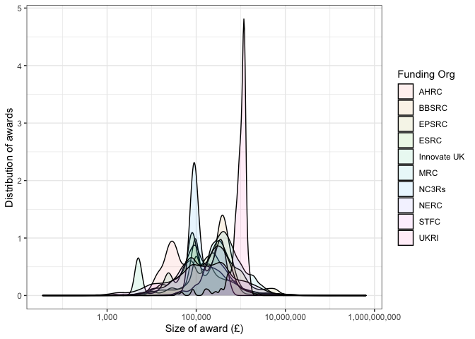
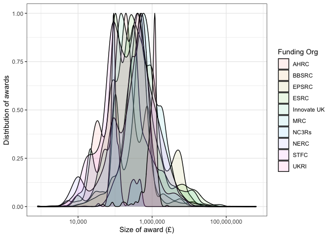
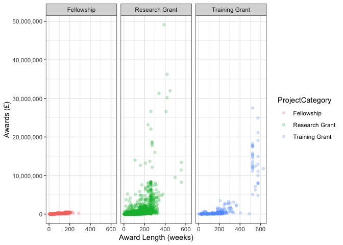

Economic and Social Research Council (ESRC) Data
================
**Author**: Mario Antonioletti. 
**Last updated**: 09/01/22.

-   [Introduction](#introduction)
-   [Overall expenditure](#overall-expenditure)
    -   [Expenditure for all UKRI
        projects](#expenditure-for-all-ukri-projects)
        -   [Summary](#summary)
    -   [Expenditure for active UKRI projects
        only](#expenditure-for-active-ukri-projects-only)
-   [ESRC data](#esrc-data)
    -   [Project category awards](#project-category-awards)
        -   [All projects category
            awards](#all-projects-category-awards)
        -   [Active projects category awards
            only](#active-projects-category-awards-only)
    -   [Award length distribution](#award-length-distribution)
        -   [Award length distribution for all
            projects](#award-length-distribution-for-all-projects)
        -   [Award length distribution for active projects
            only](#award-length-distribution-for-active-projects-only)
    -   [Regional distribution of
        awards](#regional-distribution-of-awards)
        -   [Region distributions of awards for all
            projects](#region-distributions-of-awards-for-all-projects)
        -   [Regional distributions of awards for active projects
            only](#regional-distributions-of-awards-for-active-projects-only)
    -   [Funding by lead organisation](#funding-by-lead-organisation)
        -   [Funding by lead organisation for all
            projects](#funding-by-lead-organisation-for-all-projects)
        -   [Funding by lead organisation for active projects
            only](#funding-by-lead-organisation-for-active-projects-only)
    -   [Department awards](#department-awards)
        -   [Department awards for all
            projects](#department-awards-for-all-projects)
        -   [Department awards for active projects
            only](#department-awards-for-active-projects-only)
    -   [Doctoral Training
        Partnerships](#doctoral-training-partnerships)
        -   [Active Partnerships](#active-partnerships)
    -   [Award Titles](#award-titles)
        -   [Active award titles](#active-award-titles)
    -   [Classification by category](#classification-by-category)
-   [ToDo Items](#todo-items)

# Introduction

The aim of this document is to provide an overview of expenditure done
of the [United Kingdom Research and Innovation](https://www.ukri.org/)
(UKRI) ESRC as determined from a [Gateway to
Research](https://gtr.ukri.org/) (GtR) data snapshot. The data is made
available under an [Open Government
Licence](https://www.nationalarchives.gov.uk/doc/open-government-licence/version/3/),
and covers the period 01/01/73 to 01/01/30. The GtR data snapshot
corresponded to data last updated by UKRI on the 14th December 2021.

The data set contains 126,198 rows (after some data cleaning), where a
row corresponds to the record of an award. In this data set 11,414
correspond to ESRC awards.

UK Research Councils were formed in different years (source:
[wikipedia](https://en.wikipedia.org/wiki/UK_Research_and_Innovation))
as shown in the table below which has an impact in the interpretation of
the data.

| Research Council                                                                             | Formation |
|----------------------------------------------------------------------------------------------|-----------|
| Arts and Humanities Research Council (AHRC)                                                  | 2005      |
| Biotechnology and Biological Sciences Research Council (BBSRC)                               | 1994      |
| Engineering and Physical Sciences Research Council (EPSRC)                                   | 1994      |
| Economic and Social Research Council (ESRC)                                                  | 1965      |
| Medical Research Council (MRC)                                                               | 1913      |
| National Centre for the Replacement, Refinement and Reduction of Animals in Research (NC3RS) | 2004      |
| Natural Environment Research Council (NERC)                                                  | 1965      |
| Science and Technology Facilities Council (STFC)                                             | 2007      |
| Innovate UK                                                                                  | 2007      |
| Research England                                                                             | 2018      |
| UKRI                                                                                         | 2018      |

Although strictly speaking it was the *Social Science Research Council*
(SSRC) that came into being in 1965 and it was not until 1983 that the
SSRC was renamed the Economic and Social Research Council (ESRC).

# Overall expenditure

We start by doing a brief overview of all the data obtained from the
Gateway to Research before we focus on the ESRC data.

## Expenditure for all UKRI projects

Expenditure for the whole period under consideration is shown in the
graph below. Awards that do not have a value defined have been removed.

The same information in tabular format:

| Funding org | Total awarded (Million £s) |
|:------------|---------------------------:|
| EPSRC       |                     15,109 |
| Innovate UK |                     11,861 |
| MRC         |                      6,216 |
| BBSRC       |                      4,639 |
| ESRC        |                      3,439 |
| NERC        |                      3,118 |
| STFC        |                      2,328 |
| AHRC        |                      1,239 |
| UKRI        |                        366 |
| NC3Rs       |                         73 |

The number of awards given by each council:

The average award given by funding council:

Average award per founding council ordered by the average award in
tabular form:

| Funding org | Number of awards | Total awarded (£) | Average award (£) |
|:------------|-----------------:|------------------:|------------------:|
| UKRI        |              368 |       366,352,804 |           995,524 |
| MRC         |           10,093 |     6,215,862,193 |           615,859 |
| Innovate UK |           24,555 |    11,860,937,643 |           483,036 |
| EPSRC       |           32,658 |    15,109,471,763 |           462,658 |
| STFC        |            6,983 |     2,327,739,924 |           333,344 |
| ESRC        |           11,414 |     3,438,875,323 |           301,286 |
| NERC        |           10,668 |     3,118,230,938 |           292,298 |
| BBSRC       |           15,965 |     4,639,326,710 |           290,594 |
| NC3Rs       |              461 |        73,371,692 |           159,158 |
| AHRC        |            9,391 |     1,238,764,564 |           131,910 |

The distribution of awards by research council.

The graph with the values scaled:

Expenditure by year using the starting year of the award for funds
allocated that year per research council:

### Summary

-   Over the time covered by the data, EPSRC has been allocated the most
    money but they also give the most awards so on average they do not
    give the highest award.
-   The MRC have been given the third highest amount but, other than
    UKRI, they give the second highest average award.
-   Of interest to this particular study the ESRC comes in fifth in the
    total amount awarded and they give the fourth highest number of
    awards so their average over the research councils comes third.

## Expenditure for active UKRI projects only

The graph below only contains values for currently active projects:

The same information in tabular format:

| Funding org | Total awarded (Million £s) |
|:------------|---------------------------:|
| EPSRC       |                      6,360 |
| Innovate UK |                      5,051 |
| MRC         |                      1,768 |
| ESRC        |                      1,737 |
| BBSRC       |                      1,339 |
| NERC        |                      1,268 |
| STFC        |                        730 |
| AHRC        |                        442 |
| UKRI        |                        361 |
| NC3Rs       |                         22 |

The number of awards given by each council for active projects:

The average award given by funding council for active projects:

Average award per founding council for active projects ordered by the
average award:

| Funding org | Number of awards | Total awarded (£) | Average award (£) |
|:------------|-----------------:|------------------:|------------------:|
| Innovate UK |            3,677 |     5,050,863,568 |         1,373,637 |
| UKRI        |              362 |       361,004,056 |           997,249 |
| MRC         |            3,530 |     1,767,892,463 |           500,819 |
| EPSRC       |           15,606 |     6,359,718,301 |           407,518 |
| NERC        |            3,400 |     1,268,159,841 |           372,988 |
| ESRC        |            4,972 |     1,737,215,317 |           349,400 |
| BBSRC       |            4,677 |     1,338,974,106 |           286,289 |
| STFC        |            2,757 |       730,412,706 |           264,930 |
| AHRC        |            3,185 |       441,649,890 |           138,666 |
| NC3Rs       |              177 |        21,684,553 |           122,512 |

The distribution of awards by research council for active projects.

With the densities scaled:

Expenditure by year using the starting year of the award for funds
allocated that year per research council for active projects:

# ESRC data

## Project category awards

### All projects category awards

The project categories for the ESRC awards covering the period 01/01/06
to 30/09/29. No explicit data seems to be provided for *Studentships*.
Data is sorted by the average award.

| Project Catgeory | Number of Awards | Total Awarded (£) | Average Award (£) |
|:-----------------|-----------------:|------------------:|------------------:|
| Research Grant   |            6,022 |     2,712,378,714 |         450411.61 |
| Training Grant   |              403 |       574,318,459 |        1425107.84 |
| Fellowship       |            1,423 |       152,178,150 |         106941.78 |
| Studentship      |            3,566 |                 0 |              0.00 |

<!-- -->

<!-- -->

### Active projects category awards only

This information corresponds to projects that are classified as
*Active*.

| Project Catgeory | Number of Awards | Total Awarded (£) | Average Award (£) |
|:-----------------|-----------------:|------------------:|------------------:|
| Research Grant   |            1,260 |     1,222,931,142 |         970580.27 |
| Training Grant   |               70 |       480,445,942 |        6863513.46 |
| Fellowship       |              291 |        33,838,233 |         116282.59 |
| Studentship      |            3,351 |                 0 |              0.00 |

<!-- -->

<!-- -->

## Award length distribution

### Award length distribution for all projects

The award length distribution of the award lengths binned into 28-day
periods is shown below.

Look at the award given by the length of project by project category for
all projects.

The top 15 active projects:

|                               Lead Org |       Category | Total awarded (£) |                                                           Project title |
|---------------------------------------:|---------------:|------------------:|------------------------------------------------------------------------:|
|                    University of Essex | Research Grant |        44,619,972 | Understanding Society: The UK Household Longitudinal Survey Waves 13-15 |
|              University College London | Research Grant |        36,267,415 |                Centre for Longitudinal Studies, Resource Centre 2015-20 |
|                    University of Essex | Research Grant |        31,987,749 |                                      Understanding Society Waves 6 to 8 |
|                    University of Essex | Research Grant |        30,212,001 |  Understanding Society: The UK Household Longitudinal Study: Waves 9-11 |
|                University of Edinburgh | Training Grant |        27,538,201 |                       Scottish ESRC Doctoral Training Centre DTC 2011 - |
|               University of Manchester | Research Grant |        26,621,454 |                                              The Productivity Institute |
|                University of Liverpool | Training Grant |        24,932,784 |                       North West ESRC Doctoral Training Centre DTG 2011 |
|                    University of Essex | Research Grant |        21,872,654 |                                             UK Data Service (2017-2022) |
|                University of Sheffield | Training Grant |        21,103,774 |                       White Rose ESRC Doctoral Training Centre DTG 2011 |
|                   University of Oxford | Training Grant |        19,130,626 |             University of Oxford ESRC Doctoral Training Centre DTG 2011 |
|                    Coventry University | Research Grant |        18,759,063 |              GCRF South-South Migration, Inequality and Development Hub |
|                   University of Oxford | Research Grant |        18,531,197 |              GCRF Accelerating Achievement for Africa’s Adolescents Hub |
|              University College London | Training Grant |        18,280,789 |           UCL, Bloomsbury and East London Doctoral Training Partnership |
| World Conservation Monitoring Ctr WCMC | Research Grant |        18,239,311 |                         GCRF Trade, Development and the Environment Hub |
|                University of Liverpool | Training Grant |        17,857,544 |       North West Social Science Doctoral Training Partnership (NWSSDTP) |

### Award length distribution for active projects only

The same information as provided above but only for *Active* projects.
The maximum funding period corresponds to 4382 days.

The top length of awards lie by project category in days is tabulated
below.

| Number of days | Project Category | Number of projects |
|---------------:|:-----------------|-------------------:|
|           1460 | Studentship      |                739 |
|           1095 | Studentship      |                291 |
|           1277 | Studentship      |                198 |
|           1095 | Research Grant   |                188 |
|            364 | Fellowship       |                168 |
|           1094 | Studentship      |                160 |
|           1460 | Research Grant   |                 98 |
|           1552 | Studentship      |                 81 |
|            364 | Research Grant   |                 77 |
|           1187 | Studentship      |                 73 |
|           1094 | Research Grant   |                 70 |
|           1464 | Studentship      |                 69 |
|           1461 | Studentship      |                 66 |
|            729 | Research Grant   |                 63 |
|           1642 | Studentship      |                 55 |

Percentage of award types by time length.

Look at the award given by the length of project by project category for
active projects.

## Regional distribution of awards

### Region distributions of awards for all projects

The expenditure of the awards over the whole time period by region
ordered by the total award given is shown in the table below.

| Region                   | Number of Awards | Total Awarded (£) | Average Award (£) |
|:-------------------------|-----------------:|------------------:|------------------:|
| London                   |            2,216 |       792,051,354 |         357423.90 |
| Unknown                  |            3,109 |       746,109,189 |         239983.66 |
| South East               |            1,701 |       451,043,933 |         265163.98 |
| East of England          |              209 |       336,756,102 |        1611273.22 |
| Scotland                 |            1,164 |       327,651,838 |         281487.83 |
| North West               |              782 |       202,925,558 |         259495.60 |
| South West               |              564 |       144,274,970 |         255806.68 |
| West Midlands            |              410 |       116,874,466 |         285059.67 |
| East Midlands            |              430 |        84,084,819 |         195546.09 |
| Wales                    |              216 |        77,994,514 |         361085.71 |
| Northern Ireland         |              155 |        55,209,650 |         356191.29 |
| Yorkshire and The Humber |              323 |        54,989,802 |         170247.07 |
| Outside UK               |               87 |        42,660,826 |         490354.32 |
| North East               |               46 |         5,720,679 |         124362.59 |
| NA                       |                2 |           527,623 |         263811.50 |

### Regional distributions of awards for active projects only

We can generate the table for projects that are currently active ordered
by the total award given is shown in the table below.

| Region                   | Number of Awards | Total Awarded (£) | Average Award (£) |
|:-------------------------|-----------------:|------------------:|------------------:|
| London                   |              971 |       395,908,815 |         407733.07 |
| Unknown                  |            1,488 |       371,493,074 |         249659.32 |
| South East               |              731 |       209,692,939 |         286857.65 |
| East of England          |               75 |       208,221,637 |        2776288.49 |
| Scotland                 |              473 |       168,127,720 |         355449.73 |
| North West               |              319 |        95,637,204 |         299803.15 |
| South West               |              247 |        77,029,153 |         311858.92 |
| West Midlands            |              148 |        67,573,752 |         456579.41 |
| Wales                    |              115 |        43,137,481 |         375108.53 |
| East Midlands            |              179 |        35,498,829 |         198317.48 |
| Northern Ireland         |               61 |        26,161,989 |         428885.07 |
| Yorkshire and The Humber |              124 |        18,846,578 |         151988.53 |
| Outside UK               |               27 |        17,942,249 |         664527.74 |
| North East               |               13 |         1,843,525 |         141809.62 |
| NA                       |                1 |           100,372 |         100372.00 |

## Funding by lead organisation

### Funding by lead organisation for all projects

This only shows the top 25 organisations by the average value of the
award.

| Org                                     | Number of Awards | Total Awarded (£) | Average Award (£) |
|:----------------------------------------|-----------------:|------------------:|------------------:|
| University of Copenhagen                |                1 |            97,614 |          97614.00 |
| NERC British Geological Survey          |                1 |             9,753 |           9753.00 |
| University of the West of Scotland      |                5 |           473,006 |          94601.20 |
| University of Cape Town                 |                6 |         5,670,678 |         945113.00 |
| University of the West of England       |               52 |         4,717,707 |          90725.13 |
| Canterbury Christ Church University     |                2 |           181,236 |          90618.00 |
| Office for National Statistics          |                2 |        17,898,948 |        8949474.00 |
| University of the Highlands and Islands |                3 |           264,465 |          88155.00 |
| University of the Arts London           |                3 |           262,006 |          87335.33 |
| Quadram Institute Bioscience            |                1 |            87,062 |          87062.00 |
| Johns Hopkins University                |                1 |           865,561 |         865561.00 |
| University of Huddersfield              |               11 |           950,591 |          86417.36 |
| Manchester Metropolitan University      |               66 |         5,298,546 |          80281.00 |
| University of Hertfordshire             |               14 |         1,083,610 |          77400.71 |
| Aberystwyth University                  |               37 |         2,830,742 |          76506.54 |
| University of Michigan                  |                3 |         2,240,913 |         746971.00 |
| Institute of Development Studies        |               34 |        25,051,833 |         736818.62 |
| National Institute of Public Health     |                1 |           722,163 |         722163.00 |
| Birmingham City University              |                8 |           577,158 |          72144.75 |
| University of Hull                      |               45 |         3,241,152 |          72025.60 |
| University of East London               |               24 |         1,721,019 |          71709.12 |
| Bournemouth University                  |               12 |           855,831 |          71319.25 |
| University of Bolton                    |                1 |            70,844 |          70844.00 |
| SAHFOS                                  |                1 |               700 |            700.00 |
| Institute for Fiscal Studies            |               74 |        50,576,288 |         683463.35 |

### Funding by lead organisation for active projects only

This only shows the top 25 organisations with active projects by the
average value of the award.

| Org                                 | Number of Awards | Total Awarded (£) | Average Award (£) |
|:------------------------------------|-----------------:|------------------:|------------------:|
| Harvard University                  |                1 |            99,739 |          99739.00 |
| Canterbury Christ Church University |                1 |            99,731 |          99731.00 |
| Cranfield University                |                3 |         2,943,034 |         981011.33 |
| Innovations for Poverty Action      |                1 |            96,968 |          96968.00 |
| Birmingham City University          |                3 |           290,043 |          96681.00 |
| University of Exeter                |              129 |        12,421,069 |          96287.36 |
| Institute for Fiscal Studies        |               17 |        15,942,996 |         937823.29 |
| University of East London           |               10 |            93,668 |           9366.80 |
| University of California, Berkeley  |                1 |            93,460 |          93460.00 |
| University of Surrey                |               25 |        22,997,221 |         919888.84 |
| Office for National Statistics      |                2 |        17,898,948 |        8949474.00 |
| University of Brighton              |               41 |           342,106 |           8344.05 |
| University of Cape Town             |                4 |         3,264,723 |         816180.75 |
| Open University                     |               35 |         2,811,929 |          80340.83 |
| Manchester Metropolitan University  |               37 |         2,904,094 |          78489.03 |
| University of Bradford              |                4 |           313,743 |          78435.75 |
| University of Plymouth              |                8 |           597,548 |          74693.50 |
| Washington University in St Louis   |                1 |           713,698 |         713698.00 |
| Brunel University                   |               13 |           922,455 |          70958.08 |
| University of Michigan              |                1 |           697,241 |         697241.00 |
| Goldsmiths College                  |               23 |         1,587,713 |          69031.00 |
| University of the Free State        |                1 |           670,903 |         670903.00 |
| University of Edinburgh             |              142 |        91,321,545 |         643109.47 |
| Birkbeck College                    |               54 |         3,411,286 |          63171.96 |
| University College London           |              312 |       195,353,888 |         626134.26 |

The same table ordered by the number of awards:

| Org                                  | Number of Awards | Total Awarded (£) | Average Award (£) |
|:-------------------------------------|-----------------:|------------------:|------------------:|
| University College London            |              312 |       195,353,888 |         626134.26 |
| University of Oxford                 |              240 |        85,908,831 |         357953.46 |
| Cardiff University                   |              228 |        58,106,817 |         254854.46 |
| London School of Economics & Pol Sci |              220 |        76,376,744 |         347167.02 |
| University of Cambridge              |              209 |        43,867,382 |         209891.78 |
| King’s College London                |              195 |        57,369,034 |         294200.17 |
| University of Manchester             |              166 |        52,974,388 |         319122.82 |
| University of Sheffield              |              163 |        62,834,024 |         385484.81 |
| University of Southampton            |              148 |        50,360,826 |         340275.85 |
| University of Edinburgh              |              142 |        91,321,545 |         643109.47 |
| University of Leeds                  |              138 |        26,869,634 |         194707.49 |
| University of Bristol                |              133 |        63,419,513 |         476838.44 |
| University of Birmingham             |              132 |        18,315,903 |         138756.84 |
| University of Exeter                 |              129 |        12,421,069 |          96287.36 |
| University of Glasgow                |              126 |        39,438,656 |         313005.21 |
| University of Liverpool              |              115 |        55,411,421 |         481838.44 |
| Durham University                    |              114 |        29,801,705 |         261418.46 |
| Newcastle University                 |              112 |        24,627,153 |         219885.29 |
| Lancaster University                 |              108 |        24,809,396 |         229716.63 |
| University of Warwick                |              106 |        40,086,026 |         378170.06 |
| University of Nottingham             |               94 |        17,258,954 |         183605.89 |
| University of York                   |               87 |        16,736,412 |         192372.55 |
| University of Bath                   |               82 |         9,890,194 |         120612.12 |
| Queen Mary, University of London     |               76 |        10,693,466 |         140703.50 |
| University of Sussex                 |               70 |        30,053,644 |         429337.77 |

## Department awards

### Department awards for all projects

There are 1177 unique departments. The table below only shows
departments that have 30 or more occurrences. The Departments below have
been ‘cleaned’ to remove minor differences, e.g. Cardiff Business School
to Business School and so on.

| Department                             | Number | Percent | Total Awarded (£) |
|:---------------------------------------|-------:|--------:|------------------:|
| Psychology                             |    888 |    7.78 |       155,063,135 |
| Social Science                         |    605 |    5.30 |       209,675,591 |
| Geography                              |    453 |    3.97 |       132,818,372 |
| Economics                              |    436 |    3.82 |       103,383,403 |
| Education                              |    354 |    3.10 |        78,046,026 |
| Sociology                              |    302 |    2.65 |        78,748,846 |
| Law                                    |    271 |    2.37 |        49,225,328 |
| Business School                        |    269 |    2.36 |        94,174,908 |
| Politics                               |    216 |    1.89 |        25,490,808 |
| Social and Political Science           |    153 |    1.34 |        63,475,942 |
| Management                             |    150 |    1.31 |        23,519,136 |
| Applied Social Science                 |    141 |    1.24 |        17,401,675 |
| Anthropology                           |    108 |    0.95 |        14,001,257 |
| Experimental Psychology                |     99 |    0.87 |        22,121,224 |
| Sociology & Social Policy              |     97 |    0.85 |        11,305,140 |
| Politics and International Studies     |     91 |    0.80 |        24,031,074 |
| International Development              |     88 |    0.77 |        14,309,564 |
| Geography Politics and Sociology       |     86 |    0.75 |         7,949,894 |
| Environment, Education and Development |     85 |    0.74 |        24,160,525 |
| Social & Political Science             |     83 |    0.73 |        34,955,714 |
| Health Science                         |     79 |    0.69 |        22,638,619 |
| History                                |     79 |    0.69 |         7,457,117 |
| Epidemiology and Public Health         |     77 |    0.67 |        23,441,020 |
| IFS Research Team                      |     73 |    0.64 |        50,550,150 |
| Economic, Social & Political Sci       |     71 |    0.62 |        58,099,344 |
| Research Department                    |     66 |    0.58 |        27,509,469 |
| Psychological Science                  |     64 |    0.56 |         9,177,714 |
| Politics and International Relations   |     61 |    0.53 |         4,890,554 |
| Policy Studies                         |     58 |    0.51 |        12,665,105 |
| Geography and Planning                 |     58 |    0.51 |         2,274,800 |
| Global Studies                         |     56 |    0.49 |        11,758,682 |
| Social and Economic Research           |     54 |    0.47 |       194,928,356 |
| Health and Life Science                |     50 |    0.44 |         5,496,272 |
| Arts, Humanities & Social Sci          |     49 |    0.43 |                 0 |
| Criminology                            |     47 |    0.41 |        22,701,715 |
| Philosophy Psychology & Language       |     46 |    0.40 |         9,255,042 |
| Government                             |     46 |    0.40 |         6,983,337 |
| Unlisted                               |     45 |    0.39 |         4,878,100 |
| Public Health and Policy               |     44 |    0.39 |        15,936,964 |
| Social and Policy Science              |     44 |    0.39 |         3,718,498 |
| Linguistics and English Language       |     39 |    0.34 |        12,826,299 |
| Sociological Studies                   |     36 |    0.32 |         5,576,363 |
| War Studies                            |     36 |    0.32 |        22,295,187 |
| Education and Professional Studies     |     36 |    0.32 |         7,147,045 |
| Arts Languages and Cultures            |     35 |    0.31 |         3,272,010 |
| Planning and Geography                 |     34 |    0.30 |         4,192,112 |
| Social Pol Sociology & Social Res      |     32 |    0.28 |         3,551,396 |
| Politics & International Relation      |     32 |    0.28 |         8,133,864 |
| Finance                                |     32 |    0.28 |        11,313,590 |
| Social Policy                          |     31 |    0.27 |         4,424,327 |
| Epidemiology and Population Health     |     31 |    0.27 |         6,422,547 |
| Geographical Science                   |     31 |    0.27 |         2,822,791 |
| Arts and Social Sci (FASS)             |     30 |    0.26 |         6,559,757 |

### Department awards for active projects only

There are 650 unique departments for active projects (1177 for all
projects). The table below only shows cases that have 30 or more
occurrences in active projects.

| Department                           | Number | Percent | Total Awarded (£) |
|:-------------------------------------|-------:|--------:|------------------:|
| Psychology                           |    373 |    7.50 |        55,302,456 |
| Social Science                       |    259 |    5.21 |       108,066,685 |
| Geography                            |    202 |    4.06 |        84,581,090 |
| Economics                            |    181 |    3.64 |        39,199,352 |
| Education                            |    179 |    3.60 |        44,780,279 |
| Sociology                            |    149 |    3.00 |        39,745,030 |
| Law                                  |    141 |    2.84 |        13,058,074 |
| Business School                      |    118 |    2.37 |        59,532,591 |
| Politics                             |    101 |    2.03 |         8,605,195 |
| Applied Social Science               |     82 |    1.65 |         9,066,090 |
| Sociology & Social Policy            |     65 |    1.31 |         2,651,744 |
| Economic, Social & Political Sci     |     57 |    1.15 |        45,361,685 |
| Management                           |     56 |    1.13 |         9,652,115 |
| Anthropology                         |     55 |    1.11 |         2,759,406 |
| Geography Politics and Sociology     |     50 |    1.01 |         2,566,784 |
| Arts, Humanities & Social Sci        |     49 |    0.99 |                 0 |
| History                              |     46 |    0.93 |         1,442,202 |
| Epidemiology and Public Health       |     45 |    0.91 |         9,720,721 |
| Health Science                       |     43 |    0.86 |         5,382,249 |
| Social & Political Science           |     41 |    0.82 |        21,630,288 |
| Social and Political Science         |     40 |    0.80 |        42,560,041 |
| Geography and Planning               |     39 |    0.78 |           668,248 |
| Experimental Psychology              |     37 |    0.74 |         5,573,677 |
| International Development            |     35 |    0.70 |         4,649,300 |
| Politics and International Relations |     31 |    0.62 |         1,725,275 |
| Politics and International Studies   |     30 |    0.60 |        15,728,924 |

## Doctoral Training Partnerships

### Active Partnerships

Currently active doctoral partnerships ordered by the start date.

| Lead Organisation                    | Department                              | Start    | End      |  Award (£) |
|:-------------------------------------|:----------------------------------------|:---------|:---------|-----------:|
| University College London            | Economics                               | 01/10/11 | 02/10/21 | 14,505,856 |
| University of Nottingham             | Research and Graduate Services          | 01/10/11 | 02/10/22 |  7,964,843 |
| University of Surrey                 | Psychology                              | 01/10/11 | 02/10/22 | 11,094,593 |
| London School of Economics & Pol Sci | Research & Project Development Division | 01/10/11 | 02/10/21 | 15,316,412 |
| University of Southampton            | Sch of Economic, Social & Political Sci | 01/10/11 | 02/10/22 |  8,164,941 |
| University of Cambridge              | Board of Graduate Studies               | 01/10/11 | 02/10/22 | 10,015,074 |
| University of Essex                  | Sociology                               | 01/10/11 | 02/10/22 |  7,884,208 |
| University College London            | Doctoral School                         | 01/10/11 | 02/10/22 | 12,927,461 |
| University of Sussex                 | Research and Enterprise Services        | 01/10/11 | 02/10/22 |  4,865,866 |
| University of Oxford                 | Social Sciences Division                | 01/10/11 | 02/10/22 | 19,130,626 |
| University of Liverpool              | Sch of Law and Social Justice           | 01/10/11 | 01/10/22 | 24,932,784 |
| University of Bristol                | Research and Enterprise Development     | 01/10/11 | 02/10/21 | 17,563,914 |
| King’s College London                | SSPP School Office                      | 01/10/11 | 31/03/22 |  7,150,273 |
| Durham University                    | Archaeology                             | 01/10/11 | 30/09/23 | 11,794,305 |
| University of Edinburgh              | Sch of Social and Political Science     | 01/10/11 | 02/10/21 | 27,538,201 |
| Queen Mary, University of London     | English                                 | 01/10/11 | 02/10/21 |  5,087,223 |
| Cardiff University                   | Registry                                | 01/10/11 | 02/10/22 | 14,946,728 |
| University of Birmingham             | The Registrar                           | 01/10/11 | 02/04/22 |  6,277,485 |
| University of Sheffield              | Geography                               | 01/10/11 | 02/10/22 | 21,103,774 |
| University of Warwick                | Politics and International Studies      | 03/10/11 | 02/04/22 | 12,411,023 |
| London Business School               | Research and Faculty Office             | 01/08/17 | 02/10/21 |    346,071 |
| University of Bristol                | Education                               | 01/10/17 | 30/09/27 | 17,756,940 |
| University of Cambridge              | Criminology                             | 01/10/17 | 30/09/27 | 12,988,673 |
| University of Leeds                  | Sch of Geography                        | 01/10/17 | 30/09/24 |  2,345,247 |
| University College London            | Epidemiology and Public Health          | 01/10/17 | 30/09/24 |  2,154,131 |
| University College London            | Doctoral School                         | 01/10/17 | 30/09/27 | 18,280,789 |
| University of Edinburgh              | Sch of Geosciences                      | 01/10/17 | 30/09/27 | 17,381,266 |
| University of Essex                  | Registry                                | 01/10/17 | 30/09/27 | 11,606,058 |
| University of Liverpool              | Sch of Law and Social Justice           | 01/10/17 | 30/09/27 | 17,857,544 |
| Durham University                    | Geography                               | 01/10/17 | 30/09/27 | 11,156,304 |
| University of Oxford                 | Social Sciences Division                | 01/10/17 | 30/09/27 | 12,256,023 |
| London School of Economics & Pol Sci | Research & Project Development Division | 01/10/17 | 30/09/27 | 11,976,473 |
| University of Sheffield              | Geography                               | 01/10/17 | 30/09/27 | 15,429,313 |
| Cardiff University                   | Sch of Social Sciences                  | 01/10/17 | 30/09/27 | 13,588,999 |
| University of Warwick                | Sociology                               | 01/10/17 | 30/09/27 | 12,466,669 |
| University of Southampton            | Sch of Economic, Social & Political Sci | 01/10/17 | 30/09/27 | 14,988,643 |
| University College London            | Epidemiology and Public Health          | 01/10/20 | 30/09/26 |  1,453,720 |
| University of the West of England    | Faculty of Health and Life Sciences     | 01/10/20 | 01/10/24 |          0 |

## Award Titles

### Active award titles

A word cloud made from the award titles using the top 250 words thogh
some of the longer words have been excluded.

<!-- -->

## Classification by category

Classify the department of the Principal Investigator (assuming that the
department will be linked to the subject of the award) using the
following base categories:

-   Area Studies
-   Demography
-   Development studies
-   Economics
-   Education
-   Environmental planning
-   History
-   Human Geography
-   Law & legal studies
-   Linguistics
-   Management & business studies
-   Political science. & international studies
-   Psychology
-   Science and Technology Studies
-   Social anthropology
-   Social policy
-   Social work
-   Sociology
-   Tools, technologies & methods
-   Other

The categories are derived from decomposition of previous ESRC
expenditure reports at [ESRC application and success rate data and
analysis](https://www.ukri.org/publications/esrc-application-and-success-rate-data-and-analysis/).
The GtR subject classification for projects has been mapped to the above
scheme and where a project subject is not provided an “Unclassified”
type is used.

There are 73 subject types and 21 categories described above plus the
`Uncategorised` type for the cases where this information has not been
provided. The GtR subjects for ESRC projects have been mapped to
categories according to:

-   **Area Studies**: Area Studies
-   **Demography**: Demography, Demography & human geography
-   **Development studies**: Development studies
-   **Economics**: Economics
-   **Education**: Education
-   **Environmental planning**: Environmental planning
-   **History**: History
-   **Human Geography**: Human Geography
-   **Law & legal studies**: Law & legal studies
-   **Linguistics**: Linguistics, Languages & Literature
-   **Management & business studies**: Management & Business Studies
-   **Political science. & international studies**: Pol. sci. &
    internat. studies
-   **Psychology**: Psychology
-   **Science and Technology Studies**: Science and Technology Studies
-   **Social anthropology**: Social Anthropology
-   **Social policy**: Social Policy
-   **Social work**: Social Work
-   **Sociology**: Sociology
-   **Tools, technologies & methods**: “Tools, technologies & methods”
-   **Other**: RCUK Programmes, Genetics & development, Climate &
    Climate Change, Media, “Ecol, biodivers. & systematics”, Civil eng.
    & built environment, Info. & commun. Technol., Medical & health
    interface, Visual arts, Design, Complexity Science, “Pollution,
    waste & resources”, Terrest. & freshwater environ.,
    Agri-environmental science, Food science & nutrition, Environmental
    Engineering, Manufacturing, Drama & theatre studies, Cultural &
    museum studies, Philosophy, Animal Science, Energy, Mathematical
    sciences, Archaeology, Music, “Theology, divinity & religion”,
    Library & information studies, Astronomy - observation, Astronomy -
    theory, Particle Astrophysics, Bioengineering, Cell biology, Process
    engineering, Omic sciences & technologies, Systems engineering,
    Marine environments, Atmospheric phys. & chemistry, Plant & crop
    science, Electrical Engineering, Dance, Chemical measurement,
    Geosciences, Microbial sciences, Mechanical Engineering, Classics,
    Catalysis & surfaces, Materials sciences, Instrument. sensor &
    detectors, Materials Processing
-   **Uncategorised**: NA

For all projects, this gives a breakdown of the number of awards and
amount awarded as:

| Category                                   | Number of awards | Award (£)     |
|:-------------------------------------------|:-----------------|:--------------|
| Other                                      | 1,720            | 1,311,250,067 |
| Economics                                  | 1,205            | 978,230,645   |
| Sociology                                  | 2,120            | 973,955,668   |
| Uncategorised                              | 4,263            | 724,784,068   |
| Psychology                                 | 1,563            | 576,929,956   |
| Social policy                              | 1,144            | 562,516,384   |
| Demography                                 | 736              | 430,754,904   |
| Education                                  | 835              | 402,230,848   |
| Development studies                        | 899              | 402,079,038   |
| Human Geography                            | 592              | 390,171,780   |
| Tools, technologies & methods              | 605              | 386,410,786   |
| Political science. & international studies | 1,164            | 358,106,266   |
| Management & business studies              | 788              | 331,180,924   |
| Social anthropology                        | 494              | 170,802,980   |
| Law & legal studies                        | 474              | 148,830,916   |
| Linguistics                                | 394              | 119,954,626   |
| History                                    | 318              | 114,823,355   |
| Environmental planning                     | 273              | 101,139,857   |
| Social work                                | 212              | 86,945,821    |
| Science and Technology Studies             | 152              | 61,595,683    |
| Area Studies                               | 129              | 48,469,980    |

The `Other` category dominates by award amount though the
`Uncategorised` dominate by numbers. Looking at the `Other` category in
more detail:

| Subject                        | Number of awards | Award (£)   |
|:-------------------------------|:-----------------|:------------|
| RCUK Programmes                | 376              | 327,072,642 |
| Medical & health interface     | 296              | 313,436,142 |
| Genetics & development         | 31               | 95,931,632  |
| Info. & commun. Technol.       | 143              | 89,554,768  |
| Civil eng. & built environment | 80               | 51,607,446  |
| Climate & Climate Change       | 63               | 47,109,029  |
| Visual arts                    | 56               | 35,161,484  |
| Mathematical sciences          | 41               | 34,050,930  |
| Design                         | 59               | 30,797,664  |
| Agri-environmental science     | 45               | 29,990,577  |
| Complexity Science             | 35               | 24,456,399  |
| Library & information studies  | 8                | 24,391,089  |
| Media                          | 82               | 24,324,123  |
| Energy                         | 39               | 22,011,030  |
| Ecol, biodivers. & systematics | 25               | 19,386,080  |
| Animal Science                 | 47               | 17,671,897  |
| Food science & nutrition       | 43               | 16,667,374  |
| Philosophy                     | 46               | 14,391,571  |
| Theology, divinity & religion  | 19               | 12,174,365  |
| Pollution, waste & resources   | 17               | 10,958,985  |
| Cultural & museum studies      | 45               | 9,677,686   |
| Environmental Engineering      | 8                | 9,585,824   |
| Terrest. & freshwater environ. | 11               | 9,306,244   |
| Mechanical Engineering         | 4                | 6,121,077   |
| Microbial sciences             | 7                | 5,341,318   |
| Drama & theatre studies        | 13               | 4,189,840   |
| Omic sciences & technologies   | 5                | 2,984,565   |
| Manufacturing                  | 12               | 2,681,523   |
| Atmospheric phys. & chemistry  | 2                | 2,485,475   |
| Systems engineering            | 4                | 2,447,945   |
| Bioengineering                 | 3                | 2,349,845   |
| Geosciences                    | 10               | 2,303,237   |
| Music                          | 10               | 1,922,717   |
| Electrical Engineering         | 8                | 1,799,765   |
| Marine environments            | 4                | 1,534,490   |
| Cell biology                   | 3                | 1,103,904   |
| Plant & crop science           | 1                | 876,346     |
| Archaeology                    | 5                | 755,745     |
| Materials Processing           | 1                | 614,537     |
| Classics                       | 1                | 604,605     |
| Dance                          | 2                | 304,808     |
| Materials sciences             | 3                | 286,101     |
| Process engineering            | 3                | 244,452     |
| Astronomy - observation        | 1                | 154,236     |
| Astronomy - theory             | 1                | 154,236     |
| Particle Astrophysics          | 1                | 154,236     |
| Catalysis & surfaces           | 1                | 120,083     |

There are some large items near the top. Also, some of the items would
not usually fall under the ESRC area.

If we only focus on currently active projects we get:

| Category                                   | Number of awards | Award (£)   |
|:-------------------------------------------|:-----------------|:------------|
| Other                                      | 690              | 931,668,998 |
| Uncategorised                              | 3,530            | 581,358,272 |
| Economics                                  | 233              | 461,172,184 |
| Sociology                                  | 409              | 388,286,635 |
| Social policy                              | 232              | 282,206,351 |
| Human Geography                            | 244              | 262,936,634 |
| Development studies                        | 192              | 218,131,445 |
| Psychology                                 | 306              | 192,006,375 |
| Demography                                 | 49               | 185,583,518 |
| Education                                  | 164              | 160,239,617 |
| Management & business studies              | 144              | 142,815,849 |
| Political science. & international studies | 192              | 120,221,612 |
| Tools, technologies & methods              | 69               | 104,912,857 |
| Law & legal studies                        | 95               | 66,171,085  |
| Social anthropology                        | 102              | 62,749,981  |
| Social work                                | 47               | 45,960,023  |
| Environmental planning                     | 51               | 43,351,814  |
| Science and Technology Studies             | 66               | 38,907,035  |
| Area Studies                               | 59               | 33,045,267  |
| Linguistics                                | 61               | 26,028,868  |
| History                                    | 47               | 19,738,089  |

and again looking to see how the `Other` category breakdown for active
projects only:

| Subject                        | Number of awards | Award (£)   |
|:-------------------------------|:-----------------|:------------|
| RCUK Programmes                | 138              | 283,868,264 |
| Medical & health interface     | 123              | 212,935,820 |
| Genetics & development         | 4                | 61,270,745  |
| Info. & commun. Technol.       | 65               | 48,920,419  |
| Civil eng. & built environment | 33               | 38,334,492  |
| Climate & Climate Change       | 25               | 33,386,120  |
| Visual arts                    | 32               | 30,473,965  |
| Library & information studies  | 1                | 21,872,654  |
| Agri-environmental science     | 17               | 21,052,485  |
| Mathematical sciences          | 13               | 20,377,148  |
| Design                         | 27               | 20,331,252  |
| Energy                         | 17               | 17,387,671  |
| Media                          | 30               | 14,457,597  |
| Ecol, biodivers. & systematics | 10               | 14,224,739  |
| Pollution, waste & resources   | 9                | 9,540,993   |
| Environmental Engineering      | 6                | 9,534,670   |
| Theology, divinity & religion  | 5                | 8,909,886   |
| Complexity Science             | 16               | 8,768,043   |
| Terrest. & freshwater environ. | 5                | 7,690,792   |
| Food science & nutrition       | 18               | 7,629,559   |
| Animal Science                 | 14               | 7,293,905   |
| Philosophy                     | 14               | 4,598,585   |
| Cultural & museum studies      | 15               | 4,107,551   |
| Drama & theatre studies        | 8                | 3,471,565   |
| Microbial sciences             | 2                | 2,874,555   |
| Atmospheric phys. & chemistry  | 2                | 2,485,475   |
| Bioengineering                 | 2                | 2,271,473   |
| Systems engineering            | 3                | 2,181,855   |
| Electrical Engineering         | 7                | 1,772,626   |
| Geosciences                    | 4                | 1,647,627   |
| Marine environments            | 3                | 1,382,052   |
| Music                          | 4                | 1,255,555   |
| Manufacturing                  | 5                | 1,228,365   |
| Cell biology                   | 3                | 1,103,904   |
| Plant & crop science           | 1                | 876,346     |
| Materials Processing           | 1                | 614,537     |
| Classics                       | 1                | 604,605     |
| Omic sciences & technologies   | 2                | 430,295     |
| Mechanical Engineering         | 3                | 395,522     |
| Process engineering            | 1                | 95,408      |
| Archaeology                    | 1                | 9,878       |

# ToDo Items

-   [ ] Reconcile DTPs from what was scraped from the [ESRC
    DTP](https://esrc.ukri.org/skills-and-careers/doctoral-training/doctoral-training-partnerships/doctoral-training-partnership-dtp-contacts/)
    web page and what is in the GtR data file (there are more).
-   [ ] Research title looks interesting for further examination but
    will require processing to be comprehensible.
