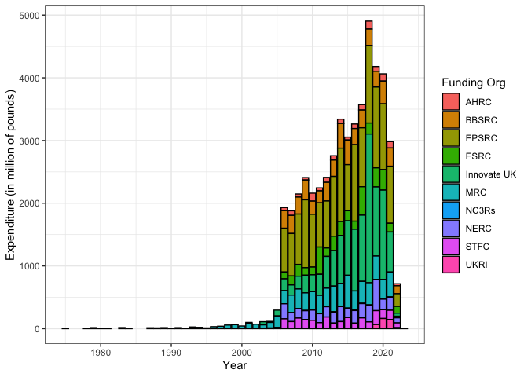
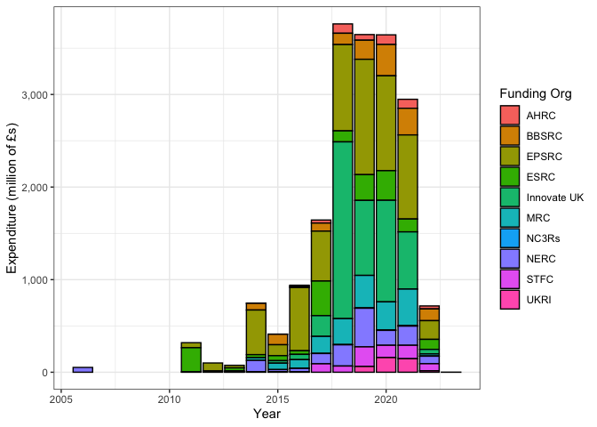
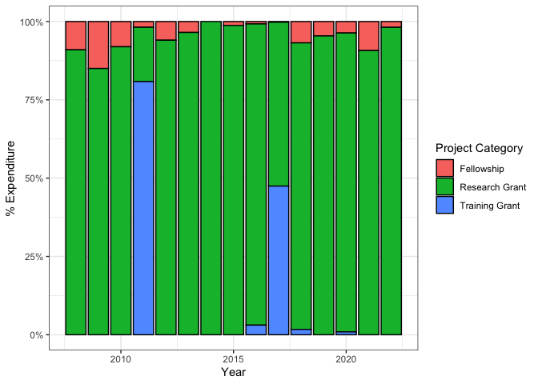

Economic and Social Research Council (ESRC) Data
================
**Author**: Mario Antonioletti. 
**Last updated**: 30/01/22.

-   [Introduction](#introduction)
-   [Overall expenditure](#overall-expenditure)
    -   [Expenditure for all UKRI
        projects](#expenditure-for-all-ukri-projects)
        -   [Summary](#summary)
    -   [Expenditure for active UKRI projects
        only](#expenditure-for-active-ukri-projects-only)
-   [ESRC data](#esrc-data)
    -   [Project category awards](#project-category-awards)
        -   [All projects category
            awards](#all-projects-category-awards)
        -   [Active projects category awards
            only](#active-projects-category-awards-only)
    -   [Award length distribution](#award-length-distribution)
        -   [Award length distribution for all
            projects](#award-length-distribution-for-all-projects)
        -   [Award length distribution for active projects
            only](#award-length-distribution-for-active-projects-only)
    -   [Regional distribution of
        awards](#regional-distribution-of-awards)
        -   [Region distributions of awards for all
            projects](#region-distributions-of-awards-for-all-projects)
        -   [Regional distributions of awards for active projects
            only](#regional-distributions-of-awards-for-active-projects-only)
    -   [Funding by lead organisation](#funding-by-lead-organisation)
        -   [Funding by lead organisation for all
            projects](#funding-by-lead-organisation-for-all-projects)
        -   [Funding by lead organisation for active projects
            only](#funding-by-lead-organisation-for-active-projects-only)
    -   [Department awards](#department-awards)
        -   [Department awards for all
            projects](#department-awards-for-all-projects)
        -   [Department awards for active projects
            only](#department-awards-for-active-projects-only)
    -   [Doctoral Training
        Partnerships](#doctoral-training-partnerships)
        -   [Active Partnerships](#active-partnerships)
    -   [Award Titles](#award-titles)
        -   [Active award titles](#active-award-titles)
    -   [Classification by category](#classification-by-category)

# Introduction

The aim of this document is to provide an overview of expenditure done
of the [United Kingdom Research and Innovation](https://www.ukri.org/)
(UKRI) ESRC as determined from a [Gateway to
Research](https://gtr.ukri.org/) (GtR) data snapshot. The data is made
available under an [Open Government
Licence](https://www.nationalarchives.gov.uk/doc/open-government-licence/version/3/),
and covers the period 01/01/73 to 01/01/30. The GtR data snapshot
corresponded to data last updated by UKRI on the 24th January 2022.

The R markdown that generated this analysis is available at:

-   <https://github.com/softwaresaved/esrc-software-study/blob/main/Src/ESRC.Rmd>

The data set contains 127,310 rows (after some data cleaning), where a
row corresponds to the record of an award. In this data set 11,511
correspond to ESRC awards.

UK Research Councils were formed in different years (source:
[wikipedia](https://en.wikipedia.org/wiki/UK_Research_and_Innovation))
as shown in the table below which has an impact in the interpretation of
the data.

| Research Council                                                                             | Formation |
|----------------------------------------------------------------------------------------------|-----------|
| Arts and Humanities Research Council (AHRC)                                                  | 2005      |
| Biotechnology and Biological Sciences Research Council (BBSRC)                               | 1994      |
| Engineering and Physical Sciences Research Council (EPSRC)                                   | 1994      |
| Economic and Social Research Council (ESRC)                                                  | 1965      |
| Medical Research Council (MRC)                                                               | 1913      |
| National Centre for the Replacement, Refinement and Reduction of Animals in Research (NC3RS) | 2004      |
| Natural Environment Research Council (NERC)                                                  | 1965      |
| Science and Technology Facilities Council (STFC)                                             | 2007      |
| Innovate UK                                                                                  | 2007      |
| Research England                                                                             | 2018      |
| UKRI                                                                                         | 2018      |

Although strictly speaking it was the *Social Science Research Council*
(SSRC) that came into being in 1965 and it was not until 1983 that the
SSRC was renamed the Economic and Social Research Council (ESRC).

# Overall expenditure

We start by doing a brief overview of all the data obtained from the
Gateway to Research before we focus on the ESRC data.

## Expenditure for all UKRI projects

Expenditure for the whole period under consideration is shown in the
graph below. Awards that do not have a value defined have been removed.

The same information in tabular format:

| Funding org | Total awarded (Million £s) |
|:------------|---------------------------:|
| EPSRC       |                     15,150 |
| Innovate UK |                     11,882 |
| MRC         |                      6,243 |
| BBSRC       |                      4,713 |
| ESRC        |                      3,462 |
| NERC        |                      3,159 |
| STFC        |                      2,334 |
| AHRC        |                      1,253 |
| UKRI        |                        382 |
| NC3Rs       |                         73 |

The number of awards given by each council:

The average award given by funding council:

Average award per founding council ordered by the average award in
tabular form:

| Funding org | Number of awards | Total awarded (£) | Average award (£) |
|:------------|-----------------:|------------------:|------------------:|
| UKRI        |              383 |       381,505,040 |           996,097 |
| MRC         |           10,130 |     6,242,641,739 |           616,253 |
| Innovate UK |           24,776 |    11,881,879,389 |           479,572 |
| EPSRC       |           32,948 |    15,149,675,762 |           459,806 |
| STFC        |            7,051 |     2,334,229,990 |           331,049 |
| ESRC        |           11,511 |     3,461,867,257 |           300,744 |
| NERC        |           10,709 |     3,158,524,093 |           294,941 |
| BBSRC       |           16,113 |     4,713,298,744 |           292,515 |
| NC3Rs       |              462 |        73,371,692 |           158,813 |
| AHRC        |            9,570 |     1,253,095,309 |           130,940 |

The distribution of awards by research council.

The graph with the values scaled:

Expenditure by year using the starting year of the award for funds
allocated that year per research council:

### Summary

-   Over the time covered by the data, EPSRC has been allocated the most
    money but they also give the most awards so on average they do not
    give the highest award.
-   The MRC have been given the third highest amount but, other than
    UKRI, they give the second highest average award.
-   Of interest to this particular study the ESRC comes in fifth in the
    total amount awarded and they give the fourth highest number of
    awards so their average over the research councils comes third.

## Expenditure for active UKRI projects only

The graph below only contains values for currently active projects:

The same information in tabular format:

| Funding org | Total awarded (Million £s) |
|:------------|---------------------------:|
| EPSRC       |                      6,199 |
| Innovate UK |                      4,796 |
| ESRC        |                      1,729 |
| MRC         |                      1,724 |
| BBSRC       |                      1,375 |
| NERC        |                      1,262 |
| STFC        |                        710 |
| AHRC        |                        434 |
| UKRI        |                        374 |
| NC3Rs       |                         21 |

The number of awards given by each council for active projects:

The average award given by funding council for active projects:

Average award per founding council for active projects ordered by the
average award:

| Funding org | Number of awards | Total awarded (£) | Average award (£) |
|:------------|-----------------:|------------------:|------------------:|
| Innovate UK |            3,454 |     4,796,162,197 |         1,388,582 |
| UKRI        |              374 |       373,625,923 |           999,000 |
| MRC         |            3,368 |     1,724,325,577 |           511,973 |
| EPSRC       |           15,170 |     6,198,838,743 |           408,625 |
| NERC        |            3,283 |     1,262,488,593 |           384,553 |
| ESRC        |            4,868 |     1,729,032,756 |           355,183 |
| BBSRC       |            4,538 |     1,375,109,452 |           303,021 |
| STFC        |            2,671 |       710,343,756 |           265,947 |
| AHRC        |            3,266 |       433,821,009 |           132,829 |
| NC3Rs       |              172 |        20,746,514 |           120,619 |

The distribution of awards by research council for active projects.

With the densities scaled:

Expenditure by year using the starting year of the award for funds
allocated that year per research council for active projects:

# ESRC data

## Project category awards

### All projects category awards

The project categories for the ESRC awards covering the period 01/01/06
to 30/09/29. No explicit data seems to be provided for *Studentships*.
Data is sorted by the average award.

| Project Catgeory | Number of Awards | Total Awarded (£) | Average Award (£) |
|:-----------------|-----------------:|------------------:|------------------:|
| Research Grant   |            6,055 |     2,735,065,463 |         451703.63 |
| Training Grant   |              403 |       574,573,855 |        1425741.58 |
| Fellowship       |            1,423 |       152,227,939 |         106976.77 |
| Studentship      |            3,630 |                 0 |              0.00 |

<!-- -->

<!-- -->

### Active projects category awards only

This information corresponds to projects that are classified as
*Active*.

| Project Catgeory | Number of Awards | Total Awarded (£) | Average Award (£) |
|:-----------------|-----------------:|------------------:|------------------:|
| Training Grant   |               65 |       479,756,418 |        7380867.97 |
| Fellowship       |              269 |        31,620,515 |         117548.38 |
| Research Grant   |            1,207 |     1,217,655,823 |        1008828.35 |
| Studentship      |            3,327 |                 0 |              0.00 |

<!-- -->

<!-- -->

## Award length distribution

### Award length distribution for all projects

The award length distribution of the award lengths binned into 28-day
periods is shown below.

Look at the award given by the length of project by project category for
all projects.

The top 15 active projects:

|                               Lead Org |       Category | Total awarded (£) |                                                           Project title |
|---------------------------------------:|---------------:|------------------:|------------------------------------------------------------------------:|
|                    University of Essex | Research Grant |        44,619,972 | Understanding Society: The UK Household Longitudinal Survey Waves 13-15 |
|              University College London | Research Grant |        36,267,415 |                Centre for Longitudinal Studies, Resource Centre 2015-20 |
|                    University of Essex | Research Grant |        31,987,749 |                                      Understanding Society Waves 6 to 8 |
|                    University of Essex | Research Grant |        30,212,001 |  Understanding Society: The UK Household Longitudinal Study: Waves 9-11 |
|                University of Edinburgh | Training Grant |        27,538,201 |                       Scottish ESRC Doctoral Training Centre DTC 2011 - |
|               University of Manchester | Research Grant |        26,621,454 |                                              The Productivity Institute |
|                University of Liverpool | Training Grant |        24,932,784 |                       North West ESRC Doctoral Training Centre DTG 2011 |
|                    University of Essex | Research Grant |        21,872,654 |                                             UK Data Service (2017-2022) |
|                University of Sheffield | Training Grant |        21,107,576 |                       White Rose ESRC Doctoral Training Centre DTG 2011 |
|                   University of Oxford | Training Grant |        19,130,626 |             University of Oxford ESRC Doctoral Training Centre DTG 2011 |
|                    Coventry University | Research Grant |        18,759,063 |              GCRF South-South Migration, Inequality and Development Hub |
|                   University of Oxford | Research Grant |        18,531,197 |              GCRF Accelerating Achievement for Africa’s Adolescents Hub |
|              University College London | Training Grant |        18,280,789 |           UCL, Bloomsbury and East London Doctoral Training Partnership |
| World Conservation Monitoring Ctr WCMC | Research Grant |        18,239,311 |                         GCRF Trade, Development and the Environment Hub |
|                University of Liverpool | Training Grant |        17,857,544 |       North West Social Science Doctoral Training Partnership (NWSSDTP) |

### Award length distribution for active projects only

The same information as provided above but only for *Active* projects.
The maximum funding period corresponds to 4382 days.

The top length of awards lie by project category in days is tabulated
below.

| Number of days | Project Category | Number of projects |
|---------------:|:-----------------|-------------------:|
|           1460 | Studentship      |                748 |
|           1095 | Studentship      |                309 |
|           1095 | Research Grant   |                187 |
|           1277 | Studentship      |                161 |
|           1094 | Studentship      |                155 |
|            364 | Fellowship       |                152 |
|           1460 | Research Grant   |                 95 |
|           1552 | Studentship      |                 85 |
|           1464 | Studentship      |                 74 |
|           1094 | Research Grant   |                 69 |
|            729 | Research Grant   |                 68 |
|           1187 | Studentship      |                 68 |
|            364 | Research Grant   |                 64 |
|           1461 | Studentship      |                 64 |
|           1642 | Studentship      |                 52 |

Percentage of award types by time length.

Look at the award given by the length of project by project category for
active projects.

## Regional distribution of awards

### Region distributions of awards for all projects

The expenditure of the awards over the whole time period by region
ordered by the total award given is shown in the table below.

| Region                   | Number of Awards | Total Awarded (£) | Average Award (£) |
|:-------------------------|-----------------:|------------------:|------------------:|
| Unknown                  |            3,818 |     1,124,425,937 |         294506.53 |
| London                   |            1,663 |       461,285,854 |         277381.75 |
| South East               |            1,626 |       414,940,920 |         255191.22 |
| East of England          |              209 |       336,963,720 |        1612266.60 |
| Scotland                 |            1,167 |       330,911,448 |         283557.37 |
| North West               |              788 |       205,574,192 |         260880.95 |
| South West               |              567 |       144,930,664 |         255609.64 |
| West Midlands            |              410 |       116,905,099 |         285134.39 |
| East Midlands            |              432 |        88,022,212 |         203755.12 |
| Wales                    |              217 |        78,798,631 |         363127.33 |
| Northern Ireland         |              156 |        55,209,650 |         353908.01 |
| Yorkshire and The Humber |              323 |        54,989,802 |         170247.07 |
| Outside UK               |               87 |        42,660,826 |         490354.32 |
| North East               |               46 |         5,720,679 |         124362.59 |
| NA                       |                2 |           527,623 |         263811.50 |

### Regional distributions of awards for active projects only

We can generate the table for projects that are currently active ordered
by the total award given is shown in the table below.

| Region                   | Number of Awards | Total Awarded (£) | Average Award (£) |
|:-------------------------|-----------------:|------------------:|------------------:|
| Unknown                  |            1,773 |       586,504,674 |         330797.90 |
| East of England          |               74 |       207,814,821 |        2808308.39 |
| London                   |              692 |       201,440,437 |         291098.90 |
| South East               |              677 |       184,916,569 |         273141.17 |
| Scotland                 |              461 |       165,407,851 |         358802.28 |
| North West               |              310 |        96,919,588 |         312643.83 |
| South West               |              240 |        76,801,701 |         320007.09 |
| West Midlands            |              138 |        66,331,462 |         480662.77 |
| Wales                    |              112 |        43,063,341 |         384494.12 |
| East Midlands            |              173 |        38,563,080 |         222907.98 |
| Northern Ireland         |               58 |        22,834,484 |         393698.00 |
| Yorkshire and The Humber |              120 |        18,645,570 |         155379.75 |
| Outside UK               |               26 |        17,845,281 |         686356.96 |
| North East               |               13 |         1,843,525 |         141809.62 |
| NA                       |                1 |           100,372 |         100372.00 |

## Funding by lead organisation

### Funding by lead organisation for all projects

This only shows the top 25 organisations by the average value of the
award.

| Org                                     | Number of Awards | Total Awarded (£) | Average Award (£) |
|:----------------------------------------|-----------------:|------------------:|------------------:|
| University of Copenhagen                |                1 |            97,614 |          97614.00 |
| NERC British Geological Survey          |                1 |             9,753 |           9753.00 |
| University of the West of Scotland      |                5 |           473,006 |          94601.20 |
| University of Cape Town                 |                6 |         5,670,678 |         945113.00 |
| University of the West of England       |               51 |         4,717,707 |          92504.06 |
| Canterbury Christ Church University     |                2 |           181,236 |          90618.00 |
| Office for National Statistics          |                2 |        17,898,948 |        8949474.00 |
| Manchester Metropolitan University      |               67 |         5,987,200 |          89361.19 |
| University of the Highlands and Islands |                3 |           264,465 |          88155.00 |
| University of the Arts London           |                3 |           262,006 |          87335.33 |
| Quadram Institute Bioscience            |                1 |            87,062 |          87062.00 |
| Johns Hopkins University                |                1 |           865,561 |         865561.00 |
| University of Huddersfield              |               11 |           950,591 |          86417.36 |
| University of Hertfordshire             |               14 |         1,136,235 |          81159.64 |
| University of Wales, Lampeter           |                1 |           804,117 |         804117.00 |
| Aberystwyth University                  |               37 |         2,830,742 |          76506.54 |
| University of Michigan                  |                3 |         2,240,913 |         746971.00 |
| Institute of Development Studies        |               35 |        25,427,751 |         726507.17 |
| National Institute of Public Health     |                1 |           722,163 |         722163.00 |
| Birmingham City University              |                8 |           577,158 |          72144.75 |
| University of Hull                      |               45 |         3,241,152 |          72025.60 |
| University of East London               |               24 |         1,721,019 |          71709.12 |
| Bournemouth University                  |               12 |           855,831 |          71319.25 |
| University of Bolton                    |                1 |            70,844 |          70844.00 |
| SAHFOS                                  |                1 |               700 |            700.00 |

### Funding by lead organisation for active projects only

This only shows the top 25 organisations with active projects by the
average value of the award.

| Org                                 | Number of Awards | Total Awarded (£) | Average Award (£) |
|:------------------------------------|-----------------:|------------------:|------------------:|
| Harvard University                  |                1 |            99,739 |          99739.00 |
| Canterbury Christ Church University |                1 |            99,731 |          99731.00 |
| Cranfield University                |                3 |         2,943,034 |         981011.33 |
| Birmingham City University          |                3 |           290,043 |          96681.00 |
| University of Exeter                |              126 |        12,150,354 |          96431.38 |
| Institute of Development Studies    |               12 |        11,561,657 |         963471.42 |
| Brunel University                   |               12 |         1,142,782 |          95231.83 |
| University of Surrey                |               24 |        22,821,261 |         950885.88 |
| Manchester Metropolitan University  |               38 |         3,592,748 |          94546.00 |
| University of Derby                 |                2 |           187,847 |          93923.50 |
| University of East London           |               10 |            93,668 |           9366.80 |
| University of California, Berkeley  |                1 |            93,460 |          93460.00 |
| University of Brighton              |               38 |           342,106 |           9002.79 |
| Office for National Statistics      |                2 |        17,898,948 |        8949474.00 |
| Institute for Fiscal Studies        |               19 |        16,400,339 |         863175.74 |
| University of St Andrews            |               26 |         2,149,900 |          82688.46 |
| University of Cape Town             |                4 |         3,264,723 |         816180.75 |
| Open University                     |               35 |         2,835,776 |          81022.17 |
| University of Wales, Lampeter       |                1 |           804,117 |         804117.00 |
| University of Bradford              |                4 |           313,743 |          78435.75 |
| University of Plymouth              |                8 |           597,548 |          74693.50 |
| Goldsmiths College                  |               22 |         1,587,713 |          72168.77 |
| Washington University in St Louis   |                1 |           713,698 |         713698.00 |
| University of Michigan              |                1 |           697,241 |         697241.00 |
| University of Salford               |                2 |         1,384,158 |         692079.00 |

The same table ordered by the number of awards:

| Org                                  | Number of Awards | Total Awarded (£) | Average Award (£) |
|:-------------------------------------|-----------------:|------------------:|------------------:|
| University College London            |              296 |       194,599,979 |         657432.36 |
| University of Oxford                 |              237 |        85,839,596 |         362192.39 |
| London School of Economics & Pol Sci |              222 |        77,519,250 |         349185.81 |
| Cardiff University                   |              217 |        57,349,429 |         264283.08 |
| King’s College London                |              216 |        56,984,830 |         263818.66 |
| University of Cambridge              |              198 |        43,193,441 |         218148.69 |
| University of Manchester             |              162 |        53,518,331 |         330360.07 |
| University of Sheffield              |              159 |        62,891,234 |         395542.35 |
| University of Southampton            |              139 |        49,997,549 |         359694.60 |
| University of Edinburgh              |              137 |        92,042,652 |         671844.18 |
| University of Leeds                  |              137 |        27,638,144 |         201738.28 |
| University of Birmingham             |              130 |        17,588,411 |         135295.47 |
| University of Bristol                |              130 |        63,677,099 |         489823.84 |
| University of Exeter                 |              126 |        12,150,354 |          96431.38 |
| University of Glasgow                |              125 |        39,117,813 |         312942.50 |
| Durham University                    |              118 |        30,243,433 |         256300.28 |
| University of Liverpool              |              110 |        53,970,874 |         490644.31 |
| Newcastle University                 |              109 |        24,592,252 |         225616.99 |
| Lancaster University                 |              103 |        25,097,440 |         243664.47 |
| University of Warwick                |               98 |        39,187,834 |         399875.86 |
| University of Nottingham             |               89 |        16,958,637 |         190546.48 |
| Queen Mary, University of London     |               85 |        10,693,466 |         125805.48 |
| University of York                   |               83 |        16,535,404 |         199221.73 |
| University of Bath                   |               79 |         9,354,963 |         118417.25 |
| University of Essex                  |               68 |       182,114,604 |        2678155.94 |

## Department awards

### Department awards for all projects

There are 1186 unique departments. The table below only shows
departments that have 30 or more occurrences. The Departments below have
been ‘cleaned’ to remove minor differences, e.g. Cardiff Business School
to Business School and so on.

| Department                              | Number | Percent | Total Awarded (£) |
|:----------------------------------------|-------:|--------:|------------------:|
| Psychology                              |    894 |    7.77 |       155,614,681 |
| Social Science                          |    608 |    5.28 |       210,502,199 |
| Geography                               |    459 |    3.99 |       136,390,345 |
| Economics                               |    439 |    3.81 |       103,758,414 |
| Education                               |    361 |    3.14 |        79,823,635 |
| Sociology                               |    304 |    2.64 |        78,779,479 |
| Law                                     |    270 |    2.35 |        49,215,495 |
| Business School                         |    269 |    2.34 |        94,174,908 |
| Politics                                |    217 |    1.89 |        25,418,624 |
| Social and Political Science            |    153 |    1.33 |        63,475,942 |
| Management                              |    150 |    1.30 |        23,519,136 |
| Applied Social Science                  |    141 |    1.22 |        17,401,675 |
| Anthropology                            |    109 |    0.95 |        14,001,257 |
| Experimental Psychology                 |     99 |    0.86 |        22,121,224 |
| Sociology & Social Policy               |     94 |    0.82 |        11,305,140 |
| Politics and International Studies      |     92 |    0.80 |        24,352,975 |
| International Development               |     88 |    0.76 |        14,311,022 |
| Geography Politics and Sociology        |     86 |    0.75 |         7,949,894 |
| Environment, Education and Development  |     85 |    0.74 |        24,160,525 |
| Social & Political Science              |     83 |    0.72 |        34,955,714 |
| History                                 |     79 |    0.69 |         7,457,117 |
| Health Science                          |     79 |    0.69 |        22,638,619 |
| Epidemiology and Public Health          |     77 |    0.67 |        23,441,020 |
| IFS Research Team                       |     76 |    0.66 |        51,097,083 |
| Economic, Social & Political Sci        |     71 |    0.62 |        58,163,997 |
| Research Department                     |     66 |    0.57 |        27,509,469 |
| Psychological Science                   |     64 |    0.56 |         9,177,714 |
| Politics and International Relations    |     61 |    0.53 |         4,890,554 |
| Policy Studies                          |     58 |    0.50 |        12,665,105 |
| Geography and Planning                  |     58 |    0.50 |         2,274,800 |
| Global Studies                          |     56 |    0.49 |        11,758,682 |
| Social and Economic Research            |     54 |    0.47 |       194,928,356 |
| Arts, Humanities & Social Sci           |     49 |    0.43 |                 0 |
| Health and Life Science                 |     49 |    0.43 |         5,496,272 |
| Government                              |     47 |    0.41 |         6,983,337 |
| Criminology                             |     47 |    0.41 |        22,701,715 |
| Philosophy Psychology & Language        |     47 |    0.41 |        10,023,375 |
| Unlisted                                |     45 |    0.39 |         4,878,100 |
| Public Health and Policy                |     44 |    0.38 |        15,936,964 |
| Social and Policy Science               |     44 |    0.38 |         3,718,498 |
| Education and Professional Studies      |     41 |    0.36 |         7,147,045 |
| Linguistics and English Language        |     39 |    0.34 |        12,826,299 |
| War Studies                             |     39 |    0.34 |        22,296,750 |
| Sociological Studies                    |     36 |    0.31 |         5,576,363 |
| Arts Languages and Cultures             |     35 |    0.30 |         3,272,010 |
| Finance                                 |     34 |    0.30 |        11,313,590 |
| Planning and Geography                  |     34 |    0.30 |         4,192,112 |
| Social Pol Sociology & Social Res       |     32 |    0.28 |         3,551,396 |
| Social Policy                           |     32 |    0.28 |         4,424,327 |
| Politics & International Relation       |     32 |    0.28 |         8,133,864 |
| Leeds University Business School (LUBS) |     32 |    0.28 |         4,535,411 |
| Epidemiology and Population Health      |     31 |    0.27 |         6,422,547 |
| Geographical Science                    |     31 |    0.27 |         2,822,791 |
| Economic Performance                    |     30 |    0.26 |        31,240,968 |
| Arts and Social Sci (FASS)              |     30 |    0.26 |         6,559,757 |

### Department awards for active projects only

There are 652 unique departments for active projects (1186 for all
projects). The table below only shows cases that have 30 or more
occurrences in active projects.

| Department                           | Number | Percent | Total Awarded (£) |
|:-------------------------------------|-------:|--------:|------------------:|
| Psychology                           |    366 |    7.52 |        54,803,276 |
| Social Science                       |    254 |    5.22 |       106,982,520 |
| Geography                            |    199 |    4.09 |        86,535,215 |
| Education                            |    176 |    3.62 |        44,658,886 |
| Economics                            |    166 |    3.41 |        37,744,052 |
| Sociology                            |    148 |    3.04 |        39,063,482 |
| Law                                  |    136 |    2.79 |        12,991,523 |
| Business School                      |    112 |    2.30 |        58,939,883 |
| Politics                             |    100 |    2.05 |         8,268,647 |
| Applied Social Science               |     78 |    1.60 |         8,636,766 |
| Sociology & Social Policy            |     60 |    1.23 |         2,536,700 |
| Anthropology                         |     56 |    1.15 |         2,759,406 |
| Management                           |     54 |    1.11 |         9,652,115 |
| Economic, Social & Political Sci     |     53 |    1.09 |        45,040,523 |
| Arts, Humanities & Social Sci        |     49 |    1.01 |                 0 |
| Geography Politics and Sociology     |     48 |    0.99 |         2,472,517 |
| History                              |     45 |    0.92 |         1,442,202 |
| Epidemiology and Public Health       |     44 |    0.90 |         9,484,655 |
| Health Science                       |     41 |    0.84 |         5,095,211 |
| Social & Political Science           |     40 |    0.82 |        21,309,445 |
| Geography and Planning               |     39 |    0.80 |           668,248 |
| Social and Political Science         |     39 |    0.80 |        42,150,481 |
| Experimental Psychology              |     37 |    0.76 |         5,573,677 |
| International Development            |     33 |    0.68 |         3,842,947 |
| Politics and International Relations |     31 |    0.64 |         1,725,275 |

## Doctoral Training Partnerships

### Active Partnerships

Currently active doctoral partnerships ordered by the start date.

| Lead Organisation                    | Department                              | Start    | End      |  Award (£) |
|:-------------------------------------|:----------------------------------------|:---------|:---------|-----------:|
| University College London            | Economics                               | 01/10/11 | 02/10/21 | 14,505,856 |
| University of Nottingham             | Research and Graduate Services          | 01/10/11 | 02/10/22 |  7,964,843 |
| London School of Economics & Pol Sci | Research & Project Development Division | 01/10/11 | 02/10/21 | 15,316,412 |
| University of Surrey                 | Psychology                              | 01/10/11 | 02/10/22 | 11,094,593 |
| University of Southampton            | Sch of Economic, Social & Political Sci | 01/10/11 | 02/10/22 |  8,164,941 |
| University of Cambridge              | Board of Graduate Studies               | 01/10/11 | 02/10/22 | 10,015,074 |
| University of Sussex                 | Research and Enterprise Services        | 01/10/11 | 02/10/22 |  4,865,866 |
| University of Essex                  | Sociology                               | 01/10/11 | 02/10/22 |  7,884,208 |
| University College London            | Doctoral School                         | 01/10/11 | 02/10/22 | 12,927,461 |
| University of Oxford                 | Social Sciences Division                | 01/10/11 | 02/10/22 | 19,130,626 |
| University of Bristol                | Research and Enterprise Development     | 01/10/11 | 02/10/21 | 17,563,914 |
| King’s College London                | SSPP School Office                      | 01/10/11 | 31/03/22 |  7,150,273 |
| University of Liverpool              | Sch of Law and Social Justice           | 01/10/11 | 01/10/22 | 24,932,784 |
| Durham University                    | Archaeology                             | 01/10/11 | 30/09/23 | 11,794,305 |
| University of Edinburgh              | Sch of Social and Political Science     | 01/10/11 | 02/10/21 | 27,538,201 |
| Cardiff University                   | Registry                                | 01/10/11 | 02/10/22 | 14,946,728 |
| Queen Mary, University of London     | English                                 | 01/10/11 | 02/10/21 |  5,087,223 |
| University of Birmingham             | The Registrar                           | 01/10/11 | 02/04/22 |  6,277,485 |
| University of Sheffield              | Geography                               | 01/10/11 | 02/10/22 | 21,107,576 |
| University of Warwick                | Politics and International Studies      | 03/10/11 | 02/04/22 | 12,411,023 |
| London Business School               | Research and Faculty Office             | 01/08/17 | 02/10/21 |    346,071 |
| University of Cambridge              | Criminology                             | 01/10/17 | 30/09/27 | 12,988,673 |
| University of Bristol                | Education                               | 01/10/17 | 30/09/27 | 17,756,940 |
| University of Leeds                  | Sch of Geography                        | 01/10/17 | 30/09/24 |  2,346,732 |
| University College London            | Epidemiology and Public Health          | 01/10/17 | 30/09/24 |  2,154,131 |
| University College London            | Doctoral School                         | 01/10/17 | 30/09/27 | 18,280,789 |
| University of Edinburgh              | Sch of Geosciences                      | 01/10/17 | 30/09/27 | 17,392,901 |
| University of Essex                  | Registry                                | 01/10/17 | 30/09/27 | 11,813,676 |
| University of Liverpool              | Sch of Law and Social Justice           | 01/10/17 | 30/09/27 | 17,857,544 |
| University of Oxford                 | Social Sciences Division                | 01/10/17 | 30/09/27 | 12,256,023 |
| Durham University                    | Geography                               | 01/10/17 | 30/09/27 | 11,156,304 |
| Cardiff University                   | Sch of Social Sciences                  | 01/10/17 | 30/09/27 | 13,588,999 |
| London School of Economics & Pol Sci | Research & Project Development Division | 01/10/17 | 30/09/27 | 11,976,473 |
| University of Warwick                | Sociology                               | 01/10/17 | 30/09/27 | 12,497,302 |
| University of Sheffield              | Geography                               | 01/10/17 | 30/09/27 | 15,429,313 |
| University of Southampton            | Sch of Economic, Social & Political Sci | 01/10/17 | 30/09/27 | 14,988,643 |
| University College London            | Epidemiology and Public Health          | 01/10/20 | 30/09/26 |  1,453,720 |
| University of the West of England    | Faculty of Health and Life Sciences     | 01/10/20 | 01/10/24 |          0 |

## Award Titles

### Active award titles

A word cloud made from the award titles using the top 250 words thogh
some of the longer words have been excluded.

<!-- -->

## Classification by category

Classify the department of the Principal Investigator (assuming that the
department will be linked to the subject of the award) using the
following base categories:

-   Area Studies
-   Demography
-   Development studies
-   Economics
-   Education
-   Environmental planning
-   History
-   Human Geography
-   Law & legal studies
-   Linguistics
-   Management & business studies
-   Political science. & international studies
-   Psychology
-   Science and Technology Studies
-   Social anthropology
-   Social policy
-   Social work
-   Sociology
-   Tools, technologies & methods
-   Other

The categories are derived from decomposition of previous ESRC
expenditure reports at [ESRC application and success rate data and
analysis](https://www.ukri.org/publications/esrc-application-and-success-rate-data-and-analysis/).
The GtR subject classification for projects has been mapped to the above
scheme and where a project subject is not provided an “Unclassified”
type is used.

There are 73 subject types and 21 categories described above plus the
`Uncategorised` type for the cases where this information has not been
provided. The GtR subjects for ESRC projects have been mapped to
categories according to:

-   **Area Studies**: Area Studies
-   **Demography**: Demography, Demography & human geography
-   **Development studies**: Development studies
-   **Economics**: Economics
-   **Education**: Education
-   **Environmental planning**: Environmental planning
-   **History**: History
-   **Human Geography**: Human Geography
-   **Law & legal studies**: Law & legal studies
-   **Linguistics**: Linguistics, Languages & Literature
-   **Management & business studies**: Management & Business Studies
-   **Political science. & international studies**: Pol. sci. &
    internat. studies
-   **Psychology**: Psychology
-   **Science and Technology Studies**: Science and Technology Studies
-   **Social anthropology**: Social Anthropology
-   **Social policy**: Social Policy
-   **Social work**: Social Work
-   **Sociology**: Sociology
-   **Tools, technologies & methods**: “Tools, technologies & methods”
-   **Other**: RCUK Programmes, Genetics & development, Climate &
    Climate Change, Media, “Ecol, biodivers. & systematics”, Civil eng.
    & built environment, Info. & commun. Technol., Medical & health
    interface, Visual arts, Design, Complexity Science, “Pollution,
    waste & resources”, Terrest. & freshwater environ.,
    Agri-environmental science, Food science & nutrition, Environmental
    Engineering, Manufacturing, Drama & theatre studies, Cultural &
    museum studies, Philosophy, Animal Science, Energy, Mathematical
    sciences, Archaeology, Music, “Theology, divinity & religion”,
    Library & information studies, Astronomy - observation, Astronomy -
    theory, Particle Astrophysics, Bioengineering, Cell biology, Process
    engineering, Omic sciences & technologies, Systems engineering,
    Marine environments, Atmospheric phys. & chemistry, Plant & crop
    science, Electrical Engineering, Dance, Chemical measurement,
    Geosciences, Microbial sciences, Mechanical Engineering, Classics,
    Catalysis & surfaces, Materials sciences, Instrument. sensor &
    detectors, Materials Processing
-   **Uncategorised**: NA

A project might be assigned more than one subject, where this is the
case if the project has been assigned with n subjects then each will
contribute 1/n to the classification count and wil be assigned a
contribution of Award_amount/n to each subject. Taking this into account
for each project, this gives a breakdown of the number of awards and
amount awarded as:

| Category                                   | Number of awards | Number % | Award (£)   | Award % |
|:-------------------------------------------|:-----------------|:---------|:------------|:--------|
| Uncategorised                              | 4,285.0          | 37       | 665,615,815 | 19      |
| Other                                      | 593.9            | 5        | 376,990,603 | 11      |
| Economics                                  | 637.0            | 6        | 354,430,643 | 10      |
| Sociology                                  | 893.1            | 8        | 314,574,326 | 9       |
| Psychology                                 | 1,003.3          | 9        | 275,371,896 | 8       |
| Social policy                              | 455.5            | 4        | 212,411,059 | 6       |
| Political science. & international studies | 592.6            | 5        | 150,072,584 | 4       |
| Education                                  | 404.4            | 4        | 149,107,165 | 4       |
| Development studies                        | 354.3            | 3        | 138,417,897 | 4       |
| Tools, technologies & methods              | 249.2            | 2        | 131,290,142 | 4       |
| Management & business studies              | 427.5            | 4        | 130,509,841 | 4       |
| Demography                                 | 310.9            | 3        | 122,918,047 | 4       |
| Human Geography                            | 230.3            | 2        | 120,360,376 | 3       |
| Linguistics                                | 207.7            | 2        | 59,703,237  | 2       |
| Social anthropology                        | 207.7            | 2        | 57,527,621  | 2       |
| Law & legal studies                        | 214.7            | 2        | 55,436,890  | 2       |
| History                                    | 139.1            | 1        | 40,842,776  | 1       |
| Environmental planning                     | 114.7            | 1        | 39,250,443  | 1       |
| Social work                                | 88.9             | 1        | 30,635,280  | 1       |
| Science and Technology Studies             | 58.7             | 1        | 22,544,127  | 1       |
| Area Studies                               | 41.0             | 0        | 13,496,626  | 0       |

The `Other` category dominates by award amount though the
`Uncategorised` dominate by numbers. Looking at the `Other` category in
more detail:

| Subject                        | Number of awards | Number % | Award (£)      | Award % |
|:-------------------------------|:-----------------|:---------|:---------------|:--------|
| RCUK Programmes                | 155.0            | 26       | 123,439,927.26 | 33      |
| Medical & health interface     | 106.5            | 18       | 81,283,427.94  | 22      |
| Info. & commun. Technol.       | 48.5             | 8        | 25,925,848.40  | 7       |
| Genetics & development         | 9.9              | 2        | 20,700,521.88  | 5       |
| Civil eng. & built environment | 25.4             | 4        | 14,348,275.64  | 4       |
| Climate & Climate Change       | 17.8             | 3        | 11,621,809.92  | 3       |
| Mathematical sciences          | 16.1             | 3        | 9,623,869.32   | 3       |
| Design                         | 18.8             | 3        | 8,116,154.89   | 2       |
| Visual arts                    | 15.4             | 3        | 7,164,430.77   | 2       |
| Agri-environmental science     | 12.3             | 2        | 6,737,178.83   | 2       |
| Media                          | 26.2             | 4        | 6,710,051.26   | 2       |
| Energy                         | 12.7             | 2        | 6,600,896.93   | 2       |
| Animal Science                 | 17.5             | 3        | 6,129,281.47   | 2       |
| Complexity Science             | 8.6              | 1        | 5,450,926.71   | 1       |
| Ecol, biodivers. & systematics | 7.5              | 1        | 5,144,719.31   | 1       |
| Food science & nutrition       | 14.5             | 2        | 4,981,417.06   | 1       |
| Library & information studies  | 2.2              | 0        | 4,979,172.85   | 1       |
| Philosophy                     | 14.7             | 2        | 4,239,294.46   | 1       |
| Theology, divinity & religion  | 7.0              | 1        | 3,518,954.19   | 1       |
| Cultural & museum studies      | 13.6             | 2        | 2,662,684.18   | 1       |
| Environmental Engineering      | 2.2              | 0        | 2,403,605.88   | 1       |
| Pollution, waste & resources   | 4.8              | 1        | 2,105,474.31   | 1       |
| Terrest. & freshwater environ. | 2.9              | 0        | 1,809,238.00   | 0       |
| Microbial sciences             | 1.7              | 0        | 1,280,770.64   | 0       |
| Mechanical Engineering         | 1.0              | 0        | 1,258,921.07   | 0       |
| Manufacturing                  | 5.7              | 1        | 1,198,467.70   | 0       |
| Drama & theatre studies        | 3.8              | 1        | 1,021,262.05   | 0       |
| Bioengineering                 | 1.2              | 0        | 795,586.51     | 0       |
| Marine environments            | 1.9              | 0        | 751,153.37     | 0       |
| Omic sciences & technologies   | 1.5              | 0        | 684,902.92     | 0       |
| Music                          | 4.3              | 1        | 649,682.19     | 0       |
| Atmospheric phys. & chemistry  | 0.4              | 0        | 577,551.45     | 0       |
| Geosciences                    | 2.5              | 0        | 536,919.14     | 0       |
| Systems engineering            | 1.0              | 0        | 509,597.37     | 0       |
| Electrical Engineering         | 2.4              | 0        | 507,161.59     | 0       |
| Cell biology                   | 0.7              | 0        | 286,269.60     | 0       |
| Archaeology                    | 1.3              | 0        | 206,572.00     | 0       |
| Materials Processing           | 0.3              | 0        | 204,640.82     | 0       |
| Classics                       | 0.3              | 0        | 201,333.46     | 0       |
| Plant & crop science           | 0.2              | 0        | 175,269.20     | 0       |
| Dance                          | 1.0              | 0        | 152,404.00     | 0       |
| Materials sciences             | 0.8              | 0        | 81,695.26      | 0       |
| Process engineering            | 0.8              | 0        | 67,583.81      | 0       |
| Astronomy - observation        | 0.2              | 0        | 38,559.00      | 0       |
| Astronomy - theory             | 0.2              | 0        | 38,559.00      | 0       |
| Particle Astrophysics          | 0.2              | 0        | 38,559.00      | 0       |
| Catalysis & surfaces           | 0.2              | 0        | 30,020.75      | 0       |

There are some large items near the top. Also, some of the items would
not usually fall under the ESRC area.

If we only focus on currently active projects we get:

| Category                                   | Number of awards | Number % | Award (£)   | Award % |
|:-------------------------------------------|:-----------------|:---------|:------------|:--------|
| Uncategorised                              | 3,468.0          | 71       | 523,234,670 | 30      |
| Other                                      | 219.8            | 5        | 266,381,881 | 15      |
| Economics                                  | 117.7            | 2        | 151,029,884 | 9       |
| Sociology                                  | 160.4            | 3        | 109,718,752 | 6       |
| Social policy                              | 96.1             | 2        | 109,424,060 | 6       |
| Psychology                                 | 168.7            | 3        | 82,813,799  | 5       |
| Human Geography                            | 90.0             | 2        | 78,178,376  | 5       |
| Development studies                        | 64.3             | 1        | 63,345,970  | 4       |
| Education                                  | 74.2             | 2        | 59,102,790  | 3       |
| Management & business studies              | 62.4             | 1        | 51,231,152  | 3       |
| Demography                                 | 17.1             | 0        | 48,958,346  | 3       |
| Political science. & international studies | 96.0             | 2        | 47,840,237  | 3       |
| Tools, technologies & methods              | 25.0             | 1        | 29,751,943  | 2       |
| Law & legal studies                        | 43.2             | 1        | 22,163,787  | 1       |
| Social anthropology                        | 40.0             | 1        | 17,537,490  | 1       |
| Social work                                | 20.3             | 0        | 16,894,296  | 1       |
| Science and Technology Studies             | 24.0             | 0        | 13,085,266  | 1       |
| Environmental planning                     | 16.3             | 0        | 12,565,266  | 1       |
| Linguistics                                | 28.0             | 1        | 11,015,382  | 1       |
| Area Studies                               | 17.8             | 0        | 8,292,006   | 0       |
| History                                    | 18.4             | 0        | 6,370,477   | 0       |

and again looking to see how the `Other` category breakdown for active
projects only:

| Subject                        | Number of awards | Number % | Award (£)      | Award % |
|:-------------------------------|:-----------------|:---------|:---------------|:--------|
| RCUK Programmes                | 42.9             | 20       | 105,591,657.39 | 40      |
| Medical & health interface     | 45.9             | 21       | 55,604,666.95  | 21      |
| Info. & commun. Technol.       | 21.3             | 10       | 14,580,301.82  | 5       |
| Genetics & development         | 1.1              | 1        | 12,334,983.47  | 5       |
| Civil eng. & built environment | 9.1              | 4        | 9,666,526.13   | 4       |
| Climate & Climate Change       | 6.4              | 3        | 7,657,472.98   | 3       |
| Visual arts                    | 9.0              | 4        | 5,990,119.03   | 2       |
| Design                         | 9.1              | 4        | 5,095,644.63   | 2       |
| Energy                         | 5.2              | 2        | 4,937,286.71   | 2       |
| Mathematical sciences          | 4.9              | 2        | 4,836,541.97   | 2       |
| Library & information studies  | 0.2              | 0        | 4,374,530.80   | 2       |
| Agri-environmental science     | 3.8              | 2        | 4,094,839.53   | 2       |
| Media                          | 9.1              | 4        | 3,860,665.02   | 1       |
| Ecol, biodivers. & systematics | 3.3              | 2        | 3,793,801.73   | 1       |
| Food science & nutrition       | 5.9              | 3        | 2,455,105.23   | 1       |
| Theology, divinity & religion  | 2.4              | 1        | 2,450,914.54   | 1       |
| Animal Science                 | 4.4              | 2        | 2,419,112.65   | 1       |
| Environmental Engineering      | 1.8              | 1        | 2,390,817.38   | 1       |
| Complexity Science             | 3.8              | 2        | 1,883,484.66   | 1       |
| Pollution, waste & resources   | 2.1              | 1        | 1,630,963.38   | 1       |
| Terrest. & freshwater environ. | 1.6              | 1        | 1,471,464.70   | 1       |
| Philosophy                     | 4.1              | 2        | 1,242,766.84   | 0       |
| Cultural & museum studies      | 4.9              | 2        | 1,075,499.70   | 0       |
| Drama & theatre studies        | 2.5              | 1        | 874,282.45     | 0       |
| Bioengineering                 | 0.7              | 0        | 756,400.51     | 0       |
| Microbial sciences             | 0.5              | 0        | 755,576.74     | 0       |
| Manufacturing                  | 2.7              | 1        | 707,405.79     | 0       |
| Atmospheric phys. & chemistry  | 0.4              | 0        | 577,551.45     | 0       |
| Electrical Engineering         | 2.2              | 1        | 501,733.79     | 0       |
| Systems engineering            | 0.7              | 0        | 443,074.87     | 0       |
| Music                          | 1.8              | 1        | 414,272.52     | 0       |
| Geosciences                    | 0.9              | 0        | 359,453.36     | 0       |
| Marine environments            | 1.0              | 0        | 330,669.02     | 0       |
| Cell biology                   | 0.7              | 0        | 286,269.60     | 0       |
| Omic sciences & technologies   | 0.8              | 0        | 206,730.20     | 0       |
| Materials Processing           | 0.3              | 0        | 204,640.82     | 0       |
| Classics                       | 0.3              | 0        | 201,333.46     | 0       |
| Plant & crop science           | 0.2              | 0        | 175,269.20     | 0       |
| Mechanical Engineering         | 0.8              | 0        | 113,810.07     | 0       |
| Process engineering            | 0.3              | 0        | 31,770.86      | 0       |
| Archaeology                    | 0.2              | 0        | 2,469.50       | 0       |

Ignoring the `Other` and `Uncategorised` categories and considering only
active projects:

| Category                                   | Number of awards | Number % | Award (£)   | Award % |
|:-------------------------------------------|:-----------------|:---------|:------------|:--------|
| Economics                                  | 117.7            | 10       | 151,029,884 | 16      |
| Sociology                                  | 160.4            | 14       | 109,718,752 | 12      |
| Social policy                              | 96.1             | 8        | 109,424,060 | 12      |
| Psychology                                 | 168.7            | 14       | 82,813,799  | 9       |
| Human Geography                            | 90.0             | 8        | 78,178,376  | 8       |
| Development studies                        | 64.3             | 5        | 63,345,970  | 7       |
| Education                                  | 74.2             | 6        | 59,102,790  | 6       |
| Management & business studies              | 62.4             | 5        | 51,231,152  | 5       |
| Demography                                 | 17.1             | 1        | 48,958,346  | 5       |
| Political science. & international studies | 96.0             | 8        | 47,840,237  | 5       |
| Tools, technologies & methods              | 25.0             | 2        | 29,751,943  | 3       |
| Law & legal studies                        | 43.2             | 4        | 22,163,787  | 2       |
| Social anthropology                        | 40.0             | 3        | 17,537,490  | 2       |
| Social work                                | 20.3             | 2        | 16,894,296  | 2       |
| Science and Technology Studies             | 24.0             | 2        | 13,085,266  | 1       |
| Environmental planning                     | 16.3             | 1        | 12,565,266  | 1       |
| Linguistics                                | 28.0             | 2        | 11,015,382  | 1       |
| Area Studies                               | 17.8             | 2        | 8,292,006   | 1       |
| History                                    | 18.4             | 2        | 6,370,477   | 1       |

<!-- -->

<!-- --> \# ToDo
Items

-   [ ] Reconcile DTPs from what was scraped from the [ESRC
    DTP](https://esrc.ukri.org/skills-and-careers/doctoral-training/doctoral-training-partnerships/doctoral-training-partnership-dtp-contacts/)
    web page and what is in the GtR data file (there are more).
-   [ ] Research title looks interesting for further examination but
    will require processing to be comprehensible.
