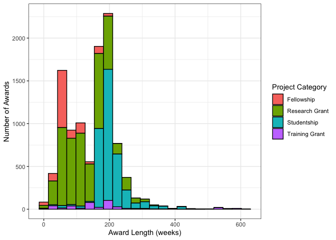

ESRC Data
================
Mario Antonioletti

-   [Overall expenditure](#overall-expenditure)
-   [ESRC data](#esrc-data)
    -   [Project category awards](#project-category-awards)
    -   [Award length distribution](#award-length-distribution)

# Overall expenditure

The data set covers the period 01/01/73 to 01/01/30 (for data downloaded
from the Gateway to Research website downloaded on 11/10/21).
Expenditure for the whole period under consideration is shown in the
graph below.

<!-- -->

# ESRC data

## Project category awards

The project categories for the ESRC awards covering the period 01/01/06
to 30/09/29.

| Project Catgeory | Number of Awards | Total Awarded (£) | Average Award (£) |
|:-----------------|-----------------:|------------------:|------------------:|
| Training Grant   |              403 |         574208131 |         1424834.1 |
| Research Grant   |             5988 |        2631071135 |          439390.6 |
| Fellowship       |             1415 |         151376374 |          106979.8 |
| Studentship      |             3028 |                 0 |               0.0 |

## Award length distribution

The award length distribution of the award lengths binned into 4-week
periods is shown below.
<!-- -->
