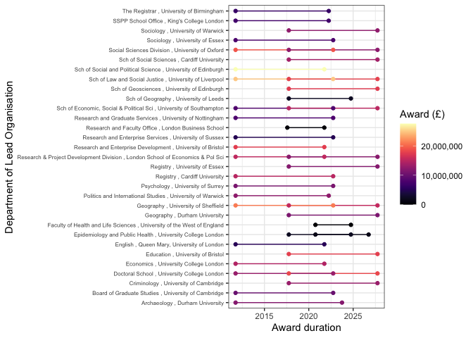
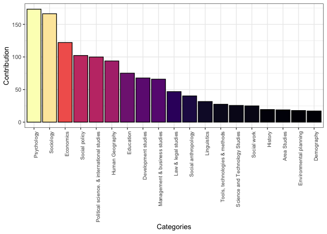

Economic and Social Research Council (ESRC) Data
================
**Author**: Mario Antonioletti. 
**Last updated**: 06/06/22.

-   <a href="#introduction" id="toc-introduction">Introduction</a>
-   <a href="#overall-expenditure" id="toc-overall-expenditure">Overall
    expenditure</a>
    -   <a href="#expenditure-for-all-ukri-projects"
        id="toc-expenditure-for-all-ukri-projects">Expenditure for all UKRI
        projects</a>
        -   <a href="#summary" id="toc-summary">Summary</a>
    -   <a href="#expenditure-for-active-ukri-projects-only"
        id="toc-expenditure-for-active-ukri-projects-only">Expenditure for
        active UKRI projects only</a>
-   <a href="#esrc-data" id="toc-esrc-data">ESRC data</a>
    -   <a href="#project-category-awards"
        id="toc-project-category-awards">Project category awards</a>
        -   <a href="#all-projects-category-awards"
            id="toc-all-projects-category-awards">All projects category awards</a>
        -   <a href="#active-projects-category-awards-only"
            id="toc-active-projects-category-awards-only">Active projects category
            awards only</a>
    -   <a href="#award-length-distribution"
        id="toc-award-length-distribution">Award length distribution</a>
        -   <a href="#award-length-distribution-for-all-projects"
            id="toc-award-length-distribution-for-all-projects">Award length
            distribution for all projects</a>
        -   <a href="#active-projects-award-length-distribution"
            id="toc-active-projects-award-length-distribution">Active projects award
            length distribution</a>
    -   <a href="#regional-distribution-of-awards"
        id="toc-regional-distribution-of-awards">Regional distribution of
        awards</a>
        -   <a href="#region-distributions-of-awards-for-all-projects"
            id="toc-region-distributions-of-awards-for-all-projects">Region
            distributions of awards for all projects</a>
        -   <a href="#regional-distributions-of-awards-for-active-projects-only"
            id="toc-regional-distributions-of-awards-for-active-projects-only">Regional
            distributions of awards for active projects only</a>
    -   <a href="#funding-by-lead-organisation"
        id="toc-funding-by-lead-organisation">Funding by lead organisation</a>
        -   <a href="#funding-by-lead-organisation-for-all-projects"
            id="toc-funding-by-lead-organisation-for-all-projects">Funding by lead
            organisation for all projects</a>
        -   <a href="#funding-by-lead-organisation-for-active-projects-only"
            id="toc-funding-by-lead-organisation-for-active-projects-only">Funding
            by lead organisation for active projects only</a>
    -   <a href="#department-awards" id="toc-department-awards">Department
        awards</a>
        -   <a href="#department-awards-for-all-projects"
            id="toc-department-awards-for-all-projects">Department awards for all
            projects</a>
        -   <a href="#department-awards-for-active-projects-only"
            id="toc-department-awards-for-active-projects-only">Department awards
            for active projects only</a>
    -   <a href="#doctoral-training-partnerships"
        id="toc-doctoral-training-partnerships">Doctoral Training
        Partnerships</a>
        -   <a href="#active-partnerships" id="toc-active-partnerships">Active
            Partnerships</a>
    -   <a href="#award-titles" id="toc-award-titles">Award Titles</a>
    -   <a href="#classification-by-category-using-research-subjects"
        id="toc-classification-by-category-using-research-subjects">Classification
        by category using research subjects</a>
    -   <a href="#classification-by-category-using-research-topics"
        id="toc-classification-by-category-using-research-topics">Classification
        by category using research topics</a>
-   <a href="#todo-items" id="toc-todo-items">ToDo Items</a>

# Introduction

The aim of this document is to provide an overview of the awards
provided by the [United Kingdom Research and
Innovation](https://www.ukri.org/)’s (UKRI) [Economics and Social
Sciences Research Council](https://esrc.ukri.org/) (ESRC) as determined
from a [Gateway to Research](https://gtr.ukri.org/) (GtR) data snapshot
update from the the 24th February 2022 - these data snapshots update
come out roughly every month. The data is made available under an [Open
Government
Licence](https://www.nationalarchives.gov.uk/doc/open-government-licence/version/3/),
and covers the period from 01/01/73 to 01/01/30.

The R markdown that generated this analysis is available at:

-   <https://github.com/softwaresaved/esrc-software-study/blob/main/Src/ESRC.Rmd>

The entire data set consists of 128,238 rows for all research councils,
where each row corresponds to a record of an award. Within this data set
11,598 rows (9%) correspond to ESRC awards.

UK Research Councils were formed in different years (source:
[wikipedia](https://en.wikipedia.org/wiki/UK_Research_and_Innovation))
as shown in the table below which has an impact in the interpretation of
the data.

| Research Council                                                                             | Formation |
|----------------------------------------------------------------------------------------------|-----------|
| Arts and Humanities Research Council (AHRC)                                                  | 2005      |
| Biotechnology and Biological Sciences Research Council (BBSRC)                               | 1994      |
| Engineering and Physical Sciences Research Council (EPSRC)                                   | 1994      |
| Economic and Social Research Council (ESRC)                                                  | 1965      |
| Medical Research Council (MRC)                                                               | 1913      |
| National Centre for the Replacement, Refinement and Reduction of Animals in Research (NC3RS) | 2004      |
| Natural Environment Research Council (NERC)                                                  | 1965      |
| Science and Technology Facilities Council (STFC)                                             | 2007      |
| Innovate UK                                                                                  | 2007      |
| Research England                                                                             | 2018      |
| UKRI                                                                                         | 2018      |

Although, strictly speaking, it was the *Social Science Research
Council* (SSRC) that came into being in 1965, it was not until 1983 that
the SSRC was renamed the Economic and Social Research Council (ESRC).

# Overall expenditure

We start by doing a brief overview of all the data obtained from the
Gateway to Research before we go on to focus on the ESRC data.

## Expenditure for all UKRI projects

Expenditure for the whole period under consideration is shown in the
graph below. Awards that do not have an awards value defined have been
removed.

The same information in tabular format:

| Funding org | Total awarded (Million £s) |
|:------------|---------------------------:|
| EPSRC       |                     15,262 |
| Innovate UK |                     11,940 |
| MRC         |                      6,268 |
| BBSRC       |                      4,732 |
| ESRC        |                      3,501 |
| NERC        |                      3,350 |
| STFC        |                      2,364 |
| AHRC        |                      1,261 |
| UKRI        |                        392 |
| NC3Rs       |                         73 |

The number of awards given by each council over the whole data period:

The average award given by funding council:

Average award per founding council ordered by the average award in
tabular form:

| Funding org | Number of awards | Total awarded (£) | Average award (£) |
|:------------|-----------------:|------------------:|------------------:|
| UKRI        |              393 |       391,911,795 |           997,231 |
| MRC         |           10,166 |     6,267,924,420 |           616,558 |
| Innovate UK |           25,000 |    11,939,854,589 |           477,594 |
| EPSRC       |           33,238 |    15,261,747,133 |           459,166 |
| STFC        |            7,112 |     2,364,288,736 |           332,437 |
| NERC        |           10,759 |     3,350,291,272 |           311,394 |
| ESRC        |           11,598 |     3,501,153,022 |           301,876 |
| BBSRC       |           16,178 |     4,732,082,523 |           292,501 |
| NC3Rs       |              463 |        73,384,156 |           158,497 |
| AHRC        |            9,662 |     1,261,472,322 |           130,560 |

The distribution of awards by research council.

The graph with the values for each research council normalised:

Expenditure by year using the starting year of the award for funds
allocated that year per research council:

The same information by percent expenditure for each year.

Although there seems to be historical data for the MRC, ESRC and STFC it
seems to make more sense to start looking at the data from 2008 (this
will be applied later).

### Summary

-   Over the time covered by the data, EPSRC has been allocated the most
    money but they also give the most awards so on average they do not
    give the highest award.
-   The MRC have been given the third highest amount but, other than
    UKRI, they give the second highest average award but they have the
    longest set of records.
-   Of interest to this particular study the ESRC comes in fifth in the
    total amount awarded and they give the fourth highest number of
    awards so their average over the research councils comes third.
-   At a later point only data from 2008 and onwards will be considered.

## Expenditure for active UKRI projects only

The graph below only contains values for currently active projects,
i.e. whose end date extends beyond the date at which the GtR data
snapshot was produced:

The same information in tabular format:

| Funding org | Total awarded (Million £s) |
|:------------|---------------------------:|
| EPSRC       |                      6,304 |
| Innovate UK |                      4,791 |
| ESRC        |                      1,766 |
| MRC         |                      1,745 |
| NERC        |                      1,443 |
| BBSRC       |                      1,367 |
| STFC        |                        741 |
| AHRC        |                        443 |
| UKRI        |                        382 |
| NC3Rs       |                         21 |

The number of awards given by each council for active projects:

The average award given by funding council for active projects:

Average award per founding council for active projects ordered by the
average award:

| Funding org | Number of awards | Total awarded (£) | Average award (£) |
|:------------|-----------------:|------------------:|------------------:|
| Innovate UK |            3,448 |     4,790,776,011 |         1,389,436 |
| UKRI        |              382 |       382,101,075 |         1,000,265 |
| MRC         |            3,386 |     1,745,442,053 |           515,488 |
| NERC        |            3,323 |     1,443,216,024 |           434,311 |
| EPSRC       |           15,385 |     6,303,746,217 |           409,733 |
| ESRC        |            4,944 |     1,766,391,182 |           357,280 |
| BBSRC       |            4,538 |     1,366,783,223 |           301,186 |
| STFC        |            2,719 |       740,988,391 |           272,522 |
| AHRC        |            3,352 |       443,171,889 |           132,211 |
| NC3Rs       |              172 |        20,698,414 |           120,340 |

The distribution of awards by research council for active projects.

With the densities normalised for each research council:

Expenditure by year using the starting year of the award for funds
allocated that year per research council for active projects:

# ESRC data

## Project category awards

### All projects category awards

The project categories for the ESRC awards covers the period 01/01/06 to
30/09/29 (project start dates - to project end dates). However, as
previously stated data only projects that started from 2008 onwards will
be considered from this point onwards reduces the number of records from
11,598 to 10,374.

No explicit expenditure data seems to be provided for *Studentships*.
Data is sorted by the average award.

| Project Categeory | Number of Awards | Total Awarded (£) | Average Award (£) |
|:------------------|-----------------:|------------------:|------------------:|
| Training Grant    |              403 |       574,573,855 |         1,425,742 |
| Research Grant    |            5,166 |     2,548,848,403 |           493,389 |
| Fellowship        |            1,156 |       125,637,540 |           108,683 |
| Studentship       |            3,649 |                 0 |                 0 |

The same diagram with each year shown as a percentage:

<!-- -->

<!-- -->

### Active projects category awards only

This information corresponds to projects that are classified as
*Active*.

| Project Catgeory | Number of Awards | Total Awarded (£) | Average Award (£) |
|:-----------------|-----------------:|------------------:|------------------:|
| Training Grant   |               65 |       479,756,418 |         7,380,868 |
| Research Grant   |            1,262 |     1,253,900,235 |           993,582 |
| Fellowship       |              280 |        32,734,529 |           116,909 |
| Studentship      |            3,337 |                 0 |                 0 |

<!-- -->

<!-- -->

## Award length distribution

### Award length distribution for all projects

The award length distribution of the award lengths binned into 28-day
periods is shown below.

The average award length:

| Grant Category | Mean (weeks) | Standar deviation (weeks) | Minimum (weeks) | Maximum (weeks) |
|:---------------|-------------:|--------------------------:|----------------:|----------------:|
| Studentship    |          204 |                        52 |               4 |             522 |
| Training Grant |          185 |                       132 |               0 |             626 |
| Research Grant |          123 |                        64 |               0 |             557 |
| Fellowship     |           72 |                        42 |               4 |             287 |

The same info with a y log1p (ln(x + 1)) scale.

Look at the award given by the length of project by project category for
all projects.

The top 15 active projects by award level:

|                      Lead Organisation |       Category | Total awarded (£) |                                                           Project title | Length (weeks) |
|---------------------------------------:|---------------:|------------------:|------------------------------------------------------------------------:|---------------:|
|                    University of Essex | Research Grant |        49,115,852 | Understanding Society: The UK Household Longitudinal Survey Waves 13-15 |            387 |
|              University College London | Research Grant |        36,267,415 |                Centre for Longitudinal Studies, Resource Centre 2015-20 |            417 |
|                    University of Essex | Research Grant |        31,987,749 |                                      Understanding Society Waves 6 to 8 |            448 |
|                    University of Essex | Research Grant |        31,322,728 |                                             UK Data Service (2017-2022) |            339 |
|                    University of Essex | Research Grant |        30,212,001 |  Understanding Society: The UK Household Longitudinal Study: Waves 9-11 |            417 |
|                University of Edinburgh | Training Grant |        27,538,201 |                       Scottish ESRC Doctoral Training Centre DTC 2011 - |            522 |
|               University of Manchester | Research Grant |        26,621,454 |                                              The Productivity Institute |            261 |
|                University of Liverpool | Training Grant |        24,932,784 |                       North West ESRC Doctoral Training Centre DTG 2011 |            574 |
|                University of Sheffield | Training Grant |        21,107,576 |                       White Rose ESRC Doctoral Training Centre DTG 2011 |            574 |
|                   University of Oxford | Training Grant |        19,130,626 |             University of Oxford ESRC Doctoral Training Centre DTG 2011 |            574 |
|                    Coventry University | Research Grant |        18,759,063 |              GCRF South-South Migration, Inequality and Development Hub |            274 |
|                   University of Oxford | Research Grant |        18,531,197 |              GCRF Accelerating Achievement for Africa’s Adolescents Hub |            272 |
|              University College London | Training Grant |        18,280,789 |           UCL, Bloomsbury and East London Doctoral Training Partnership |            522 |
| World Conservation Monitoring Ctr WCMC | Research Grant |        18,239,311 |                         GCRF Trade, Development and the Environment Hub |            272 |
|                University of Liverpool | Training Grant |        17,857,544 |       North West Social Science Doctoral Training Partnership (NWSSDTP) |            522 |

### Active projects award length distribution

The same information as provided above but only for *Active* projects.
The maximum funding period corresponds to 4,382 days.

Looking at the statistics for active projects:

| Grant Category | Mean (days) | Standar deviation (days) | Maximum (days) | Minimum (days) |
|:---------------|------------:|-------------------------:|---------------:|---------------:|
| Training Grant |        2714 |                     1188 |           4382 |           1277 |
| Studentship    |        1466 |                      339 |           3652 |            280 |
| Research Grant |        1025 |                      478 |           3896 |             88 |
| Fellowship     |         500 |                      230 |           1581 |             91 |

As a log1p (ln(x + 1)) plot:

Where the longest awards lie in term of days by project category is
tabulated below.

| Number of days | Project Category | Number of projects |
|---------------:|:-----------------|-------------------:|
|           1460 | Studentship      |                740 |
|           1095 | Studentship      |                300 |
|           1095 | Research Grant   |                188 |
|           1277 | Studentship      |                159 |
|           1094 | Studentship      |                152 |
|            364 | Fellowship       |                151 |
|           1460 | Research Grant   |                 99 |
|           1552 | Studentship      |                 85 |
|           1464 | Studentship      |                 74 |
|           1187 | Studentship      |                 71 |
|            729 | Research Grant   |                 69 |
|           1094 | Research Grant   |                 69 |
|            545 | Research Grant   |                 62 |
|           1461 | Studentship      |                 62 |
|            364 | Research Grant   |                 61 |

Percentage of award types by time length.

Look at the award given by the length of project by project category for
active projects.

## Regional distribution of awards

### Region distributions of awards for all projects

The expenditure of the awards over the whole time period by region
ordered by the total award given is shown in the table below.

| Region                   | Number of Awards | Total Awarded (£) | Average Award (£) |
|:-------------------------|-----------------:|------------------:|------------------:|
| Unknown                  |            3,511 |     1,040,994,020 |           296,495 |
| London                   |            1,504 |       433,340,480 |           288,125 |
| South East               |            1,481 |       399,540,289 |           269,777 |
| East of England          |              183 |       335,868,903 |         1,835,349 |
| Scotland                 |            1,025 |       304,558,712 |           297,130 |
| North West               |              694 |       189,191,900 |           272,611 |
| South West               |              493 |       133,789,672 |           271,379 |
| West Midlands            |              354 |       110,179,317 |           311,241 |
| East Midlands            |              383 |        82,964,712 |           216,618 |
| Wales                    |              189 |        69,380,128 |           367,091 |
| Yorkshire and The Humber |              291 |        51,671,632 |           177,566 |
| Northern Ireland         |              143 |        51,429,447 |           359,646 |
| Outside UK               |               82 |        41,002,086 |           500,025 |
| North East               |               39 |         4,620,877 |           118,484 |

### Regional distributions of awards for active projects only

We can generate the table for projects that are currently active ordered
by the total award given is shown in the table below.

| Region                   | Number of Awards | Total Awarded (£) | Average Award (£) |
|:-------------------------|-----------------:|------------------:|------------------:|
| Unknown                  |            1,817 |       596,141,468 |           328,091 |
| East of England          |               76 |       221,920,343 |         2,920,005 |
| London                   |              698 |       202,710,650 |           290,416 |
| South East               |              686 |       191,757,717 |           279,530 |
| Scotland                 |              464 |       168,722,647 |           363,626 |
| North West               |              314 |        98,176,988 |           312,666 |
| South West               |              245 |        77,239,538 |           315,263 |
| West Midlands            |              140 |        66,614,179 |           475,816 |
| Wales                    |              111 |        42,259,224 |           380,714 |
| East Midlands            |              176 |        38,895,480 |           220,997 |
| Northern Ireland         |               57 |        22,834,484 |           400,605 |
| Yorkshire and The Humber |              120 |        19,329,286 |           161,077 |
| Outside UK               |               26 |        17,845,281 |           686,357 |
| North East               |               13 |         1,843,525 |           141,810 |

## Funding by lead organisation

### Funding by lead organisation for all projects

This only shows the top 25 organisations by the average value of the
award.

| Organisation                            | Number of Awards | Total Awarded (£) | Average Award (£) |
|:----------------------------------------|-----------------:|------------------:|------------------:|
| World Conservation Monitoring Ctr WCMC  |                2 |        22,456,789 |        11,228,394 |
| Office for National Statistics          |                2 |        17,898,948 |         8,949,474 |
| Ministry of Justice                     |                1 |         3,412,732 |         3,412,732 |
| Liverpool School of Tropical Medicine   |                4 |        12,482,546 |         3,120,636 |
| International Institute for Env and Dev |                4 |         9,359,410 |         2,339,852 |
| Northern Ireland Stat Res Agency NISRA  |                2 |         3,979,826 |         1,989,913 |
| University of Essex                     |              163 |       308,044,623 |         1,889,844 |
| The Scottish Government                 |                3 |         5,468,844 |         1,822,948 |
| University of Pretoria                  |                2 |         2,581,756 |         1,290,878 |
| Rhodes University                       |                2 |         2,561,566 |         1,280,783 |
| Coventry University                     |               19 |        22,978,127 |         1,209,375 |
| Leonard Cheshire Disability             |                2 |         2,161,816 |         1,080,908 |
| Addis Ababa University                  |                3 |         3,131,845 |         1,043,948 |
| University of Cape Town                 |                6 |         5,670,678 |           945,113 |
| Johns Hopkins University                |                1 |           865,561 |           865,561 |
| University of Wales Trinity St David    |                1 |           804,117 |           804,117 |
| University of Michigan                  |                3 |         2,240,913 |           746,971 |
| National Institute of Public Health     |                1 |           722,163 |           722,163 |
| Institute for Fiscal Studies            |               68 |        46,927,139 |           690,105 |
| University of the Free State            |                1 |           670,903 |           670,903 |
| Institute of Development Studies        |               33 |        21,359,197 |           647,248 |
| University of Nairobi                   |                1 |           614,772 |           614,772 |
| University of Lagos                     |                2 |         1,229,275 |           614,638 |
| University of the Witwatersrand         |                2 |         1,223,884 |           611,942 |

### Funding by lead organisation for active projects only

This only shows the top 25 organisations with active projects by the
average value of the award.

| Organisation                            | Number of Awards | Total Awarded (£) | Average Award (£) |
|:----------------------------------------|-----------------:|------------------:|------------------:|
| Liverpool School of Tropical Medicine   |                1 |        12,156,514 |        12,156,514 |
| World Conservation Monitoring Ctr WCMC  |                2 |        22,456,789 |        11,228,394 |
| Office for National Statistics          |                2 |        17,898,948 |         8,949,474 |
| International Institute for Env and Dev |                2 |         8,252,550 |         4,126,275 |
| Ministry of Justice                     |                1 |         3,412,732 |         3,412,732 |
| Coventry University                     |                7 |        21,819,585 |         3,117,084 |
| University of Essex                     |               69 |       196,169,721 |         2,843,039 |
| Northern Ireland Stat Res Agency NISRA  |                1 |         1,329,836 |         1,329,836 |
| The Scottish Government                 |                2 |         2,606,844 |         1,303,422 |
| University of Pretoria                  |                2 |         2,581,756 |         1,290,878 |
| Rhodes University                       |                2 |         2,561,566 |         1,280,783 |
| Addis Ababa University                  |                3 |         3,131,845 |         1,043,948 |
| University of Surrey                    |               25 |        22,930,331 |           917,213 |
| Institute of Development Studies        |               13 |        11,640,314 |           895,409 |
| Institute for Fiscal Studies            |               19 |        16,400,339 |           863,176 |
| University of Cape Town                 |                4 |         3,264,723 |           816,181 |
| University of Wales Trinity St David    |                1 |           804,117 |           804,117 |
| Cranfield University                    |                4 |         2,993,439 |           748,360 |
| Washington University in St Louis       |                1 |           713,698 |           713,698 |
| University of Michigan                  |                1 |           697,241 |           697,241 |
| University of Salford                   |                2 |         1,384,158 |           692,079 |
| University of the Free State            |                1 |           670,903 |           670,903 |
| University of Edinburgh                 |              139 |        92,166,008 |           663,065 |
| University College London               |              299 |       194,907,944 |           651,866 |
| De Montfort University                  |                3 |         1,869,576 |           623,192 |

The same table ordered by the number of awards:

| Organisation                         | Number of Awards | Total Awarded (£) | Average Award (£) |
|:-------------------------------------|-----------------:|------------------:|------------------:|
| University College London            |              299 |       194,907,944 |           651,866 |
| University of Oxford                 |              234 |        83,325,112 |           356,090 |
| London School of Economics & Pol Sci |              224 |        78,281,421 |           349,471 |
| Cardiff University                   |              221 |        57,730,832 |           261,225 |
| King’s College London                |              216 |        57,064,736 |           264,189 |
| University of Cambridge              |              210 |        43,301,780 |           206,199 |
| University of Manchester             |              163 |        53,837,183 |           330,289 |
| University of Sheffield              |              162 |        63,279,551 |           390,615 |
| University of Leeds                  |              140 |        27,757,429 |           198,267 |
| University of Southampton            |              140 |        50,057,303 |           357,552 |
| University of Edinburgh              |              139 |        92,166,008 |           663,065 |
| University of Bristol                |              134 |        64,005,811 |           477,655 |
| University of Birmingham             |              133 |        18,524,190 |           139,280 |
| University of Exeter                 |              128 |        17,303,084 |           135,180 |
| University of Glasgow                |              126 |        42,004,979 |           333,373 |
| Durham University                    |              121 |        31,044,809 |           256,569 |
| University of Liverpool              |              113 |        54,090,187 |           478,674 |
| Newcastle University                 |              110 |        24,667,367 |           224,249 |
| Lancaster University                 |              106 |        26,024,426 |           245,513 |
| University of Warwick                |               99 |        39,237,211 |           396,335 |
| University of Nottingham             |               90 |        17,019,837 |           189,109 |
| Queen Mary, University of London     |               85 |        10,693,466 |           125,805 |
| University of York                   |               84 |        17,345,460 |           206,494 |
| University of Bath                   |               80 |         9,464,088 |           118,301 |
| University of Sussex                 |               70 |        38,201,879 |           545,741 |

Plotting by the number of awards and institution.

<!-- -->

Plotting by the total amount of awards and institution but keeping the
number of awards order.

<!-- -->

Plotting by the average size of awards and institution but keeping the
number of awards order.

<!-- -->

## Department awards

### Department awards for all projects

There are 1119 unique departments. The table below only shows
departments that have 30 or more occurrences. The Departments below have
been ‘cleaned’ to remove minor differences, e.g. Cardiff Business School
to Business School and so on.

| Department                             | Number | Percent | Total Awarded (£) |
|:---------------------------------------|-------:|--------:|------------------:|
| Psychology                             |    758 |    7.31 |       138,317,873 |
| Social Science                         |    553 |    5.33 |       201,168,618 |
| Geography                              |    408 |    3.93 |       132,462,745 |
| Economics                              |    367 |    3.54 |        92,568,798 |
| Education                              |    323 |    3.11 |        74,028,436 |
| Sociology                              |    275 |    2.65 |        72,731,454 |
| Law                                    |    261 |    2.52 |        40,351,547 |
| Business School                        |    246 |    2.37 |        94,230,663 |
| Politics                               |    194 |    1.87 |        22,914,127 |
| Management                             |    134 |    1.29 |        22,166,058 |
| Applied Social Science                 |    130 |    1.25 |        16,393,785 |
| Social and Political Science           |    129 |    1.24 |        60,233,521 |
| Anthropology                           |     96 |    0.93 |        12,181,407 |
| Sociology & Social Policy              |     89 |    0.86 |         7,105,171 |
| Politics and International Studies     |     82 |    0.79 |        23,157,580 |
| International Development              |     81 |    0.78 |        13,271,376 |
| Experimental Psychology                |     79 |    0.76 |        19,205,558 |
| Geography Politics and Sociology       |     79 |    0.76 |         7,353,442 |
| Environment, Education and Development |     78 |    0.75 |        23,049,547 |
| Health Science                         |     74 |    0.71 |        21,627,826 |
| Epidemiology and Public Health         |     74 |    0.71 |        23,143,895 |
| Social & Political Science             |     73 |    0.70 |        33,771,060 |
| History                                |     73 |    0.70 |         7,312,565 |
| Economic, Social & Political Sci       |     71 |    0.68 |        58,163,997 |
| IFS Research Team                      |     68 |    0.66 |        46,927,139 |
| Geography and Planning                 |     59 |    0.57 |         2,257,283 |
| Research Department                    |     56 |    0.54 |        21,966,197 |
| Policy Studies                         |     54 |    0.52 |        12,042,157 |
| Politics and International Relations   |     54 |    0.52 |         4,284,184 |
| Global Studies                         |     52 |    0.50 |        11,330,855 |
| Social and Economic Research           |     50 |    0.48 |       199,000,336 |
| Arts, Humanities & Social Sci          |     49 |    0.47 |                 0 |
| Psychological Science                  |     49 |    0.47 |         7,653,645 |
| Criminology                            |     45 |    0.43 |        19,815,492 |
| Health and Life Science                |     43 |    0.41 |         4,901,287 |
| Public Health and Policy               |     41 |    0.40 |        15,781,594 |
| Social and Policy Science              |     41 |    0.40 |         3,510,715 |
| Education and Professional Studies     |     38 |    0.37 |         5,906,044 |
| Philosophy Psychology & Language       |     38 |    0.37 |         8,674,195 |
| Government                             |     38 |    0.37 |         6,199,217 |
| Sociological Studies                   |     36 |    0.35 |         5,576,363 |
| War Studies                            |     36 |    0.35 |        21,706,313 |
| Linguistics and English Language       |     36 |    0.35 |         6,822,489 |
| Finance                                |     33 |    0.32 |         9,853,421 |
| Planning and Geography                 |     32 |    0.31 |         3,471,438 |
| Arts and Social Sci (FASS)             |     31 |    0.30 |         6,624,205 |
| Arts Languages and Cultures            |     31 |    0.30 |         2,974,941 |
| Social Pol Sociology & Social Res      |     30 |    0.29 |         3,390,023 |
| Politics & International Relation      |     30 |    0.29 |         8,072,909 |
| Geographical Science                   |     30 |    0.29 |         2,788,901 |

Plotting by the number of awards

<!-- -->

Plotting by the number of awards ordered by the number of awards.

<!-- -->

Plotting by the number of awards ordered by the number of awards.

<!-- -->

### Department awards for active projects only

There are 662 unique departments for active projects (1119 for all
projects). The table below only shows cases that have 30 or more
occurrences in active projects.

| Department                           | Number | Percent | Total Awarded (£) |
|:-------------------------------------|-------:|--------:|------------------:|
| Psychology                           |    369 |    7.46 |        56,245,872 |
| Social Science                       |    259 |    5.24 |       108,040,091 |
| Geography                            |    201 |    4.07 |        91,704,134 |
| Education                            |    177 |    3.58 |        42,643,897 |
| Economics                            |    169 |    3.42 |        38,105,729 |
| Sociology                            |    150 |    3.03 |        39,184,114 |
| Law                                  |    140 |    2.83 |        13,254,439 |
| Business School                      |    113 |    2.29 |        67,189,698 |
| Politics                             |    100 |    2.02 |         8,268,647 |
| Applied Social Science               |     78 |    1.58 |         8,704,044 |
| Sociology & Social Policy            |     60 |    1.21 |         2,536,700 |
| Anthropology                         |     56 |    1.13 |         2,759,406 |
| Management                           |     54 |    1.09 |         9,652,115 |
| Economic, Social & Political Sci     |     53 |    1.07 |        45,040,523 |
| Arts, Humanities & Social Sci        |     49 |    0.99 |                 0 |
| Geography Politics and Sociology     |     49 |    0.99 |         2,547,632 |
| History                              |     48 |    0.97 |         2,256,813 |
| Epidemiology and Public Health       |     44 |    0.89 |         9,484,655 |
| Health Science                       |     41 |    0.83 |         4,664,324 |
| Geography and Planning               |     40 |    0.81 |           708,622 |
| Social & Political Science           |     40 |    0.81 |        24,036,849 |
| Social and Political Science         |     39 |    0.79 |        42,150,481 |
| Experimental Psychology              |     36 |    0.73 |         5,288,082 |
| International Development            |     34 |    0.69 |         4,556,432 |
| Politics and International Relations |     31 |    0.63 |         1,725,275 |
| Politics and International Studies   |     30 |    0.61 |        15,045,532 |

Plotting by the number of awards

<!-- -->

Plotting by the number of awards ordered by the number of awards.

<!-- -->

Plotting by the number of awards ordered by the number of awards.

<!-- -->

## Doctoral Training Partnerships

### Active Partnerships

Currently active doctoral partnerships identified by the words “Doctoral
Training” being in the title (case insensitive) ordered by the start
date.

| Lead Organisation                    | Department                              | Start    | End      |  Award (£) |
|:-------------------------------------|:----------------------------------------|:---------|:---------|-----------:|
| University College London            | Economics                               | 01/10/11 | 02/10/21 | 14,505,856 |
| University of Surrey                 | Psychology                              | 01/10/11 | 02/10/22 | 11,094,593 |
| University of Nottingham             | Research and Graduate Services          | 01/10/11 | 02/10/22 |  7,964,843 |
| London School of Economics & Pol Sci | Research & Project Development Division | 01/10/11 | 02/10/21 | 15,316,412 |
| University of Southampton            | Sch of Economic, Social & Political Sci | 01/10/11 | 02/10/22 |  8,164,941 |
| University of Essex                  | Sociology                               | 01/10/11 | 02/10/22 |  7,884,208 |
| University of Sussex                 | Research and Enterprise Services        | 01/10/11 | 02/10/22 |  4,865,866 |
| University of Oxford                 | Social Sciences Division                | 01/10/11 | 02/10/22 | 19,130,626 |
| University College London            | Doctoral School                         | 01/10/11 | 02/10/22 | 12,927,461 |
| University of Cambridge              | Board of Graduate Studies               | 01/10/11 | 02/10/22 | 10,015,074 |
| University of Liverpool              | Sch of Law and Social Justice           | 01/10/11 | 01/10/22 | 24,932,784 |
| King’s College London                | SSPP School Office                      | 01/10/11 | 31/03/22 |  7,150,273 |
| University of Bristol                | Research and Enterprise Development     | 01/10/11 | 02/10/21 | 17,563,914 |
| University of Edinburgh              | Sch of Social and Political Science     | 01/10/11 | 02/10/21 | 27,538,201 |
| Durham University                    | Archaeology                             | 01/10/11 | 30/09/23 | 11,794,305 |
| Queen Mary, University of London     | English                                 | 01/10/11 | 02/10/21 |  5,087,223 |
| Cardiff University                   | Registry                                | 01/10/11 | 02/10/22 | 14,946,728 |
| University of Birmingham             | The Registrar                           | 01/10/11 | 02/04/22 |  6,277,485 |
| University of Sheffield              | Geography                               | 01/10/11 | 02/10/22 | 21,107,576 |
| University of Warwick                | Politics and International Studies      | 03/10/11 | 02/04/22 | 12,411,023 |
| London Business School               | Research and Faculty Office             | 01/08/17 | 02/10/21 |    346,071 |
| University of Bristol                | Education                               | 01/10/17 | 30/09/27 | 17,756,940 |
| University of Cambridge              | Criminology                             | 01/10/17 | 30/09/27 | 12,988,673 |
| University of Leeds                  | Sch of Geography                        | 01/10/17 | 30/09/24 |  2,346,732 |
| University College London            | Epidemiology and Public Health          | 01/10/17 | 30/09/24 |  2,154,131 |
| University of Edinburgh              | Sch of Geosciences                      | 01/10/17 | 30/09/27 | 17,392,901 |
| University College London            | Doctoral School                         | 01/10/17 | 30/09/27 | 18,280,789 |
| University of Essex                  | Registry                                | 01/10/17 | 30/09/27 | 11,813,676 |
| University of Liverpool              | Sch of Law and Social Justice           | 01/10/17 | 30/09/27 | 17,857,544 |
| University of Oxford                 | Social Sciences Division                | 01/10/17 | 30/09/27 | 12,256,023 |
| Durham University                    | Geography                               | 01/10/17 | 30/09/27 | 11,156,304 |
| Cardiff University                   | Sch of Social Sciences                  | 01/10/17 | 30/09/27 | 13,588,999 |
| London School of Economics & Pol Sci | Research & Project Development Division | 01/10/17 | 30/09/27 | 11,976,473 |
| University of Warwick                | Sociology                               | 01/10/17 | 30/09/27 | 12,497,302 |
| University of Sheffield              | Geography                               | 01/10/17 | 30/09/27 | 15,429,313 |
| University of Southampton            | Sch of Economic, Social & Political Sci | 01/10/17 | 30/09/27 | 14,988,643 |
| University College London            | Epidemiology and Public Health          | 01/10/20 | 30/09/26 |  1,453,720 |

We can do a time line plot. From this we can see that certain
organisations get different trenches of funding before the original
award has expired.

<!-- -->

## Award Titles

## Classification by category using research subjects

We want to be able to classify projects under the following base
categories:

-   Area Studies
-   Demography
-   Development studies
-   Economics
-   Education
-   Environmental planning
-   History
-   Human Geography
-   Law & legal studies
-   Linguistics
-   Management & business studies
-   Political science. & international studies
-   Psychology
-   Science and Technology Studies
-   Social anthropology
-   Social policy
-   Social work
-   Sociology
-   Tools, technologies & methods
-   Other

These categories are derived from decomposition of previous ESRC
expenditure reports at [ESRC application and success rate data and
analysis](https://www.ukri.org/publications/esrc-application-and-success-rate-data-and-analysis/).

The GtR allows each project to be classified under one or more research
subjects. This data does not come with the data snapshots but can be
obtained by other means. This has been mapped to the above categories
using the mapping provided below. Where a project subject is not
provided an “Unclassified” type is used.

There are 73 research subject types and 21 categories described above
plus the `Uncategorised` type for the cases where this information has
not been provided. The GtR subjects for ESRC projects have been mapped
to categories according to:

-   **Area Studies**: Area Studies
-   **Demography**: Demography, Demography & human geography
-   **Development studies**: Development studies
-   **Economics**: Economics
-   **Education**: Education
-   **Environmental planning**: Environmental planning
-   **History**: History
-   **Human Geography**: Human Geography
-   **Law & legal studies**: Law & legal studies
-   **Linguistics**: Linguistics, Languages & Literature
-   **Management & business studies**: Management & Business Studies
-   **Political science. & international studies**: Pol. sci. &
    internat. studies
-   **Psychology**: Psychology
-   **Science and Technology Studies**: Science and Technology Studies
-   **Social anthropology**: Social Anthropology
-   **Social policy**: Social Policy
-   **Social work**: Social Work
-   **Sociology**: Sociology
-   **Tools, technologies & methods**: “Tools, technologies & methods”
-   **Other**: RCUK Programmes, Genetics & development, Climate &
    Climate Change, Media, “Ecol, biodivers. & systematics”, Civil eng.
    & built environment, Info. & commun. Technol., Medical & health
    interface, Visual arts, Design, Complexity Science, “Pollution,
    waste & resources”, Terrest. & freshwater environ.,
    Agri-environmental science, Food science & nutrition, Environmental
    Engineering, Manufacturing, Drama & theatre studies, Cultural &
    museum studies, Philosophy, Animal Science, Energy, Mathematical
    sciences, Archaeology, Music, “Theology, divinity & religion”,
    Library & information studies, Astronomy - observation, Astronomy -
    theory, Particle Astrophysics, Bioengineering, Cell biology, Process
    engineering, Omic sciences & technologies, Systems engineering,
    Marine environments, Atmospheric phys. & chemistry, Plant & crop
    science, Electrical Engineering, Dance, Chemical measurement,
    Geosciences, Microbial sciences, Mechanical Engineering, Classics,
    Catalysis & surfaces, Materials sciences, Instrument. sensor &
    detectors, Materials Processing
-   **Uncategorised**: NA

A project might be assigned more than one research subject, where this
is the case if the project has been assigned with n subjects then each
will contribute 1/n to the classification count and will be assigned a
contribution of Award_amount/n to each subject. Taking this into account
for each project, this gives a breakdown of the number of awards and
amount awarded as:

| Category                                   | Number of awards | Number % | Award (£)   | Award % |
|:-------------------------------------------|:-----------------|:---------|:------------|:--------|
| Uncategorised                              | 4,277.0          | 41       | 661,431,925 | 20      |
| Other                                      | 604.7            | 6        | 383,745,803 | 12      |
| Economics                                  | 526.6            | 5        | 338,799,625 | 10      |
| Sociology                                  | 743.6            | 7        | 285,194,282 | 9       |
| Psychology                                 | 799.3            | 8        | 246,376,376 | 8       |
| Social policy                              | 392.1            | 4        | 203,999,345 | 6       |
| Political science. & international studies | 495.9            | 5        | 136,527,673 | 4       |
| Education                                  | 323.8            | 3        | 134,694,744 | 4       |
| Development studies                        | 311.0            | 3        | 127,563,704 | 4       |
| Human Geography                            | 234.1            | 2        | 122,727,321 | 4       |
| Management & business studies              | 360.5            | 3        | 116,195,854 | 4       |
| Tools, technologies & methods              | 198.4            | 2        | 109,860,096 | 3       |
| Demography                                 | 216.6            | 2        | 106,195,991 | 3       |
| Law & legal studies                        | 191.2            | 2        | 54,172,169  | 2       |
| Linguistics                                | 168.1            | 2        | 48,297,137  | 1       |
| Social anthropology                        | 157.7            | 2        | 45,561,198  | 1       |
| History                                    | 103.4            | 1        | 33,589,332  | 1       |
| Social work                                | 82.9             | 1        | 30,099,764  | 1       |
| Environmental planning                     | 83.6             | 1        | 26,536,290  | 1       |
| Science and Technology Studies             | 60.3             | 1        | 23,625,071  | 1       |
| Area Studies                               | 42.0             | 0        | 13,558,534  | 0       |

The `Other` category dominates by award amount though the
`Uncategorised` dominate by numbers. Looking at the `Other` category in
more detail:

| Subject                        | Number of awards | Number % | Award (£)      | Award % |
|:-------------------------------|:-----------------|:---------|:---------------|:--------|
| RCUK Programmes                | 155.0            | 26       | 123,439,927.26 | 32      |
| Medical & health interface     | 107.2            | 18       | 82,260,150.32  | 21      |
| Info. & commun. Technol.       | 50.7             | 8        | 27,019,172.20  | 7       |
| Genetics & development         | 9.9              | 2        | 21,599,697.88  | 6       |
| Civil eng. & built environment | 26.4             | 4        | 15,091,926.39  | 4       |
| Climate & Climate Change       | 18.3             | 3        | 11,644,688.42  | 3       |
| Mathematical sciences          | 16.1             | 3        | 10,307,418.49  | 3       |
| Design                         | 19.1             | 3        | 8,148,979.46   | 2       |
| Visual arts                    | 17.1             | 3        | 7,234,559.47   | 2       |
| Library & information studies  | 2.2              | 0        | 6,869,187.65   | 2       |
| Media                          | 27.2             | 5        | 6,753,037.07   | 2       |
| Agri-environmental science     | 12.3             | 2        | 6,737,178.83   | 2       |
| Energy                         | 13.6             | 2        | 6,672,216.80   | 2       |
| Animal Science                 | 17.8             | 3        | 6,144,659.74   | 2       |
| Complexity Science             | 8.6              | 1        | 5,451,662.50   | 1       |
| Ecol, biodivers. & systematics | 7.5              | 1        | 5,144,719.31   | 1       |
| Food science & nutrition       | 14.5             | 2        | 4,981,417.06   | 1       |
| Philosophy                     | 14.7             | 2        | 4,239,294.46   | 1       |
| Theology, divinity & religion  | 7.0              | 1        | 3,518,954.19   | 1       |
| Cultural & museum studies      | 15.3             | 3        | 2,820,192.63   | 1       |
| Environmental Engineering      | 2.2              | 0        | 2,403,605.88   | 1       |
| Pollution, waste & resources   | 4.8              | 1        | 2,105,474.31   | 1       |
| Terrest. & freshwater environ. | 2.9              | 0        | 1,809,238.00   | 0       |
| Microbial sciences             | 1.7              | 0        | 1,280,770.64   | 0       |
| Mechanical Engineering         | 1.0              | 0        | 1,258,921.07   | 0       |
| Manufacturing                  | 5.7              | 1        | 1,198,467.70   | 0       |
| Drama & theatre studies        | 3.8              | 1        | 1,021,262.05   | 0       |
| Bioengineering                 | 1.2              | 0        | 795,586.51     | 0       |
| Marine environments            | 1.9              | 0        | 751,153.37     | 0       |
| Omic sciences & technologies   | 1.5              | 0        | 684,902.92     | 0       |
| Music                          | 4.5              | 1        | 658,680.39     | 0       |
| Atmospheric phys. & chemistry  | 0.4              | 0        | 577,551.45     | 0       |
| Systems engineering            | 1.2              | 0        | 555,601.57     | 0       |
| Geosciences                    | 2.5              | 0        | 536,919.14     | 0       |
| Electrical Engineering         | 2.4              | 0        | 507,161.59     | 0       |
| Cell biology                   | 0.7              | 0        | 286,269.60     | 0       |
| Archaeology                    | 1.3              | 0        | 206,572.00     | 0       |
| Materials Processing           | 0.3              | 0        | 204,640.82     | 0       |
| Classics                       | 0.3              | 0        | 201,333.46     | 0       |
| Plant & crop science           | 0.2              | 0        | 175,269.20     | 0       |
| Dance                          | 1.0              | 0        | 152,404.00     | 0       |
| Materials sciences             | 0.8              | 0        | 81,695.26      | 0       |
| Process engineering            | 0.8              | 0        | 67,583.81      | 0       |
| Astronomy - observation        | 0.2              | 0        | 38,559.00      | 0       |
| Astronomy - theory             | 0.2              | 0        | 38,559.00      | 0       |
| Particle Astrophysics          | 0.2              | 0        | 38,559.00      | 0       |
| Catalysis & surfaces           | 0.2              | 0        | 30,020.75      | 0       |

There are some large items near the top. Also, some of the items would
not usually fall under the ESRC area.

If we only focus on currently active projects we get:

| Category                                   | Number of awards | Number % | Award (£)   | Award % |
|:-------------------------------------------|:-----------------|:---------|:------------|:--------|
| Uncategorised                              | 3,478.0          | 70       | 523,234,670 | 30      |
| Other                                      | 230.1            | 5        | 272,994,283 | 15      |
| Economics                                  | 122.1            | 2        | 157,322,573 | 9       |
| Sociology                                  | 166.2            | 3        | 114,551,889 | 6       |
| Social policy                              | 102.2            | 2        | 110,135,170 | 6       |
| Psychology                                 | 173.2            | 4        | 84,502,509  | 5       |
| Human Geography                            | 93.8             | 2        | 80,545,321  | 5       |
| Development studies                        | 67.7             | 1        | 65,876,212  | 4       |
| Education                                  | 75.1             | 2        | 58,132,386  | 3       |
| Management & business studies              | 65.9             | 1        | 55,405,705  | 3       |
| Political science. & international studies | 99.9             | 2        | 50,626,694  | 3       |
| Demography                                 | 17.1             | 0        | 49,879,926  | 3       |
| Tools, technologies & methods              | 27.4             | 1        | 30,126,581  | 2       |
| Law & legal studies                        | 46.8             | 1        | 24,494,514  | 1       |
| Social work                                | 24.9             | 1        | 17,608,512  | 1       |
| Social anthropology                        | 40.2             | 1        | 17,547,416  | 1       |
| Science and Technology Studies             | 25.6             | 1        | 14,166,210  | 1       |
| Environmental planning                     | 17.8             | 0        | 12,736,827  | 1       |
| Linguistics                                | 31.6             | 1        | 11,638,437  | 1       |
| Area Studies                               | 18.8             | 0        | 8,353,914   | 0       |
| History                                    | 19.3             | 0        | 6,413,233   | 0       |

and again looking to see how the `Other` category breakdown for active
projects only:

| Subject                        | Number of awards | Number % | Award (£)      | Award % |
|:-------------------------------|:-----------------|:---------|:---------------|:--------|
| RCUK Programmes                | 42.9             | 19       | 105,591,657.39 | 39      |
| Medical & health interface     | 46.1             | 20       | 56,438,591.83  | 21      |
| Info. & commun. Technol.       | 23.6             | 10       | 15,673,625.62  | 6       |
| Genetics & development         | 1.1              | 0        | 13,234,159.47  | 5       |
| Civil eng. & built environment | 10.2             | 4        | 10,410,176.88  | 4       |
| Climate & Climate Change       | 6.9              | 3        | 7,680,351.48   | 3       |
| Library & information studies  | 0.2              | 0        | 6,264,545.60   | 2       |
| Visual arts                    | 10.7             | 5        | 6,060,247.73   | 2       |
| Mathematical sciences          | 4.9              | 2        | 5,520,091.14   | 2       |
| Design                         | 9.4              | 4        | 5,128,469.20   | 2       |
| Energy                         | 6.1              | 3        | 5,008,606.58   | 2       |
| Agri-environmental science     | 3.8              | 2        | 4,094,839.53   | 1       |
| Media                          | 10.2             | 4        | 3,903,650.83   | 1       |
| Ecol, biodivers. & systematics | 3.3              | 1        | 3,793,801.73   | 1       |
| Food science & nutrition       | 5.9              | 3        | 2,455,105.23   | 1       |
| Theology, divinity & religion  | 2.4              | 1        | 2,450,914.54   | 1       |
| Animal Science                 | 4.8              | 2        | 2,434,490.92   | 1       |
| Environmental Engineering      | 1.8              | 1        | 2,390,817.38   | 1       |
| Complexity Science             | 3.8              | 2        | 1,884,220.46   | 1       |
| Pollution, waste & resources   | 2.1              | 1        | 1,630,963.38   | 1       |
| Terrest. & freshwater environ. | 1.6              | 1        | 1,471,464.70   | 1       |
| Philosophy                     | 4.1              | 2        | 1,242,766.84   | 0       |
| Cultural & museum studies      | 6.6              | 3        | 1,233,008.15   | 0       |
| Drama & theatre studies        | 2.5              | 1        | 874,282.45     | 0       |
| Bioengineering                 | 0.7              | 0        | 756,400.51     | 0       |
| Microbial sciences             | 0.5              | 0        | 755,576.74     | 0       |
| Manufacturing                  | 2.7              | 1        | 707,405.79     | 0       |
| Atmospheric phys. & chemistry  | 0.4              | 0        | 577,551.45     | 0       |
| Electrical Engineering         | 2.2              | 1        | 501,733.79     | 0       |
| Systems engineering            | 0.9              | 0        | 489,079.07     | 0       |
| Music                          | 2.0              | 1        | 423,270.72     | 0       |
| Geosciences                    | 0.9              | 0        | 359,453.36     | 0       |
| Marine environments            | 1.0              | 0        | 330,669.02     | 0       |
| Cell biology                   | 0.7              | 0        | 286,269.60     | 0       |
| Omic sciences & technologies   | 0.8              | 0        | 206,730.20     | 0       |
| Materials Processing           | 0.3              | 0        | 204,640.82     | 0       |
| Classics                       | 0.3              | 0        | 201,333.46     | 0       |
| Plant & crop science           | 0.2              | 0        | 175,269.20     | 0       |
| Mechanical Engineering         | 0.8              | 0        | 113,810.07     | 0       |
| Process engineering            | 0.3              | 0        | 31,770.86      | 0       |
| Archaeology                    | 0.2              | 0        | 2,469.50       | 0       |

Ignoring the `Other` and `Uncategorised` categories and considering only
active projects:

| Category                                   | Number of awards | Number % | Award (£)   | Award % |
|:-------------------------------------------|:-----------------|:---------|:------------|:--------|
| Economics                                  | 122.1            | 10       | 157,322,573 | 16      |
| Sociology                                  | 166.2            | 13       | 114,551,889 | 12      |
| Social policy                              | 102.2            | 8        | 110,135,170 | 11      |
| Psychology                                 | 173.2            | 14       | 84,502,509  | 9       |
| Human Geography                            | 93.8             | 8        | 80,545,321  | 8       |
| Development studies                        | 67.7             | 5        | 65,876,212  | 7       |
| Education                                  | 75.1             | 6        | 58,132,386  | 6       |
| Management & business studies              | 65.9             | 5        | 55,405,705  | 6       |
| Political science. & international studies | 99.9             | 8        | 50,626,694  | 5       |
| Demography                                 | 17.1             | 1        | 49,879,926  | 5       |
| Tools, technologies & methods              | 27.4             | 2        | 30,126,581  | 3       |
| Law & legal studies                        | 46.8             | 4        | 24,494,514  | 3       |
| Social work                                | 24.9             | 2        | 17,608,512  | 2       |
| Social anthropology                        | 40.2             | 3        | 17,547,416  | 2       |
| Science and Technology Studies             | 25.6             | 2        | 14,166,210  | 1       |
| Environmental planning                     | 17.8             | 1        | 12,736,827  | 1       |
| Linguistics                                | 31.6             | 3        | 11,638,437  | 1       |
| Area Studies                               | 18.8             | 2        | 8,353,914   | 1       |
| History                                    | 19.3             | 2        | 6,413,233   | 1       |

Plot the number of contributions against research subject.

<!-- -->

Plot the total awards against research subject.

<!-- -->

Plot the average award against research subject.

<!-- -->

<!-- -->

<!-- -->

## Classification by category using research topics

Unlike the 71 unique research subjects there are 399 unique [research
topics](https://gtr.ukri.org/resources/classificationlists.html) but it
gives as a different way of classifying awards into the categories
mentioned above. As there are a lot more topics to assign you will have
to examine the code to see the detail. This would be a zeroth order
approximation to the matching with categries.

The GtR [says](https://gtr.ukri.org/resources/data.html):

> Classifications: The ability to search for classifications has been
> provided to give an insight into grants that are \> from similar areas
> that may be of interest to the user. Care should be taken if using
> these classifications for comparative analysis purposes as the source,
> coverage and level of usage of the classifications varies
> significantly \> across the GtR funders. It is not possible to search
> and download all the classification categories that are being
> published on GtR. The ones that are searchable and downloadable are
> Research Topics, Health Category and UKRI Programmes. A full list of
> these classifications and their categories can be found here.

Like with research subjects a project might be assigned more than one
research topic, as previously done if a project has been assigned with n
topics then each will contribute 1/n to the classification count and
will be assigned a contribution of Award_amount/n to each category
Taking this into account for each project, this gives a breakdown of the
number of awards and amount awarded as:

| Category                                   | Number of awards | Number % | Award (£)   | Award % |
|:-------------------------------------------|:-----------------|:---------|:------------|:--------|
| Other                                      | 4,751.8          | 46       | 921,555,293 | 28      |
| Economics                                  | 623.3            | 6        | 369,121,298 | 11      |
| Sociology                                  | 574.2            | 6        | 258,482,444 | 8       |
| Psychology                                 | 684.5            | 7        | 198,722,802 | 6       |
| Social policy                              | 375.8            | 4        | 194,707,004 | 6       |
| Political science. & international studies | 605.5            | 6        | 177,659,697 | 5       |
| Development studies                        | 249.1            | 2        | 160,167,131 | 5       |
| Education                                  | 358.4            | 3        | 151,290,227 | 5       |
| Human Geography                            | 373.7            | 4        | 138,566,197 | 4       |
| Management & business studies              | 358.8            | 3        | 116,601,273 | 4       |
| Environmental planning                     | 243.1            | 2        | 109,243,745 | 3       |
| Demography                                 | 109.0            | 1        | 103,605,676 | 3       |
| Law & legal studies                        | 254.5            | 2        | 73,651,173  | 2       |
| Linguistics                                | 173.6            | 2        | 52,289,250  | 2       |
| Social anthropology                        | 154.3            | 1        | 47,376,835  | 1       |
| Tools, technologies & methods              | 90.9             | 1        | 44,415,252  | 1       |
| Uncategorised                              | 54.0             | 1        | 41,980,644  | 1       |
| Science and Technology Studies             | 127.2            | 1        | 39,836,949  | 1       |
| Area Studies                               | 136.1            | 1        | 30,291,410  | 1       |
| Social work                                | 51.4             | 0        | 11,769,752  | 0       |
| History                                    | 23.9             | 0        | 7,491,934   | 0       |

The `Other` category dominates by award amount though the
`Uncategorised` dominate by numbers. Looking at the `Other` category in
more detail:

| Subject                        | Number of awards | Number % | Award (£)      | Award % |
|:-------------------------------|:-----------------|:---------|:---------------|:--------|
| Unclassified                   | 4,277.0          | 90       | 661,431,925.00 | 72      |
| Mental Health                  | 33.4             | 1        | 27,714,002.97  | 3       |
| Biomedical sciences            | 3.9              | 0        | 22,828,828.03  | 2       |
| Children and Families          | 26.2             | 1        | 17,040,876.50  | 2       |
| Med Soc/Soc Health & Illness   | 43.3             | 1        | 16,504,981.17  | 2       |
| Innovation                     | 20.2             | 0        | 15,524,338.66  | 2       |
| Information & Knowledge Mgmt   | 11.0             | 0        | 13,196,390.07  | 1       |
| Medical science & disease      | 31.3             | 1        | 12,544,465.24  | 1       |
| Global Health and Medicine     | 15.8             | 0        | 12,266,863.58  | 1       |
| Climate & Climate Change       | 14.0             | 0        | 9,915,426.38   | 1       |
| Dev Informatics & Technology   | 4.1              | 0        | 8,529,210.88   | 1       |
| Biomedical neuroscience        | 13.9             | 0        | 7,416,596.63   | 1       |
| Stratification                 | 18.3             | 0        | 6,879,595.18   | 1       |
| Epigenetics                    | 5.4              | 0        | 6,394,452.26   | 1       |
| Community Art inc A & H        | 5.6              | 0        | 5,525,467.40   | 1       |
| Cultural Studies               | 16.5             | 0        | 5,342,471.32   | 1       |
| Bioinformatics                 | 3.4              | 0        | 5,046,044.76   | 1       |
| Agricultural systems           | 7.9              | 0        | 4,791,784.82   | 1       |
| Research approaches            | 10.7             | 0        | 3,959,015.53   | 0       |
| Media & Communication Studies  | 13.2             | 0        | 3,927,819.63   | 0       |
| Diet & health                  | 9.3              | 0        | 3,325,246.11   | 0       |
| Rel, Material & Cog Anthrop    | 6.3              | 0        | 3,286,865.25   | 0       |
| Design Processes               | 6.8              | 0        | 3,186,990.19   | 0       |
| Analytical Science             | 0.9              | 0        | 2,698,450.60   | 0       |
| Kinship Health & relatedness   | 11.4             | 0        | 2,634,870.19   | 0       |
| Survey & Monitoring            | 4.6              | 0        | 2,484,997.04   | 0       |
| New Media/Web-Based Studies    | 11.0             | 0        | 2,305,923.49   | 0       |
| Reproductive and sexual health | 4.6              | 0        | 1,974,633.30   | 0       |
| Sustainable Energy Networks    | 3.9              | 0        | 1,924,626.74   | 0       |
| Product Design                 | 5.1              | 0        | 1,920,842.18   | 0       |
| Media Studies                  | 7.1              | 0        | 1,734,082.03   | 0       |
| Architecture HTP               | 2.6              | 0        | 1,628,427.90   | 0       |
| Pollution                      | 2.5              | 0        | 1,422,322.67   | 0       |
| Manufact. Enterprise Ops& Mgmt | 7.1              | 0        | 1,304,574.89   | 0       |
| Microbiology                   | 1.5              | 0        | 1,218,548.23   | 0       |
| Energy Efficiency              | 4.1              | 0        | 899,652.29     | 0       |
| Systems neuroscience           | 2.6              | 0        | 833,556.55     | 0       |
| Islam                          | 1.9              | 0        | 797,287.47     | 0       |
| Marketing                      | 4.4              | 0        | 788,332.64     | 0       |
| Sport and Exercise             | 2.5              | 0        | 780,883.70     | 0       |
| Food processing                | 2.0              | 0        | 749,638.41     | 0       |
| Design HTP                     | 1.2              | 0        | 604,640.47     | 0       |
| Hosp, Leisure & tourism manage | 3.6              | 0        | 596,878.03     | 0       |
| Multimedia                     | 1.6              | 0        | 501,087.40     | 0       |
| Project Studies                | 1.9              | 0        | 499,727.72     | 0       |
| Cultural Studies & Pop Culture | 2.5              | 0        | 478,053.82     | 0       |
| Drama & Theatre - Other        | 0.6              | 0        | 448,072.80     | 0       |
| Structural Engineering         | 0.8              | 0        | 439,579.04     | 0       |
| Inter-faith Relations          | 1.7              | 0        | 438,513.50     | 0       |
| Genomics                       | 0.8              | 0        | 435,318.51     | 0       |
| Design Engineering             | 2.6              | 0        | 421,447.83     | 0       |
| Boundary Layer Meteorology     | 0.2              | 0        | 402,282.25     | 0       |
| Medical Imaging                | 1.8              | 0        | 400,611.55     | 0       |
| Digital Signal Processing      | 1.2              | 0        | 395,443.55     | 0       |
| Music & Society                | 1.9              | 0        | 355,332.72     | 0       |
| Gene action & regulation       | 1.6              | 0        | 352,062.65     | 0       |
| Digital Art & Design           | 1.9              | 0        | 350,086.27     | 0       |
| Gender & Sexuality             | 0.6              | 0        | 349,660.59     | 0       |
| Bioenergy                      | 1.2              | 0        | 323,253.05     | 0       |
| eScience                       | 1.2              | 0        | 299,838.66     | 0       |
| Performance & Live Art         | 1.0              | 0        | 298,827.85     | 0       |
| Comparative Literature         | 0.6              | 0        | 295,616.87     | 0       |
| Celtic Studies                 | 0.2              | 0        | 288,176.60     | 0       |
| Museum & Gallery Studies       | 2.6              | 0        | 287,483.30     | 0       |
| Gender & Sexuality Studies     | 1.2              | 0        | 285,019.00     | 0       |
| Film-based media (H, T & P)    | 1.0              | 0        | 274,793.40     | 0       |
| Applied Arts HTP               | 1.5              | 0        | 261,554.72     | 0       |
| Immunology                     | 0.3              | 0        | 261,081.66     | 0       |
| Theatre & Society              | 1.6              | 0        | 237,703.50     | 0       |
| Networks & Distributed Systems | 1.8              | 0        | 235,440.12     | 0       |
| Sustainable Energy Vectors     | 0.8              | 0        | 221,227.14     | 0       |
| Soil science                   | 0.4              | 0        | 214,212.40     | 0       |
| Journalism                     | 1.5              | 0        | 208,450.39     | 0       |
| Food structure/composition     | 0.4              | 0        | 198,729.30     | 0       |
| Energy - Nuclear               | 1.0              | 0        | 189,079.00     | 0       |
| Landscape Architecture         | 1.8              | 0        | 187,530.74     | 0       |
| Photography HTP                | 0.8              | 0        | 186,656.65     | 0       |
| Energy Storage                 | 0.4              | 0        | 175,257.80     | 0       |
| Assess/Remediate Contamination | 0.2              | 0        | 173,266.20     | 0       |
| Mining & Minerals Extraction   | 0.2              | 0        | 173,266.20     | 0       |
| Drug Formulation & Delivery    | 0.6              | 0        | 165,582.19     | 0       |
| Cells                          | 0.3              | 0        | 163,968.20     | 0       |
| Tissue engineering             | 0.3              | 0        | 163,968.20     | 0       |
| Ground Engineering             | 1.0              | 0        | 152,219.00     | 0       |
| Civil Engineering Materials    | 0.4              | 0        | 147,576.80     | 0       |
| Lifewriting                    | 0.5              | 0        | 146,455.09     | 0       |
| English Language & Literature  | 1.6              | 0        | 145,271.71     | 0       |
| Art Theory & Aesthetics        | 1.4              | 0        | 145,176.40     | 0       |
| Musculoskeletal system         | 0.5              | 0        | 140,130.50     | 0       |
| Biomechanics & Rehabilitation  | 2.4              | 0        | 138,807.44     | 0       |
| Creative Writing               | 0.6              | 0        | 130,747.87     | 0       |
| Buddhism                       | 0.4              | 0        | 130,633.65     | 0       |
| Energy - Conventional          | 0.7              | 0        | 126,407.40     | 0       |
| Materials Processing           | 0.2              | 0        | 122,907.40     | 0       |
| Land - Atmosphere Interactions | 0.2              | 0        | 115,780.60     | 0       |
| Food microbiology              | 0.9              | 0        | 114,688.20     | 0       |
| Stem cell biology              | 0.2              | 0        | 101,618.20     | 0       |
| Philosophy Of Mind             | 0.6              | 0        | 101,522.40     | 0       |
| Information Sci. & Retrieval   | 0.4              | 0        | 97,306.75      | 0       |
| Metabolomics / Metabonomics    | 0.4              | 0        | 88,579.15      | 0       |
| Materials Synthesis & Growth   | 0.7              | 0        | 86,234.35      | 0       |
| Acoustics                      | 0.3              | 0        | 80,598.32      | 0       |
| Power Sys Man, Prot & Control  | 0.2              | 0        | 76,054.25      | 0       |
| Functional genomics            | 0.2              | 0        | 75,978.40      | 0       |
| Proteomics                     | 0.2              | 0        | 75,978.40      | 0       |
| Atheism/Secularism             | 0.4              | 0        | 68,466.97      | 0       |
| Fine Art HTP                   | 0.9              | 0        | 68,298.05      | 0       |
| Library Studies                | 0.2              | 0        | 64,978.75      | 0       |
| Choreography                   | 0.4              | 0        | 60,961.60      | 0       |
| Dance Performance              | 0.4              | 0        | 60,961.60      | 0       |
| Digital Arts HTP               | 0.5              | 0        | 55,776.29      | 0       |
| Aesthetics                     | 0.5              | 0        | 55,670.66      | 0       |
| Theoretical biology            | 0.5              | 0        | 54,076.43      | 0       |
| Publishing                     | 0.3              | 0        | 53,834.44      | 0       |
| Music & Acoustic Technology    | 0.4              | 0        | 42,102.00      | 0       |
| Musical Performance            | 0.4              | 0        | 42,102.00      | 0       |
| Classical Music                | 0.6              | 0        | 40,553.60      | 0       |
| Surfaces & Interfaces          | 0.3              | 0        | 39,987.64      | 0       |
| Astron. & Space Sci. Technol.  | 0.2              | 0        | 38,559.00      | 0       |
| Extra-Galactic Astron.&Cosmol. | 0.2              | 0        | 38,559.00      | 0       |
| Galactic & Interstellar Astron | 0.2              | 0        | 38,559.00      | 0       |
| Gamma Ray Astronomy            | 0.2              | 0        | 38,559.00      | 0       |
| Bioelectronic Devices          | 0.7              | 0        | 33,321.98      | 0       |
| Traditional Music              | 0.3              | 0        | 33,112.52      | 0       |
| Biogeochemical Cycles          | 0.2              | 0        | 30,487.60      | 0       |
| Dramaturgy                     | 0.2              | 0        | 23,802.00      | 0       |
| Materials testing & eng.       | 0.2              | 0        | 20,638.00      | 0       |
| Archives                       | 0.2              | 0        | 19,664.20      | 0       |
| Installation & Sound Art HTP   | 0.2              | 0        | 18,258.80      | 0       |
| Archaeology of Literate Soc.   | 0.2              | 0        | 14,945.00      | 0       |
| Composition                    | 0.2              | 0        | 10,038.60      | 0       |
| Archaeological Theory          | 0.2              | 0        | 6,012.20       | 0       |
| Biomaterials                   | 0.2              | 0        | 6,012.20       | 0       |
| Materials Characterisation     | 0.2              | 0        | 5,427.80       | 0       |
| Optical Devices & Subsystems   | 0.2              | 0        | 5,427.80       | 0       |
| Literary & Cultural Theory     | 0.2              | 0        | 5,376.60       | 0       |

There are some large items near the top. Also, a lot of these items
would not usually fall under the ESRC area.

If we only focus on currently active projects we get:

| Category                                   | Number of awards | Number % | Award (£)   | Award % |
|:-------------------------------------------|:-----------------|:---------|:------------|:--------|
| Other                                      | 3,673.1          | 74       | 687,246,037 | 39      |
| Economics                                  | 146.3            | 3        | 165,514,088 | 9       |
| Development studies                        | 97.8             | 2        | 112,119,807 | 6       |
| Social policy                              | 96.9             | 2        | 107,708,641 | 6       |
| Sociology                                  | 58.8             | 1        | 79,071,714  | 4       |
| Political science. & international studies | 145.2            | 3        | 74,622,405  | 4       |
| Human Geography                            | 97.6             | 2        | 71,909,045  | 4       |
| Education                                  | 90.8             | 2        | 71,247,708  | 4       |
| Demography                                 | 29.6             | 1        | 70,097,791  | 4       |
| Environmental planning                     | 81.8             | 2        | 59,086,588  | 3       |
| Psychology                                 | 116.8            | 2        | 57,367,675  | 3       |
| Management & business studies              | 70.3             | 1        | 53,222,713  | 3       |
| Law & legal studies                        | 80.3             | 2        | 38,431,634  | 2       |
| Uncategorised                              | 2.0              | 0        | 36,002,161  | 2       |
| Tools, technologies & methods              | 41.8             | 1        | 28,183,776  | 2       |
| Social anthropology                        | 35.7             | 1        | 17,740,044  | 1       |
| Linguistics                                | 35.4             | 1        | 13,808,546  | 1       |
| Science and Technology Studies             | 22.9             | 0        | 13,149,808  | 1       |
| Social work                                | 9.4              | 0        | 4,809,200   | 0       |
| History                                    | 7.4              | 0        | 2,603,237   | 0       |
| Area Studies                               | 4.0              | 0        | 2,336,274   | 0       |

and again looking to see how the `Other` category breakdown for active
projects only:

| Subject                        | Number of awards | Number % | Award (£)      | Award % |
|:-------------------------------|:-----------------|:---------|:---------------|:--------|
| Unclassified                   | 3,478.0          | 95       | 523,234,670.00 | 76      |
| Biomedical sciences            | 1.5              | 0        | 21,238,524.69  | 3       |
| Mental Health                  | 14.8             | 0        | 17,435,214.87  | 3       |
| Children and Families          | 12.3             | 0        | 12,012,258.81  | 2       |
| Innovation                     | 6.5              | 0        | 11,225,924.27  | 2       |
| Global Health and Medicine     | 7.5              | 0        | 10,602,112.10  | 2       |
| Information & Knowledge Mgmt   | 2.7              | 0        | 8,628,563.89   | 1       |
| Med Soc/Soc Health & Illness   | 20.5             | 1        | 7,274,379.10   | 1       |
| Medical science & disease      | 10.7             | 0        | 6,766,584.49   | 1       |
| Climate & Climate Change       | 5.0              | 0        | 6,720,019.94   | 1       |
| Community Art inc A & H        | 2.8              | 0        | 4,977,431.35   | 1       |
| Dev Informatics & Technology   | 0.8              | 0        | 4,719,836.80   | 1       |
| Biomedical neuroscience        | 6.3              | 0        | 4,048,125.58   | 1       |
| Cultural Studies               | 9.7              | 0        | 3,733,247.34   | 1       |
| Agricultural systems           | 2.8              | 0        | 3,598,961.94   | 1       |
| Stratification                 | 7.2              | 0        | 3,210,087.16   | 0       |
| Rel, Material & Cog Anthrop    | 4.3              | 0        | 2,994,432.26   | 0       |
| Analytical Science             | 0.7              | 0        | 2,686,572.60   | 0       |
| Media & Communication Studies  | 5.9              | 0        | 2,660,638.85   | 0       |
| Design Processes               | 3.1              | 0        | 1,965,512.47   | 0       |
| Research approaches            | 2.8              | 0        | 1,863,664.55   | 0       |
| Kinship Health & relatedness   | 6.6              | 0        | 1,604,859.42   | 0       |
| Reproductive and sexual health | 2.3              | 0        | 1,468,902.83   | 0       |
| Diet & health                  | 3.6              | 0        | 1,397,104.56   | 0       |
| Architecture HTP               | 1.0              | 0        | 1,359,157.95   | 0       |
| Sustainable Energy Networks    | 1.6              | 0        | 1,233,320.04   | 0       |
| Pollution                      | 1.0              | 0        | 1,190,486.09   | 0       |
| Product Design                 | 3.4              | 0        | 1,171,489.75   | 0       |
| Microbiology                   | 0.8              | 0        | 1,058,236.00   | 0       |
| New Media/Web-Based Studies    | 2.8              | 0        | 959,591.99     | 0       |
| Manufact. Enterprise Ops& Mgmt | 3.1              | 0        | 848,402.64     | 0       |
| Media Studies                  | 3.0              | 0        | 815,269.11     | 0       |
| Bioinformatics                 | 1.1              | 0        | 741,695.04     | 0       |
| Sport and Exercise             | 1.8              | 0        | 694,804.10     | 0       |
| Food processing                | 1.2              | 0        | 629,772.41     | 0       |
| Islam                          | 1.1              | 0        | 580,027.25     | 0       |
| Energy Efficiency              | 1.2              | 0        | 497,773.56     | 0       |
| Drama & Theatre - Other        | 0.6              | 0        | 448,072.80     | 0       |
| Hosp, Leisure & tourism manage | 0.9              | 0        | 427,304.95     | 0       |
| Structural Engineering         | 0.5              | 0        | 423,635.00     | 0       |
| Boundary Layer Meteorology     | 0.2              | 0        | 402,282.25     | 0       |
| Design HTP                     | 0.4              | 0        | 390,921.00     | 0       |
| Gender & Sexuality             | 0.6              | 0        | 349,660.59     | 0       |
| Project Studies                | 0.3              | 0        | 333,593.74     | 0       |
| Performance & Live Art         | 0.9              | 0        | 295,812.25     | 0       |
| Digital Signal Processing      | 0.6              | 0        | 280,372.40     | 0       |
| Music & Society                | 1.1              | 0        | 274,374.72     | 0       |
| Systems neuroscience           | 0.3              | 0        | 264,462.61     | 0       |
| Immunology                     | 0.3              | 0        | 261,081.66     | 0       |
| Survey & Monitoring            | 0.9              | 0        | 239,868.91     | 0       |
| Soil science                   | 0.2              | 0        | 184,154.80     | 0       |
| Cultural Studies & Pop Culture | 0.9              | 0        | 179,971.35     | 0       |
| Energy - Nuclear               | 0.5              | 0        | 176,290.50     | 0       |
| Film-based media (H, T & P)    | 0.6              | 0        | 176,107.00     | 0       |
| Comparative Literature         | 0.2              | 0        | 174,744.80     | 0       |
| Applied Arts HTP               | 0.9              | 0        | 174,314.52     | 0       |
| Assess/Remediate Contamination | 0.2              | 0        | 173,266.20     | 0       |
| Mining & Minerals Extraction   | 0.2              | 0        | 173,266.20     | 0       |
| Drug Formulation & Delivery    | 0.6              | 0        | 165,582.19     | 0       |
| Cells                          | 0.3              | 0        | 163,968.20     | 0       |
| Tissue engineering             | 0.3              | 0        | 163,968.20     | 0       |
| Bioenergy                      | 0.2              | 0        | 153,693.00     | 0       |
| Museum & Gallery Studies       | 1.5              | 0        | 148,769.15     | 0       |
| Marketing                      | 0.4              | 0        | 142,740.95     | 0       |
| Photography HTP                | 0.4              | 0        | 141,664.65     | 0       |
| Inter-faith Relations          | 0.2              | 0        | 138,700.60     | 0       |
| Medical Imaging                | 0.7              | 0        | 138,516.70     | 0       |
| Journalism                     | 0.5              | 0        | 137,960.37     | 0       |
| Food structure/composition     | 0.2              | 0        | 122,917.80     | 0       |
| Civil Engineering Materials    | 0.2              | 0        | 122,907.40     | 0       |
| Energy Storage                 | 0.2              | 0        | 122,907.40     | 0       |
| Materials Processing           | 0.2              | 0        | 122,907.40     | 0       |
| Biomechanics & Rehabilitation  | 2.2              | 0        | 108,318.84     | 0       |
| Stem cell biology              | 0.2              | 0        | 101,618.20     | 0       |
| Landscape Architecture         | 1.0              | 0        | 97,342.90      | 0       |
| Theatre & Society              | 0.4              | 0        | 93,739.50      | 0       |
| Genomics                       | 0.4              | 0        | 88,579.15      | 0       |
| Metabolomics / Metabonomics    | 0.4              | 0        | 88,579.15      | 0       |
| Design Engineering             | 0.9              | 0        | 85,997.05      | 0       |
| Acoustics                      | 0.3              | 0        | 80,598.32      | 0       |
| Power Sys Man, Prot & Control  | 0.2              | 0        | 76,054.25      | 0       |
| Functional genomics            | 0.2              | 0        | 75,978.40      | 0       |
| Proteomics                     | 0.2              | 0        | 75,978.40      | 0       |
| Gender & Sexuality Studies     | 0.4              | 0        | 61,982.80      | 0       |
| Networks & Distributed Systems | 0.2              | 0        | 60,648.75      | 0       |
| Digital Arts HTP               | 0.5              | 0        | 55,776.29      | 0       |
| Sustainable Energy Vectors     | 0.5              | 0        | 54,535.00      | 0       |
| Art Theory & Aesthetics        | 0.7              | 0        | 50,318.60      | 0       |
| Digital Art & Design           | 0.6              | 0        | 40,425.69      | 0       |
| Philosophy Of Mind             | 0.4              | 0        | 40,186.00      | 0       |
| Aesthetics                     | 0.3              | 0        | 36,174.46      | 0       |
| Fine Art HTP                   | 0.7              | 0        | 33,453.25      | 0       |
| Bioelectronic Devices          | 0.7              | 0        | 33,321.98      | 0       |
| Traditional Music              | 0.3              | 0        | 33,112.52      | 0       |
| Multimedia                     | 0.5              | 0        | 24,554.00      | 0       |
| Dramaturgy                     | 0.2              | 0        | 23,802.00      | 0       |
| Materials testing & eng.       | 0.2              | 0        | 20,638.00      | 0       |
| Epigenetics                    | 0.2              | 0        | 19,939.80      | 0       |
| Composition                    | 0.2              | 0        | 10,038.60      | 0       |
| Classical Music                | 0.2              | 0        | 10,006.40      | 0       |
| Creative Writing               | 0.2              | 0        | 9,990.20       | 0       |
| Buddhism                       | 0.2              | 0        | 9,897.40       | 0       |
| English Language & Literature  | 0.2              | 0        | 6,033.40       | 0       |

Ignoring the `Other` and `Uncategorised` categories and considering only
active projects:

| Category                                   | Number of awards | Number % | Award (£)   | Award % |
|:-------------------------------------------|:-----------------|:---------|:------------|:--------|
| Economics                                  | 146.3            | 12       | 165,514,088 | 16      |
| Development studies                        | 97.8             | 8        | 112,119,807 | 11      |
| Social policy                              | 96.9             | 8        | 107,708,641 | 10      |
| Sociology                                  | 58.8             | 5        | 79,071,714  | 8       |
| Political science. & international studies | 145.2            | 11       | 74,622,405  | 7       |
| Human Geography                            | 97.6             | 8        | 71,909,045  | 7       |
| Education                                  | 90.8             | 7        | 71,247,708  | 7       |
| Demography                                 | 29.6             | 2        | 70,097,791  | 7       |
| Environmental planning                     | 81.8             | 6        | 59,086,588  | 6       |
| Psychology                                 | 116.8            | 9        | 57,367,675  | 6       |
| Management & business studies              | 70.3             | 6        | 53,222,713  | 5       |
| Law & legal studies                        | 80.3             | 6        | 38,431,634  | 4       |
| Tools, technologies & methods              | 41.8             | 3        | 28,183,776  | 3       |
| Social anthropology                        | 35.7             | 3        | 17,740,044  | 2       |
| Linguistics                                | 35.4             | 3        | 13,808,546  | 1       |
| Science and Technology Studies             | 22.9             | 2        | 13,149,808  | 1       |
| Social work                                | 9.4              | 1        | 4,809,200   | 0       |
| History                                    | 7.4              | 1        | 2,603,237   | 0       |
| Area Studies                               | 4.0              | 0        | 2,336,274   | 0       |

Plot the number of contributions against research topic.

<!-- -->

Plot the total awards against research subject.

<!-- -->

Plot the average award against research subject.

<!-- -->

# ToDo Items

-   [ ] Reconcile DTPs from what was scraped from the [ESRC
    DTP](https://esrc.ukri.org/skills-and-careers/doctoral-training/doctoral-training-partnerships/doctoral-training-partnership-dtp-contacts/)
    web page and what is in the GtR data file (there are more).
-   [ ] Research title looks interesting for further examination but
    will require processing to be comprehensible.
