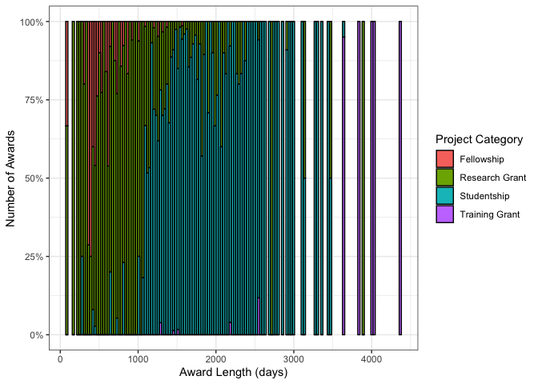

Economic and Social Research Council (ESRC) Data
================
**Author**: Mario Antonioletti. 
**Last updated**: 12/12/21.

-   [Introduction](#introduction)
-   [Overall expenditure](#overall-expenditure)
    -   [Expenditure for all UKRI
        projects](#expenditure-for-all-ukri-projects)
        -   [Summary](#summary)
    -   [Expenditure for active UKRI projects
        only](#expenditure-for-active-ukri-projects-only)
-   [ESRC data](#esrc-data)
    -   [Project category awards](#project-category-awards)
        -   [All projects category
            awards](#all-projects-category-awards)
        -   [Active projects category awards
            only](#active-projects-category-awards-only)
    -   [Award length distribution](#award-length-distribution)
        -   [Award length distribution for all
            projects](#award-length-distribution-for-all-projects)
        -   [Award length distribution for active projects
            only](#award-length-distribution-for-active-projects-only)
    -   [Regional distribution of
        awards](#regional-distribution-of-awards)
        -   [Region distributions of awards for all
            projects](#region-distributions-of-awards-for-all-projects)
        -   [Regional distributions of awards for active projects
            only](#regional-distributions-of-awards-for-active-projects-only)
    -   [Funding by lead organisation](#funding-by-lead-organisation)
        -   [Funding by lead organisation for all
            projects](#funding-by-lead-organisation-for-all-projects)
        -   [Funding by lead organisation for active projects
            only](#funding-by-lead-organisation-for-active-projects-only)
    -   [Department awards](#department-awards)
        -   [Department awards for all
            projects](#department-awards-for-all-projects)
        -   [Department awards for active projects
            only](#department-awards-for-active-projects-only)
    -   [Doctoral Training
        Partnerships](#doctoral-training-partnerships)
        -   [Active Partnerships](#active-partnerships)
    -   [Award Titles](#award-titles)
        -   [Active award titles](#active-award-titles)
    -   [Classification of subjects](#classification-of-subjects)
-   [ToDo Items](#todo-items)

# Introduction

The aim of this document is to provide an overview of expenditure done
of the [United Kingdom Research and Innovation](https://www.ukri.org/)
(UKRI) ESRC as determined from a [Gateway to
Research](https://gtr.ukri.org/) (GtR) data snapshot. The data is made
available under an [Open Government
Licence](https://www.nationalarchives.gov.uk/doc/open-government-licence/version/3/),
and covers the period 01/01/73 to 01/01/30. The GtR data snapshot was
downloaded from the GtR website on the 11/12/21 and corresponded to data
last updated by UKRI on the 23rd November
2021.<!-- 28th October 2021.--><!-- 11/10/21 and corresponded to data last updated by UKRI on the 30th of September 2021. -->

The data set contains 125,135 rows (after some data cleaning), where a
row corresponds to the record of an award. In this data set 11,352
correspond to ESRC awards.

UK Research Councils were formed in different years (source:
[wikipedia](https://en.wikipedia.org/wiki/UK_Research_and_Innovation))
as shown in the table below which has an impact in the interpretation of
the data.

| Research Council                                                                             | Formation |
|----------------------------------------------------------------------------------------------|-----------|
| Arts and Humanities Research Council (AHRC)                                                  | 2005      |
| Biotechnology and Biological Sciences Research Council (BBSRC)                               | 1994      |
| Engineering and Physical Sciences Research Council (EPSRC)                                   | 1994      |
| Economic and Social Research Council (ESRC)                                                  | 1965      |
| Medical Research Council (MRC)                                                               | 1913      |
| National Centre for the Replacement, Refinement and Reduction of Animals in Research (NC3RS) | 2004      |
| Natural Environment Research Council (NERC)                                                  | 1965      |
| Science and Technology Facilities Council (STFC)                                             | 2007      |
| Innovate UK                                                                                  | 2007      |
| Research England                                                                             | 2018      |
| UKRI                                                                                         | 2018      |

# Overall expenditure

We start by doing a brief overview of all the data obtained from the
Gateway to Research before we focus on the ESRC data.

## Expenditure for all UKRI projects

Expenditure for the whole period under consideration is shown in the
graph below. Awards that do not have a value defined have been removed.

The same information in tabular format:

| Funding org | Total awarded (Million £s) |
|:------------|---------------------------:|
| EPSRC       |                     15,100 |
| Innovate UK |                     11,814 |
| MRC         |                      6,191 |
| BBSRC       |                      4,635 |
| ESRC        |                      3,382 |
| NERC        |                      3,092 |
| STFC        |                      2,299 |
| AHRC        |                      1,235 |
| UKRI        |                        358 |
| NC3Rs       |                         73 |

The number of awards given by each council:

The average award given by funding council:

Average award per founding council ordered by the average award in
tabular form:

| Funding org | Number of awards | Total awarded (£) | Average award (£) |
|:------------|-----------------:|------------------:|------------------:|
| UKRI        |              361 |       358,304,719 |           992,534 |
| MRC         |           10,039 |     6,191,333,838 |           616,728 |
| Innovate UK |           24,332 |    11,813,982,665 |           485,533 |
| EPSRC       |           32,272 |    15,099,820,637 |           467,892 |
| STFC        |            6,909 |     2,298,653,250 |           332,704 |
| ESRC        |           11,352 |     3,382,158,375 |           297,935 |
| NERC        |           10,572 |     3,092,096,204 |           292,480 |
| BBSRC       |           15,871 |     4,635,495,847 |           292,073 |
| NC3Rs       |              454 |        72,549,985 |           159,802 |
| AHRC        |            9,333 |     1,234,986,920 |           132,325 |

The distribution of awards by research council.

The graph with the values scaled:

Expenditure by year using the starting year of the award for funds
allocated that year per research council:

    ## Warning: Transformation introduced infinite values in continuous y-axis

    ## Warning: Removed 1 rows containing missing values (geom_col).

### Summary

-   Over the time covered by the data, EPSRC has been allocated the most
    money but they also give the most awards so on average they do not
    give the highest award.
-   The MRC have been given the third highest amount but, other than
    UKRI, they give the second highest average award.
-   Of interest to this particular study the ESRC comes in fifth in the
    total amount awarded and they give the fourth highest number of
    awards so their average over the research councils comes third.

## Expenditure for active UKRI projects only

The graph below only contains values for currently active projects:

The same information in tabular format:

| Funding org | Total awarded (Million £s) |
|:------------|---------------------------:|
| EPSRC       |                      6,359 |
| Innovate UK |                      5,105 |
| MRC         |                      1,749 |
| ESRC        |                      1,681 |
| BBSRC       |                      1,346 |
| NERC        |                      1,242 |
| STFC        |                        702 |
| AHRC        |                        443 |
| UKRI        |                        353 |
| NC3Rs       |                         21 |

The number of awards given by each council for active projects:

The average award given by funding council for active projects:

Average award per founding council for active projects ordered by the
average award:

| Funding org | Number of awards | Total awarded (£) | Average award (£) |
|:------------|-----------------:|------------------:|------------------:|
| Innovate UK |            3,688 |     5,104,522,025 |         1,384,089 |
| UKRI        |              355 |       352,955,971 |           994,242 |
| MRC         |            3,500 |     1,748,567,830 |           499,591 |
| EPSRC       |           15,290 |     6,358,769,810 |           415,878 |
| NERC        |            3,308 |     1,242,025,107 |           375,461 |
| ESRC        |            4,926 |     1,681,459,651 |           341,344 |
| BBSRC       |            4,621 |     1,346,360,158 |           291,357 |
| STFC        |            2,691 |       701,893,385 |           260,830 |
| AHRC        |            3,146 |       443,421,818 |           140,948 |
| NC3Rs       |              170 |        20,862,846 |           122,723 |

The distribution of awards by research council for active projects.

With the densities scaled:

Expenditure by year using the starting year of the award for funds
allocated that year per research council for active projects:

    ## Warning: Transformation introduced infinite values in continuous y-axis

    ## Warning: Removed 1 rows containing missing values (geom_col).

# ESRC data

## Project category awards

### All projects category awards

The project categories for the ESRC awards covering the period 01/01/06
to 30/09/29. No explicit data seems to be provided for *Studentships*.
Data is sorted by the average award.

| Project Catgeory | Number of Awards | Total Awarded (£) | Average Award (£) |
|:-----------------|-----------------:|------------------:|------------------:|
| Research Grant   |            6,000 |     2,656,182,360 |         442697.06 |
| Training Grant   |              403 |       574,274,761 |        1424999.41 |
| Fellowship       |            1,418 |       151,701,254 |         106982.55 |
| Studentship      |            3,531 |                 0 |              0.00 |

<!-- -->

<!-- -->

### Active projects category awards only

This information corresponds to projects that are classified as
*Active*.

| Project Catgeory | Number of Awards | Total Awarded (£) | Average Award (£) |
|:-----------------|-----------------:|------------------:|------------------:|
| Research Grant   |            1,241 |     1,167,696,070 |         940931.56 |
| Training Grant   |               70 |       480,402,244 |        6862889.20 |
| Fellowship       |              286 |        33,361,337 |         116648.03 |
| Studentship      |            3,329 |                 0 |              0.00 |

<!-- -->

<!-- -->

## Award length distribution

### Award length distribution for all projects

The award length distribution of the award lengths binned into 28-day
periods is shown below.

Look at the award given by the length of project by project category for
all projects.

The top 15 active projects:

|                               Lead Org |       Category | Total awarded (£) |                                                           Project title |
|---------------------------------------:|---------------:|------------------:|------------------------------------------------------------------------:|
|                    University of Essex | Research Grant |        44,619,972 | Understanding Society: The UK Household Longitudinal Survey Waves 13-15 |
|              University College London | Research Grant |        36,267,415 |                Centre for Longitudinal Studies, Resource Centre 2015-20 |
|                    University of Essex | Research Grant |        31,987,749 |                                      Understanding Society Waves 6 to 8 |
|                    University of Essex | Research Grant |        30,212,001 |  Understanding Society: The UK Household Longitudinal Study: Waves 9-11 |
|                University of Edinburgh | Training Grant |        27,538,201 |                       Scottish ESRC Doctoral Training Centre DTC 2011 - |
|               University of Manchester | Research Grant |        26,621,454 |                                              The Productivity Institute |
|                University of Liverpool | Training Grant |        24,932,784 |                       North West ESRC Doctoral Training Centre DTG 2011 |
|                    University of Essex | Research Grant |        21,847,174 |                                             UK Data Service (2017-2022) |
|                University of Sheffield | Training Grant |        21,102,259 |                       White Rose ESRC Doctoral Training Centre DTG 2011 |
|                   University of Oxford | Training Grant |        19,130,626 |             University of Oxford ESRC Doctoral Training Centre DTG 2011 |
|                    Coventry University | Research Grant |        18,759,063 |              GCRF South-South Migration, Inequality and Development Hub |
|                   University of Oxford | Research Grant |        18,531,197 |              GCRF Accelerating Achievement for Africa’s Adolescents Hub |
|              University College London | Training Grant |        18,280,789 |           UCL, Bloomsbury and East London Doctoral Training Partnership |
| World Conservation Monitoring Ctr WCMC | Research Grant |        18,239,311 |                         GCRF Trade, Development and the Environment Hub |
|                University of Liverpool | Training Grant |        17,857,544 |       North West Social Science Doctoral Training Partnership (NWSSDTP) |

### Award length distribution for active projects only

The same information as provided above but only for *Active* projects.
The maximum funding period corresponds to 4382 days.

The top length of awards lie by project category in days is tabulated
below.

| Number of days | Project Category | Number of projects |
|---------------:|:-----------------|-------------------:|
|           1460 | Studentship      |                757 |
|           1095 | Studentship      |                303 |
|           1095 | Research Grant   |                183 |
|           1277 | Studentship      |                182 |
|            364 | Fellowship       |                168 |
|           1094 | Studentship      |                161 |
|           1460 | Research Grant   |                 97 |
|            364 | Research Grant   |                 84 |
|           1552 | Studentship      |                 81 |
|           1187 | Studentship      |                 75 |
|           1094 | Research Grant   |                 70 |
|           1461 | Studentship      |                 66 |
|            729 | Research Grant   |                 63 |
|           1642 | Studentship      |                 53 |
|           1368 | Studentship      |                 52 |

Percentage of award types by time length.

Look at the award given by the length of project by project category for
active projects.

## Regional distribution of awards

### Region distributions of awards for all projects

The expenditure of the awards over the whole time period by region
ordered by the total award given is shown in the table below.

| Region                   | Number of Awards | Total Awarded (£) | Average Award (£) |
|:-------------------------|-----------------:|------------------:|------------------:|
| London                   |            2,229 |       791,372,287 |         355034.67 |
| Unknown                  |            3,049 |       744,182,004 |         244074.12 |
| South East               |            1,691 |       441,504,856 |         261090.99 |
| East of England          |              224 |       338,192,539 |        1509788.12 |
| Scotland                 |            1,155 |       319,011,374 |         276200.32 |
| North West               |              779 |       202,732,798 |         260247.49 |
| South West               |              562 |       136,542,612 |         242958.38 |
| West Midlands            |              409 |       116,732,331 |         285409.12 |
| East Midlands            |              428 |        76,086,870 |         177773.06 |
| Wales                    |              215 |        64,798,196 |         301386.96 |
| Northern Ireland         |              155 |        55,209,650 |         356191.29 |
| Yorkshire and The Humber |              321 |        46,883,730 |         146055.23 |
| Outside UK               |               87 |        42,660,826 |         490354.32 |
| North East               |               46 |         5,720,679 |         124362.59 |
| NA                       |                2 |           527,623 |         263811.50 |

### Regional distributions of awards for active projects only

We can generate the table for projects that are currently active ordered
by the total award given is shown in the table below.

| Region                   | Number of Awards | Total Awarded (£) | Average Award (£) |
|:-------------------------|-----------------:|------------------:|------------------:|
| London                   |              985 |       395,229,748 |         401248.48 |
| Unknown                  |            1,444 |       370,901,033 |         256856.67 |
| East of England          |               79 |       208,683,553 |        2641563.96 |
| South East               |              725 |       200,153,862 |         276074.29 |
| Scotland                 |              468 |       159,852,668 |         341565.53 |
| North West               |              318 |        95,444,444 |         300139.76 |
| South West               |              245 |        69,620,808 |         284166.56 |
| West Midlands            |              146 |        67,292,452 |         460907.21 |
| Wales                    |              114 |        29,941,163 |         262641.78 |
| East Midlands            |              178 |        27,551,279 |         154782.47 |
| Northern Ireland         |               61 |        26,161,989 |         428885.07 |
| Outside UK               |               27 |        17,942,249 |         664527.74 |
| Yorkshire and The Humber |              122 |        10,740,506 |          88036.93 |
| North East               |               13 |         1,843,525 |         141809.62 |
| NA                       |                1 |           100,372 |         100372.00 |

## Funding by lead organisation

### Funding by lead organisation for all projects

This only shows the top 25 organisations by the average value of the
award.

| Org                                     | Number of Awards | Total Awarded (£) | Average Award (£) |
|:----------------------------------------|-----------------:|------------------:|------------------:|
| University of Copenhagen                |                1 |            97,614 |          97614.00 |
| NERC British Geological Survey          |                1 |             9,753 |           9753.00 |
| University of the West of Scotland      |                5 |           473,006 |          94601.20 |
| University of Cape Town                 |                6 |         5,670,678 |         945113.00 |
| University of the West of England       |               52 |         4,717,707 |          90725.13 |
| Canterbury Christ Church University     |                2 |           181,236 |          90618.00 |
| Office for National Statistics          |                2 |        17,898,948 |        8949474.00 |
| University of the Highlands and Islands |                3 |           264,465 |          88155.00 |
| University of the Arts London           |                3 |           262,006 |          87335.33 |
| Quadram Institute Bioscience            |                1 |            87,062 |          87062.00 |
| Johns Hopkins University                |                1 |           865,561 |         865561.00 |
| University of Huddersfield              |               11 |           950,591 |          86417.36 |
| Manchester Metropolitan University      |               65 |         5,223,968 |          80368.74 |
| University of Hertfordshire             |               14 |         1,083,610 |          77400.71 |
| Aberystwyth University                  |               37 |         2,830,742 |          76506.54 |
| University of Michigan                  |                3 |         2,240,913 |         746971.00 |
| Institute of Development Studies        |               34 |        25,051,833 |         736818.62 |
| National Institute of Public Health     |                1 |           722,163 |         722163.00 |
| Birmingham City University              |                8 |           577,158 |          72144.75 |
| University of Hull                      |               45 |         3,241,152 |          72025.60 |
| University of East London               |               24 |         1,721,019 |          71709.12 |
| Bournemouth University                  |               12 |           855,831 |          71319.25 |
| University of Bolton                    |                1 |            70,844 |          70844.00 |
| SAHFOS                                  |                1 |               700 |            700.00 |
| Institute for Fiscal Studies            |               74 |        50,576,288 |         683463.35 |

### Funding by lead organisation for active projects only

This only shows the top 25 organisations with active projects by the
average value of the award.

| Org                                 | Number of Awards | Total Awarded (£) | Average Award (£) |
|:------------------------------------|-----------------:|------------------:|------------------:|
| Harvard University                  |                1 |            99,739 |          99739.00 |
| Canterbury Christ Church University |                1 |            99,731 |          99731.00 |
| Imperial College London             |               35 |         3,464,829 |          98995.11 |
| Cranfield University                |                3 |         2,943,034 |         981011.33 |
| Innovations for Poverty Action      |                1 |            96,968 |          96968.00 |
| Birmingham City University          |                3 |           290,043 |          96681.00 |
| University of Exeter                |              129 |        12,421,069 |          96287.36 |
| Institute for Fiscal Studies        |               17 |        15,942,996 |         937823.29 |
| University of East London           |               10 |            93,668 |           9366.80 |
| University of California, Berkeley  |                1 |            93,460 |          93460.00 |
| Office for National Statistics      |                2 |        17,898,948 |        8949474.00 |
| University of Surrey                |               26 |        22,986,832 |         884108.92 |
| Heriot-Watt University              |                5 |            42,495 |           8499.00 |
| University of Brighton              |               41 |           342,106 |           8344.05 |
| University of Cape Town             |                4 |         3,264,723 |         816180.75 |
| Open University                     |               35 |         2,811,929 |          80340.83 |
| Manchester Metropolitan University  |               36 |         2,829,516 |          78597.67 |
| University of Bradford              |                4 |           313,743 |          78435.75 |
| University of Plymouth              |                9 |           684,660 |          76073.33 |
| Washington University in St Louis   |                1 |           713,698 |         713698.00 |
| Loughborough University             |               45 |         3,173,665 |          70525.89 |
| University of Michigan              |                1 |           697,241 |         697241.00 |
| Goldsmiths College                  |               23 |         1,587,713 |          69031.00 |
| University of the Free State        |                1 |           670,903 |         670903.00 |
| Birkbeck College                    |               54 |         3,411,286 |          63171.96 |

The same table ordered by the number of awards:

| Org                                  | Number of Awards | Total Awarded (£) | Average Award (£) |
|:-------------------------------------|-----------------:|------------------:|------------------:|
| University College London            |              310 |       195,164,571 |         629563.13 |
| University of Oxford                 |              240 |        85,193,937 |         354974.74 |
| Cardiff University                   |              227 |        58,106,073 |         255973.89 |
| King’s College London                |              221 |        56,444,939 |         255406.96 |
| London School of Economics & Pol Sci |              202 |        77,153,467 |         381947.86 |
| University of Cambridge              |              186 |        43,867,382 |         235846.14 |
| University of Manchester             |              167 |        52,952,146 |         317078.72 |
| University of Sheffield              |              161 |        62,728,049 |         389615.21 |
| University of Southampton            |              144 |        42,064,825 |         292116.84 |
| University of Edinburgh              |              142 |        84,682,000 |         596352.11 |
| University of Leeds                  |              138 |        26,869,634 |         194707.49 |
| University of Birmingham             |              133 |        18,676,526 |         140425.01 |
| University of Bristol                |              130 |        55,924,056 |         430185.05 |
| University of Exeter                 |              129 |        12,421,069 |          96287.36 |
| University of Glasgow                |              125 |        38,709,572 |         309676.58 |
| University of Liverpool              |              116 |        55,411,421 |         477684.66 |
| Newcastle University                 |              113 |        24,627,153 |         217939.41 |
| Lancaster University                 |              107 |        24,713,456 |         230966.88 |
| University of Warwick                |              106 |        39,973,392 |         377107.47 |
| University of Nottingham             |               93 |        17,236,348 |         185337.08 |
| Durham University                    |               92 |        29,800,544 |         323918.96 |
| University of York                   |               85 |         8,630,340 |         101533.41 |
| Queen Mary, University of London     |               84 |        10,693,466 |         127303.17 |
| University of Bath                   |               82 |         9,890,194 |         120612.12 |
| University of Sussex                 |               71 |        29,754,031 |         419070.86 |

## Department awards

### Department awards for all projects

There are 1176 unique departments. The table below only shows
departments that have 30 or more occurrences. The Departments below have
been ‘cleaned’ to remove minor differences, e.g. Cardiff Business School
to Business School and so on.

| Department                             | Number | Percent | Total Awarded (£) |
|:---------------------------------------|-------:|--------:|------------------:|
| Psychology                             |    884 |    7.79 |       155,063,135 |
| Social Science                         |    604 |    5.32 |       209,215,687 |
| Geography                              |    450 |    3.96 |       132,441,080 |
| Economics                              |    430 |    3.79 |       103,383,403 |
| Education                              |    348 |    3.07 |        78,044,505 |
| Sociology                              |    289 |    2.55 |        71,017,605 |
| Business School                        |    269 |    2.37 |        94,062,678 |
| Law                                    |    268 |    2.36 |        48,878,200 |
| Politics                               |    216 |    1.90 |        25,360,845 |
| Social and Political Science           |    152 |    1.34 |        63,120,139 |
| Management                             |    149 |    1.31 |        23,519,136 |
| Applied Social Science                 |    141 |    1.24 |        17,126,417 |
| Anthropology                           |    102 |    0.90 |        14,001,257 |
| Experimental Psychology                |     98 |    0.86 |        21,776,720 |
| Sociology & Social Policy              |     96 |    0.85 |        11,282,534 |
| Politics and International Studies     |     91 |    0.80 |        24,031,074 |
| International Development              |     88 |    0.78 |        14,309,525 |
| Geography Politics and Sociology       |     86 |    0.76 |         7,949,894 |
| Environment, Education and Development |     84 |    0.74 |        24,138,283 |
| Social & Political Science             |     80 |    0.70 |        34,226,630 |
| Health Science                         |     79 |    0.70 |        22,638,619 |
| History                                |     77 |    0.68 |         7,457,117 |
| Epidemiology and Public Health         |     77 |    0.68 |        23,441,020 |
| IFS Research Team                      |     73 |    0.64 |        50,550,150 |
| Economic, Social & Political Sci       |     69 |    0.61 |        49,845,458 |
| Research Department                    |     66 |    0.58 |        27,509,469 |
| Psychological Science                  |     64 |    0.56 |         9,177,714 |
| Politics and International Relations   |     61 |    0.54 |         4,890,554 |
| Policy Studies                         |     58 |    0.51 |        12,665,105 |
| Geography and Planning                 |     58 |    0.51 |         2,274,800 |
| Global Studies                         |     56 |    0.49 |        11,758,682 |
| Social and Economic Research           |     54 |    0.48 |       194,928,356 |
| Health and Life Science                |     50 |    0.44 |         5,496,272 |
| Arts, Humanities & Social Sci          |     49 |    0.43 |                 0 |
| Philosophy Psychology & Language       |     46 |    0.41 |         9,255,042 |
| Government                             |     45 |    0.40 |         6,983,337 |
| Unlisted                               |     45 |    0.40 |         4,878,100 |
| Public Health and Policy               |     44 |    0.39 |        15,936,964 |
| Social and Policy Science              |     44 |    0.39 |         3,718,498 |
| Criminology                            |     41 |    0.36 |        22,701,715 |
| Education and Professional Studies     |     41 |    0.36 |         7,147,045 |
| War Studies                            |     40 |    0.35 |        22,269,956 |
| Linguistics and English Language       |     39 |    0.34 |        12,826,299 |
| Sociological Studies                   |     35 |    0.31 |         5,477,753 |
| Arts Languages and Cultures            |     35 |    0.31 |         3,272,010 |
| Planning and Geography                 |     34 |    0.30 |         4,192,112 |
| Politics & International Relation      |     32 |    0.28 |         8,133,864 |
| Finance                                |     32 |    0.28 |        11,313,590 |
| Social Pol Sociology & Social Res      |     31 |    0.27 |         3,551,396 |
| Social Policy                          |     31 |    0.27 |         4,424,327 |
| Geographical Science                   |     31 |    0.27 |         2,822,791 |
| Epidemiology and Population Health     |     31 |    0.27 |         6,422,547 |
| Arts and Social Sci (FASS)             |     30 |    0.26 |         6,559,757 |

### Department awards for active projects only

There are 648 unique departments for active projects (1176 for all
projects). The table below only shows cases that have 30 or more
occurrences in active projects.

| Department                           | Number | Percent | Total Awarded (£) |
|:-------------------------------------|-------:|--------:|------------------:|
| Psychology                           |    370 |    7.51 |        55,663,079 |
| Social Science                       |    260 |    5.28 |       107,606,781 |
| Geography                            |    198 |    4.02 |        84,203,798 |
| Economics                            |    177 |    3.59 |        39,199,352 |
| Education                            |    172 |    3.49 |        44,617,517 |
| Law                                  |    138 |    2.80 |        12,710,946 |
| Sociology                            |    136 |    2.76 |        32,013,789 |
| Business School                      |    120 |    2.44 |        59,420,361 |
| Politics                             |    101 |    2.05 |         8,475,232 |
| Applied Social Science               |     82 |    1.66 |         8,790,832 |
| Sociology & Social Policy            |     64 |    1.30 |         2,629,138 |
| Management                           |     55 |    1.12 |         9,652,115 |
| Economic, Social & Political Sci     |     55 |    1.12 |        37,107,799 |
| Geography Politics and Sociology     |     50 |    1.02 |         2,566,784 |
| Arts, Humanities & Social Sci        |     49 |    0.99 |                 0 |
| Anthropology                         |     49 |    0.99 |         2,759,406 |
| Epidemiology and Public Health       |     45 |    0.91 |         9,720,721 |
| History                              |     44 |    0.89 |         1,442,202 |
| Health Science                       |     43 |    0.87 |         5,382,249 |
| Social and Political Science         |     39 |    0.79 |        42,204,238 |
| Geography and Planning               |     39 |    0.79 |           668,248 |
| Social & Political Science           |     39 |    0.79 |        20,901,204 |
| Experimental Psychology              |     38 |    0.77 |         5,229,173 |
| International Development            |     35 |    0.71 |         4,649,261 |
| Politics and International Relations |     31 |    0.63 |         1,725,275 |
| Politics and International Studies   |     30 |    0.61 |        15,728,924 |

## Doctoral Training Partnerships

### Active Partnerships

Currently active doctoral partnerships ordered by the start date.

| Lead Organisation                    | Department                              | Start    | End      |  Award (£) |
|:-------------------------------------|:----------------------------------------|:---------|:---------|-----------:|
| University of Surrey                 | Psychology                              | 01/10/11 | 02/10/22 | 11,094,593 |
| University of Nottingham             | Research and Graduate Services          | 01/10/11 | 02/10/22 |  7,964,843 |
| University College London            | Economics                               | 01/10/11 | 02/10/21 | 14,505,856 |
| London School of Economics & Pol Sci | Research & Project Development Division | 01/10/11 | 02/10/21 | 15,316,412 |
| University of Southampton            | Sch of Economic, Social & Political Sci | 01/10/11 | 02/10/22 |  8,164,941 |
| University of Essex                  | Sociology                               | 01/10/11 | 02/10/22 |  7,884,208 |
| University of Oxford                 | Social Sciences Division                | 01/10/11 | 02/10/22 | 19,130,626 |
| University of Cambridge              | Board of Graduate Studies               | 01/10/11 | 02/10/22 | 10,015,074 |
| University of Sussex                 | Research and Enterprise Services        | 01/10/11 | 02/10/22 |  4,865,866 |
| University College London            | Doctoral School                         | 01/10/11 | 02/10/22 | 12,927,461 |
| University of Liverpool              | Sch of Law and Social Justice           | 01/10/11 | 01/10/22 | 24,932,784 |
| University of Bristol                | Research and Enterprise Development     | 01/10/11 | 02/10/21 | 17,563,914 |
| King’s College London                | SSPP School Office                      | 01/10/11 | 31/03/22 |  7,150,273 |
| Durham University                    | Archaeology                             | 01/10/11 | 30/09/23 | 11,794,305 |
| University of Edinburgh              | Sch of Social and Political Science     | 01/10/11 | 02/10/21 | 27,538,201 |
| Cardiff University                   | Registry                                | 01/10/11 | 02/10/22 | 14,946,728 |
| Queen Mary, University of London     | English                                 | 01/10/11 | 02/10/21 |  5,087,223 |
| University of Birmingham             | The Registrar                           | 01/10/11 | 02/04/22 |  6,277,485 |
| University of Sheffield              | Geography                               | 01/10/11 | 02/10/22 | 21,102,259 |
| University of Warwick                | Politics and International Studies      | 03/10/11 | 02/04/22 | 12,411,023 |
| London Business School               | Research and Faculty Office             | 01/08/17 | 02/10/21 |    346,071 |
| University of Bristol                | Education                               | 01/10/17 | 30/09/27 | 17,755,419 |
| University of Leeds                  | Sch of Geography                        | 01/10/17 | 30/09/24 |  2,345,247 |
| University of Cambridge              | Criminology                             | 01/10/17 | 30/09/27 | 12,988,673 |
| University College London            | Epidemiology and Public Health          | 01/10/17 | 30/09/24 |  2,154,131 |
| University College London            | Doctoral School                         | 01/10/17 | 30/09/27 | 18,280,789 |
| University of Edinburgh              | Sch of Geosciences                      | 01/10/17 | 30/09/27 | 17,379,682 |
| University of Essex                  | Registry                                | 01/10/17 | 30/09/27 | 11,604,473 |
| University of Liverpool              | Sch of Law and Social Justice           | 01/10/17 | 30/09/27 | 17,857,544 |
| University of Oxford                 | Social Sciences Division                | 01/10/17 | 30/09/27 | 12,254,438 |
| Durham University                    | Geography                               | 01/10/17 | 30/09/27 | 11,155,143 |
| Cardiff University                   | Sch of Social Sciences                  | 01/10/17 | 30/09/27 | 13,588,255 |
| London School of Economics & Pol Sci | Research & Project Development Division | 01/10/17 | 30/09/27 | 11,974,889 |
| University of Warwick                | Sociology                               | 01/10/17 | 30/09/27 | 12,466,265 |
| University of Sheffield              | Geography                               | 01/10/17 | 30/09/27 | 15,423,463 |
| University of Southampton            | Sch of Economic, Social & Political Sci | 01/10/17 | 30/09/27 | 14,987,709 |
| University of the West of England    | Faculty of Health and Life Sciences     | 01/10/20 | 01/10/24 |          0 |
| University College London            | Epidemiology and Public Health          | 01/10/20 | 30/09/26 |  1,453,720 |

## Award Titles

### Active award titles

A word cloud made from the award titles using the top 250 words thogh
some of the longer words have been excluded.

<!-- -->

## Classification of subjects

Classify the department of the Principal Investigator (assuming that the
department will be linked to the subject of the award) using the
following base categories:

-   Area Studies
-   Demography
-   Development studies
-   Economics
-   Education
-   Environmental planning
-   History
-   Human Geography
-   Law & legal studies
-   Linguistics
-   Management & business studies
-   Political science. & international studies
-   Psychology
-   Science and Technology Studies
-   Social anthropology
-   Social policy
-   Social work
-   Sociology
-   Tools, technologies & methods
-   Other

<!-- -->

    ##   [1] "Politics and International Studies"      
    ##   [2] "Hist, Anthrop, Philos & Politics"        
    ##   [3] "International Politics"                  
    ##   [4] "Politics"                                
    ##   [5] "Politics and International Relations"    
    ##   [6] "Politics and International Studies"      
    ##   [7] "Politics & International Relation"       
    ##   [8] "Social and Political Science"            
    ##   [9] "Hist, Anthrop, Philos & Politics"        
    ##  [10] "Politics"                                
    ##  [11] "Politics and International Relations"    
    ##  [12] "Politics"                                
    ##  [13] "Politics and International Studies"      
    ##  [14] "International Politics"                  
    ##  [15] "Politics and International Relations"    
    ##  [16] "Social and Political Science"            
    ##  [17] "Social and Political Science"            
    ##  [18] "Economic, Social & Political Sci"        
    ##  [19] "Politics"                                
    ##  [20] "Politics and International Relations"    
    ##  [21] "Social and Political Science"            
    ##  [22] "Geography Politics and Sociology"        
    ##  [23] "Social & Political Science"              
    ##  [24] "Politics"                                
    ##  [25] "Politics and International Studies"      
    ##  [26] "Politics Philosophy Lang & Comms Studies"
    ##  [27] "Social and Political Science"            
    ##  [28] "Politics"                                
    ##  [29] "Politics & International Relation"       
    ##  [30] "Social and Political Science"            
    ##  [31] "Social & Political Science"              
    ##  [32] "Social and Political Science"            
    ##  [33] "Politics and International Studies"      
    ##  [34] "Politics"                                
    ##  [35] "Politics, History & International Rel"   
    ##  [36] "Geography Politics and Sociology"        
    ##  [37] "Politics and International Relations"    
    ##  [38] "Politics"                                
    ##  [39] "Politics"                                
    ##  [40] "Social and Political Science"            
    ##  [41] "Social & Political Science"              
    ##  [42] "Political Science"                       
    ##  [43] "Social & Political Science"              
    ##  [44] "Politics and International Relations"    
    ##  [45] "Social and Political Science"            
    ##  [46] "Political Science"                       
    ##  [47] "Law, Politics and Sociology"             
    ##  [48] "Political Economy"                       
    ##  [49] "Politics"                                
    ##  [50] "Politics Philosophy Lang & Comms Studies"
    ##  [51] "Social & Political Science"              
    ##  [52] "Politics"                                
    ##  [53] "Politics"                                
    ##  [54] "Politics, Languages and Int Studies"     
    ##  [55] "Social and Political Science"            
    ##  [56] "Politics Philosophy and Religion"        
    ##  [57] "Politics Philosophy and Religion"        
    ##  [58] "Politics"                                
    ##  [59] "Social and Political Science"            
    ##  [60] "Social & Political Science"              
    ##  [61] "Politics and International Relations"    
    ##  [62] "Economic, Social & Political Sci"        
    ##  [63] "Politics"                                
    ##  [64] "Economic, Social & Political Sci"        
    ##  [65] "Politics"                                
    ##  [66] "Politics"                                
    ##  [67] "Political Science"                       
    ##  [68] "Social and Political Science"            
    ##  [69] "Politics and International Studies"      
    ##  [70] "Politics"                                
    ##  [71] "Political Science"                       
    ##  [72] "Politics"                                
    ##  [73] "Economic, Social & Political Sci"        
    ##  [74] "Politics"                                
    ##  [75] "Geography Politics and Sociology"        
    ##  [76] "Social & Political Science"              
    ##  [77] "Geography Politics and Sociology"        
    ##  [78] "Social and Political Science"            
    ##  [79] "Social & Political Science"              
    ##  [80] "Social & Political Science"              
    ##  [81] "Social and Political Science"            
    ##  [82] "Law, Politics and Sociology"             
    ##  [83] "Social and Political Science"            
    ##  [84] "Social and Political Science"            
    ##  [85] "Politics"                                
    ##  [86] "Economic, Social & Political Sci"        
    ##  [87] "Economic, Social & Political Sci"        
    ##  [88] "Law, Politics and Sociology"             
    ##  [89] "Politics and International Relations"    
    ##  [90] "Social and Political Science"            
    ##  [91] "Politics and International Studies"      
    ##  [92] "Politics"                                
    ##  [93] "Social and Political Science"            
    ##  [94] "Social and Political Science"            
    ##  [95] "Politics and International Relations"    
    ##  [96] "Social & Political Science"              
    ##  [97] "Economic, Social & Political Sci"        
    ##  [98] "Politics and International Relations"    
    ##  [99] "Geography Politics and Sociology"        
    ## [100] "Geography Politics and Sociology"        
    ## [101] "Politics and International Studies"      
    ## [102] "Social and Political Science"            
    ## [103] "History and Politics"                    
    ## [104] "Politics"                                
    ## [105] "Politics"                                
    ## [106] "Politics"                                
    ## [107] "Economic, Social & Political Sci"        
    ## [108] "Geography Politics and Sociology"        
    ## [109] "Geography Politics and Sociology"        
    ## [110] "Economic, Social & Political Sci"        
    ## [111] "Politics & International Relation"       
    ## [112] "Politics and International Relations"    
    ## [113] "Economic, Social & Political Sci"        
    ## [114] "Economic, Social & Political Sci"        
    ## [115] "Social and Political Science"            
    ## [116] "Politics & International Relation"       
    ## [117] "Social and Political Science"            
    ## [118] "Politics"                                
    ## [119] "Social and Political Science"            
    ## [120] "Economic, Social & Political Sci"        
    ## [121] "Politics and International Studies"      
    ## [122] "Politics"                                
    ## [123] "Law, Politics and Sociology"             
    ## [124] "Social and Political Science"            
    ## [125] "Social and Political Science"            
    ## [126] "Politics"                                
    ## [127] "Politics"                                
    ## [128] "Economic, Social & Political Sci"        
    ## [129] "Social & Political Science"              
    ## [130] "Politics"                                
    ## [131] "Political Science"                       
    ## [132] "Politics"                                
    ## [133] "Social and Political Science"            
    ## [134] "Politics"                                
    ## [135] "Geography Politics and Sociology"        
    ## [136] "Social & Political Science"              
    ## [137] "Geography Politics and Sociology"        
    ## [138] "International Politics"                  
    ## [139] "Social and Political Science"            
    ## [140] "Politics and International Studies"      
    ## [141] "Geography Politics and Sociology"        
    ## [142] "Politics and International Studies"      
    ## [143] "Social & Political Science"              
    ## [144] "Politics & International Relation"       
    ## [145] "Politics and International Studies"      
    ## [146] "Politics & International Relation"       
    ## [147] "Political Science"                       
    ## [148] "Political Economy"                       
    ## [149] "Geography Politics and Sociology"        
    ## [150] "Politics"                                
    ## [151] "Political Economy"                       
    ## [152] "Politics and International Studies"      
    ## [153] "Social and Political Science"            
    ## [154] "Politics and International Relations"    
    ## [155] "Social and Political Science"            
    ## [156] "Politics and International Studies"      
    ## [157] "Politics and International Studies"      
    ## [158] "Politics and International Relations"    
    ## [159] "Social and Political Science"            
    ## [160] "Social and Political Science"            
    ## [161] "Politics"                                
    ## [162] "Social and Political Science"            
    ## [163] "Social and Political Science"            
    ## [164] "Politics and International Studies"      
    ## [165] "Politics"                                
    ## [166] "Politics"                                
    ## [167] "Politics and International Relations"    
    ## [168] "Economic, Social & Political Sci"        
    ## [169] "Politics"                                
    ## [170] "Social and Political Science"            
    ## [171] "Area Stud, Hist, Politics & Lit"         
    ## [172] "Geography Politics and Sociology"        
    ## [173] "Social & Political Science"              
    ## [174] "Geography Politics and Sociology"        
    ## [175] "Politics & International Relation"       
    ## [176] "Politics, Languages and Int Studies"     
    ## [177] "Social and Political Science"            
    ## [178] "Social and Political Science"            
    ## [179] "Politics"                                
    ## [180] "Politics"                                
    ## [181] "Hist, Anthrop, Philos & Politics"        
    ## [182] "Politics"                                
    ## [183] "Politics Philosophy and Religion"        
    ## [184] "Social & Political Science"              
    ## [185] "Politics"                                
    ## [186] "International Politics"                  
    ## [187] "Geography Politics and Sociology"        
    ## [188] "Politics"                                
    ## [189] "Political Economy"                       
    ## [190] "Politics and International Relations"    
    ## [191] "Political Economy"                       
    ## [192] "Social & Political Science"              
    ## [193] "Economic, Social & Political Sci"        
    ## [194] "Social and Political Science"            
    ## [195] "Social and Political Science"            
    ## [196] "Political Science"                       
    ## [197] "Social and Political Science"            
    ## [198] "Politics"                                
    ## [199] "Politics"                                
    ## [200] "Politics and International Relations"    
    ## [201] "Politics & International Relation"       
    ## [202] "Politics and International Studies"      
    ## [203] "Economic, Social & Political Sci"        
    ## [204] "Social and Political Science"            
    ## [205] "Politics"                                
    ## [206] "Political Science"                       
    ## [207] "Geography Politics and Sociology"        
    ## [208] "Geography Politics and Sociology"        
    ## [209] "Social and Political Science"            
    ## [210] "Politics and International Relations"    
    ## [211] "Politics and International Relations"    
    ## [212] "Social and Political Science"            
    ## [213] "Politics and International Relations"    
    ## [214] "Political Science"                       
    ## [215] "Social & Political Science"              
    ## [216] "Social and Political Science"            
    ## [217] "Social & Political Science"              
    ## [218] "Politics"                                
    ## [219] "Politics"                                
    ## [220] "Politics and International Relations"    
    ## [221] "Economic, Social & Political Sci"        
    ## [222] "Social and Political Science"            
    ## [223] "Political Economy"                       
    ## [224] "Politics and International Relations"    
    ## [225] "Social and Political Science"            
    ## [226] "Politics"                                
    ## [227] "Politics and International Studies"      
    ## [228] "Social and Political Science"            
    ## [229] "Geography Politics and Sociology"        
    ## [230] "International Politics"                  
    ## [231] "Politics and International Studies"      
    ## [232] "Politics"                                
    ## [233] "Social and Political Science"            
    ## [234] "Politics"                                
    ## [235] "Politics"                                
    ## [236] "Social and Political Science"            
    ## [237] "Politics"                                
    ## [238] "Politics and International Studies"      
    ## [239] "Economic, Social & Political Sci"        
    ## [240] "Economic, Social & Political Sci"        
    ## [241] "Social & Political Science"              
    ## [242] "Economic, Social & Political Sci"        
    ## [243] "Politics"                                
    ## [244] "Politics"                                
    ## [245] "Economics & Politics"                    
    ## [246] "Social and Political Science"            
    ## [247] "Hist, Anthrop, Philos & Politics"        
    ## [248] "Politics & International Relation"       
    ## [249] "Social and Political Science"            
    ## [250] "Politics"                                
    ## [251] "Social and Political Science"            
    ## [252] "Social and Political Science"            
    ## [253] "Politics and International Relations"    
    ## [254] "Politics"                                
    ## [255] "Geography Politics and Sociology"        
    ## [256] "Political, Social and International"     
    ## [257] "Area Stud, Hist, Politics & Lit"         
    ## [258] "Politics and International Studies"      
    ## [259] "Political Economy"                       
    ## [260] "International Politics"                  
    ## [261] "Social and Political Science"            
    ## [262] "Social and Political Science"            
    ## [263] "Social and Political Science"            
    ## [264] "Politics"                                
    ## [265] "Geography Politics and Sociology"        
    ## [266] "Geography Politics and Sociology"        
    ## [267] "Politics and International Relations"    
    ## [268] "Politics and International Relations"    
    ## [269] "Geography Politics and Sociology"        
    ## [270] "International Politics"                  
    ## [271] "Politics"                                
    ## [272] "Politics"                                
    ## [273] "Geography Politics and Sociology"        
    ## [274] "Social and Political Science"            
    ## [275] "Politics and International Studies"      
    ## [276] "Politics"                                
    ## [277] "Politics"                                
    ## [278] "Politics, Languages and Int Studies"     
    ## [279] "Politics and International Studies"      
    ## [280] "Politics and International Studies"      
    ## [281] "Economic, Social & Political Sci"        
    ## [282] "Politics and International Studies"      
    ## [283] "Economic, Social & Political Sci"        
    ## [284] "International Politics"                  
    ## [285] "Geography Politics and Sociology"        
    ## [286] "Social & Political Science"              
    ## [287] "Political Economy"                       
    ## [288] "Politics & International Relation"       
    ## [289] "Politics & International Relation"       
    ## [290] "Politics"                                
    ## [291] "Geography Politics and Sociology"        
    ## [292] "Politics & International Relation"       
    ## [293] "Politics"                                
    ## [294] "Geography Politics and Sociology"        
    ## [295] "Geography Politics and Sociology"        
    ## [296] "Politics"                                
    ## [297] "Area Stud, Hist, Politics & Lit"         
    ## [298] "Politics and International Relations"    
    ## [299] "Political, Social and International"     
    ## [300] "International Politics"                  
    ## [301] "Economic, Social & Political Sci"        
    ## [302] "Politics and International Relations"    
    ## [303] "Politics and International Relations"    
    ## [304] "Geography Politics and Sociology"        
    ## [305] "Politics and International Studies"      
    ## [306] "Politics"                                
    ## [307] "Geography Politics and Sociology"        
    ## [308] "Politics and International Studies"      
    ## [309] "Politics & International Relation"       
    ## [310] "Politics"                                
    ## [311] "Social & Political Science"              
    ## [312] "Politics"                                
    ## [313] "Economic, Social & Political Sci"        
    ## [314] "Politics and International Studies"      
    ## [315] "Politics"                                
    ## [316] "Politics"                                
    ## [317] "Geography Politics and Sociology"        
    ## [318] "Politics and International Studies"      
    ## [319] "Politics Philosophy Lang & Comms Studies"
    ## [320] "Politics"                                
    ## [321] "Politics"                                
    ## [322] "Politics"                                
    ## [323] "Politics and International Relations"    
    ## [324] "Politics and International Studies"      
    ## [325] "Social and Political Science"            
    ## [326] "Social and Political Science"            
    ## [327] "Political Economy"                       
    ## [328] "Politics"                                
    ## [329] "Politics"                                
    ## [330] "Social & Political Science"              
    ## [331] "Politics & International Relation"       
    ## [332] "Politics & International Relation"       
    ## [333] "Social & Political Science"              
    ## [334] "Politics & International Relation"       
    ## [335] "Social & Political Science"              
    ## [336] "Politics"                                
    ## [337] "Politics and International Studies"      
    ## [338] "Geography Politics and Sociology"        
    ## [339] "Politics"                                
    ## [340] "Geography Politics and Sociology"        
    ## [341] "Social and Political Science"            
    ## [342] "Social and Political Science"            
    ## [343] "Politics and International Studies"      
    ## [344] "Social and Political Science"            
    ## [345] "Law, Politics and Sociology"             
    ## [346] "Geography Politics and Sociology"        
    ## [347] "Politics"                                
    ## [348] "Law, Politics and Sociology"             
    ## [349] "Politics Philosophy Lang & Comms Studies"
    ## [350] "Social & Political Science"              
    ## [351] "Social and Political Science"            
    ## [352] "Politics and International Relations"    
    ## [353] "Politics and International Relations"    
    ## [354] "Economic, Social & Political Sci"        
    ## [355] "Politics and International Relations"    
    ## [356] "Geography Politics and Sociology"        
    ## [357] "Politics and International Studies"      
    ## [358] "Politics and International Studies"      
    ## [359] "Social and Political Science"            
    ## [360] "Politics and International Studies"      
    ## [361] "Geography Politics and Sociology"        
    ## [362] "Hist, Anthrop, Philos & Politics"        
    ## [363] "Economic, Social & Political Sci"        
    ## [364] "Law, Politics and Sociology"             
    ## [365] "Economic, Social & Political Sci"        
    ## [366] "Social & Political Science"              
    ## [367] "Politics & International Relation"       
    ## [368] "Economic, Social & Political Sci"        
    ## [369] "Politics"                                
    ## [370] "Social and Political Science"            
    ## [371] "Political Science"                       
    ## [372] "Social and Political Science"            
    ## [373] "Geography Politics and Sociology"        
    ## [374] "Hist, Anthrop, Philos & Politics"        
    ## [375] "Political Economy"                       
    ## [376] "Geography Politics and Sociology"        
    ## [377] "Politics, Philosophy & History"          
    ## [378] "Social and Political Science"            
    ## [379] "Politics"                                
    ## [380] "Social & Political Science"              
    ## [381] "Politics"                                
    ## [382] "Hist, Anthrop, Philos & Politics"        
    ## [383] "Politics"                                
    ## [384] "Political Science"                       
    ## [385] "Politics"                                
    ## [386] "Social and Political Science"            
    ## [387] "Social and Political Science"            
    ## [388] "Politics and International Studies"      
    ## [389] "Social and Political Science"            
    ## [390] "Politics"                                
    ## [391] "Social and Political Science"            
    ## [392] "Economic, Social & Political Sci"        
    ## [393] "Politics and International Relations"    
    ## [394] "Geography Politics and Sociology"        
    ## [395] "Hist, Anthrop, Philos & Politics"        
    ## [396] "Political Economy"                       
    ## [397] "Social and Political Science"            
    ## [398] "Geography Politics and Sociology"        
    ## [399] "Social and Political Science"            
    ## [400] "Economic, Social & Political Sci"        
    ## [401] "Geography Politics and Sociology"        
    ## [402] "Politics"                                
    ## [403] "Geography Politics and Sociology"        
    ## [404] "Area Stud, Hist, Politics & Lit"         
    ## [405] "Politics"                                
    ## [406] "Social and Political Science"            
    ## [407] "Politics"                                
    ## [408] "Social & Political Science"              
    ## [409] "Politics"                                
    ## [410] "Politics"                                
    ## [411] "Political Economy"                       
    ## [412] "Economic, Social & Political Sci"        
    ## [413] "Politics and International Studies"      
    ## [414] "Social & Political Science"              
    ## [415] "Politics Philosophy Lang & Comms Studies"
    ## [416] "Geography Politics and Sociology"        
    ## [417] "Politics"                                
    ## [418] "Politics & International Relation"       
    ## [419] "Social & Political Science"              
    ## [420] "Area Stud, Hist, Politics & Lit"         
    ## [421] "Political Economy"                       
    ## [422] "Politics"                                
    ## [423] "Politics and International Relations"    
    ## [424] "Politics and International Studies"      
    ## [425] "Politics and International Relations"    
    ## [426] "Politics and International Studies"      
    ## [427] "Politics and International Studies"      
    ## [428] "Social and Political Science"            
    ## [429] "Law, Politics and Sociology"             
    ## [430] "Social and Political Science"            
    ## [431] "Politics and International Relations"    
    ## [432] "International Politics"                  
    ## [433] "Hist, Anthrop, Philos & Politics"        
    ## [434] "Social & Political Science"              
    ## [435] "Geography Politics and Sociology"        
    ## [436] "Politics"                                
    ## [437] "Politics"                                
    ## [438] "Politics and International Studies"      
    ## [439] "Politics and International Studies"      
    ## [440] "Politics"                                
    ## [441] "Geography Politics and Sociology"        
    ## [442] "Economic, Social & Political Sci"        
    ## [443] "Social and Political Science"            
    ## [444] "Economic, Social & Political Sci"        
    ## [445] "Political Science"                       
    ## [446] "Politics"                                
    ## [447] "Politics"                                
    ## [448] "Social and Political Science"            
    ## [449] "Politics and International Studies"      
    ## [450] "Politics & International Relation"       
    ## [451] "Geography Politics and Sociology"        
    ## [452] "Economic, Social & Political Sci"        
    ## [453] "Area Stud, Hist, Politics & Lit"         
    ## [454] "Law, Politics and Sociology"             
    ## [455] "Geography Politics and Sociology"        
    ## [456] "Politics"                                
    ## [457] "Political Science"                       
    ## [458] "Politics and International Relations"    
    ## [459] "Politics"                                
    ## [460] "Politics and International Studies"      
    ## [461] "Social and Political Science"            
    ## [462] "Geography Politics and Sociology"        
    ## [463] "International Politics"                  
    ## [464] "Geography Politics and Sociology"        
    ## [465] "Politics Philosophy and Religion"        
    ## [466] "Politics and International Studies"      
    ## [467] "Social and Political Science"            
    ## [468] "International Politics"                  
    ## [469] "Political Science"                       
    ## [470] "Politics and International Relations"    
    ## [471] "Economic, Social & Political Sci"        
    ## [472] "Politics"                                
    ## [473] "Social & Political Science"              
    ## [474] "Politics"                                
    ## [475] "Social and Political Science"            
    ## [476] "Politics"                                
    ## [477] "Politics"                                
    ## [478] "Social & Political Science"              
    ## [479] "Politics"                                
    ## [480] "Politics"                                
    ## [481] "Politics"                                
    ## [482] "Social & Political Science"              
    ## [483] "Politics, Languages and Int Studies"     
    ## [484] "Geography Politics and Sociology"        
    ## [485] "Area Stud, Hist, Politics & Lit"         
    ## [486] "Social & Political Science"              
    ## [487] "Social and Political Science"            
    ## [488] "Politics and Public Policy"              
    ## [489] "Politics"                                
    ## [490] "Geography Politics and Sociology"        
    ## [491] "Politics"                                
    ## [492] "Politics"                                
    ## [493] "Geography Politics and Sociology"        
    ## [494] "Political Science"                       
    ## [495] "Politics"                                
    ## [496] "Social and Political Science"            
    ## [497] "Social & Political Science"              
    ## [498] "Politics and International Studies"      
    ## [499] "Politics, Languages and Int Studies"     
    ## [500] "Law, Politics and Sociology"             
    ## [501] "Politics and International Studies"      
    ## [502] "Politics"                                
    ## [503] "Politics"                                
    ## [504] "Economic, Social & Political Sci"        
    ## [505] "Economic, Social & Political Sci"        
    ## [506] "Social and Political Science"            
    ## [507] "Politics"                                
    ## [508] "Politics"                                
    ## [509] "Social & Political Science"              
    ## [510] "Politics"                                
    ## [511] "Politics"                                
    ## [512] "Politics & International Relation"       
    ## [513] "Social & Political Science"              
    ## [514] "Politics and International Studies"      
    ## [515] "International Politics"                  
    ## [516] "Social and Political Science"            
    ## [517] "Politics and International Relations"    
    ## [518] "Politics"                                
    ## [519] "Economic, Social & Political Sci"        
    ## [520] "Politics"                                
    ## [521] "Political Economy"                       
    ## [522] "Social and Political Science"            
    ## [523] "Politics"                                
    ## [524] "Social & Political Science"              
    ## [525] "Politics"                                
    ## [526] "Politics and International Relations"    
    ## [527] "Politics"                                
    ## [528] "Politics"                                
    ## [529] "Social and Political Science"            
    ## [530] "Economic, Social & Political Sci"        
    ## [531] "Political, Social and International"     
    ## [532] "Geography Politics and Sociology"        
    ## [533] "Politics and International Relations"    
    ## [534] "Politics and International Studies"      
    ## [535] "Politics and International Studies"      
    ## [536] "Politics"                                
    ## [537] "Politics"                                
    ## [538] "Law, Politics and Sociology"             
    ## [539] "Politics"                                
    ## [540] "Social and Political Science"            
    ## [541] "Politics"                                
    ## [542] "Politics and International Relations"    
    ## [543] "Social & Political Science"              
    ## [544] "Politics"                                
    ## [545] "Politics"                                
    ## [546] "Politics, Internatl Relations & Philos"  
    ## [547] "Politics"                                
    ## [548] "Politics Philosophy Lang & Comms Studies"
    ## [549] "Social and Political Science"            
    ## [550] "Politics and International Relations"    
    ## [551] "Political Economy"                       
    ## [552] "Social & Political Science"              
    ## [553] "Social and Political Science"            
    ## [554] "Politics, History and Law"               
    ## [555] "Social & Political Science"              
    ## [556] "Politics & International Relation"       
    ## [557] "Political Science"                       
    ## [558] "Social and Political Science"            
    ## [559] "Social and Political Science"            
    ## [560] "Social and Political Science"            
    ## [561] "Politics and International Studies"      
    ## [562] "Geography Politics and Sociology"        
    ## [563] "Geography Politics and Sociology"        
    ## [564] "Economic, Social & Political Sci"        
    ## [565] "Geography Politics and Sociology"        
    ## [566] "Politics"                                
    ## [567] "Politics"                                
    ## [568] "Social and Political Science"            
    ## [569] "Politics"                                
    ## [570] "International Politics"                  
    ## [571] "Politics and International Relations"    
    ## [572] "Politics"                                
    ## [573] "Social and Political Science"            
    ## [574] "Economic, Social & Political Sci"        
    ## [575] "Social and Political Science"            
    ## [576] "Politics"                                
    ## [577] "Law, Politics and Sociology"             
    ## [578] "Politics and International Studies"      
    ## [579] "Social and Political Science"            
    ## [580] "Politics"                                
    ## [581] "Politics & International Relation"       
    ## [582] "Politics"                                
    ## [583] "Politics"                                
    ## [584] "Politics and International Studies"      
    ## [585] "Politics"                                
    ## [586] "Politics and International Studies"      
    ## [587] "Politics"                                
    ## [588] "Social & Political Science"              
    ## [589] "Politics"                                
    ## [590] "Politics"                                
    ## [591] "Economic, Social & Political Sci"        
    ## [592] "Social and Political Science"            
    ## [593] "Social & Political Science"              
    ## [594] "Politics and International Studies"      
    ## [595] "Politics"                                
    ## [596] "Politics and International Studies"      
    ## [597] "Politics"                                
    ## [598] "Social & Political Science"              
    ## [599] "Geography Politics and Sociology"        
    ## [600] "Politics and International Relations"    
    ## [601] "Politics"                                
    ## [602] "Economic, Social & Political Sci"        
    ## [603] "Geography Politics and Sociology"        
    ## [604] "Politics and International Relations"    
    ## [605] "Political Economy"                       
    ## [606] "Politics and International Relations"    
    ## [607] "Social and Political Science"            
    ## [608] "Social and Political Science"            
    ## [609] "Social and Political Science"            
    ## [610] "Politics"                                
    ## [611] "Social and Political Science"            
    ## [612] "Social and Political Science"            
    ## [613] "Politics and International Studies"      
    ## [614] "Hist, Anthrop, Philos & Politics"        
    ## [615] "Social & Political Science"              
    ## [616] "Social & Political Science"              
    ## [617] "Social & Political Science"              
    ## [618] "Politics"                                
    ## [619] "Economic, Social & Political Sci"        
    ## [620] "Politics Philosophy and Religion"        
    ## [621] "Geography Politics and Sociology"        
    ## [622] "Economic, Social & Political Sci"        
    ## [623] "Political Science"                       
    ## [624] "Social and Political Science"            
    ## [625] "Politics and International Studies"      
    ## [626] "Politics and International Relations"    
    ## [627] "Law, Politics and Sociology"             
    ## [628] "Economic, Social & Political Sci"        
    ## [629] "Politics"                                
    ## [630] "Social and Political Science"            
    ## [631] "Political Economy"                       
    ## [632] "Social & Political Science"              
    ## [633] "Politics, Internatl Relations & Philos"  
    ## [634] "Politics and International Studies"      
    ## [635] "Law, Politics and Sociology"             
    ## [636] "Social and Political Science"            
    ## [637] "Politics and International Relations"    
    ## [638] "Politics"                                
    ## [639] "Politics & International Relation"       
    ## [640] "Politics"                                
    ## [641] "Economic, Social & Political Sci"        
    ## [642] "Government and Politics"                 
    ## [643] "Politics"                                
    ## [644] "Political Science"                       
    ## [645] "Politics and International Studies"      
    ## [646] "Politics and International Studies"      
    ## [647] "Politics"                                
    ## [648] "Politics & International Relation"       
    ## [649] "Political Economy"                       
    ## [650] "Politics, Languages and Int Studies"     
    ## [651] "Politics"                                
    ## [652] "Social and Political Science"            
    ## [653] "Geography Politics and Sociology"        
    ## [654] "Politics and International Relations"    
    ## [655] "Social and Political Science"            
    ## [656] "Social & Political Science"              
    ## [657] "Politics"                                
    ## [658] "Politics & International Relation"       
    ## [659] "Geography Politics and Sociology"        
    ## [660] "Politics"                                
    ## [661] "Politics and International Studies"      
    ## [662] "Politics, Languages and Int Studies"     
    ## [663] "Politics"                                
    ## [664] "Politics, History and Law"               
    ## [665] "Economic, Social & Political Sci"        
    ## [666] "Politics and International Studies"      
    ## [667] "Social & Political Science"              
    ## [668] "Politics and International Studies"      
    ## [669] "Social and Political Science"            
    ## [670] "Politics"                                
    ## [671] "Politics and International Relations"    
    ## [672] "International Politics"                  
    ## [673] "Politics and International Relations"    
    ## [674] "Politics and International Studies"      
    ## [675] "Politics"                                
    ## [676] "Politics and International Studies"      
    ## [677] "Politics and International Studies"      
    ## [678] "Geography Politics and Sociology"        
    ## [679] "Politics and International Studies"      
    ## [680] "Politics and International Studies"      
    ## [681] "Geography Politics and Sociology"        
    ## [682] "Political Economy"                       
    ## [683] "Social and Political Science"            
    ## [684] "Geography Politics and Sociology"        
    ## [685] "Politics"                                
    ## [686] "Social and Political Science"            
    ## [687] "Area Stud, Hist, Politics & Lit"         
    ## [688] "Politics & International Relation"       
    ## [689] "Politics and International Relations"    
    ## [690] "Political Economy"                       
    ## [691] "Law, Politics and Sociology"             
    ## [692] "Social & Political Science"              
    ## [693] "Politics and International Studies"      
    ## [694] "Political Science"                       
    ## [695] "Geography Politics and Sociology"        
    ## [696] "Social and Political Science"            
    ## [697] "Politics"                                
    ## [698] "Politics"                                
    ## [699] "Politics and International Studies"      
    ## [700] "Hist, Anthrop, Philos & Politics"        
    ## [701] "Politics"                                
    ## [702] "Politics and International Studies"      
    ## [703] "Social & Political Science"              
    ## [704] "Politics"                                
    ## [705] "Geography Politics and Sociology"        
    ## [706] "Politics"                                
    ## [707] "Social and Political Science"            
    ## [708] "Economic, Social & Political Sci"        
    ## [709] "Geography Politics and Sociology"        
    ## [710] "Geography Politics and Sociology"        
    ## [711] "Politics"                                
    ## [712] "Social and Political Science"            
    ## [713] "Politics"                                
    ## [714] "Social and Political Science"            
    ## [715] "Politics"                                
    ## [716] "Politics and International Studies"      
    ## [717] "Economic, Social & Political Sci"        
    ## [718] "Politics & International Relation"       
    ## [719] "Social and Political Science"            
    ## [720] "Geography Politics and Sociology"        
    ## [721] "Politics"                                
    ## [722] "Geography Politics and Sociology"        
    ## [723] "Law, Politics and Sociology"             
    ## [724] "Economic, Social & Political Sci"        
    ## [725] "Political Science"                       
    ## [726] "Economic, Social & Political Sci"        
    ## [727] "Geography Politics and Sociology"        
    ## [728] "Social and Political Science"            
    ## [729] "International Politics"                  
    ## [730] "Politics"                                
    ## [731] "Social and Political Science"            
    ## [732] "Area Stud, Hist, Politics & Lit"         
    ## [733] "Social and Political Science"            
    ## [734] "Politics"                                
    ## [735] "Politics"                                
    ## [736] "Geography Politics and Sociology"        
    ## [737] "Social & Political Science"              
    ## [738] "Politics"                                
    ## [739] "International Politics"                  
    ## [740] "Politics Int Stu and Philosophy"         
    ## [741] "Social & Political Science"              
    ## [742] "Politics and International Relations"    
    ## [743] "Political Economy"                       
    ## [744] "Hist, Anthrop, Philos & Politics"        
    ## [745] "Geography Politics and Sociology"        
    ## [746] "Social and Political Science"            
    ## [747] "Social and Political Science"            
    ## [748] "Politics"                                
    ## [749] "Politics and International Studies"      
    ## [750] "Geography Politics and Sociology"        
    ## [751] "Economic, Social & Political Sci"        
    ## [752] "Social & Political Science"              
    ## [753] "Politics"                                
    ## [754] "Geography Politics and Sociology"        
    ## [755] "Law, Politics and Sociology"             
    ## [756] "Social and Political Science"            
    ## [757] "Politics and International Studies"      
    ## [758] "Political, Social and International"     
    ## [759] "Politics"                                
    ## [760] "Social and Political Science"            
    ## [761] "Politics and International Studies"      
    ## [762] "Social and Political Science"            
    ## [763] "Politics"                                
    ## [764] "Politics and Public Policy"              
    ## [765] "Politics and International Studies"      
    ## [766] "Social and Political Science"            
    ## [767] "Social & Political Science"              
    ## [768] "Economic, Social & Political Sci"        
    ## [769] "Politics and International Studies"      
    ## [770] "Social & Political Science"              
    ## [771] "Social and Political Science"            
    ## [772] "Political Economy"                       
    ## [773] "Social and Political Science"            
    ## [774] "Social & Political Science"              
    ## [775] "Politics and International Studies"      
    ## [776] "Economic, Social & Political Sci"        
    ## [777] "Politics"                                
    ## [778] "Politics and International Studies"      
    ## [779] "Social & Political Science"              
    ## [780] "Economic, Social & Political Sci"        
    ## [781] "Politics and International Studies"      
    ## [782] "Politics"                                
    ## [783] "Social & Political Science"              
    ## [784] "Politics and Public Policy"              
    ## [785] "Social & Political Science"              
    ## [786] "Geography Politics and Sociology"        
    ## [787] "Politics"                                
    ## [788] "Politics"                                
    ## [789] "Politics"                                
    ## [790] "Social and Political Science"            
    ## [791] "Geography Politics and Sociology"        
    ## [792] "Social and Political Science"            
    ## [793] "Politics and International Studies"      
    ## [794] "Hist, Anthrop, Philos & Politics"        
    ## [795] "Politics"                                
    ## [796] "Social & Political Science"              
    ## [797] "Politics"                                
    ## [798] "Political Economy"                       
    ## [799] "Economic, Social & Political Sci"        
    ## [800] "Social & Political Science"              
    ## [801] "Politics"                                
    ## [802] "Social & Political Science"              
    ## [803] "Politics and International Relations"    
    ## [804] "Politics"                                
    ## [805] "Political Science"                       
    ## [806] "Politics and International Relations"    
    ## [807] "Social & Political Science"              
    ## [808] "Area Stud, Hist, Politics & Lit"         
    ## [809] "Politics & International Relation"       
    ## [810] "Social and Political Science"            
    ## [811] "Politics"                                
    ## [812] "Law, Politics and Sociology"             
    ## [813] "Politics"                                
    ## [814] "Politics, Internatl Relations & Philos"  
    ## [815] "Social & Political Science"              
    ## [816] "Political Economy"                       
    ## [817] "Politics"                                
    ## [818] "Politics"                                
    ## [819] "Geography Politics and Sociology"        
    ## [820] "Political Science"                       
    ## [821] "Politics and International Relations"    
    ## [822] "Politics"                                
    ## [823] "Politics"                                
    ## [824] "Social and Political Science"            
    ## [825] "Social & Political Science"              
    ## [826] "Social & Political Science"              
    ## [827] "Politics"                                
    ## [828] "Social & Political Science"              
    ## [829] "Politics"                                
    ## [830] "Geography Politics and Sociology"        
    ## [831] "Social and Political Science"            
    ## [832] "Economic, Social & Political Sci"        
    ## [833] "Politics"                                
    ## [834] "Social & Political Science"              
    ## [835] "Politics"                                
    ## [836] "Politics and International Relations"    
    ## [837] "International Politics"                  
    ## [838] "Geography Politics and Sociology"        
    ## [839] "Law, Politics and Sociology"             
    ## [840] "Hist, Anthrop, Philos & Politics"        
    ## [841] "Social & Political Science"              
    ## [842] "Politics"                                
    ## [843] "Social and Political Science"            
    ## [844] "Economics and Politics"                  
    ## [845] "Economic, Social & Political Sci"        
    ## [846] "Economic, Social & Political Sci"        
    ## [847] "Politics"                                
    ## [848] "Geography Politics and Sociology"        
    ## [849] "Politics"                                
    ## [850] "Hist, Anthrop, Philos & Politics"        
    ## [851] "Law, Politics and Sociology"             
    ## [852] "Political Economy"                       
    ## [853] "Politics, Philosophy & History"          
    ## [854] "Social & Political Science"              
    ## [855] "Politics"                                
    ## [856] "Politics and International Relations"    
    ## [857] "Social & Political Science"              
    ## [858] "Politics & International Relation"       
    ## [859] "Politics"                                
    ## [860] "Politics"                                
    ## [861] "Politics"                                
    ## [862] "Politics"                                
    ## [863] "International Politics"                  
    ## [864] "Hist, Anthrop, Philos & Politics"        
    ## [865] "Politics and International Studies"      
    ## [866] "Economic, Social & Political Sci"        
    ## [867] "Politics and International Studies"      
    ## [868] "Politics"                                
    ## [869] "Social and Political Science"            
    ## [870] "Politics and International Studies"      
    ## [871] "Politics, Languages and Int Studies"     
    ## [872] "Social and Political Science"            
    ## [873] "Politics and International Studies"      
    ## [874] "Politics Philosophy and Religion"        
    ## [875] "Social and Political Science"            
    ## [876] "Politics & International Relation"       
    ## [877] "Politics and International Relations"    
    ## [878] "Economics & Politics"                    
    ## [879] "Social & Political Science"              
    ## [880] "Social and Political Science"            
    ## [881] "Geography Politics and Sociology"        
    ## [882] "Politics Philosophy Lang & Comms Studies"
    ## [883] "Law, Politics and Sociology"             
    ## [884] "Social and Political Science"            
    ## [885] "Politics and International Relations"    
    ## [886] "Social & Political Science"              
    ## [887] "Social and Political Science"            
    ## [888] "Politics"                                
    ## [889] "Social and Political Science"            
    ## [890] "Political Science"                       
    ## [891] "Geography Politics and Sociology"        
    ## [892] "Social & Political Science"              
    ## [893] "Politics"                                
    ## [894] "Economic, Social & Political Sci"        
    ## [895] "Hist, Anthrop, Philos & Politics"        
    ## [896] "Social and Political Science"            
    ## [897] "Social and Political Science"            
    ## [898] "Social and Political Science"            
    ## [899] "Geography Politics and Sociology"        
    ## [900] "Politics"                                
    ## [901] "Politics"                                
    ## [902] "Politics"                                
    ## [903] "Area Stud, Hist, Politics & Lit"         
    ## [904] "Politics and International Studies"      
    ## [905] "Social and Political Science"            
    ## [906] "Economic, Social & Political Sci"        
    ## [907] "Politics"                                
    ## [908] "Social and Political Science"            
    ## [909] "Social & Political Science"              
    ## [910] "Politics and International Studies"      
    ## [911] "Economic, Social & Political Sci"        
    ## [912] "Social and Political Science"            
    ## [913] "Politics"                                
    ## [914] "Politics, Languages and Int Studies"     
    ## [915] "Social and Political Science"            
    ## [916] "Political Science"                       
    ## [917] "Economic, Social & Political Sci"        
    ## [918] "Politics and International Studies"      
    ## [919] "Hist, Anthrop, Philos & Politics"        
    ## [920] "Geography Politics and Sociology"        
    ## [921] "Politics and International Relations"    
    ## [922] "Politics Philosophy Lang & Comms Studies"
    ## [923] "Politics Philosophy and Religion"        
    ## [924] "Geography Politics and Sociology"        
    ## [925] "Politics"                                
    ## [926] "Social and Political Science"            
    ## [927] "Politics"                                
    ## [928] "Politics"                                
    ## [929] "Politics"                                
    ## [930] "Geography Politics and Sociology"        
    ## [931] "Politics, Languages and Int Studies"     
    ## [932] "Political Science"                       
    ## [933] "Politics & International Relation"       
    ## [934] "Social & Political Science"              
    ## [935] "Area Stud, Hist, Politics & Lit"         
    ## [936] "Politics and International Studies"      
    ## [937] "Social and Political Science"            
    ## [938] "Social and Political Science"            
    ## [939] "Social and Political Science"            
    ## [940] "Economic, Social & Political Sci"        
    ## [941] "Political Economy"                       
    ## [942] "International Politics"                  
    ## [943] "Social & Political Science"              
    ## [944] "Politics"                                
    ## [945] "Economic, Social & Political Sci"        
    ## [946] "Politics"                                
    ## [947] "Economic, Social & Political Sci"        
    ## [948] "Political Science"                       
    ## [949] "Politics"                                
    ## [950] "Politics and International Studies"      
    ## [951] "Economic, Social & Political Sci"        
    ## [952] "Social and Political Science"            
    ## [953] "Social and Political Science"            
    ## [954] "Politics"                                
    ## [955] "Politics & International Relation"       
    ## [956] "Political Economy"                       
    ## [957] "Politics"

# ToDo Items

-   [ ] Reconcile DTPs from what was scraped from the [ESRC
    DTP](https://esrc.ukri.org/skills-and-careers/doctoral-training/doctoral-training-partnerships/doctoral-training-partnership-dtp-contacts/)
    web page and what is in the GtR data file (there are more).
-   [ ] Research title looks interesting for further examination but
    will require processing to be comprehensible.
